# [HTML] 텍스트 요소

## VScode 단축키 + HTML 요소들

👨🏻‍💻 **에디터 창 제어**

|                      | 윈도우           | 맥              |
| -------------------- | ---------------- | --------------- |
| 현재 창 닫기         | Ctrl + w         | Cmd + w         |
| 닫은 창 다시 열기    | Ctrl + Shift + t | Cmd + Shift + t |
| 사이드바 토글        | Ctrl + b         | Cmd + b         |
| 사이드바 - 탐색기    | Ctrl + Shift + e | Cmd + Shift + e |
| 사이드바 - 전체 검색 | Ctrl + Shift + f | Cmd + Shift + f |
| 에디터 확대          | Ctrl + +(=)      | Cmd + +(=)      |
| 에디터 축소          | Ctrl + -         | Cmd + -         |

🔤 **소스코드 편집**

|                | 윈도우                    | 맥                       |
| -------------- | ------------------------- | ------------------------ |
| 들여쓰기       | Tab 혹은 Ctrl + ]         | Tab 혹은 Cmd + ]         |
| 내어쓰기       | Shift + Tab 혹은 Ctrl + [ | Shift + Tab 혹은 Cmd + [ |
| 아래에 행 삽입 | Ctrl + Enter              | Cmd + Enter              |
| 위에 행 삽입   | Ctrl + Shift + Enter      | Cmd + Shift + Enter      |
| 현재 행 이동   | Alt + ⬇️/⬆️               | Opt + ⬇️/⬆️              |
| 현재 행 복사   | Alt + Shift + ⬇️/⬆️       | Opt + Shift + ⬇️/⬆️      |
| 현재 행 삭제   | Ctrl + Shift + k          | Cmd + Shift + k          |
| 주석 토글      | Ctrl + /                  | Cmd + /                  |

---

## 제목 - h1 ~ h6

### 💡 h1-h6: HTML 구획 제목 요소

- **글씨 크기를 위해 제목 태그를 사용하면 안된다!**
  → 대신 CSS의 font-size 속성을 사용한다.
- 하나의 페이지에 하나의 <h1>만 사용한다.
  → 여러 개를 써도 오류는 나지 않지만, <h1>은 가장 중요한 제목이므로 전체 페이지의 목적을 드러내고 있다. 두 개의 제목을 가진 책 같은 느낌.

```html
<h1>Beetles</h1>
<h2>External morphology</h2>
<h3>Head</h3>
<h4>Mouthparts</h4>
<h3>Thorax</h3>
<h4>Prothorax</h4>
<h4>Pterothorax</h4>
```

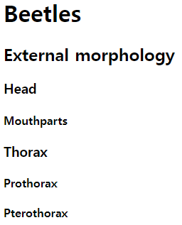{: height="200"}

## 본문 - p

💡 **p**

- 여러 개의 공백(’ ‘)을 주어도 한 개의 공백(’ ’)만 적용된다.
- 빈 p 요소를 사용하여 문단 사이에 여백을 주면 안된다.
  → CSS로 여백 주는 것을 권장한다. (margin)

```html
<p>
  Geckos are a group of usually small, usually nocturnal lizards. They are found
  on every continent except Australia.
</p>

<p>
  Some species live in houses where they hunt insects attracted by artificial
  light.
</p>
```

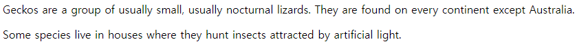

## 본문 - br

💡 **br** : **줄바꿈 요소**

- 문단 사이에 여백을 두기 위한 용도로 <br>태그를 사용하면 안된다.
  → 대신 p 요소로 감싼 후, CSS의 margin 속성으로 여백 크기 조절한다.

```html
<p>
  O’er all the hilltops<br />
  Is quiet now,<br />
  In all the treetops<br />
  Hearest thou<br />
  Hardly a breath;<br />
  The birds are asleep in the trees:<br />
  Wait, soon like these<br />
  Thou too shalt rest.
</p>
```

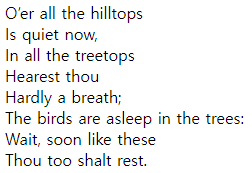

## 본문 - blockquote, q

💡 **blockquote : 인용 블록 요소**

- 안쪽의 텍스트가 긴 인용문이다.

  - 일반 문단과는 달리 여백이 존재한다. → 이를 통해 일반 문단과 구분한다.
  - **p** 태그 사이에 사용하면 안된다.
    → **p** 태그 내부에 블록 속성의 자식 태그가 존재하면 자동으로 **blockquote** 앞에서 **p** 태그를 닫아버린다.

  ```html
  <figure>
    <blockquote cite="https://www.huxley.net/bnw/four.html">
      <p>
        Words can be like X-rays, if you use them properly—they’ll go through
        anything. You read and you’re pierced.
      </p>
    </blockquote>
    <figcaption>—Aldous Huxley, <cite>Brave New World</cite></figcaption>
  </figure>
  ```

  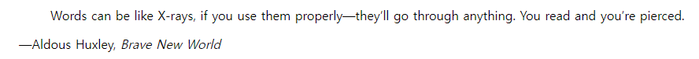

💡 **q : 인라인 인용문 요소**

- 둘러싼 텍스트가 짧은 **인라인** 인용문이다.
  - 기본 스타일링으로 앞뒤로 “” 가 붙는다.
    ```html
    <q>이건 나는 게 아냐, 아주 멋있게 떨어지는 거지</q>
    ```
    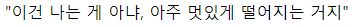

💡 **공통**

- **cite**: blockquote, q 공통 속성이다. 인용문의 출처 문서나 메시지를 가리키는 URL로 인용문의 맥락 혹은 출처 정보를 가리키는 용도로 사용된다.

```html
<figure>
  <blockquote>
    <p>
      It was a bright cold day in April, and the clocks were striking thirteen.
    </p>
  </blockquote>
  <figcaption>
    First sentence in
    <cite
      ><a href="http://www.george-orwell.org/1984/0.html"
        >Nineteen Eighty-Four</a
      ></cite
    >
    by George Orwell (Part 1, Chapter 1).
  </figcaption>
</figure>
```

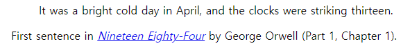

## 본문 - pre

💡 **pre**

- 미리 서식을 지정한 텍스트를 나타내며, HTML에 작성한 내용 그대로 표현한다.
  → 지정된 형식이 있어 특별한 가공 없이 그대로 output으로 출력하고 싶을 때 사용한다.
- 고정폭 글꼴을 갖고 있다.
  - **pre** 태그와 **p** 태그에 동일한 텍스트를 넣어도 output이 다르게 나온다.

```html
<pre>
IIIII
</pre>
<p>IIIII</p>
```

{: width="100" height="100"}

---

## 본문 - figure, figcaption

💡 **figure**

- 독립적인 콘텐츠를 표현한다. **figcaption** 요소를 통해 설명(ex. 출처)을 붙일 수 있다.
- 이미지, **pre** 태그, **blockquote** 태그, **p** 태그 모두 **내부 content**로 사용 가능하다.

```html
<figure>
  
  <figcaption>This is JavaScript</figcaption>
</figure>
```

{: width="300"}

## 본문 - hr

💡 **hr**

- **hr** 요소는 이야기 장면 전환, 구획 내 주제 변경 등, 문단 레벨 요소에서 주제의 분리를 나타낸다. == 수평선
- HTML 속성 말고 CSS로 스타일링하는 것을 권장한다.

```html
<p>§1: The first rule of Fight Club is: You do not talk about Fight Club.</p>

<hr />

<p>§2: The second rule of Fight Club is: Always bring cupcakes.</p>
```

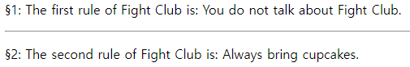

## 본문 - abbr, address, cite, bdo

💡 **abbr**

- 약어(abbreviation). 이니셜을 적고, title 속성을 사용하여 약어의 원래 의미를 작성한다.
  ```html
  <!-- <abbr> 약어(abbreviation) -->
  <p>
    <abbr title="World Wide Web">WWW</abbr>
    and
    <abbr title="Hyper Text Markup Language">HTML</abbr>
  </p>
  ```
  {: width="200"}

💡 **address**

- 주소(이메일 주소, 연락처 정보 등등)를 통칭하여 나타낼 때 사용한다.

  - 별도의 기능을 한다기보다, 내부 content가 주소라는 것을 나타낸다는 의미가 크다.
  - 내부 content의 텍스트가 기울어져 있는 것이 특징이다.

  ```html
  <address>
    You can contact author at
    <a href="www.somedomain.com">www.somedomain.com</a> <br />
    If you see any bugs, please
    <a href="mailto:webmaster@some.com">contact webmaster</a> <br />
    You may also want to visit us: <br />
    Mozilla Foundation <br />
    331 E Evelyn Ave <br />
    Mountain View, CA 94041 <br />
    USA
  </address>
  ```

  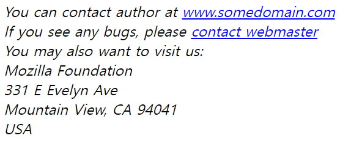{: width="400"}

💡 **cite**

- 인용한다는 의미를 갖는다. 인용한 사이트의 출처를 나타낼 때 <cite> 태그로 묶어서 사용한다.

  - 내부 content의 텍스트가 기울어져 있는 것이 특징이다.
  - <blockquote> 태그의 속성으로도 사용할 수 있지만, 이러한 경우에는 cite 속성값이 출력되지는 않는다.

  ```html
  <figure>
    <blockquote>
      <p>
        It was a bright cold day in April, and the clocks were striking
        thirteen.
      </p>
    </blockquote>
    <figcaption>
      First sentence in
      <cite>Nineteen Eighty-Four</cite>
      by George Orwell (Part 1, Chapter 1).
    </figcaption>
  </figure>
  ```

  {:width="500"}

💡 **bdo : 양방향 텍스트 재정의 요소**

- bidirectional override의 약자. 텍스트를 반대 방향으로 출력하고 싶을 때 사용한다.

  - dir 속성에 값 넣어주기, rtl == right to left. ltr(== left to right) 값을 넣어주면 원래 방향으로 돌아옴(default 값)

  ```html
  <p>이 글은 왼쪽에서 오른쪽으로 작성합니다.</p>
  <p><bdo dir="rtl">이 글은 오른쪽에서 왼쪽으로 작성합니다.</bdo></p>
  ```

  {:width="400"}

---

## 포매팅 - b, strong

💡 **포매팅**

💡 **b**

- **b**: bold. 독자의 주의를 끌기 위한 용도로 사용한다. 그 외의 다른 **특별한 중요도는 주어지지 않는다**.
  → **b** 태그로 전체 텍스트를 굵게 만드는 등, 텍스트를 꾸미는 용도로 사용하면 안된다. CSS의 font-weight를 사용하거나, **strong** 요소를 사용하여 특별히 중요한 텍스트를 나타내길 권장한다.

💡 **strong : 높은 중요도 요소**

- **strong**: **중대하거나 긴급한 컨텐츠**
  → 둘의 차이가 미묘하다고 느껴질 수도 있으나, 스크린 리더(?)를 사용할 때 차이가 존재한다. **b** 태그의 경우, 여느 문장과 다른 점이 없지만, **strong** 태그의 경우, 해당 문장을 더욱 강조하여 읽는다고 함.

---

## 포매팅 - i, em

💡 **i**

- **i**: 텍스트에서 어떤 이유로 주위와 구분해야 하는 부분을 나타낸다. 기술 용어, 외국어 구절, 등장인물의 생각 등을 나타낼 때 사용한다. 보통 기울임꼴로 표시한다.

💡 **em** : **강세 요소**

- **em**: 텍스트의 강세를 나타낸다. **em** 태그를 중첩하면 더 큰 강세를 뜻하게 된다.
  → **b**, **strong** 태그간의 차이와 동일. **i** 태그와 달리 **em** 태그의 경우 스크린 리더를 사용할 때 아나운서가 강조해서 읽는다.

```html
<p><i>Iron Man</i> is a hero.</p>
<p>
  노래 가사에 사용된 <i>Uno, dos, tres, cuatro!</i>는 스페인어로 하나, 둘, 셋,
  넷을 뜻합니다.
</p>
```

{:width="500"}

→ 이를 통해 Iron Man이 ‘철남자’ 가 아닌 고유 명사로서 **유저가 받아들이기 쉬워진다**.

---

## 포매팅 - mark, small, sub, sup

💡 **mark**

- 하이라이팅해주는 태그. 관심 부분 강조, 상황에 맞는 구절을 식별할 때에 사용한다. 스크린 리더에서 인지하지 못한다.

```html
<p>
  Several species of <mark>salamander</mark> inhabit the temperate rainforest of
  the Pacific Northwest.
</p>
```

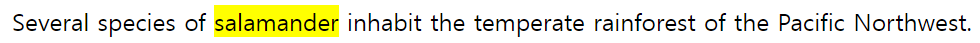{:width="500"}

💡 **small : 덧붙임 글 요소**

- 덧붙임 글 요소. 덧붙이는 글이나, 저작권과 법률 표기 등의 작은 텍스트를 나타낼 때 사용한다.

```html
<p>
  MDN Web Docs is a learning platform for Web technologies and the software that
  powers the Web.
</p>
<br />
<p>
  <small
    >The content is licenses under a Creative Commons Attribution-ShareAlike 2.5
    Generic License.</small
  >
</p>
```

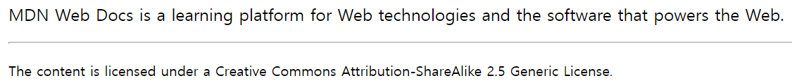

💡 **sub : 아래 첨자 요소**

- 아래 첨자 요소. 화학식, 각주 표기, 변수 표기할 때 사용한다.

```html
<p>
  Almost every developer's favorite molecule is C<sub>8</sub>H<sub>N</sub>4<sub
    >O</sub
  ><sub>2</sub>, also known as "caffeine."
</p>
```

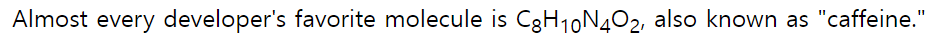{:width="500"}

💡 **sup : 위 첨자 요소**

- 위 첨자 요소. 지수 표기, 서수 표기할 때 사용한다.

```html
<p>
  <var>a<sup>2</sup></var> + <var>b<sup>2</sup></var> = <var>c<sup>2</sup></var>
</p>
```

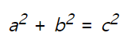{:width="100"}

---

## 포매팅 - del, ins, code, kbd

💡 **del**

- 문서에서 제거된 텍스트의 범위를 나타낸다.

💡 **ins**

- 문서에 추가된 텍스트의 범위를 나타낸다.**]** → **세트처럼 쓰이기도 함**

  - cite: 변경점에 대해 기술할 때 사용한다.
  - datetime: 변경이 발생한 일시에 대해 기술할 때 사용한다.

  ```html
  <blockquote>
    There is <del>nothing</del>
    <ins cite="../howtobeawizard.html" datetime="2018-05">no code</ins> either
    good or bad, but <del>thinking</del> <ins>running it</ins>
  </blockquote>
  ```

  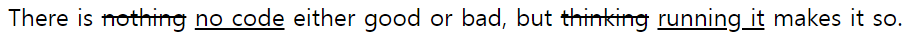{:width="500"}

💡 **code : 인라인 코드 요소**

- 짧은 코드 조각을 나타내는 스타일을 사용하여 자신의 콘텐츠를 표시할 때 사용한다. (인라인 요소, 고정폭 글씨체)

  - 여러 줄의 코드를 나타내려면 **code** 요소가 아닌 **pre** 요소를 사용할 것

  ```html
  <p>
    The <code>push()</code> method adds one or more elements to the end of an
    array and returns the new length of the array.
  </p>
  ```

  

💡 **kbd : 키보드 입력 요소**

- **kbd**: 키보드 입력, 음성 입력 등 임의의 장치를 사용한 사용자의 입력을 나타낸다.
  ```html
  <p>
    Please press <kbd>Ctrl</kbd> + <kbd>Shift</kbd> + <kbd>R</kbd> to re-render
    an MDN page.
  </p>
  ```
  {:width="500"}

---

## a 태그와 하이퍼링크 1

💡 **a**

- href 요소를 통해 다른 페이지나 같은 페이지의 어느 위치, 파일, 이메일 주소와 그 외 다른 URL로 연결할 수 있는 하이퍼링크를 만든다. <a> 안의 콘텐츠는 링크 목적지의 설명을 나타내야 한다.
  - href 요소에 목적지에 대한 속성을 명시해주어야 한다.
    → 절대경로와 상대경로 뿐만 아니라 이메일 주소 / 전화번호도 삽입 가능하다.
  - target: 링크한 URL을 표시할 위치.
    - \_self: default값. 현재 브라우징 맥락에 표시한다.
    - \_blank: URL을 새로운 브라우징 맥락에 표시한다.
    - \_parent: URL을 현재 브라우징 맥락의 부모에 표시한다.
    - \_top: URL을 최상단 브라우징 맥락(현재 맥락의 부모면서 자신의 부모가 존재하지 않는, 제일 높은 맥락)에 표시한다. 부모가 존재하지 않으면 ‘\_self’ 와 동일하게 행동한다.
  - 이외에도 다양한 요소가 존재한다.

```html
<ul>
  <!-- 절대 URL로 연결 -->
  <li><a href="https://www.mozilla.com"> Mozilla </a></li>
  <!-- 상대 URL로 연결 -->
  <li><a href="./p">Directory-relative URL</a></li>

  <!-- 이메일로 연결 -->
  <li><a href="mailto:nowhere@mozilla.org">Send email to nowhere</a></li>
  <!-- 전화번호로 연결 -->
  <li><a href="tel:+1(555)5309">(555) 5309</a></li>

  <!-- <a> 요소로 아래의 구획에 연결 -->
  <li>
    <p><a href="#Section_further_down"> 아래 제목으로 건너뛰기 </a></p>
  </li>
  <!-- 링크가 향할 제목 -->
  <li><h2 id="Section_further_down">아래의 제목</h2></li>
</ul>
```

{:width="300"}

---

## 엔티티(Entity)

💡 **엔티티(Entity)**

- HTML에서 문자 **<**,**>**,**”**,**&** 는 예약어(특수 문자)로 구문 자체의 일부로 인식된다.

  따라서 다음과 같은 명령어로 엔티티를 표현해야 한다.
  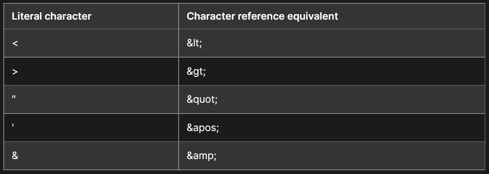{:width="700"}

  특수 문자를 표현할 때 사용되는 문자 참조 코드 +**α 공백: &nbsp;**
  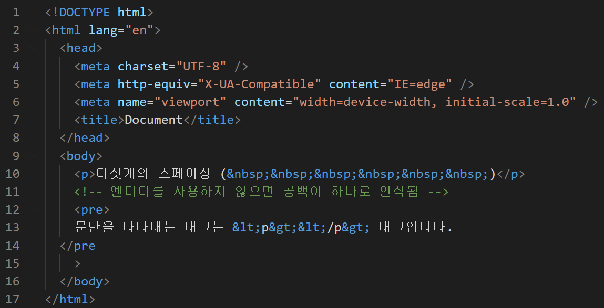{:width="700"}

  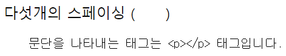{:width="400"}

---

# 관련 링크

- **h1-h6**: [https://developer.mozilla.org/ko/docs/Web/HTML/Element/Heading_Elements](https://developer.mozilla.org/ko/docs/Web/HTML/Element/Heading_Elements)
- **p**: [https://developer.mozilla.org/ko/docs/Web/HTML/Element/p](https://developer.mozilla.org/ko/docs/Web/HTML/Element/p)
- **br**: [https://developer.mozilla.org/ko/docs/Web/HTML/Element/br](https://developer.mozilla.org/ko/docs/Web/HTML/Element/br)
- **blockquote**: [https://developer.mozilla.org/ko/docs/Web/HTML/Element/blockquote](https://developer.mozilla.org/ko/docs/Web/HTML/Element/blockquote)
- **q**: [https://developer.mozilla.org/ko/docs/Web/HTML/Element/q](https://developer.mozilla.org/ko/docs/Web/HTML/Element/q)
- **pre**: [https://developer.mozilla.org/ko/docs/Web/HTML/Element/pre](https://developer.mozilla.org/ko/docs/Web/HTML/Element/pre)
- **figure**: [https://developer.mozilla.org/ko/docs/Web/HTML/Element/figure](https://developer.mozilla.org/ko/docs/Web/HTML/Element/figure)
- **hr**: [https://developer.mozilla.org/ko/docs/Web/HTML/Element/hr](https://developer.mozilla.org/ko/docs/Web/HTML/Element/hr)
- **abbr**: [https://developer.mozilla.org/ko/docs/Web/HTML/Element/abbr](https://developer.mozilla.org/ko/docs/Web/HTML/Element/abbr)
- **address**: [https://developer.mozilla.org/ko/docs/Web/HTML/Element/address](https://developer.mozilla.org/ko/docs/Web/HTML/Element/address)
- **cite**: [https://developer.mozilla.org/ko/docs/Web/HTML/Element/cite](https://developer.mozilla.org/ko/docs/Web/HTML/Element/cite)
- **bdo**: [https://developer.mozilla.org/ko/docs/Web/HTML/Element/bdo](https://developer.mozilla.org/ko/docs/Web/HTML/Element/bdo)
- **b**: [https://developer.mozilla.org/ko/docs/Web/HTML/Element/b](https://developer.mozilla.org/ko/docs/Web/HTML/Element/b)
- **strong**: [https://developer.mozilla.org/ko/docs/Web/HTML/Element/strong](https://developer.mozilla.org/ko/docs/Web/HTML/Element/strong)
- **i**: [https://developer.mozilla.org/ko/docs/Web/HTML/Element/i](https://developer.mozilla.org/ko/docs/Web/HTML/Element/i)
- **em**: [https://developer.mozilla.org/ko/docs/Web/HTML/Element/em](https://developer.mozilla.org/ko/docs/Web/HTML/Element/em)
- **mark**: [https://developer.mozilla.org/ko/docs/Web/HTML/Element/mark](https://developer.mozilla.org/ko/docs/Web/HTML/Element/mark)
- **small**: [https://developer.mozilla.org/ko/docs/Web/HTML/Element/small](https://developer.mozilla.org/ko/docs/Web/HTML/Element/small)
- **sub**: [https://developer.mozilla.org/ko/docs/Web/HTML/Element/sub](https://developer.mozilla.org/ko/docs/Web/HTML/Element/sub)
- **sup**: [https://developer.mozilla.org/ko/docs/Web/HTML/Element/sup](https://developer.mozilla.org/ko/docs/Web/HTML/Element/sup)
- **del**: [https://developer.mozilla.org/ko/docs/Web/HTML/Element/del](https://developer.mozilla.org/ko/docs/Web/HTML/Element/del)
- **ins**: [https://developer.mozilla.org/ko/docs/Web/HTML/Element/ins](https://developer.mozilla.org/ko/docs/Web/HTML/Element/ins)
- **code**: [https://developer.mozilla.org/ko/docs/Web/HTML/Element/code](https://developer.mozilla.org/ko/docs/Web/HTML/Element/code)
- **kbd**: [https://developer.mozilla.org/ko/docs/Web/HTML/Element/kbd](https://developer.mozilla.org/ko/docs/Web/HTML/Element/kbd)
- **a**: [https://developer.mozilla.org/ko/docs/Web/HTML/Element/a](https://developer.mozilla.org/ko/docs/Web/HTML/Element/a)
- **Entity**: [https://developer.mozilla.org/ko/docs/Learn/HTML/introduction*to_HTML/Getting_started#entity_references_html에*특수*문자*포함](https://developer.mozilla.org/ko/docs/Learn/HTML/introduction_to_HTML/Getting_started#entity_references_html%EC%97%90_%ED%8A%B9%EC%88%98_%EB%AC%B8%EC%9E%90_%ED%8F%AC%ED%95%A8)
