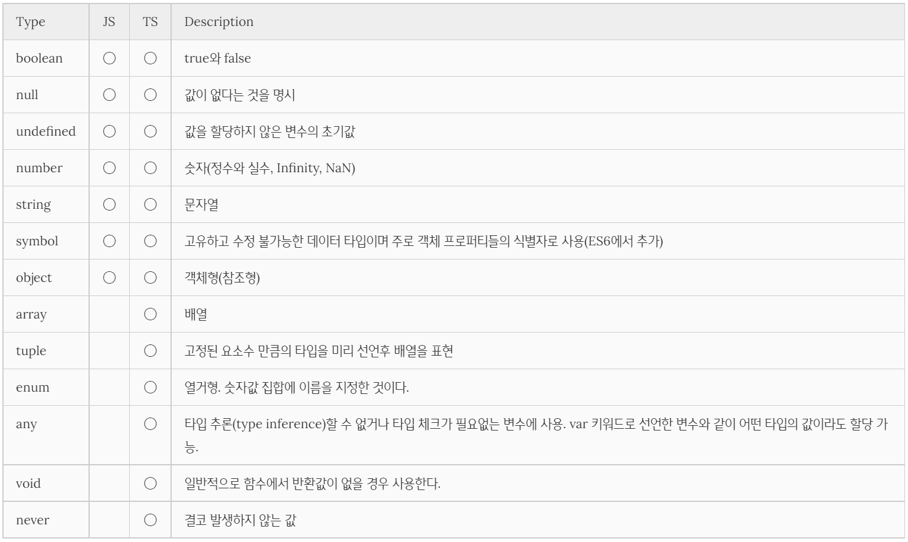

# [TS] 기본 타입, 클래스, 인터페이스

## 정적 타이핑

---

### 타입 선언 (Type Declaration)

**TypeScript**는 변수명 뒤에 타입을 명시하는 것으로 타입을 선언할 수 있다.

→ **Type Annotation**

```tsx
/*
 *	Type Annotation
 *
 *  value: type
 */

const val: number = "123";
```

- **value:** **type** 형태 → 콜론(:)을 기준으로 좌측이 value, 우측이 type
- 선언한 타입에 맞지 않는 값을 할당하면 **컴파일 시점**에 에러가 발생한다.
- 이러한 타입 선언은 개발자가 코드를 예측하는 데에 용이하다.
- 또한, 타입 선언은 강력한 타입 체크를 가능하게 하기에 문법 에러나 타입과 일치하지 않는 값의 할당 등 기본적인 오류를 **런타임 이전**에 색출한다.

---

**TypeScript**는 ES5, ES6의 상위확장이므로 **JavaScript**의 타입을 그대로 사용할 수 있다.



---

### 정적 타이핑

C \***\*혹은 Java 같은 C-family 언어는 변수를 선언할 때 변수의 타입을 **사전에 지정**하여 명시적으로 선언해야 하며 이에 알맞은 값을 할당해야 한다. 이를 **정적 타이핑\*\*(Static Typing)이라 한다.

```java
char foo = 'A';
int foo1 = 1;
boolean foo2 = true;
```

하지만, **JavaScript**는 동적 타입(dynamic typed) 언어이다. 이는 변수의 타입 선언 없이 할당 과정에서 동적으로 타입을 추론(Type Inference)한다는 의미이다. 이는 사용하기에는 편할 수 있지만, **코드를 예측하는 데에 어려움이 있어** 에러를 만들 가능성이 높다.

```jsx
var foo;

console.log(typeof foo); // undefined

foo = null;
console.log(typeof foo); // object

foo = 1;
console.log(typeof foo); // number

foo = {};
console.log(typeof foo); // object
```

**TypeScript**는 JavaScript와는 반대로 **정적 타이핑**을 지원한다!

```tsx
let foo: string, // 문자열 타입
  bar: number, // 숫자 타입
  baz: boolean; // 불리언 타입

foo = "Hello";
bar = 123;
baz = "true"; // 에러 발생. boolean 값이 아닌 String 타입이기 때문.
```

---

### 타입 캐스팅

기존의 타입에서 다른 타입으로 타입 캐스팅하려면 **as** 키워드를 사용하거나 **<>** 연산자를 사용할 수 있다.

```tsx
const $input = document.querySelector(
  'input["type"="text"]'
) as HTMLInputElement;
const val = $input.value;

const $input = <HTMLInputElement>document.querySelector('input["type"="text"]');
const val = $input.value;
```

---

### 원시 타입

```tsx
/*
 * Primitive (원시값)
 */
const str: string = "String";
const num: number = 123;
const bool: boolean = true;
const big: bigint = 100n;

// 이와 같은 형태도 가능하다
// 문자열의 경우, 소문자로 넣어야 인정됨
// 숫자의 경우 또한 동일한 값을 넣어줘야 됨
// boolean 값 또한 동일한 값을 넣어줘야 됨
const str: "string" = "string";
const num: 123 = 123;
const bool: true = true;

// 타입 추론
const str = "string";
const num = 123;
const bool = true;
```

- 불변
- 객체가 아닌 값들

→ **Type을 달고 싶을 때는 Type Annotation을 사용하면 된다!**

---

### 객체 타입

```tsx
/*
 * Object Type
 */

const obj: object = {
  str: "str",
  num: 123,
  child: {
    str: "str",
    num: 123,
  },
};

obj.str.trim(); // error 발생
```

- **any**와 다를게 없는 상황

```tsx
const obj2: {
  str: string;
  num: number;
  child: {
    str: string;
    num: number;
  };
} = {
  str: "str",
  num: 123,
  child: {
    str: "str",
    num: 123,
  },
};

obj2.str; // 정상
```

- 이와 같은 방식이면 type을 안전하게 달고(?) 사용할 수 있다.

---

### 함수 타입

```tsx
/*
 * Function Type
 */

function func(num: number, str: string) {
  return num + str;
}

func("str", 123); // error 발생
func(123, "str"); // 정상
```

- 함수는 매개변수( () ), 반환 ( return ) 을 명시해주어야 한다.
- 9번 라인의 경우, 매개변수가 잘못되었기에 error가 발생한다.

```tsx
function func(num: number, str: string): void {
  // return
}
```

- 반환 타입으로 void를 명시해주면 return 값을 주면 안된다.

```tsx
function func(num: number, str: string): string {
  return num + str;
}
```

- 이와 같이 **string**을 명시해주면 문제 없이 반환된다.

```tsx
function func(num1: number, str: string): number {
  return num1 + str; // error 발생
}
```

- 반환 타입이 **number** 인데 반해, return 값이 **string**이기 때문

이러한 경우에는

```tsx
function func(num1: number, str: string): number {
  return num1 + Number(str);
}

func(123, 123);
```

- 형변환을 시켜주면 정상적으로 작동한다.

```tsx
function func(num1: Function, num2: Function): Function {
  console.log(num1 + num2);
}
```

- **이와 같이 단순하게 Function이라고만 다는 것은 지양하기**

**함수 표현식**의 경우에는 다음과 같이 나타낸다.

```tsx
// 함수 표현식
const func = (str1: string, str2: string): string => {
  return str1 + " " + str2;
};
```

**객체 타입** 또한 받을 수 있다.

```tsx
// 객체 타입
const func = (obj: { str1: string; str2: string }) => {
  return obj.str1 + " " + obj.str2;
};
```

**결론**

- **매개변수와 반환값 모두 타입을 명시할 수 있다.**
- **return 값의 경우, 타입 추론이 잘되기 때문에 꼭 type을 지정해야만 하는 것은 아니다! 하지만, 매개변수는 type을 지정해주는 것을 권장한다!**

---

### 배열 타입

```tsx
/*
 * Array Type
 */

// String Array
const strArr: string[] = ["str", "str2", "str3"];
const strArr2: Array<string> = ["str", "str2", "str3"];

// number Array
const numArr: Array<number> = [1, 2, 3];

// boolean Array
const boolArr: boolean[] = [false, true, false, true];

// 동작 X
strArr.push(1);
numArr.push("str");

// 정상 동작
boolArr.push(false);

// Tuple로
const arr = ["str", 123, false];
```

- 6, 7번 라인과 같이 표현 방식에 2가지 방법이 있다.
- 타입에 맞지 않는 값을 삽입하려 하면 동작하지 않는다.

---

### 리터럴 타입

```tsx
/*
 * Literal Type
 */

let letString = "Hello"; // string
const constString = "Hello"; // "Hello"

let letNumber = 123;
const constNumber = 123;
```

- letString의 경우에는 **string**, constString의 경우에는 **“Hello”** 으로 선언이 되어 있다.
- type이 number인 경우에도 동일한데 이러한 이유로는 let으로 선언된 경우 값이 재할당이 가능하기 때문이다.
- 안전한 애플리케이션을 만들 때 유용하다.

---

### 튜플 타입

```tsx
/*
 * Tuple Type
 */

// 기존의 배열 타입
const arr: string[] = ["A", "B", "C"];

const tuple: [number, string] = [1, "A"]; // 길이와 타입이 고정
const tuple2: [number, ...string[]] = [0, "A", "B"]; // 튜플의 길이를 가변적으로 바꿀 수 있다.
```

- 배열 타입의 경우, 타입을 제한하여 안전하게 사용할 수 있지만, 다른 타입이 들어올 수 없다는 단점 또한 존재한다.
- 길이 고정 & 인덱스 타입이 고정되어 다양한 타입을 안전하게 받을 수 있다.
- 여러 다른 타입으로 이루어진 배열을 안전하게 관리할 수 있다.
- 배열 타입의 길이 조절이 가능하다.

---

### undefined & null

```tsx
/*
 * undefined & null
 */

const nu: null = null;
const un: undefined = undefined;

console.log(nu == un); // 느슨한 검사, true
console.log(nu === un); // false

// return Type을 지정하지 않아도 string or (null or undefined) 값이 리턴되는 것을 알아서 추정해준다.
function sayHello(word: string) {
  if (word === "world") {
    return "hello" + word;
  }

  return null; // string or null
  return; // string or undefined
}

function log(message: string | number) {
  console.log(message);

  return undefined;
}
```

**원시 값**

- **JavaScript**에서 **원시 값**(primitive, 또는 원시 자료형)이란 객체가 아니면서 메서드도 가지지 않는 데이터이다. 원시 값에는 7종류, **string**, **number**, **bigint**, **boolean**, **undefined**, **symbol**, **null**이 존재한다.
- **TypeScript** 또한 마찬가지로 고유의 특별한 타입으로 **인정**한다.
  → 이외에 **void**, **never**와 같이 더 세밀한 타입 또한 제공한다.
- **strictNullChecks**가 핵심
- 헷갈릴 수 있기 때문에 최대한 **null**과 **undefined**는 사용하지 않는 것이 좋다.
  → 프로젝트 등에서 빈 칸을 사용하고자 한다면 **null**과 **undefined** 중 하나를 사용하는 것을 권장

---

[원시 값 - 용어 사전 | MDN](https://developer.mozilla.org/ko/docs/Glossary/Primitive)

---

### any

```tsx
/*
 * any type
 */

// 대부분의 모든 값을 수용할 수 있는 any는 지양하자
function func(anyParam: any) {
  anyParam.trim(); // error가 발생할 수 있는 상황임에도 에러 메세지가 없다. 물론, 콘솔 창에는 error가 뜬다.
}

func([1, 2, 3]);
```

- 모든 값의 집합
- any 타입을 붙이면 **TypeScript**가 아닌 **JavaScript**처럼 사용 가능하게 된다.
- **사용하지 말자**
- **noImplicitAny** or **strict 옵션 true** 권장
  → **error message**를 표시해준다.

---

### unknown

```tsx
/*
 * unknown
 */

// any의 경우, 아무런 error 메시지가 뜨지 않는다.
function func(x: any) {
  let val1: any = x;
  let val2: unknown = x;
  let val3: string = x;
  let val4: boolean = x;
  let val5: number = x;
  let val6: string[] = x;
  let val7: {} = x;
}

// val1, val2를 제외한 나머지에서 error 발생
function func(x: unknown) {
  let val1: any = x; // 정상
  let val2: unknown = x; // 정상
  let val3: string = x; // error
  let val4: boolean = x; // error
  let val5: number = x; // error
  let val6: string[] = x; // error
  let val7: {} = x; // error
}

let num: any = 99;
num.trim(); // 동작할 수 없음에도 error message가 나오지 않는다. 물론, 동작하지 않으며 콘솔창에는 error message가 나온다.

let num: unknown = 99;
if (typeof num === "string") {
  // 타입 가드, num이 string 타입일 경우 동작한다. 즉, 다음 코드는 동작하지 않는다.
  num.trim();
}
```

- 새로운 최상위 타입
- **any** 처럼 모든 값을 허용하지만, 상대적으로 엄격하다.
- **TypeScript** 에서 **unknown** 으로 추론하는 경우는 없으니 개발자가 **직접 명시**해야 한다.
- **assertion** 혹은 **타입 가드**와 함께 사용한다.

---

### void

```tsx
/*
 * void
 */

// 다음 두 코드 모두 undefined를 반환하지만 두 코드는 엄연히 다르다!
function test(): undefined {}
function test2(): void {}

function voidFunc() {} // 타입 추론으로 TypeScript에서 알아서 void로 추론해준다!
```

- 함수의 반환이 없는 경우를 명시
- **JavaScript**에서는 암시적으로 **undefined** 반환
- 그러나 **void와 undefined는 TypeScript에서 같은 것이 아니다**.
- **TypeScript에서 타입 추론을 통해 알아서 추론해주므로 타입 추론에 위임하자**

---

## 클래스

---

- **JavaScript**에서는 ES2015의 새로운 문법
- **TypeScript**에서의 클래스 기능은 **C#**에서 유래된 것이 많다.
- **TypeScript 클래스는 클래스 몸체에 클래스 프로퍼티를 사전 선언하여야 한다.**

```tsx
class Person {
  // 클래스 프로퍼티를 사전 선언하여야 한다.
  name: string;
  age: number;
  readonly location: string = "Korea"; // readonly를 붙이면 수정 불가하다.

  constructor(name: string) {
    // 클래스 프로퍼티수에 값을 할당
    this.name = name;
  }

  walk() {
    console.log(`${this.name} is walking.`);
  }
}

// 인스턴스 p 생성
const p = new Person("Lee"); // new 연산자로 생성
p.walk(); // Lee is walking 출력
```

- 일부 기능은 TS에서만 존재하는 고유 문법으로 컴파일 후에 **사라진다**.
- **TypeScript**는 **readonly** 키워드를 사용할 수 있고, **readonly**를 붙이면 선언 시, 혹은 생성자 내부에서만 값을 할당할 수 있고, 이후에 값을 재할당할 수 없다.
- **클래스**는 **필드**를 갖는다.
  - **필드**는 **일종의 속성**으로 **public**으로 사용 가능하다.
- **인스턴스**는 **클래스에서 파생된 고유한 것**으로, **실제로 생성된 후 메모리에 올라간다**.

→ **클래스**는 **붕어빵틀**, **인스턴스**는 붕어빵틀로 구워낸 **붕어빵** 같은 느낌이다!

---

### 접근 제한자

**TypeScript** 클래스는 Java와 같이 **접근 제한자**(Access modifier) **public**, **private**, **protected** 를 지원한다.

단, 접근 제한자를 명시하지 않았을 경우, **public**이 선언된다.

| 접근 가능성      | public | protected | private |
| ---------------- | ------ | --------- | ------- |
| 클래스 내부      | O      | O         | O       |
| 자식 클래스 내부 | O      | O         | X       |
| 클래스 인스턴스  | P      | X         | X       |

```tsx
class Foo {
  public x: string;
  protected y: string;
  private z: string;

  constructor(x: string, y: string, z: string) {
    // public, protected, private 접근 제한자 모두 클래스 내부에서 참조 가능하다.
    this.x = x;
    this.y = y;
    this.z = z;
  }
}

const foo = new Foo("x", "y", "z");

// public 접근 제한자는 클래스 인스턴스를 통해 클래스 외부에서 참조 가능하다.
console.log(foo.x);

// protected 접근 제한자는 클래스 인스턴스를 통해 클래스 외부에서 참조할 수 없다.
console.log(foo.y); // 에러 발생

// private 접근 제한자는 클래스 인스턴스를 통해 클래스 외부에서 참조할 수 없다.
console.log(foo.z); // 에러 발생

class Bar extends Foo {
  constructor(x: string, y: string, z: string) {
    super(x, y, z);

    // public 접근 제한자는 자식 클래스 내부에서 참조 가능하다.
    console.log(this.x);

    // protected 접근 제한자는 자식 클래스 내부에서 참조 가능하다.
    console.log(this.y);

    // private 접근 제한자는 자식 클래스 내부에서 참조할 수 없다.
    console.log(this.z); // 에러 발생
  }
}
```

---

### 생성자 파라미터에 접근 제한자 선언

접근 제한자는 생성자 파라미터에도 선언 가능하다. 이때 **접근 제한자가 사용된 생성자 파라미터는 암묵적으로 클래스 프로퍼티로 선언되고 생성자 내부에서 별도의 초기화가 없어도 암묵적으로 초기화가 수행된다.**

이때 private 접근 제한자가 사용되면 클래스 내부에서만, public 접근 제한자가 사용되면 클래스 외부에서도 참조가 가능하다.

```tsx
class Foo {
  /*
  접근 제한자가 선언된 생성자 파라미터 x는 클래스 프로퍼티로 선언되고 지동으로 초기화된다.
  public이 선언되었으므로 x는 클래스 외부에서도 참조가 가능하다.
  */
  constructor(public x: string) {}
}

const foo = new Foo("Hello");
console.log(foo); // Foo { x: 'Hello' }
console.log(foo.x); // Hello

class Bar {
  /*
  접근 제한자가 선언된 생성자 파라미터 x는 멤버 변수로 선언되고 자동으로 초기화된다.
  private이 선언되었으므로 x는 클래스 내부에서만 참조 가능하다.
  */
  constructor(private x: string) {}
}

const bar = new Bar("Hello");

console.log(bar); // Bar { x: 'Hello' }

// private이 선언된 bar.x는 클래스 내부에서만 참조 가능하다
console.log(bar.x); // Property 'x' is private and only accessible within class 'Bar'.
```

---

### static 키워드

클래스의 정적(static) 메소드를 정의한다. 정적 메소드는 클래스의 인스턴스가 아닌 클래스명으로 호출한다. 따라서 인스턴스를 생성하지 않아도 사용 가능하다.

```tsx
class Foo {
  constructor(prop) {
    this.prop = prop;
  }

  static method() {
    // 정적 메소드 내부에서 this는 클래스의 인스턴스가 아닌 클래스 자신을 가리키므로 사용할 수 없다..
    return "method";
  }

  prototypeMethod() {
    return this.prop;
  }
}

// 정적 메소드는 클래스명으로 호출한다.
console.log(Foo.method());

const foo = new Foo(123);
// 정적 메소드는 인스턴스로 호출할 수 없다.
console.log(foo.staticMethod()); // 에러 발생
```

TypeScipt에서는 static 키워드를 클래스 프로퍼티에도 사용할 수 있다. 즉, 클래스명으로 호출하며 인스턴스 생성 없이 호출할 수 있다.

```tsx
class Foo {
  // 생성된 인스턴스의 카운트
  static instanceCounte = 0;
  constructor() {
    // 생성자가 호출될 때마다 카운트를 1씩 증가
    Foo.instanceCount++;
  }
}

var foo1 = new Foo();
var foo2 = new Foo();

console.log(Foo.instanceCounter); // 2
console.log(foo2.instanceCounter); // 에러 발생
```

---

### 추상 클래스

추상 클래스(abstract class)는 내용 없이 메소드 이름과 타입만 선언된 메소드를 말하며 abstract 키워드를 사용하여 선언한다. **추상 클래스는 오직 상속만을 위해 사용된다.**

```tsx
abstract class Animal {
  // 추상 메소드
  abstract makeSound(): void;
  // 일반 메소드
  move(): void {
    console.log("roaming the earth...");
  }
}

// 인스턴스를 생성 X.
// new Animal(); -> 에러 발생

class Dog extends Animal {
  // 추상 클래스를 상속한 클래스는 추상 클래스의 추상 메소드를 반드시 구현하여야 한다
  makeSound() {
    console.log("bowwow~~");
  }
}

const myDog = new Dog();
myDog.makeSound();
myDog.move();
```

**인터페이스**는 모든 메소드가 추상 메소드이지만 추상 클래스는 하나 이상의 추상 메소드와 일반 메소드를 포함할 수 있다.

---

## 인터페이스

---

**인터페이스**는 프로퍼티와 메소드를 가질 수 있다는 점에서 클래스와 유사하나 직접 인스턴스를 생성할 수 없고, **모든 메소드는 추상 메소드이다**. 단, 추상 클래스의 추상 메소드와 달리 **abstract** 키워드를 사용하지 않는다.

- **JavaScript**에서는 존재하지 않는다.
- 객체의 타입을 정의하고 생김새를 가지도록 할 수 있다.
- **TypeScript**에서의 클래스 기능은 C#에서 유래된 것이 많다.
- 일부 기능은 TS에서만 존재하는 고유 문법으로 **컴파일 후에 사라진다**.
- **extends** 가 아닌 **implements** 키워드로 구현한다.

```tsx
/*
 * 인터페이스
 *
 * interface
 * - 정의
 * - 설계
 *
 * implements
 * - 구현
 */

interface Person {
 name: string
 age: number
}

// 이러한 방식으로 사용 가능
const jang: Person {
	name: 'Jang',
	age: 99
}
```

→ **인터페이스는 다양한 기능을 제공하고, 자주 사용되는 TypeScript의 핵심!**

---

### 클래스와 인터페이스

클래스 선언문의 implements 뒤에 인터페이스를 선언하면 해당 클래스는 지정된 인터페이스를 **반드시 구현해야 한다**!

이를 통해 **인터페이스를 구현하는 클래스의 일관성을 유지할 수 있다**.

```tsx
// 인터페이스의 정의
interface ITodo {
  id: number;
  content: string;
  completed: boolean;
}

// Todo 클래스는 ITodo 인터페이스를 구현하여야 한다.
class Todo implements ITodo {
  constructor(
    public id: number,
    public content: string,
    public completed: boolean
  ) {}
}
```

---

### 인터페이스 상속

인터페이스는 **extends** 키워드를 사용하여 인터페이스 혹은 클래스를 상속받을 수 있다.

여러 인터페이스를 상속받는 것도 가능하다!

```tsx
interface Person {
  name: string;
  age?: number;
}

interface Developer {
  skills: string[];
}

interface WebDeveloper extends Person, Developer {}

const webDeveloper: WebDeveloper = {
  name: "Lee",
  age: 20,
  skills: ["HTML", "CSS", "JavaScript"],
};
```

---

### 참조

[웹 프로그래밍 튜토리얼 | PoiemaWeb](https://poiemaweb.com/)
[TypeScript | basic-types](https://typescript-kr.github.io/pages/basic-types.html)
