# [CS] Network, OS, CS

## HTML과 HTML5의 차이점

- HTML(Hyper Text Markup Language)을 뜻한다.
- HTML5는 HTML 표준의 다섯 번째 업그레이드 버전

### HTML5

1. 멀티미디어 기능
   (3D, 오디오, 영상 등) Active X 설치 없이도 사용 가능
2. 웹 저장 기능
   웹 사이트 사용자의 정보를 pc에 저장할 수 있는 매커니즘 제공 (기존 쿠키 및 세션의 한계 해소)
3. 웹 소켓 기능
4. 위치(Geolocation) 기능
5. CSS3

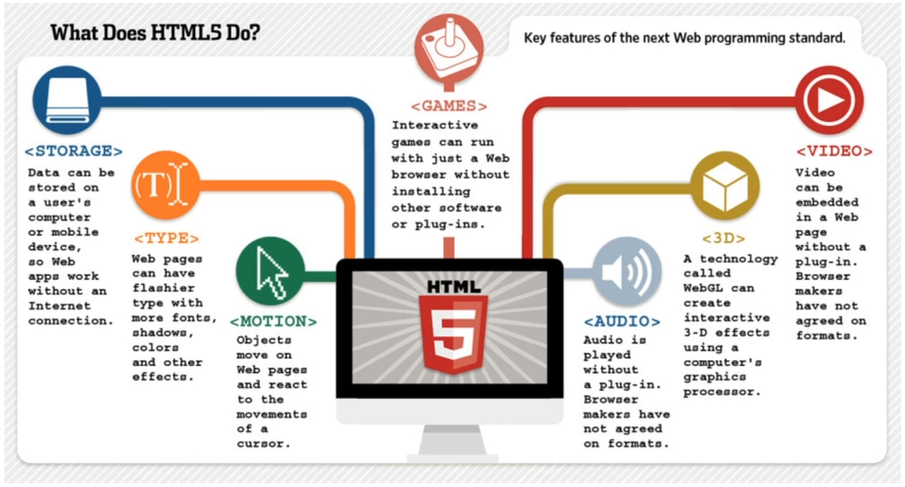

---

## GET과 POST의 차이점

### GET

1. 서버에 정보를 조회하기 위해 사용되는 메소드 ex) 게시판 글 조회
2. 서버에 정보를 요청할 때, 쿼리스트링을 통해 데이터 전송
3. URL 주소에 **?** 로 주소로 데이터를 전송 ex)
   [www.example.com/show?name1=value1&name2=value2](www.example.com/show?name1=value1&name2=value2)
4. 길이 제한이 있음.
5. 보안에 중요한 데이터를 담아서 보내면 안됨.

### POST

1. 서버에 데이터를 생성 또는 수정하기 위해 사용되는 메소드 ex) 게시판 글 작성
2. 데이터는 body에 담아서 보냄.
3. 데이터가 노출되지 않아 GET 방식보다는 안전함.

→ **GET은 SELECT, POST는 CREATE, UPDATE에 가까움**.

<br>

**GET**은 **Idempotent**, **POST**는 **Non-idempotent** 하게 설계됨.

**Idempotent**(멱등)

```

수학이나 전산학에서 연산의 한 성질을 나타내는 것으로, 연산을 여러 번 적용하더라도 결과가 달라지지 않는 성질

```

- GET의 경우 서버에 동일한 요청을 여러 번 보내더라도 항상 동일한 응답이 돌아와야 한다는 것을 의미.

- POST의 경우 서버에 동일한 요청을 여러 번 보내더라도 응답 결과가 다를 수 있다는 것을 의미.

→ **GET은 멱등하고, POST는 멱등하지 않다.**

---

## TCP와 UDP의 차이

TCP와 UDP는 데이터를 전송할 때 사용하는 프로토콜

### TCP (Transmission Control Protocol)

1. 연결형으로 **신뢰성**을 보장한다. (3-way handshaking 과정을 통해서)
2. **전송 순서를 보장하나 속도가 UDP보다 느리다.**
3. 파일 전송과 같은 **신뢰성이 중요한 경우** 사용한다.

### UDP (User Datagram Protocol)

1. 비연결형으로 **연속성**이 중요한 곳에 사용됨 ex) 스트리밍 서비스
2. 전송 순서가 바뀔 수 있다.
3. **신뢰성이 낮은 대신 속도가 빠름**

### TCP와 UDP의 구조

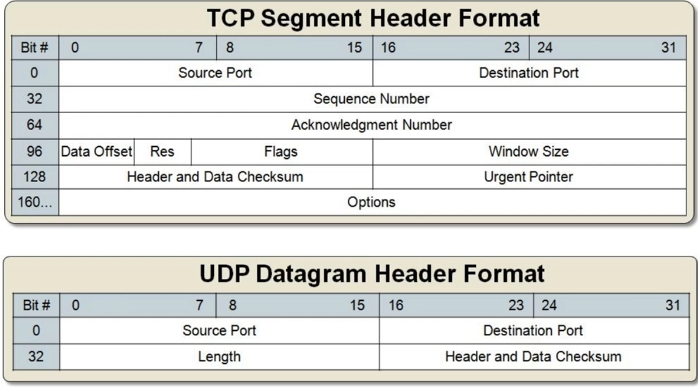

### 3-Way Handshaking(for establishing connection)

TCP로 통신하는 장치간 서로 연결이 잘 되었는지를 확인하는 방식.
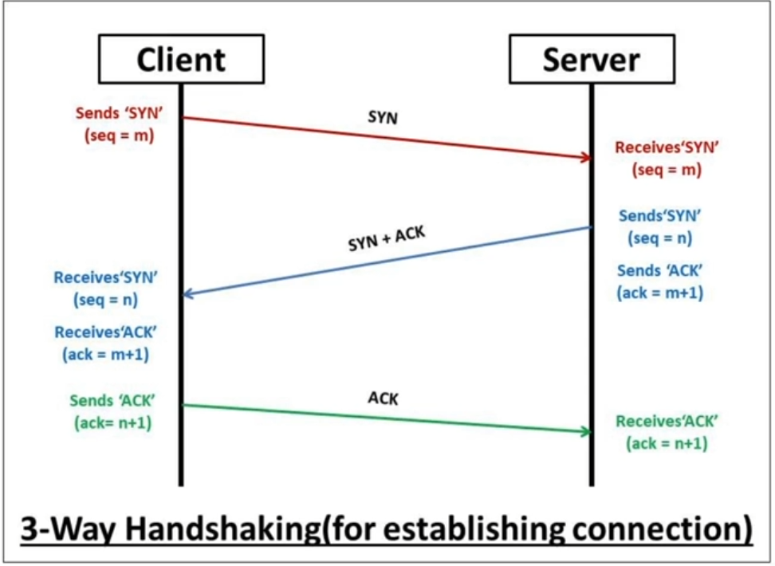

---

## HTTP와 HTTPS의 차이

### HTTP

1. **H**yper**T**ext **T**ransfer **P**rotocol
2. 데이터 요청/응답 (request/response)시 사용되는 프로토콜이다.
3. 암호화되지 않은 평문 데이터를 전송하기 때문에 서버와 주고 받는 데이터를 볼 수가 있다.
4. 80포트를 사용한다.

### HTTP + SSL (Secure Socket Layer) ⇒ HTTP + S (Secure)

1. HTTP에서 데이터 암호화가 추가된 프로토콜
2. 암호화된 데이터를 전송하기 때문에 제3자가 데이터를 볼 수 없다.
3. 443번 포트를 사용한다.

### HTTPS의 암호화 방식

1. 대칭키 암호화

   - 클라이언트와 서버가 동일한 키를 사용해 암호화/복호화 과정을 진행한다.
   - 키 노출 위험성이 큰 대신 속도가 빠르다.

2. 비대칭키 암호화

   - 공개키와 개인키를 사용해 암호화/복호화 과정을 진행한다.
   - 키가 노출되어도 비교적 안전한 대신 속도가 느리다.

---

## Restful API란

1. REST(REpresentational State Transfer)ful API
2. REST의 규칙을 지켜서 만든 API를 뜻한다.
   (REST란 소프트웨어 프로그램 아키텍처의 한 형태이다.)
3. 성능의 향상보다는 규칙을 통한 API 이해도와 호환성을 높이기 위함.
   (유지보수 및 코드의 재사용성을 높일 수 있다.)
   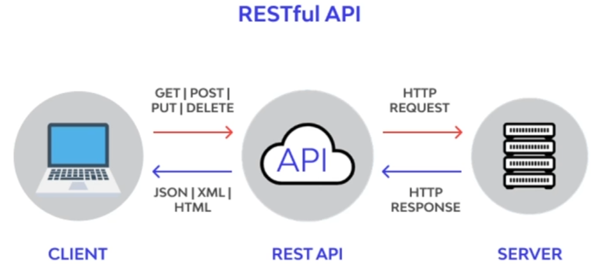

---

## 동기/비동기 방식

### 동기 (Synchronous) 방식

1. 요청과 결과가 동시에 일어남.
2. 요청을 하고 결과가 나올 때까지 기다림. (작업의 순서를 보장)
3. 여러 요청을 동시에 처리할 수 없음.
   ex) 1:1 고객 응대 카페
4. Blocking 방식

### 비동기 (Asynchronous) 방식

1. 요청과 결과가 동시에 일어나지 않는다.
2. 요청 후 결과와 상관없이 다음 요청을 진행
3. 여러 요청을 동시에 처리.
   ex) 1:N 고객 응대 카페
4. Non-Blocking 방식

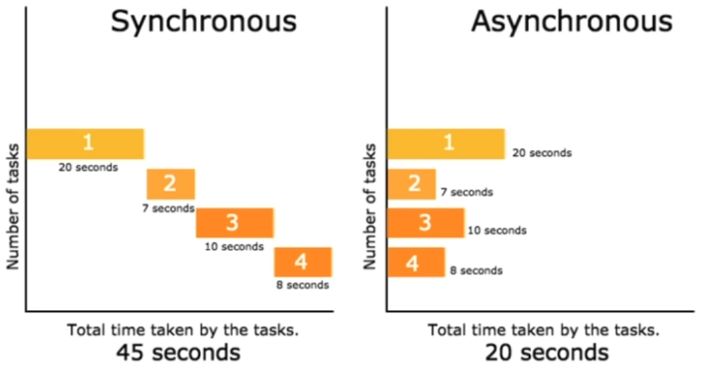

→ **무조건 비동기 방식이 좋다고는 할 수 없다. 비동기 방식의 경우 CPU나 메모리 소모가 크고, 작업의 순서가 중요한 경우, 동기 방식을 사용하기도 한다.**

---

## 프록시 서버란? 어떤 역할을 하는가?

### 프록시 (Proxy) 서버란?

1. proxy, 대리라는 뜻을 갖고 있다.
2. 클라이언트(유저)가 프록시 자신을 거쳐 다른 네트워크에 접속할 수 있도록 중간에서 대리역할을 하는 서버이다.
3. 즉, 인터넷에서 유저를 대신해서 데이터를 가져오는 서버이다.

**사용 이유**

1. 캐시 데이터 활용을 위함으로 프록시 서버에 요청된 내용은 굳이 한번 더 서버를 거칠 필요가 없게 되기 때문에 전송 시간을 아낄 수 있다.
2. 보안 목적으로 프록시 서버로 중간 경유를 하게 되면 IP 노출을 하지 않아도 되기 때문. 이러한 이유로 프록시 서버를 방화벽 목적으로 사용하기도 한다.

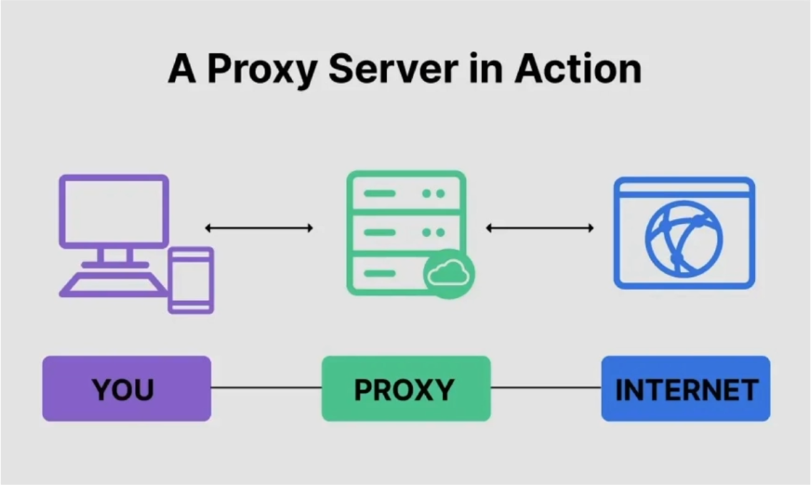

---

## DNS란?

### DNS(Domain Naming Server)란?

1. 도메인 이름과 IP 주소의 변환기 역할
2. 192.0.0.1과 같은 숫자 IP주소를 사람이 읽을 수 있는 주소로 변환해준다.
   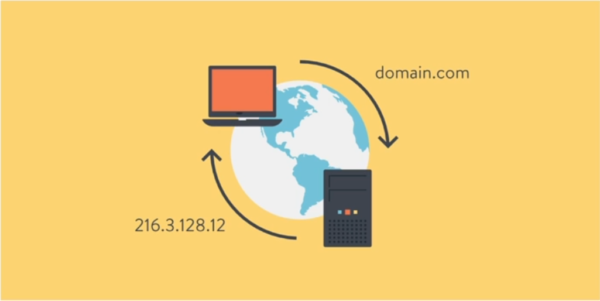

---

## 패킷이란?

### 패킷(Packet)이란?

- 패키지(package)와 버킷(bucket)의 합성어로 데이터의 전송 단위를 뜻한다.

---

## 쿠키와 세션의 차이는?

### 쿠키(Cookie)란?

- 브라우저 로컬에 저장되는 Key-Value 형태의 데이터 파일

### 세션(Session)이란?

- 브라우저가 종료되기 전까지 유저의 요청을 유지하게 해주는 기술

### 차이점

1. 저장위치: 쿠키는 로컬에 저장, 세션은 로컬과 서버에 저장한다.
2. 생명주기: 쿠키는 브라우저를 종료해도 파일로 남아있지만, 세션은 브라우저 종료시 삭제된다.
3. 속도: **쿠키**는 파일에서 읽기 때문에 상대적으로 빠르지만, **세션**은 요청마다 서버에서 처리해야 하기 때문에 비교적 느리다.

---

## 프로세스와 스레드의 차이점은?

### 프로세스(Process)란?

- 운영체제로부터 자원을 할당받은 작업의 단위

### 스레드(Thread)란?

- 프로세스가 할당받은 자원을 이용하는 실행 흐름의 단위

→ **프로세스가 더 큰 단위로 존재하고, 내부에 스레드가 존재한다.**

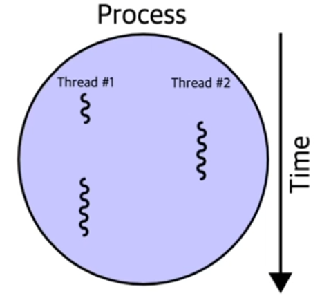{: width="300"}

**프로세스**는 운영체제로부터 각각 **독립된 메모리 영역(Code, Data, Stack, Heap)**을 할당 받는다.

하나의 프로세스가 생성되면 하나의 스레드가 생성된다.

**스레드**는 프로세스 내에서 동작되는 실행의 흐름으로 **각각 Stack만 따로 할당받고 Code, Data, Heap 영역은 공유한다.**

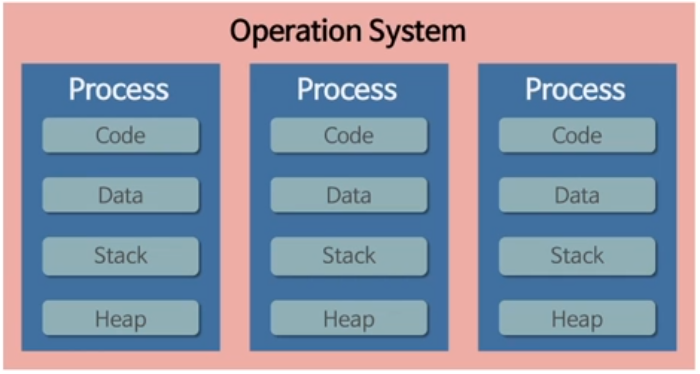

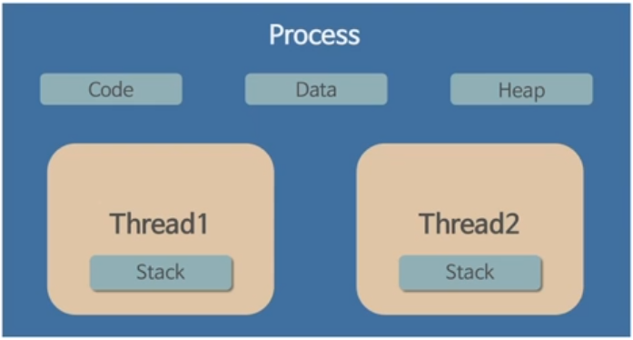

---

## 컨텍스트 스위칭이란?

### 컨텍스트 스위칭(Context Switching)이란?

- 하나의 프로세스가 실행되고 있는 상태에서 다른 우선 순위의 요청이 들어왔을 때, 기존의 컨텍스트를 저장하고 다음 프로세스를 실행할 수 있도록 새로운 컨텍스트로 교체하는 작업

**프로세스의 컨텍스트 스위칭**의 경우 공유되는 영역이 없으므로 컨텍스트 스위칭에 시간이 오래 걸린다.

**스레드**의 경우 공유 영역이 많기 때문에 컨텍스트 스위칭이 프로세스보다 빠르다.

→ **이 차이가 백엔드 서버의 속도 차이를 유발하기에 중요하다.**

---

## 힙 영역과 스택 영역의 차이점은?

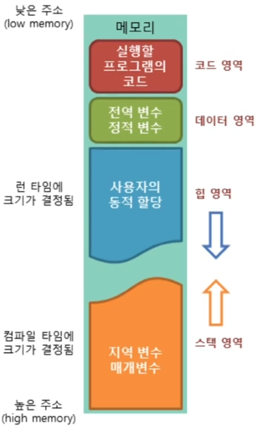{: width="150"}

프로그램 실행을 위해 OS에서 제공하는 메모리 공간

1. 코드 영역
   - 코드가 저장되는 영역
2. 데이터 영역
   - 전역 변수와 정적 변수가 저장되는 영역
3. 스택 영역
   - 지역 변수와 매개 변수가 저장되는 영역
   - 정적 메모리가 저장. LIFO(List-In First-Out) 방식.
4. 힙 영역
   - 전역 변수가 저장되는 영역
   - 사용자에 의해 메모리 공간이 동저긍로 할당되고 해제됨

---
