# [JS] JavaScript란?

## JavaScript란?

- 객체(Object) 기반의 스크립트 프로그래밍 언어
- ECMAScript 사양을 준수하는 범용 스크립팅 언어
- 자바와 직접적인 연관은 없으며, 웹의 동적 동작을 구현하기 위해 제작
- Mocha → LiveScript → JavaScript로 명칭 변경
- JavaScript는 JS 엔진위에서 수행되며, Google V8, Firefox SpiderMonkey, Edge Chakra 존재

---

## ECMAScript란?

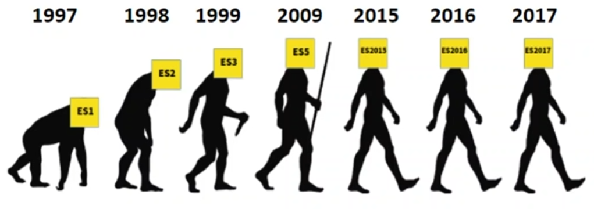

- Ecma International이 ECMA-262 기술 규격에 따라 정의하고 있는 표준화된 스크립트 프로그래밍 언어
- 자바스크립트를 표준화하기 위해 만들어졌으며, 액션스크립트와 J스크립트 등 다른 구현체도 포함
- Ecma International: 정보 통신에 대한 표준을 제정하는 비영리 표준화 기구
- ECMA-262: Ecma International에서 제정한 기술 규격의 이름으로, 범용 목적의 스크립트 언어 명세 기술
- 97년 ES1 초판, 09년 ES5, 15년 ES2015(ES6)으로 매해 6월에 버전 갱신 중

---

## 코드 동작 흐름

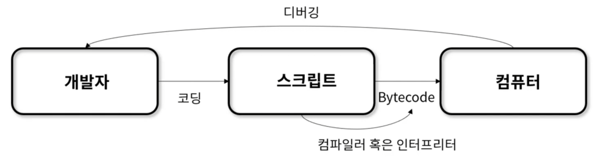

---

## 컴퓨터 내부 동작 원리

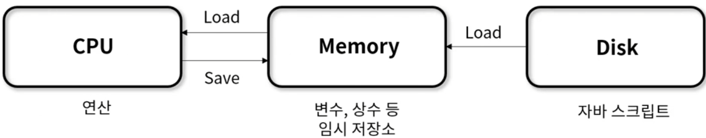

---

## 입출력

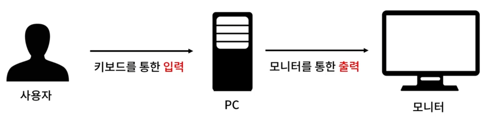

- 사용자가 프로그램과 상호작용하기 위한 방법으로, 입력과 출력을 아우르는 개념
- Input/Output의 머리 글자를 따서 I/O로 줄여서도 표기
- 운영 체제에서의 대표적인 입출력은 “표준 입력 / 표준 출력 / 표준 오류 출력”

### 표준 입력 (stdin)

- 일반적으로 컴퓨터의 키보드의 응답을 받아 입력
- 프로그램의 데이터를 추가하기 위한 입력 장치
- 알고리즘에서는 문제의 Testcase 입력을 위해 사용

<!-- {: width="100"} -->

### 표준 출력 (stdout)

- 일반적으로 컴퓨터의 모니터에 문자열로 출력
- 프로그램의 실행 상태 혹은 실행 결과를 보고 판단
- 알고리즘에서는 문제의 정답 확인, 디버깅 용으로 사용

<!-- {: width="100"} -->

---

## 코드 구성

- JavaScript는 문법의 대부분을 C, C++, Java로부터 차용하여 제작된 스크립트 기반의 언어
- 다수의 표현식(expression)으로 하나의 명령문(statement)이 만들어지며, 명령문으로 프로그램이 수행
- 하나의 명령문 끝은 개행 문자(Enter) 혹은 세미콜론(;)으로 표시
  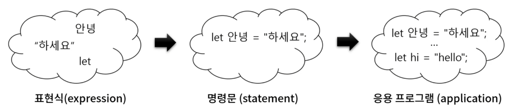

---

## 키워드

- JavaScript에서 문법을 만들 때 미리 정해진 용도로 동작하기 위해 정의해 놓은 단어
- JavaScript에 예약된 키워드 목록 (\*는 ES5와 ES6에 추가된 단어)

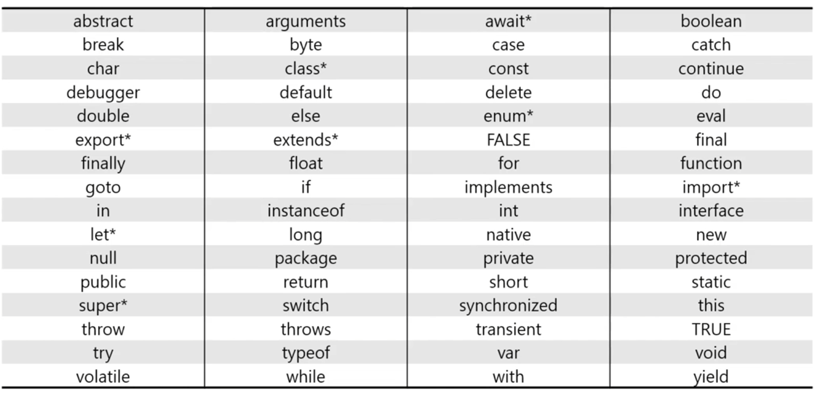

---

## 식별자

- 스크립트에서 변수나 함수에 이름을 붙일 때 사용하는 단어
- 대소문자를 구별하며 유니코드 문자셋을 이용
- 자바스크립트 내 식별자 규칙
  - 키워드 사용 불가
  - 숫자로 시작 불가
  - 특수문자는 **\_** 와 **$** 만 허용
  - 공백 문자 포함 불가

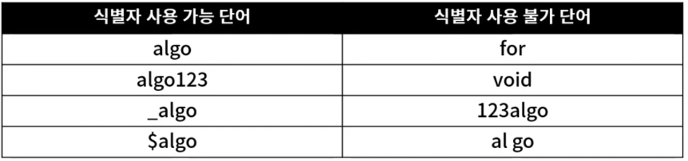

---

## 주석

- 프로그램 구현 시 개발자의 설명 및 이해를 쉽게 도와주는 문장으로 실제 실행 코드에는 포함되지 않음
- 주석의 종류는 단일 행 주석 **//** 과 다중 행 주석 **/\* \*/** 존재
  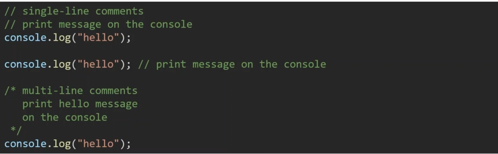

---

## 변수

- **변경 가능한** 값을 저장하기 위한 기억 공간 (memory)
- 사용하기 전 반드시 선언 필요
- 중복 선언 불가능
- 키워드: **let**

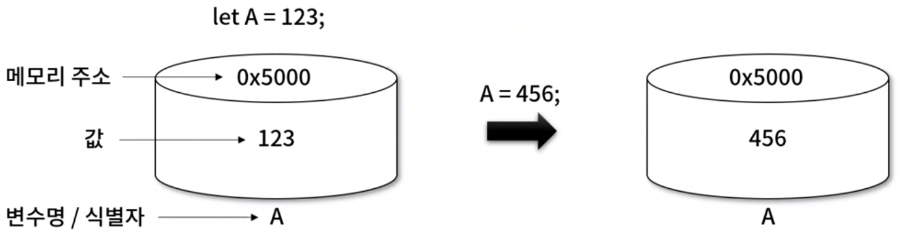

## 상수

- **변경 불가능한** 값을 저장하기 위한 기억 공간
- 사용하기 전 반드시 선언 필요
- 중복 선언 불가능
- 키워드: **const**

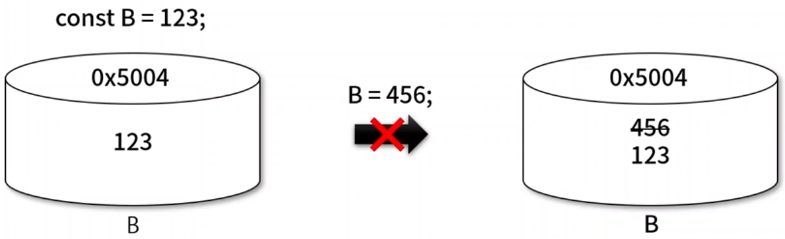

### 변수, 상수 예제 코드

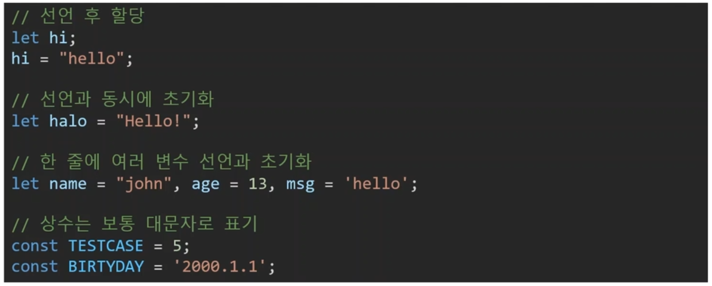

---

## 호이스팅

- 코드에 선언된 변수 및 함수를 유효한 범위의 코드 상단으로 끌어 올리는 작업
- **var** 의 변수/함수 선언만 위로 올려지고, 할당은 올려지지 않음
- **let/const** 변수 선언과 함수 표현식에서는 호이스팅이 발생하지 않음

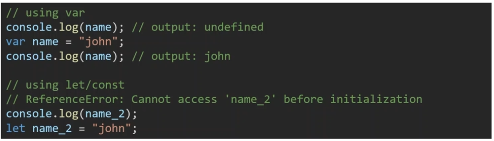
