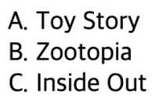
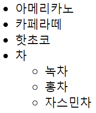
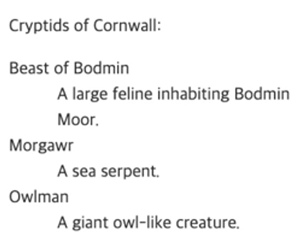
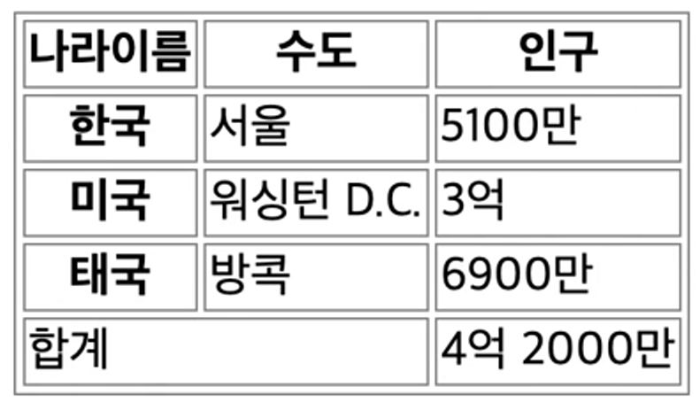
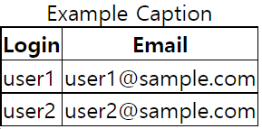

# [HTML] 목록과 표

## 목록 - ul, ol, li

💡 **ol**

1. Ordered List. 정렬 목록, 순위, 단계적으로 수행해야 하는 것들을 처리할 때 사용한다.
2. type 을 통해 목록을 표시할 수 있다.
    - 기본값이 숫자 ‘1’
    - 이외에도 **‘a’**(소문자 알파벳), **‘A’**(대문자 알파벳), **‘i’**(소문자 로마 숫자), **‘I’**(대문자 로마 숫자)로 나타낼 수 있다.
    - start 속성을 통해 시작 번호를 조절할 수 있다.
    - reversed 속성을 통해 숫자를 반대로 출력할 수도 있다. (defalut 값은 false)


```html
<ol type="A">
	<li>Toy Story</li>
	<li>Zootopia</li>
	<li>Inside Out</li>
</ol>
```



💡 **ul**

- Unordered List, 비정렬 목록, 순서없는 목록을 처리할 때 사용한다.

```html
<ul>
	<li>아메리카노</li>
	<li>카페라떼</li>
	<li>핫초코</li>
	<li>차
		<ul>
			<li>녹차</li>
			<li>홍차</li>
			<li>자스민차</li>
		</ul>
	</li>
</ul>
```



💡 **공통**

- **li** : List Item, **ol**, **ul** 공통적으로 사용한다. 단일 아이템을 표기할 때 사용한다.
    - value 속성을 통해 값을 줄 수도 있다. but, 가급적 **ol** 태그로 조절하는 편이 가독성이 좋다.
        - 이후 **li** 태그에도 영향을 미친다. 이전 **li** 태그에는 영향을 미치지 않는다.

---

## 정의 목록 - dl, dt, dd

💡 **dl**

- description list, 설명 목록을 나타낸다. 용어를 정의하거나 설명하는 목록
    - **dt** 태그와 **dd** 태그를 가질 수 있다. (like **li** 태그)
    - **dt** : 용어명
    - **dd** : 용어 설명
    - **dt** 태그와 **dd** 태그는 1대1로 매칭될 수도 있고, 여러 개의 **dt** 태그와 한 개의 **dd** 태그로 매칭될 수도, 하나의 **dt** 태그와 여러 개의 **dd** 태그가 매칭될 수도 있다.
    - **dt** 태그와 **dd** 태그 그룹을 **div** 태그로 감싸서 스타일링할 수 있다. but, **dt 태그와 dd 태그의 형제로 div 태그를 사용하면 안된다.** (웹 표준)

```html
<p>Cryptids of Cornwall:</p>

<dl>
	<dt>Beast of Bodmin</dt>
	<dd>A large feline inhabiting Bodmin Moor.</dd>

	<dt>Morgawr</dt>
	<dd>A sea serpent.</dd>

	<dt>Owlman</dt>
	<dd>A giant owl-like creature.</dd>
</dl>
```



---

## 표 - table, tr, th, td

💡 **table**

- 복잡한 형태의 데이터를 2차원 행렬의 형태로 나타낼 수 있는 태그이다.
    - **tr** : table row, 행(가로줄)
    - **th** : table head, 행이나 열을 통칭하는 명칭이 들어간다.
        - **scope** 속성 : 어떤 범위를 대표하는 것인지 나타내기 위해 사용한다. “col” 이나 “row” 값을 줄 수 있는데 직접적인 변화는 없으나, 스크린리더 등을 사용할 때 접근성을 높이기 위해 사용한다.
    - **td** : table data
        - **colspan** 속성 : 폭을 의미하는데 몇 칸을 차지할지 설정해줄 수 있다.

```html
<tr>
	<td colspan="2">합계</td>
	<td>4억 2000만</td>
</tr>
```



---

## thead, tbody, tfoot

💡 **thead, tbody, tfoot**

1. **table** 내에서도 구획(**header**, **body**, **footer**)을 나눌 수 있다.
2. **thead**를 사용했다면 형제 태그로 **tr** 태그가 존재하면 안된다.
    → 에러는 발생하지 않으나 표준에 맞지 않음.
3. 구획을 나누는 편이 스타일링을 할 때도 편리하다.
4. 종류
    - **thead** : **header**. **table** 태그의 바로 아래에 위치시켜야 한다.
    - **tbody** : body
    - **tfoot** : footer

```html
<thead>
	<tr>
		<th scope="col">품목</th>
		<th scope="col">지출</th>
	</tr>
<thead>
<tbody>
	<tr>
		<th scope="row">대파</th>
		<td>3,000</td>
	</tr>
	<tr>
		<th scope="row">달걀</th>
		<td>4,000</td>
	</tr>
	<tr>
		<th scope="row">고양이간식</th>
		<td>12,000</td>
	</tr>
	<tr>
		<th scope="row">종이봉투</th>
		<td>300</td>
	</tr>
</tbody>
<tfoot>
	<tr>
		<th scope="row">Totals</th>
		<td>33,300</td>
	</tr>
</tfoot>
```


---

## caption

💡 **caption**

- 표의 설명 또는 제목을 붙일 수 있다.
- default로 가운데 정렬로 들어간다.
- **table** 요소의 첫 번째 자식으로 들어가야만 한다.
- 만일 설명을 하단이나 옆면에 붙이고 싶으면 CSS를 사용해야 한다.
- **figure**로 감싼다고 할 때, 유일한 자식이라면 **figcaption**을 사용해야 한다.

```html
<table>
	<caption>Example Caption</caption>
	<tr>
		<th>Login</th>
		<th>Email</th>
	</tr>
	<tr>
		<td>user1</td>
		<td>user1@sample.com</td>
	</tr>
	<tr>
		<td>user2</td>
		<td>user2@sample.com</td>
	</tr>
</table>
```



---

## 관련 링크

- **ol** : [https://developer.mozilla.org/ko/docs/Web/HTML/Element/ol](https://developer.mozilla.org/ko/docs/Web/HTML/Element/ol)
- **ul** : [https://developer.mozilla.org/ko/docs/Web/HTML/Element/ul](https://developer.mozilla.org/ko/docs/Web/HTML/Element/ul)
- **dl** : [https://developer.mozilla.org/ko/docs/Web/HTML/Element/dl](https://developer.mozilla.org/ko/docs/Web/HTML/Element/dl)
- **table** : [https://developer.mozilla.org/ko/docs/Web/HTML/Element/table](https://developer.mozilla.org/ko/docs/Web/HTML/Element/table)
- **thead** : [https://developer.mozilla.org/ko/docs/Web/HTML/Element/thead](https://developer.mozilla.org/ko/docs/Web/HTML/Element/thead)
- **tbody** : [https://developer.mozilla.org/ko/docs/Web/HTML/Element/tbody](https://developer.mozilla.org/ko/docs/Web/HTML/Element/tbody)
- **tfoot** : [https://developer.mozilla.org/ko/docs/Web/HTML/Element/tfoot](https://developer.mozilla.org/ko/docs/Web/HTML/Element/tfoot)
- **caption** : [https://developer.mozilla.org/ko/docs/Web/HTML/Element/caption](https://developer.mozilla.org/ko/docs/Web/HTML/Element/caption)