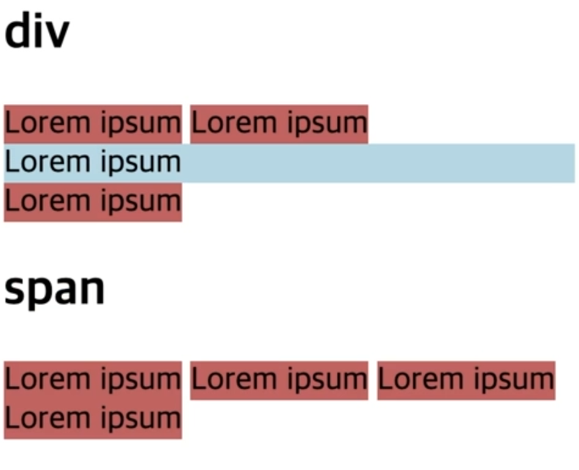

# [HTML] 구조를 나타내는 요소

## 컨테이너 (div, span)

💡 **div** : **콘텐츠 분할 요소**

- 플로우 콘텐츠를 위한 통용 블록 컨테이너. CSS로 꾸미기 전에는 콘텐츠나 레이아웃에 어떠한 영향도 주지 않는다.

💡 **span**

- 구문 콘텐츠를 위한 통용 인라인 컨테이너. CSS로 꾸미기 전에는 콘텐츠나 레이아웃에 어떠한 영향도 주지 않는다.

```html
<h2>div</h2>
<span>Lorem ipsum</span>
<span>Lorem ipsum</span>
<div>Lorem ipsum</div>
<span>Lorem ipsum</span>

<h2>span</h2>
<span>Lorem ipsum</span>
<span>Lorem ipsum</span>
<span>Lorem ipsum</span>
<span>Lorem ipsum</span>
```

{: width="500"}

- div 태그가 블록 레벨 컨테이너임에도 여백이 생기는 이유 <br>
  → 블록 레벨 컨테이너가 가질 수 있는 최대 길이는 부모의 길이인데 부모 태그인 body 태그는 브라우저가 위아래로 조금씩 여백을 만들기 때문이다.

---

## 시멘틱 웹

- **Semantic** : 의미의, 의미론적인
- **요소의 의미를 고려하여, 구조를 설계하고 코드를 작성한다.**

### semantic tag

```html
<body>
  <header><!-- Header --></header>

  <nav><!-- 메뉴 --></nav>

  <main>
    <article><!-- 본문 --></article>
    <aside><!-- 사이드바 --></aside>
  </main>

  <footer><!-- Footer --></footer>
</body>
```

### non-semantic tag

```html
<body>
  <div><!-- Header --></div>

  <div><!-- 메뉴 --></div>

  <div>
    <div><!-- 본문 --></div>
    <div><!-- 사이드바 --></div>
  </div>

  <div><!-- Footer --></div>
</body>
```

### 의미론적인 마크업을 사용하면 다음과 같은 이점이 존재한다.

1. 검색 엔진(구글)은 의미론적 마크업을 분석하여 페이지의 검색 랭킹에 영향을 줄 수 있는 중요한 키워드로 간주한다.
2. 시각 장애가 있는 사용자가 스크린리더로 페이지를 탐색할 때 의미론적 풋말로 사용할 수 있다.
3. 의미가 없는 끊임없는 **div** 들을 탐색하는 것보다, 의미있는 코드 블록을 찾는 것이 훨씬 쉽다. 즉, 가독성이 더 좋다.
4. 개발자에게 태그 안에 채워질 데이터 유형을 제안한다.
5. 의미있는 이름짓기(Semantic naming)는 적절한 사용자 정의 요소 / 구성 요소의 이름짓기(naming)를 반영한다.

---

## header, footer

💡 **header**

1. 소개 및 탐색에 도움에 주는 콘텐츠를 나타낸다. 제목, 로고, 검색 폼, 작성자 이름 등등이 포함될 수 있다.
2. 도입부에 해당하는 콘텐츠나 네비게이션 링크의 집합 등과 같은 정보를 포함한다.

   - 하나 이상의 제목 요소(h1 ~ h6)
   - 로고(logo)나 아이콘(icon)
   - 저자(author) 정보

3. HTML 문서는 여러 개의 **header** 요소를 포함할 수 있다.

```html
<article>
    <header>
        <h3>날씨 정보</h4>
        <h4>8월 9일</h4>
        <p>- 기상청 제공 -</p>
    </header>
    <p>서울 : 맑음</p>
    <p>대구 : 흐림</p>
    <p>부산 : 비</p>
</article>
```

💡 **footer**

1. 일반적으로 구획의 작성자, 저작권 정보, 관련 문서 등의 내용이 포함된다.
2. 하나의 HTML 문서에는 여러 개의 **footer** 요소가 포함될 수 있다.

```html
<footer>
  <p>Copyright © 2022 example.co.,Ltd. All rights reserved.</p>
  <address>Contact site for more information. 010-1234-5678</address>
</footer>
```

---

## nav

💡 **nav**: **탐색 구획 요소**

1. 문서의 부분 중 현재 페이지 내, 또는 다른 페이지로의 링크를 보여주는 구획을 나타낸다. 메뉴, 목차, 색인에 자주 쓰인다.
2. **footer** 와의 차이: **footer**의 경우 페이지 전체를 아우르는 링크들이 주로 들어가고, **nav**의 경우 현재 페이지를 기준으로 상위 페이지, 하위 페이지, 혹은 현재 페이지의 개요등을 나타낸다.

```html
<nav>
  <a href="/html/intro">HTML</a>
  <a href="/css/intro">CSS</a>
  <a href="/javascript/intro">JavaScript</a>
  <a href="/typescript/intro">TypeScript</a>
</nav>
```

---

## aside

💡 **aside**: **별도 구획 요소**

1. 문서의 주요 내용과 간접적으로만 연관된 부분을 나타낸다. 주로 사이드바 혹은 콜아웃 박스로 표현한다.
2. 없어진다고 해서 메인 콘텐츠에 영향이 없는 부분을 나타낸다.

```html
<h2>과메기</h2>
<p>
  과메기는 경상북도 포항 지역의 특산물로 청어나 꽁치를 추운 겨울 동안 얼렸다
  녹였다를 반복하여 반건조시킨 음식이다.
</p>
<aside>
  <h4>포항</h4>
  <p>
    포항시는 대한민국 경상북도 동해안에 위치하고 있으며, 포항시 중심을 관통하는
    형산강이 영일만에 유입되면서 넓은 충적평야를 형성하는 지역이다.
  </p>
</aside>
```

---

## main

💡 **main**

- 문서 **body**의 주요 콘텐츠를 나타낸다. 주요 콘텐츠 영역은 문서의 핵심 주제나 앱의 핵심 기능에 직접적으로 연결됐거나 확장하는 콘텐츠로 이루어진다.

```html
<main>
  <h1>example</h1>
  <p>example sentence</p>
  <article>
    <h2>example1</h2>
    <p>example1 sentence</p>
  </article>
  <article>
    <h2>example2</h2>
    <p>example2 sentence</p>
  </article>
</main>
```

---

## article

💡 **article**

1. semantic 태그
2. 문서, 페이지, 애플리케이션, 또는 사이트 안에서 독립적으로 구분하여 배포하거나 재사용할 수 있는 구획을 나타낸다. 게시판이나 블로그 글, 매거진이나 뉴스 기사 등을 나타낼 때 사용한다.
3. **section**과는 차이가 존재. **article**은 독립적 콘텐츠이므로 다른 곳에서도 재사용 가능하다.
4. **article**은 독립적 콘텐츠이므로 내부에 **header**와 **footer** 사용 가능하다.

```html
<article>
  <h2>8월 8일 날씨 정보</h2>
  <h3>서울</h3>
  <p>맑음</p>
  <h3>대구</h3>
  <p>흐림</p>
  <h3>부산</h3>
  <p>비</p>
</article>
```

---

## section

💡 **section**: **일반 구획 요소**

1. semantic 태그
2. 문서의 독립적인 구획을 나타내며, 더 적합한 의미를 가진 요소가 없을 때 사용한다.
3. **article**로 사용할 수 있는지 판단하고, 사용할 수 없는 경우에 **section**을 사용하면 된다.
4. **div**로도 구현할 수 있지만, **div** 태그는 의미를 부여하는 것이 아니라 디자인적으로 구성하는 것이 목적이므로 **section**과 구분된다.

```html
<section>
  <h1>HTML</h1>
  <p>
    HTML(HyperText Markup Language)은 하이퍼텍스트 마크업 언어(HyperText Markup
    Language)라는 의미의 웹 페이지를 위한 마크업 언어이다.
  </p>
</section>
<section>
  <h1>HTML의 역사</h1>
  <p>
    최초의 HTML은 1991년 말에 버너스리가 처음으로 인터넷에서 문서를 "HTML
    태그"(HTML tag)로 부르면서 시작되었다.
  </p>
</section>
```

## 관련 링크

- **div** : [https://developer.mozilla.org/ko/docs/Web/HTML/Element/div](https://developer.mozilla.org/ko/docs/Web/HTML/Element/div)
- **span** : [https://developer.mozilla.org/ko/docs/Web/HTML/Element/span](https://developer.mozilla.org/ko/docs/Web/HTML/Element/span)
- **header** : [https://developer.mozilla.org/ko/docs/Web/HTML/Element/header](https://developer.mozilla.org/ko/docs/Web/HTML/Element/header)
- **footer** : [https://developer.mozilla.org/ko/docs/Web/HTML/Element/footer](https://developer.mozilla.org/ko/docs/Web/HTML/Element/footer)
- **nav** : [https://developer.mozilla.org/ko/docs/Web/HTML/Element/nav](https://developer.mozilla.org/ko/docs/Web/HTML/Element/nav)
- **aside** : [https://developer.mozilla.org/ko/docs/Web/HTML/Element/aside](https://developer.mozilla.org/ko/docs/Web/HTML/Element/aside)
- **main** : [https://developer.mozilla.org/ko/docs/Web/HTML/Element/main](https://developer.mozilla.org/ko/docs/Web/HTML/Element/main)
- **article** : [https://developer.mozilla.org/ko/docs/Web/HTML/Element/article](https://developer.mozilla.org/ko/docs/Web/HTML/Element/article)
- **section** : [https://developer.mozilla.org/ko/docs/Web/HTML/Element/section](https://developer.mozilla.org/ko/docs/Web/HTML/Element/section)
