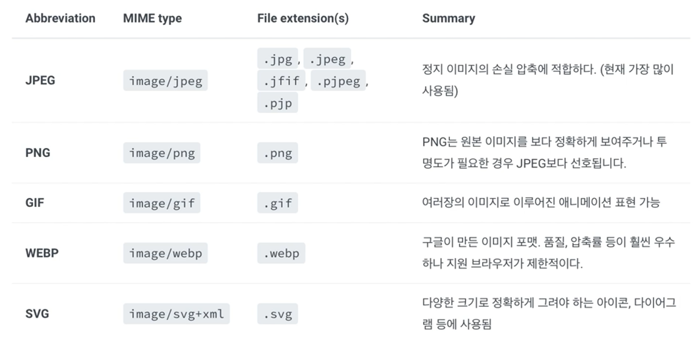
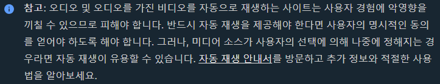

# [HTML] 임베디드 요소

## img - src, alt, title, width, height

💡 **img: 이미지 삽입 요소**

1. **src** 속성 : **필수**. 포함하고자 하는 **이미지로의 경로를 지정한다**.
    - ‘절대 경로’와 ‘상대 경로’ 모두 사용 가능하다.
2. **alt** 속성 : 이미지의 텍스트 설명으로 필수는 아니지만, alt 속성값을 읽어 사용자에게 이미지를 설명하므로, **접근성 차원에서 유용하다**. 또한, 네트워크 오류 등으로 **이미지를 표시할 수 없는 경우에도 alt 속성값을 대신 보여준다**.
3. **title** 속성 : 이미지에 마우스를 올리면 title 속성값이 뜨게 된다.
4. **width, height** 속성 : 이미지 크기를 조절할 수 있다. CSS 스타일링을 통해서도 이미지 크기를 조절할 수 있다.

```html

```

---

## 웹에서 사용하는 이미지 유형



- **래스터 이미지** : JPEG, PNG, GIF, WEBP. 풍경 사진, 일반적인 사진
- **벡터 이미지** : SVG. 아이콘, UI
    
    

→ **래스터 이미지와 달리 벡터 이미지는 아무리 확대해도 깨져보이지 않는다. 더 선명하게 보임. 용도가 다르다.**

## 반응형 이미지 - srcset, sizes

💡 **srcset : 여러 개의 이미지 경로를 설정할 수 있게 한다. 반응형 이미지**

- 2개 이상의 문자열을 쉼표로 구분하여 입력한다. 선택적으로 공백 삽입 후 ‘너비 서술자(양의 정수와 바로 뒤의 ‘w’ 문자)’, ‘밀도 서술자(양의 실수와 바로 뒤의 ‘x’ 문자)’를 기입한다.
- 작은 순으로 기입한다.

```html

```

💡 **sizes : 이미지 조건을 설정해줄 수 있다.**

- min-width, max-width 속성을 자주 사용한다.
- 크기가 600px 이상인 경우에는 600px로 고정, 450px 이상 600px 미만인 경우에는 450px로 고정, 그 이하는 300px로 고정해주는 코드

```html

```

---

## video

💡 **video: 비디오 삽입 요소**

- **img** 태그는 빈 태그이기에 자식을 가질 수 없었으나, **video** 태그는 내부에 자식 콘텐츠를 넣을 수  있다. 자식 콘텐츠는 브라우저가 video 요소를 지원하지 않을 때 보여진다.
    - **src 속성**에 동영상 주소를 넣어준다. **src** 속성에 **url**을 넣지 않는 대신에 **video**태그의 자식 콘텐츠로 **source src=”주소”** 형식으로 넣어줘도 정상적으로 동작한다.
    - **controls 속성**을 통해 볼륨 조절, 동영상 탐색, 일시 정지/재시작을 할 수 있는 컨트롤러를 제공할 수 있다.
    - **autoplay 속성**을 주면 자동재생된다. but, 소리가 있는 경우 새로고침을 하면 자동재생되지 않는다.
        - 소리를 없애면 자동재생시킬 수 있는데 **muted 속성**을 주면 소리가 없어진다.
    - **loop 속성** : 동영상 재생이 끝나면 자동으로 처음으로 돌아간다.
    - **poster 속성** : 썸네일 기능을 하는데 지정해주지 않으면 첫 번째 프레임을 포스터 프레임으로 출력한다.
        
```html
<video poster="images/large.png">
```

```html
<video controls>
	<source src="video/sample-mp4-file.mp4">
	Sorry, your browser doesn't support embedded videos.
</video>
```

---

## audio

💡 **audio**

- **video** 태그와 유사한 속성이 사용된다.
    - **src 속성**에 **audio** 소스를 넣어준다. **video** 태그와 동일하게 **src** 속성 대신에 자식으로 **source** 태그 **src** 속성에 오디오 소스를 넣어주는 것도 가능하다.
    - **autoplay 속성**이 존재하나 다음과 같이 제한되는 경우가 많다.
        
        
        
    - **controls 속성**을 통해 재생을 조절할 수 있는 컨트롤러를 삽입할 수 있다.

---

## canvas, iframe

💡 **canvas: 그래픽 캔버스 요소**

- **HTML**로 마크업할 수 있지만, 크기만 조절하고 실제 동작은 **JavaScript**를 통해 구현한다.

💡 **iframe: 인라인 프레임 요소**

- **src 속성**에 **url**을 삽입하면 프레임 안에 다른 **HTML** 페이지를 띄어준다.
- 보안상의 이유로 아무 페이지를 가져올 수 있는 것이 아니라 주로 구글 맵 같은 요소를 **iframe** 요소로 가져온다.

---

## 관련 링크

- **img** : [https://developer.mozilla.org/ko/docs/Web/HTML/Element/img](https://developer.mozilla.org/ko/docs/Web/HTML/Element/img)
- **srcset, sizes** : [https://developer.mozilla.org/ko/docs/Learn/HTML/Multimedia_and_embedding/Responsive_images](https://developer.mozilla.org/ko/docs/Learn/HTML/Multimedia_and_embedding/Responsive_images)
- **video** : [https://developer.mozilla.org/ko/docs/Web/HTML/Element/Video](https://developer.mozilla.org/ko/docs/Web/HTML/Element/Video)
- **audio** : [https://developer.mozilla.org/ko/docs/Web/HTML/Element/audio](https://developer.mozilla.org/ko/docs/Web/HTML/Element/audio)
- **canvas** : [https://developer.mozilla.org/ko/docs/Web/API/Canvas_API](https://developer.mozilla.org/ko/docs/Web/HTML/Element/canvas)
- **iframe** : [https://developer.mozilla.org/ko/docs/Web/HTML/Element/iframe](https://developer.mozilla.org/ko/docs/Web/HTML/Element/iframe)