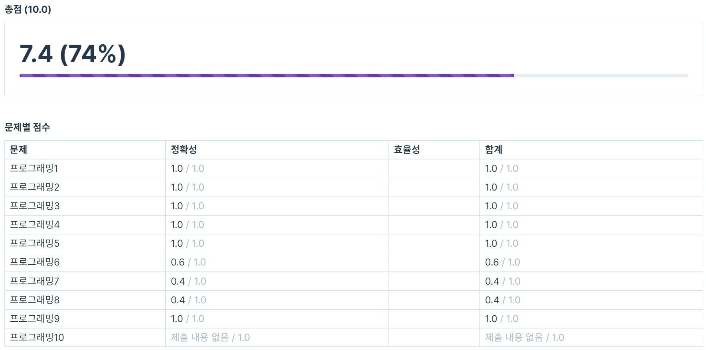

# [코테] 4주차 코딩테스트

**8월 10일**, 드디어 네 번째 코딩테스트가 다가왔다.

---



이전 회차보다 0.4점 떨어진 7.4점..

---

상승 곡선을 원했다만.. 어째 하향 곡선을 그리고 있다.. ㅋㅋ

커뮤니티를 봐도, 체감상으로도 난이도가 점차 올라가는게 느껴진다..

제대로 복습하고, 다시금 알고리즘 공부 방법을 개선해봐야겠다..

---

## 내 풀이

### 1. change

```jsx
function solution(A) {
  let count = 0;
  const arr = [50000,10000,5000,1000,500,100,50,10,5,1];
  for(let item of arr){
    count = count + Math.floor(A/item); //동전의 개수
    A = A - item * Math.floor(A/item); // 남은 돈 계산
  }
  return count;
}

console.log(solution(12345));
```

### 2. greatestCommonFactor

```jsx
function solution(A) {
  let tmp;

  let array = [];
  for (let element of A) {
    array.push(element);
  }

  array.sort(function compare(a, b) {
    return a - b;
  });

  tmp = array[0];

  for (; tmp >= 1 ; tmp--) {
    for (let i = 0 ; i < array.length ; i++) {
      if(array[i] % tmp == 0) {
        if(i == array.length - 1) {
          return tmp;
        }
      } else {
        break;
      }
    }
  }

  return tmp;
}

console.log(solution([6, 12, 4]));
```

### 3. inputK

```jsx
function solution(N, K) {
  let array = [];
  let bool = true;
  if(N < 0) {
    bool = false;
    N *= -1;
  }

  do {
    array.unshift(N % 10);
    N = Math.floor(N / 10);
  } while(N > 0);

  if(bool) {
    for(let i = 0 ; i < array.length ; i++) {
      if(array[i] < K) {
        array.splice(i, 0, K);
        break;
      }
    }
  } else {
    for(let i = 0 ; i < array.length ; i++) {
      if(array[i] > K) {
        array.splice(i, 0, K);
        break;
      }
    }
  }

  let answer = "";

  for(let element of array) {
    answer += element;
  }

  if(bool) return Number(answer);
  else return -1 * Number(answer);
}

console.log(solution(-728, 3));
```

### 4. josephusProblem

```jsx
function solution(N, K) {
  let array = [];

  for (let i = 1 ; i <= N ; i++) {
    array.push(i);
  }

  let cnt = 0;

  while(array.length > 1) {
    cnt = (cnt + K - 1) % array.length;
    array.splice(cnt, 1);
  }

  return array[0];
}

console.log(solution(7, 3));
```

### 5. numberCheck

```jsx
function solution(N, K) {
  let answer = 0;

  for(let i = 0 ; i <= N ; i++) {
    let tmp = i;
    let array = [];
    do {
      array.unshift(tmp % 10);
      tmp = Math.floor(tmp / 10);
    } while(tmp > 0);

    for(let j = 0 ; j < array.length ; j++) {
      if(array[j] == K) answer++;
    }
  }

  return answer;
}

console.log(solution(25, 2));
```

### 9. LeastRepresenter

```jsx
function solution(arr) {
  let answer = 0;

  let array = [];
  for(let element of arr) {
    array.push(element);
  }

  array.sort(function(a, b)  {
    return a - b;
  });

  for(let i = 0 ; i < array.length ; i++) {
    if(i % 2 == 1) answer += array[i];
  }

  return answer;
}

console.log(solution([4, 1, 3, 2]));
```