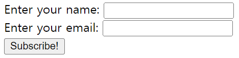
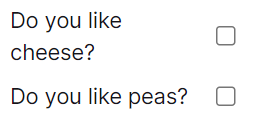
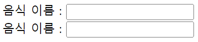
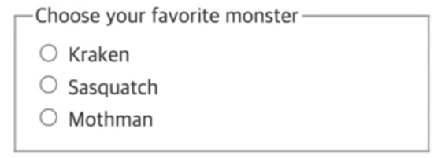

# [HTML] 폼 관련 요소

## form - action, method

💡 **form - action, method**

1. 정보를 제출하기 위한 대화형 컨트롤을 포함하는 문서 구획을 나타낸다.
2. **action** 속성 : 양식 데이터를 처리할 프로그램의 URI. 데이터를 보낼 주소값
3. **method** 속성 : 양식을 제출할 때 사용할 **HTTP** 메서드
    - **post** : **POST** 메서드, 사용자가 입력한 정보가 주소창에 드러나지 않는다.
    - **get**: **GET** 메서드, 사용자가 입력한 정보를 주소창에 드러낸다. → 보안적으로 중요한 정보일 경우에는 사용하면 안됨

```html
<form action="" method="get" class="form-example">
	<div class="form-example">
		<label for="name">Enter your name: </label>
		<input type="text" name="name" id="name" required>
	</div>
	<div class="form-example">
		<label for="email">Enter your email: </label>
		<input type="email" name="email" id="email" required>
	</div>
	<div class="form-example">
		<input type="submit" value="Subscribe!">
	</div>
</form>
```

{: width="300"}

---

## label, input

💡 **label, input**

1. 사용자 인터페이스 항목의 설명을 나타낸다.
2. 설명을 해주는 레이블이 붙어있으면 사용자가 잘못된 정보를 입력할 가능성도 낮아지므로 사용자 입장에서도 중요하고, 웹접근성이나 시멘틱적인 부분에서도 중요하다.
3. input 태그에는 텍스트 뿐만 아니라 다양한 값을 받을 수 있다.
4. name 속성과 id 속성이 같을 필요가 없다. 용도가 다르기 때문. name은 서버에 전송할 때 form 데이터를 구분하기 위해 사용하고, id는 전체 문서 내에서 구분하기 위한 구분자 역할

```html
<div class="preference">
	<label for="cheese">Do you like cheese?</label>
	<input type="checkbox" name="cheese" id="cheese">
</div>

<div class="preference">
	<label for="peas">Do you like peas?</label>
	<input type="checkbox" name="peas" id="peas">
</div>
```

{: width="300"}

<br/>

- 두 코드는 동일한 결과값을 나타낸다.
    - 후자의 경우, for 속성을 사용하지 않아도 된다.
    
    ```html
    <div>
    	<label for="foodname">음식 이름 :</label>
    	<input type="text" name="food" id="food" id="foodnamae">
    </div>
    
    <div>
    	<label>음식 이름 :
    		<input type="text" name="color">
    	</label>
    </div>
    ```

	{: width="300"}

---

## fieldset, legend

💡 **fieldset, legend**

- **fieldset** 요소는 웹 양식의 여러 컨트롤과 레이블( **label** )을 묶을 때 사용한다.
- **fieldset**을 제어함으로서 **fieldset** 내부에 있는 모든 **input** 요소에 영향을 줄 수 있다.
    - ex) **disabled** 속성을 줌으로서 **input** 요소 컨트롤을 비활성화할 수 있다.
- **legend** 요소는 부모 **fieldset** 콘텐츠의 설명을 나타낸다. → 제목
    - **legend**가 **fieldset**의 첫 번째 자식이어야 한다.

```html
<form>
	<fieldset>
		<legend>Choose your favorite monster</legend>

		<input type="radio" id="kraken" name="monster">
		<label for="kraken">Kraken</label><br/>

		<input type="radio" id="sasquatch" name="monster">
		<label for="sasquatch">Sasquatch</label><br/>

		<input type="radio" id="mothman" name="monster">
		<label for="mothman">Mothman</label>
	</fieldset>
</form>
```

{: width="300"}

---

## input

💡 **input**

1. **input** 요소는 웹 기반 양식에서 사용자의 데이터를 받을 수 있는 대화형 컨트롤을 생성한다.
2. **input** 요소에는 굉장히 다양한 속성이 존재하고, 속성을 바꿔줌으로서 전혀 다른 속성처럼 사용할 수 있다.
    - **text**
        1. **text** : **한 줄**만 입력받을 수 있다. enter 키를 누르면 제출된다.
        2. **minlength, maxlength** : 입력받을 수 있는 최소, 최대 글자수를 지정할 수 있다. 지키지 않을 시에 제출 양식을 지키라는 툴팁이 나온다. 사용할 수 있는 속성이 정해져 있다.
        3. **password** : 입력시에 보이지 않는다. **서비스시에는 form 요소의 method를 GET이 아닌 POST로 사용해야 한다!**
        4. **email** : 입력 받을 때 ‘@’ 마크 유무를 판단하고 없다면 안내 메시지를 출력한다.
        5. **tel** : 번호를 입력받는다. 하지만, 숫자가 아니더라도 **email** 속성처럼 안내 메시지를 출력하지는 않는다.
    - **number**
        1. **number** : 숫자 이외의 문자는 입력받지 못한다.
        2. **range** : 바로 숫자를 조절한다.
        3. **date** : 달력을 통해 연도, 월, 일을 입력 받는다.
        4. **month** : 달력을 통해 일을 제외한 연도와 달만 입력 받는다.
        5. **time** : 시계 아이콘을 통해 시간을 입력 받는다.
    - **extra**
        1. **submit** : **button** 요소와 동일한 역할. **default** 값은 제출이고, **value** 속성을 통해 변경할 수 있다. 해당 요소를 클릭하면 값을 제출한다.
        2. **reset** : 클릭하면 form 내부에 있는 모든 값이 기본값으로 돌아간다. **submit**과 마찬가지로 “초기화” 라는 값이 기본적으로 들어있다. **value** 속성을 통해 문구를 바꿔줄 수 있다. 
        3. **button** : **type**에 **button**을 줄 수도 있는데 빈 버튼이 생성된다. **value** 속성을 통해 값을 변경할 수는 있지만, **submit** 속성과 달리 눌러도 값을 제출하지 않는다.
        4. **checkbox** : 체크 박스가 생성된다. **name** 속성을 통해 구분한다. **checked** 속성을 주면 **defalut** 값이 체크한 것으로 주어진다.
        5. **radio** : 중복 선택이 안되는 체크 박스를 생성한다. **name** 속성을 동일하게 주면 그룹화 된다. 제출하면 선택한 **value** 값이 제출된다.
        6. **datalist** : 다른 컨트롤에서 고를 수 있는 가능한, 혹은 추천하는 선택지를 나타내는 **option** 요소를 담는다.
            
            **id** 속성을 주고, **input** 태그에 **list** 속성으로 id값을 넣어주면 된다.
            
            **select** 요소와는 다르게 텍스트 요소 값을 수정할 수 있다.
            
    - **All**
        1. **name** : 전체 form 데이터에서 해당 필드가 어떤 데이터를 가지고 있는 지를 나타낸다. **구분자 역할**
        2. **placeholder** : **input** 요소에 어떤 값이 들어가야 하는지에 대한 **힌트**
        3. **autocomplete** : 자동완성 기능이 추가된다. “**on**” or “**off**”로 줄 수 있다.
        4. **required** : boolean 속성으로 필수로 입력받도록 한다.
        5. **disabled** : 입력할 수도, 값도 존재하지 않게 **해당 필드를 비활성화시킨다**. 특정 필드를 입력받았을 때, 다른 필드를 비활성화시킬 때 등등 사용한다.
        6. **readonly** : 포커싱은 되지만, 입력할 수 없게 한다. 값을 미리 지정해두고 사용할 때 적용시킨다. **disabled** 속성과 다르게 전송은 된다. **읽기 전용**
        7. **step** : **숫자 조절 간격**을 지정할 수 있다.
        8. **min** : **최소값** 지정
        9. **max** : **최대값** 지정

```html
<form action="" method="GET">
<!-- TEXT 관련 -->
	<!-- text -->
	<div>
    <label>TEXT :
			<input type="text" name="text" minlength="5" maxlength="10">
		</label>
	</div>

	<!-- password -->
	<div>
		<label>PASSWORD :
			<input type="password" name="pwd">
		</label>
	</div>

	<!-- email -->
	<div>
		<label>EMAIL :
			<input type="email" name="email">
		</label>
	</div>

	<!-- tel -->
	<div>
		<label>TEL :
			<input type="tel" name="tel">
		</label>
	</div>

<!-- NUMBER 관련 -->
	<!-- number -->
	<div>
		<label>NUMBER :
			<input type="number" name="number">
		</label>
	</div>

	<!-- range -->
		<div>
			<label>RANGE :
				<input type="range" name="range">
			</label>
		</div>
	
	<!-- date -->
	<div>
		<label>DATE :
			<input type="date" name="date">
		</label>
	</div>

	<!-- month -->
	<div>
		<label>MONTH :
			<input type="month" name="month">
		</label>
	</div>

	<!-- time -->
	<div>
		<label>TIME :
			<input type="time" name="time">
		</label>
	</div>

<!-- EXTRA -->
	<!-- submit -->
	<input type="submit" value="제출하기!">

	<!-- reset -->
	<input type="reset">

	<!-- button -->
	<input type="button" value="제출~">

	<!-- checkbox -->
	<div>
		<label>CHECKBOX : 
			<input type="checkbox" name="check1">
			<input type="checkbox" name="check2" checked>
			<input type="checkbox" name="check3">
		</label>
	</div>

	<!-- radio -->
	<div>
		<label>RADIO : 
			<input type="radio" name="radiobuttons" value="r1">
			<input type="radio" name="radiobuttons" value="r2">
			<input type="radio" name="radiobuttons" value="r3">
		</label>
	</div>

	<!-- datalist -->
	<label for="movie">좋아하는 영화: </label>
	<input type="text" id="movie" name="movie" list="movie-list">

	<datalist id="movie-list">
		<option>주토피아</option>
		<option>인사이드아웃</option>
		<option>토이스토리1</option>
		<option>토이스토리2</option>
		<option>토이스토리3</option>
	</datalist>

	<!-- All -->
	<div>
		<label for="username">이름 :</label>
		<input type="text" name="username" id="username" placeholder="홍길동" autocomplete="on" required>
	</div>
	<div>
		<label for="job">직업 :</label>
		<input type="text" name"job" id="job" placeholder="예) 교사" autocomplete="off">
	</div>
	<div>
		<label for="age">나이 :</label>
		<input type="number" name="age" id="age" placeholder="10" disabled>
	</div>
	<div>
		<label for="age">주소 :</label>
		<input type="text" name="address" id="address" readonly>
	</div>

	<div>
		<label for="score">평점 :</label>
		<input type="number" id="score" min="0" max="10" step="2"/>
	</div>
	<div>
		<label for="scores">평점2 : </label>
		<input type="range" name="scores" id="scores" min="-10" max="10" step="2"/>
	</div>

	<button type="submit">제출</button>
</form>
```

---

## button

💡 **button**

클릭 가능한 버튼을 나타낸다.

**input** 과의 차이

- **input**의 경우, **value** 값을 주지 않아도 기본값으로 텍스트가 들어가지만, **button**의 경우에는 그렇지 않다.
- **input**의 경우 자식 태그를 가질 수 없지만, **button**의 경우 **자식 태그**를 가질 수 있다.
- **value** 속성에는 문자열만 입력이 가능하지만, **자식 요소를 사용하여 태그를 입력하거나 이미지를 넣을 수 있다!** → **스타일링에 용이하다.**

```html
<form action="" method="GET">

	<!-- input과 button에는 차이가 존재한다! -->
	<div>
		<input type="reset" value="RESET"/>
		<input type="submit" value="제출하기"/>
		<input type="button" value="빈 버튼"/>
	</div>
	
	<div>
		<button type="reset">초기화</button>
		<button type="submit">제출</button>
		<button type="button">일반 버튼</button>
	</div>

</form>
```

---

## select

💡  **select**

옵션 메뉴(드롭 다운 메뉴)를 제공하는 컨트롤을 나타낸다.

- **option** 태그 내에 자식 태그로 들어있는 컨텐츠는 유저에게 보여줄 UI적인 요소를 넣고, 서버로 보낼 때는 name과 value를 설정해야 한다. (name=value)
- **required** 속성을 주면 값이 없는 경우에는 제출되지 않는다.
- **selected** 속성을 주면 디폴트 값으로 해당 컨텐츠를 갖는다.
- **select** 태그에 **disabled** 속성을 주면 선택하지 못하게 막는다.
- **optgroup** 속성을 통해 **option** 별로 그룹 지을 수 있다.
    - **label** 속성을 통해 그룹별 이름을 지어줄 수도 있다.
- **datalist**와 달리 텍스트값을 수정할 수 없다.

```html
<form action="" method="GET">
	<label for="movie">좋아하는 영화: </label>
	<select id="movie" name="movie" required>
		<!-- value=""를 주지 않으면 내부 컨텐츠를 value 값으로 갖는다. -->
		<option value="">--Please choose an option--</option>

		<!-- 후보군 -->
		<optgroup label="animation">
			<option value="toystory">토이스토리</option>
			<option value="zootopia" selected>주토피아</option>
			<option value="insideout">인사이드아웃</option>
		</optgroup>
		
		<optgroup label="sf">
			<option value="matrix">매트릭스</option>
		</optgroup>

	</select>
</form>
```

---

## textarea

💡 **textarea**

여러 줄의 멀티라인 일반 텍스트 편집 컨트롤을 나타낸다.

- **input의 text** 요소와 달리 자식 요소를 가질 수 있다.
- 댓글이나 리뷰 목적으로 많이 사용된다.
- **rows** 속성을 통해 보여줄 수 있는 행의 줄 수도 지정할 수 있다.
- **cols** 속성으로 가로 크기 또한 지정할 수 있다.
- but, **rows**, **cols** 속성보다는 **CSS**로 사이즈를 조절하는 것을 권장!
- **disabled**와 **placeholder**, **readonly** 속성들 또한 사용 가능하다.

```html
<form action="" method="GET">
	<label for="comment">댓글 :</label>
	<textarea name="comment" id="comment" rows="5">
		오늘은...
		개행을 해도 그대로 적용된다!
	</textarea>
</form>
```

---

## 관련 링크

- **form** : [https://developer.mozilla.org/ko/docs/Web/HTML/Element/form](https://developer.mozilla.org/ko/docs/Web/HTML/Element/form)
- **label** : [https://developer.mozilla.org/ko/docs/Web/HTML/Element/label](https://developer.mozilla.org/ko/docs/Web/HTML/Element/label)
- **input** : [https://developer.mozilla.org/ko/docs/Web/HTML/Element/Input](https://developer.mozilla.org/ko/docs/Web/HTML/Element/Input)
- **fieldset** : [https://developer.mozilla.org/ko/docs/Web/HTML/Element/fieldset](https://developer.mozilla.org/ko/docs/Web/HTML/Element/fieldset)
- **legend** : [https://developer.mozilla.org/ko/docs/Web/HTML/Element/legend](https://developer.mozilla.org/ko/docs/Web/HTML/Element/legend)