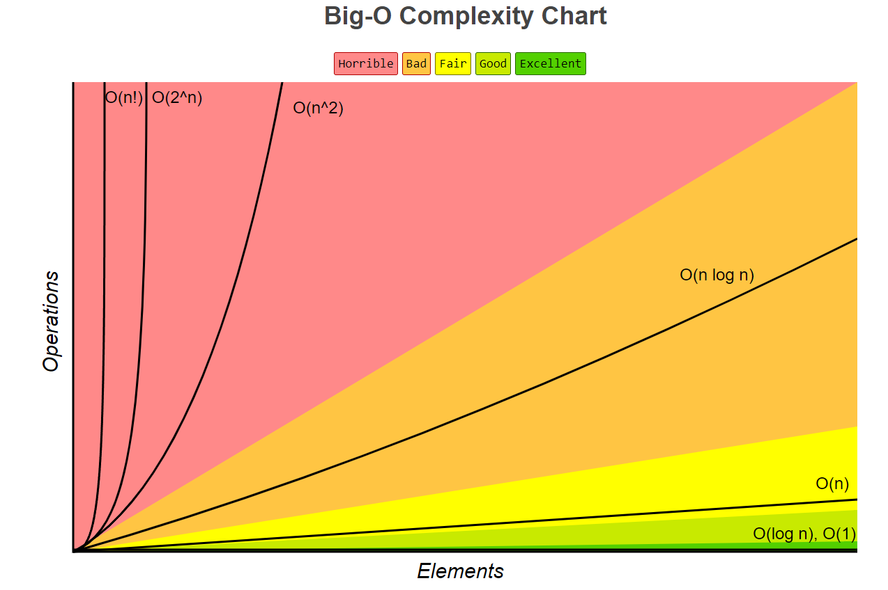
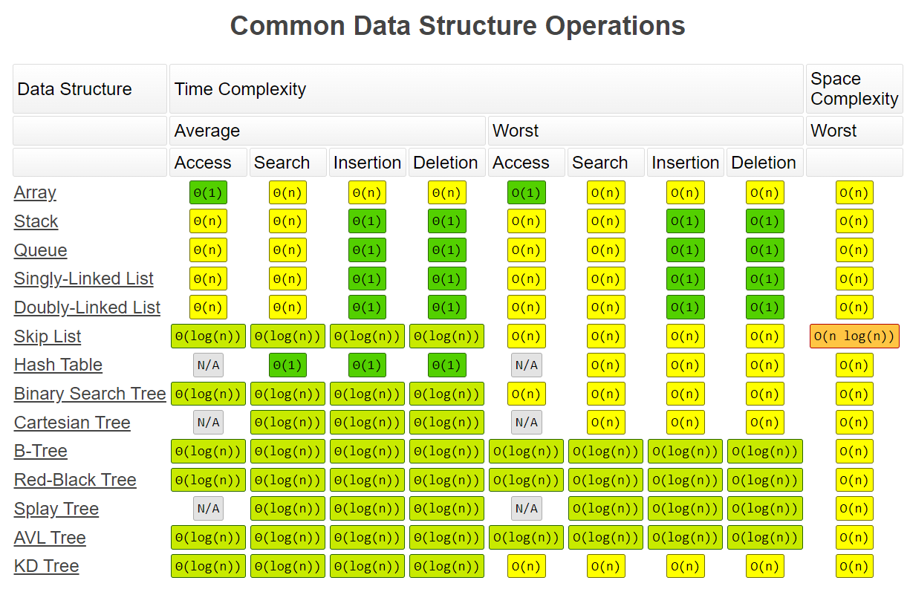
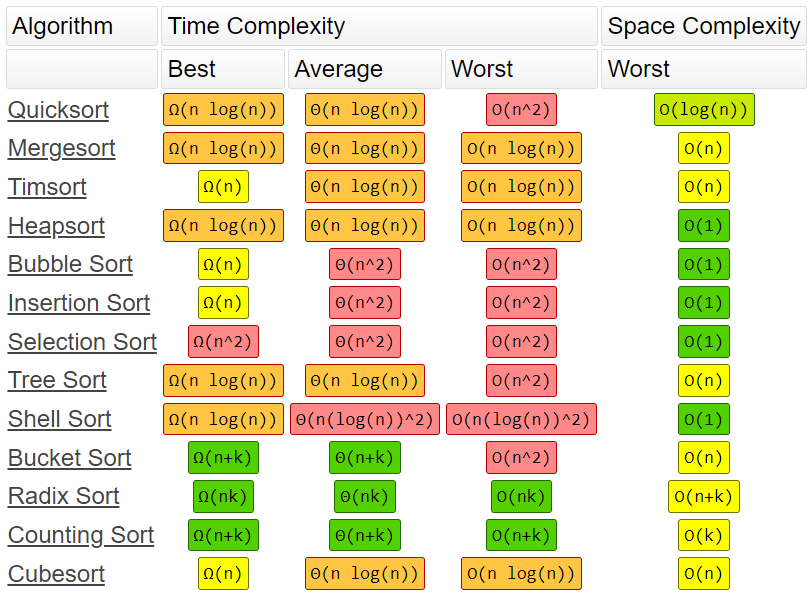
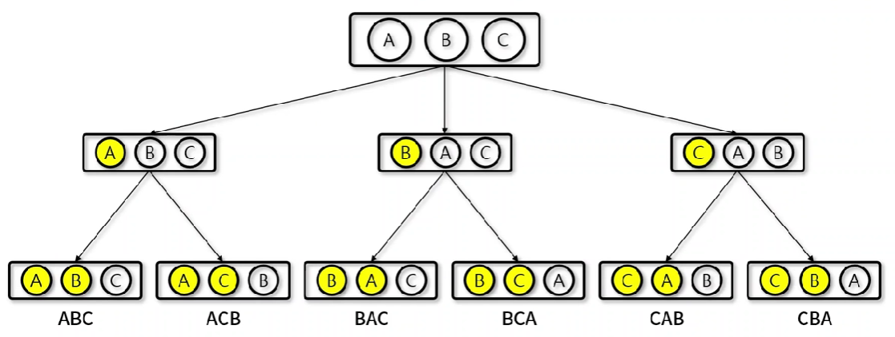
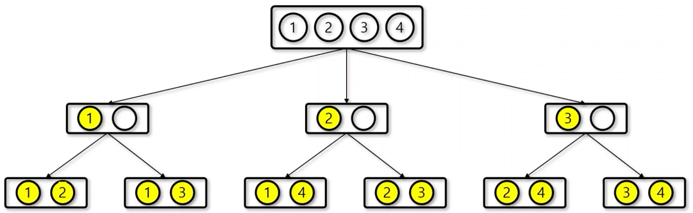
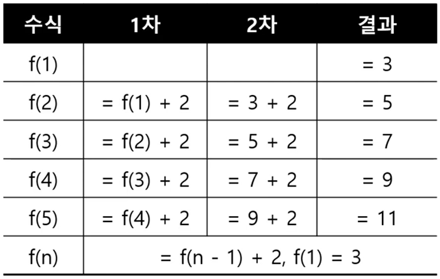
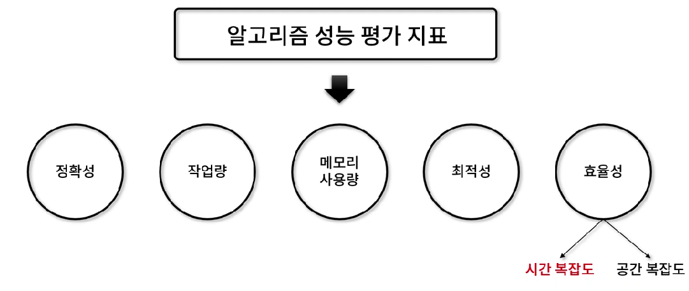

# [알고리즘] 기본 수학 이론

## 알고리즘 복잡도 (시간 복잡도)

- 입력 크기의 값에 대해 단위 연산을 몇 번 수행하는지 계산하여, 알고리즘의 수행시간을 평가하는 방법
- 3가지 점근적 표현법
    - **O**(빅오): **최악의 상황**을 고려하여 성능 측정 결과 표현
    - **Θ**(세타): **평균**적인 경우에서의 성능 측정 결과 표현
    - **Ω**(오메가): **최선의 상황**일 때의 성능 측정 결과 표현


### Big-O Complexity Chart



→ 녹색일수록 빠르고, 붉은색일수록 느리므로 붉은색은 사용을 지양해야 한다.

### 빅오 표기법 예제

```jsx
function big_o(n) {
	let sum = 0; // 1회

	sum = n * 2; // 1회

	return sum;  // 1회
}
```

⇒ 3 → O(1)

for문의 갯수에 따라 N을 늘린다.

```jsx
function big_o(arr, n) {
	let sum = 0;                     // 1회

	for (let i = 0 ; i < n ; i++) {  // n회
		sum += arr[i];
	}

	return sum;                      // 1회
}
```

⇒ n + 2 -> O(n)

2중 for문이라면 N^2

```jsx
function big_o(arr, n) {
	let sum = 0;                       // 1회

	for (let i = 0 ; i < n ; i++) {    // n * n = n^2
		for (let j = 0 ; j < n ; j++) {
			sum += arr[i][j];
		}
	}

	return sum;                         // 1회
}
```

⇒ n^2 + 2 → O(N^2)

나누는 연산이 존재한다면(n/2) logN

```jsx
function big_o(n) {
	let sum = 0;                        // 1회

	for (let i = 0 ; i < n ; i *= 2) {  // n/2회
		sum += 2;
	}

	return sum;                          // 1회
}
```

⇒ n/2 + 2 → O(log N)

**⇒ 가장 높은 차수를 제외하고는 무시한다.**

### Data Structure Operations



⇒ **상황에 적합하게 사용해야 한다. Hash Table을 현업에서 많이 사용한다고 한다.**

### Array Sorting Algorithms



---

## 경우의 수

- 어떤 사건 혹은 일이 일어날 수 있는 경우의 가짓수를 수로 표현
- 일상 생활에서의 **경우의 수**
    1. **주사위**: 던지는 결과, 1 ~ 6 사이의 숫자이므로 경우의 수는 6
    2. **윷**: 던지는 결과, 도, 개, 걸, 윷, 모 이므로 경우의 수는 5
    3. **가위바위보**: 게임 결과, 가위, 바위, 보 중에 하나를 낼 수 있으므로 경우의 수는 3
    4. **동전**: 던지는 결과, 앞면 혹은 뒷면이므로 경우의 수는 2
- **완전탐색**으로 경우의 수를 푸는 알고리즘
    1. **순열**: 서로 다른 n개의 원소 중에서 r를 중복 없이 골라 **순서에 상관 있게** 나열하는 경우의 수 (nPr)
    2. **조합**: 서로 다른 n개의 원소 중에서 r를 중복 없이 골라 **순서에 상관 없이** 나열하는 경우의 수 (nCr)
    3. **중복 순열**: 서로 다른 n개의 원소 중에서 r개를 중복 있게 골라 순서에 상관 없이 나열하는 경우의 수 (nH)

---

### 순열 (Permutation)

- 서로 다른 n개의 원소 중에서 r를 중복 없이 골라 **순서에 상관 있게** 나열하는 경우의 수 (nPr) nPr = n!/(n-r)!
- 3개의 알파벳으로 단어를 만드는 경우의 수를 트리 구조로 표현한다면



**순열 예제 by for문**

```jsx
let input = ["a", "b", "c"];
let count = 0;

function permutation(arr) {
	// for i -> 첫번째 index 위치시킬 요소 a, b, c
	for (let i = 0 ; i < arr.length ; i++) {
		// for j => 두번째 index 위치시킬 요소 [i, j, 0]
		for (let j = 0 ; j < arr.length ; j++) {
			if (i == j) continue;
			// for k => 세번째 index 위치시킬 요소 [i, j, k]
			for(let k = 0 ; k < arr.length ; k++) {
				if (i == k) continue;
				if (j == k) continue;

				console.log(arr[i], arr[j], arr[k]);
				count++;
			}
		}
	}
}

permutation(input);
console.log(count);
```

```jsx
/* output
a b c
a c b
b a c
b c a
c a b
c b a
6
*/
```

for문으로도 구현할 수 있지만, 요소가 많아지면 많아질수록 for문을 써야 하기에 요소의 갯수가 많다면 for문으로 구현하기 힘들어지기에 재귀로 자주 구현하는 편이다.

**순열 예제 by 재귀**

```jsx
let input = ["a", "b", "c"];
let count = 0;

function permutation(arr, s, r) {
	// 1. 재귀함수를 멈춰야할 조건
	if (s == r) {
		count++;
		console.log(arr.join(" "));
		return;
	}

	// 2. 재귀를 돌면서 변경되어야 될 부분/메인로직
	for (let i = s ; i < arr.length ; i++) {
		[arr[s], arr[i]] = [arr[i], arr[s]]; // swap
		permutation(arr, s + 1, r);
		[arr[s], arr[i]] = [arr[i], arr[s]]; // 원상복귀

		/*
		s = 0, r = 2 ["a", ]
		s = 1, r = 2 ["a", "b", ]
		s = 2, r = 2 ["a", "b", "c"]
		...
		s = 1, r = 2, i = 2 ["a", "c", "b"]
		s = 2, r = 2 ["a", "c", "b"]
		...
		s = 0, r = 2, i = 1 ["b", "a", "c"]
		...
		s = 0, r = 2, i = 2 ["a", ]
		*/

	}
}

permutation(input, 0, 2);
console.log(count);
```

```jsx
/* output
a b c
a c b
b a c
b c a
c b a
c a b
6
*/
```

---

### 조합 (Combination)

- 서로 다른 n개의 원소 중에서 r를 중복 없이 골라 **순서에 상관 없이** 나열하는 경우의 수 (nCr)  nCr = n! / (n-r)!r!



**조합 예제 by for문**

```jsx
let input = [1, 2, 3, 4]; // 4C2
let count = 0;

function combination(arr) {
	// for -> 뽑는 개수 ==> r => 2
	for (let i = 0 ; i < arr.length ; i++) {
		for (let j = i + 1 ; j < arr.length ; j++) {
			count++;
			console.log(arr[i], arr[j]);
		}
	}
}

combination(input);
console.log(count);
```

```jsx
/* output
[ 1, 2 ]
[ 1, 3 ]
[ 1, 4 ]
[ 2, 3 ]
[ 2, 4 ]
[ 3, 4 ]
6
*/
```

**조합 예제 by 재귀**

```jsx
let input = [1, 2, 3, 4];
let output = [];
let count = 0;

function combination(arr, data, s, idx, r) {
	if (s == r) {
		count++;
		console.log(data);
		return;
	}

	for (let i = idx ; arr.length - i >= r - s ; i++) {
		data[s] = arr[i];
		combination(arr, data, s + 1, i + 1, r);
	}
}

combination(input, output, 0, 0, 2);
console.log(count);
```

```jsx
/* output
[ 1, 2 ]
[ 1, 3 ]
[ 1, 4 ]
[ 2, 3 ]
[ 2, 4 ]
[ 3, 4 ]
6
*/
```

---

## 점화식

- 점화식(재귀식)이란 수열에서 이웃하는 두개의 항 사이에 성립하는 관계를 나타낸 관계식
- 대표적인 점화식
    - 등차 수열: F(n) = F(n - 1) + a *a: 고정된 상수
    - 등비 수열: F(n) = F(n - 1) * a
    - 팩토리얼: F(n) = F(n - 1) * n
    - 피보나치 수열:  F(n) = F(n - 1) + F(n - 2)



### 등차수열 by for문

```jsx
let result;

function forloop(s, t, number) {
	let acc = 0;

	for (let i = 1 ; i <= number ; i++) {
		if (i == 1)
			acc += s;
		else
			acc += t;

		console.log(i, acc);
	}

	return acc;
}

result = forloop(3, 2, 5);
console.log(result);
```

```jsx
/* output
1 3
2 5
3 7
4 9
5 11
11
*/
```

### **등차수열 by 재귀**

```jsx
let result;

function recursive(s, t, number) {
	// 멈출 조건
	if (number == 1) {
		return s;
	}	

	// 반복할 코드
	return recursive(s, t, number - 1) + t;
}

// number: 5, recursive(s, t, 4) + 2
// number: 4, recursive(s, t, 3) + 2
// number: 3, recursive(s, t, 2) + 2
// number: 2, recursive(s, t, 1) + 2
// number: 1 => 3

result = recursive(3, 2, 5);
console.log(result); // output: 11
```

```jsx
/* output
1 3
2 5
3 7
4 9
5 11
11
*/
```

### **등비수열 by for문**

```jsx
let result;

function forloop(s, t, number) {
	let acc = 1;

	for (let i = 1 ; i <= number ; i++) {
		if (i == 1)
			acc *= s;
		else
			acc *= t;

		console.log(i, acc);
	}

	return acc;
}

result = forloop(3, 2, 5);
console.log(result);
```

```jsx
/* output
1 3
2 6
3 12
4 24
5 48
48
*/
```

### **등비수열 by 재귀**

```jsx
let result;

function recursive(s, t, number) {
	if (number == 1) {
		return s;
	}

	return recursive(s, t, number - 1) * t;
}

result = recursive(3, 2, 5);
console.log(result); // output: 48
```

```jsx
/* output
48
*/
```

### 팩토리얼

```jsx
let result;

function recursive(number) {
	if (number == 1) {
		return number;
	}

	return recursive(number - 1) * number;
}

result = recursive(5);
console.log(result); // output: 120
```

### 피보나치 수열

```jsx
let result;

function recursive(number) {
	if (number == 1 || number == 0) {
		return number;
	}

	// f(n) = f(n - 1) + f(n - 2)
	return recursive(number - 1) + recursive(number - 2);
}

result = recursive(7);
console.log(result); // output: 13
```

---

## 예제

### 등차수열의 항 찾기

💡 **문제 설명**

입력된 값을 통해서 등차 수열의 몇 번째 항인지를 구하는 프로그램을 작성하시오.

입력은 초항 a, 인접한 차이 d, 찾는 항의 수 n이 주어지며, n 값에 해당하는 항 번호를 반환한다.

단, 만약 항 번호가 없을 시에는 -1을 반환한다.

예를 들어 a=1, d=2, n=7이 주어졌을 때

f(1) = 1, f(2) = 3, f(3) = 5, f(4) = 7이 되므로 n=7에 해당하는 항인 4를 반환한다.

💡 **입력 값**

#1. 1 2 7

#2. 2 3 10

#3. 3 5 23

💡 **출력 값**

#1. 1 4

#2. 2 -1

#3. 3 5


**답안 case 1**

```jsx
function answer(a, d, n) {
	let index = -1;

	// 등차수열
	let num;
	for (let i = 1 ; ; i++) {
		num = a + d * (i - 1);

		// 찾지 못함 -1
		if (num > n) break;
		
		// 답 찾음
		if (num == n) {
			index = i;
			break;
		}
	}

	return index;
}

/* main code */
let input = [
	// TC: 1
	[1, 2, 7],
	// TC: 2
	[2, 3, 10],
	// TC: 3
	[3, 5, 23],
];

for (let i = 0 ; i < input.length ; i++) {
	console.log(`#${i + 1} ${answer(input[i][0], input[i][1], input[i][2])}`);
}
```

**답안 case 2**

```jsx
function answer(a, d, n) {
	let index = -1;

	if ((n - a) % d == 0) {
		index = (n - a) / d + 1; // 초항 감안해서 +1
	} else index = -1;

	return index;
}

/* main code */
let input = [
	// TC: 1
	[1, 2, 7],
	// TC: 2
	[2, 3, 10],
	// TC: 3
	[3, 5, 23],
];

for (let i = 0 ; i < input.length ; i++) {
	console.log(`#${i + 1} ${answer(input[i][0], input[i][1], input[i][2])}`);
}
```

⇒ **case 2의 경우가 더 효율적인 코드**

### 잃어버린 카드 찾기

💡 **문제 설명**

등차 수열을 이루는 4개의 숫자 카드를 받았는데, 한 카드를 잃어버렸다. 

잊어버린 카드를 찾아주자.

입력은 자연수로 된 3개의 숫자 카드를 받고, 한 가지의 잃어버린 카드의 수를 반환한다.

단, 잃어버린 카드는 가운데 숫자 카드로 한정한다.

예를 들어 1, 7, 10을 입력 받았을 때 

초항이 1이고, 두 수의 차가 3인, 등차 수열 1, 4, 7, 10을 찾아 4를 반환하도록 한다.

💡 **입력 값**

#1. 1 7 10

#2. 3 8 18

#3. 11 2 5

💡 **출력 값**

#1. 1 4

#2. 2 13

#3. 3 8

```jsx
function answer(a, b, c) {
	let number = 0;

	// sort
	num = [a, b, c];
	num.sort((x, y) => x - y);

	// 1. get d -> 등차값 찾기
	let d = 0;
	for (let i = 1 ; i < num.length ; i++) {
		d += num[i] - num[i - 1];
	}
	d /= num.length;

	// 2. 빈 index 찾기
	let index = num[2] - num[1] - num[0] ? 2 : 1;

	// 3. number += 이전 값 + d
	number = num[0] + d * index;

	return number;
}

/* main code */
let input = [
	// TC: 1
	[1, 7, 10],	

	// TC: 2
	[3, 8, 18],

	// TC: 3
	[2, 5, 11],
];

for (let i = 0 ; i < input.length ; i++) {
	console.log(`#${i + 1} ${answer(input[i][0], input[i][1], input[i][2])}`);
}
```

---

## 알고리즘 평가 지표



→ **코딩 테스트시에는 시간 복잡도를 중점적으로 고려하여 구현하도록 하자!**