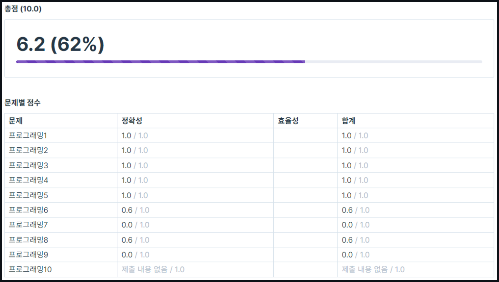

# [코테] 1주차 코딩테스트

**7월 20일**, 부트캠프를 시작하고 대망의 첫 코딩테스트였다.

잘하는 건 아니지만 그래도 나름 교내에서 프로그래밍 대회 우승 경력도 있었기에 어느정도 자신감을 가진 상태로 코딩테스트를 보았다.

---

하지만, 

### **결과는 참패였다…!**

생각 이상으로 문제들이 많이 어려웠고, 아예 손을 대지 못한 문제도 있었다..

나름대로 백준 문제도 꾸준히 풀며 노력해왔다고 생각했는데, 우선 실패한 이유로 크게 2가지의 이유가 있었다고 생각한다.

---

1. **JavaScript에 익숙치 않다.**
2. **자료구조를 비롯한 전공지식이 부족하다.**

---

아직 코딩테스트를 볼 기회가 많이 남았기에 여태까지 이상으로 꾸준히 백준 문제 풀이를 동반한 이론 공부를 해야겠다 생각했다.

현재 내게 부족한 점을 분석할 수 있었던 좋은 기회였다. 자만심을 갖지 않고 겸손한 태도로 임해야겠다.