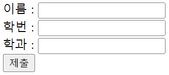

# [HTML] 폼 관련 요소

## form - action, method

💡 **form - action, method**

1. 정보를 제출하기 위한 대화형 컨트롤을 포함하는 문서 구획을 나타낸다.
2. **action** 속성 : 양식 데이터를 처리할 프로그램의 URI. 데이터를 보낼 주소값
3. **method** 속성 : 양식을 제출할 때 사용할 **HTTP** 메서드
    - **post** : **POST** 메서드, 사용자가 입력한 정보가 주소창에 드러나지 않는다.
    - **get**: **GET** 메서드, 사용자가 입력한 정보를 주소창에 드러낸다. → 보안적으로 중요한 정보일 경우에는 사용하면 안됨

```html
<form action="" method="get" class="form-example">
	<div class="form-example">
		<label for="name">Enter your name: </label>
		<input type="text" name="name" id="name" required>
	</div>
	<div class="form-example">
		<label for="email">Enter your email: </label>
		<input type="email" name="email" id="email" required>
	</div>
	<div class="form-example">
		<input type="submit" value="Subscribe!">
	</div>
</form>
```

{: width="300"}

---

## label, input

💡 **label, input**

1. 사용자 인터페이스 항목의 설명을 나타낸다.
2. 설명을 해주는 레이블이 붙어있으면 사용자가 잘못된 정보를 입력할 가능성도 낮아지므로 사용자 입장에서도 중요하고, 웹접근성이나 시멘틱적인 부분에서도 중요하다.
3. input 태그에는 텍스트 뿐만 아니라 다양한 값을 받을 수 있다.
4. name 속성과 id 속성이 같을 필요가 없다. 용도가 다르기 때문. name은 서버에 전송할 때 form 데이터를 구분하기 위해 사용하고, id는 전체 문서 내에서 구분하기 위한 구분자 역할

```html
<div class="preference">
	<label for="cheese">Do you like cheese?</label>
	<input type="checkbox" name="cheese" id="cheese">
</div>

<div class="preference">
	<label for="peas">Do you like peas?</label>
	<input type="checkbox" name="peas" id="peas">
</div>
```

{: width="300"}

<br/>

- 두 코드는 동일한 결과값을 나타낸다.
    - 후자의 경우, for 속성을 사용하지 않아도 된다.
    
    ```html
    <div>
    	<label for="foodname">음식 이름 :</label>
    	<input type="text" name="food" id="food" id="foodnamae">
    </div>
    
    <div>
    	<label>음식 이름 :
    		<input type="text" name="color">
    	</label>
    </div>
    ```

	{: width="300"}

---

## fieldset, legend

💡 **fieldset, legend**

- **fieldset** 요소는 웹 양식의 여러 컨트롤과 레이블( **label** )을 묶을 때 사용한다.
- **fieldset**을 제어함으로서 **fieldset** 내부에 있는 모든 **input** 요소에 영향을 줄 수 있다.
    - ex) **disabled** 속성을 줌으로서 **input** 요소 컨트롤을 비활성화할 수 있다.
- **legend** 요소는 부모 **fieldset** 콘텐츠의 설명을 나타낸다. → 제목
    - **legend**가 **fieldset**의 첫 번째 자식이어야 한다.

```html
<form>
	<fieldset>
		<legend>Choose your favorite monster</legend>

		<input type="radio" id="kraken" name="monster">
		<label for="kraken">Kraken</label><br/>

		<input type="radio" id="sasquatch" name="monster">
		<label for="sasquatch">Sasquatch</label><br/>

		<input type="radio" id="mothman" name="monster">
		<label for="mothman">Mothman</label>
	</fieldset>
</form>
```

{: width="300"}

---

## input

💡 **input**

1. **input** 요소는 웹 기반 양식에서 사용자의 데이터를 받을 수 있는 대화형 컨트롤을 생성한다.
2. 속성을 바꿔줌으로서 전혀 다른 속성처럼 사용할 수 있다.
    - **text** : 한 줄만 입력받을 수 있다. enter 키를 누르면 제출된다.
    - **minlength, maxlength** : 입력받을 수 있는 최소, 최대 글자수를 지정할 수 있다. 지키지 않을 시에 제출 양식을 지키라는 툴팁이 나온다.

```html
<form action="" method="get">
    이름 : <input type="text" name="st_name"><br>
    학번 : <input type="text" name="st_id"><br>
    학과 : <input type="text" name="department"><br>
    <input type="submit">
</form>
```
{: width="200"}

---

## 관련 링크

- **form** : [https://developer.mozilla.org/ko/docs/Web/HTML/Element/form](https://developer.mozilla.org/ko/docs/Web/HTML/Element/form)
- **label** : [https://developer.mozilla.org/ko/docs/Web/HTML/Element/label](https://developer.mozilla.org/ko/docs/Web/HTML/Element/label)
- **input** : [https://developer.mozilla.org/ko/docs/Web/HTML/Element/Input](https://developer.mozilla.org/ko/docs/Web/HTML/Element/Input)
- **fieldset** : [https://developer.mozilla.org/ko/docs/Web/HTML/Element/fieldset](https://developer.mozilla.org/ko/docs/Web/HTML/Element/fieldset)
- **legend** : [https://developer.mozilla.org/ko/docs/Web/HTML/Element/legend](https://developer.mozilla.org/ko/docs/Web/HTML/Element/legend)