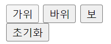
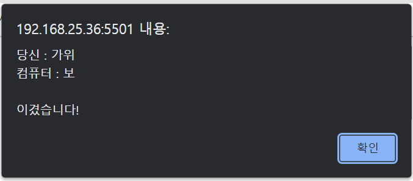
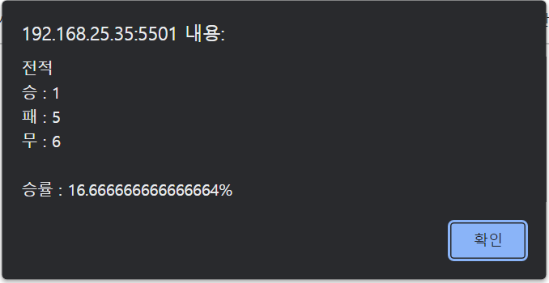
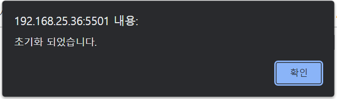

# [스터디] DOM을 활용한 가위바위보 구현

지난 스터디 시간에 **DOM의 개념**에 대해 학습하였다.

이번 시간에는 **DOM을 직접 활용하며 DOM에 익숙해져 보고자 한다**.

본격적으로 학습하기 이전에 우선, 지난주에 학습했던 내용에 대해 간략하게 짚고 넘어가고자 한다.

---

## 문서 객체 모델(DOM)이란?

Document Object Model의 약자로 XML이나 HTML 문서에 접근하기 위한 일종의 인터페이스이다.

## DOM 속성

### 1. 하나의 요소 노드 선택

- **[document.getElementById(id)](https://developer.mozilla.org/ko/docs/Web/API/Document/getElementById)**
- **[document.querySelector(cssSelector)](https://developer.mozilla.org/ko/docs/Web/API/Document/querySelector)**

### 2. 여러 개의 요소 노드 선택

- **[document.getElementsByClassName(class)](https://developer.mozilla.org/ko/docs/Web/API/Document/getElementsByClassName)**
- **[document.getElementsByTagName(tagName)](https://developer.mozilla.org/ko/docs/Web/API/Element/getElementsByTagName)**
- **[document.querySelectorAll(selector)](https://developer.mozilla.org/ko/docs/Web/API/Document/querySelectorAll)**

### 3. 어트리뷰트 노드에의 접근/수정

- **[className](https://developer.mozilla.org/ko/docs/Web/API/Element/className)**
- **[classList](https://developer.mozilla.org/ko/docs/Web/API/Element/classList)**
- **[id](https://developer.mozilla.org/ko/docs/Web/API/Element/id)**
- **[hasAttribute(attribute)](https://developer.mozilla.org/en-US/docs/Web/API/Element/hasAttribute)**
- **[getAttribute(attribute)](https://developer.mozilla.org/ko/docs/Web/API/Element/getAttribute)**
- **[setAttribute(attribute, value)](https://developer.mozilla.org/ko/docs/Web/API/Element/setAttribute)**
- **[removeAttribute(attribute)](https://developer.mozilla.org/ko/docs/Web/API/Element/removeAttribute)**

### 4. HTML 콘텐츠 조작(Manipulation)

- **[textContent](https://developer.mozilla.org/ko/docs/Web/API/Node/textContent)**
- **[innerText](https://developer.mozilla.org/ko/docs/Web/API/Node/innerText)**
- **[innerHTML](https://developer.mozilla.org/ko/docs/Web/API/Element/innerHTML)**

### 더 자세하게 보고 싶다면?
[DOM이란?](https://devyuminkim.github.io/devlog/dev-js-dom.html)

---

**이제 본격적으로 DOM 활용 예제를 작성해 보도록 하겠다.**

**main.html** <br>
```html
<!DOCTYPE html>
<html lang="ko">

<head>
  <meta charset="UTF-8">
  <title>가위바위보</title>
  <link rel="stylesheet" href="style.css">
</head>

<body>
  <div>
    <button type="button" onclick="playts(1)">가위</button>
    <button type="button" onclick="playts(2)">바위</button>
    <button type="button" onclick="playts(3)">보</button>
  </div>
  <div>
    <button type="button" id="reset">초기화</button>
  </div>
</body>
<script src="./use_dom.js"></script>

</html>
```

**style.css** <br>
```css
div { margin-bottom: 10px; }
```

**TypeScript**로 작동 코드를 구현한 후에 **JavaScript** 코드로 변환해보았다.

**use_dom.tsx** <br>
```tsx
let playerStateCharts: string = "";
let playerStatets: number = 0;
let comStateCharts: string = "";
let comStatets: number = 0;

let resultts: number = 0;

let wints: number = 0;
let defeatts: number = 0;
let drawts: number = 0;

function playts(num) {
  if (num == 1) {
    playerStateCharts
   = "가위";
    playerStatets = 1;
  } else if (num == 2) {
    playerStateCharts = "바위";
    playerStatets = 2;
  } else {
    playerStateCharts = "보";
    playerStatets = 3;
  }

  // 컴퓨터의 가위, 바위, 보 설정
  setComStatets();

  // 플레이어의 승패 여부를 판별
  setDistinctts();

  // 결과 출력
  showResultts();
}

// 컴퓨터의 상태 설정 함수
// 1 : 가위 / 2 : 바위 / 3 : 보
function setComStatets() {
  let statets: number = Math.floor(Math.random() * 3) + 1;
  comStatets = statets;

  if (statets == 1) comStateCharts = "가위";
  else if (statets == 2) comStateCharts = "바위";
  else comStateCharts = "보"; 
}

// 결과에 따른 result 값 설정
// 0 : 무승부 / 1 : 승리 / -1 : 패배
function setDistinctts() {
  if (playerStatets == comStatets) {
    resultts = 0;
  } else {
    // 플레이어 : 가위
    if (playerStatets == 1) {
      if (comStatets == 2) resultts = -1;
      else if (comStatets == 3) resultts = 1;
    }
    // 플레이어 : 바위
    else if (playerStatets == 2) {
      if (comStatets == 1) resultts = 1;
      else if (comStatets == 3) resultts = -1;
    }
    // 플레이어 : 보
    else {
      if (comStatets == 1) resultts = -1;
      else if (comStatets == 2) resultts = 1;
    }
  }
}

// 결과 출력 함수
function showResultts() {
  if (resultts == 0) {
    drawts++;
    alert("당신 : " + playerStateCharts + "\n컴퓨터 : " + comStateCharts + "\n\n비겼습니다.");
    alert("현재 전적\n승 : " + wints + "\n패 : " + defeatts + "\n무 : " + drawts + "\n\n승률 : " + getWinRatets() + "%");
  } else if (resultts == 1) {
    wints++;
    alert("당신 : " + playerStateCharts + "\n컴퓨터 : " + comStateCharts + "\n\n이겼습니다!");
    alert("현재 전적\n승 : " + wints + "\n패 : " + defeatts + "\n무 : " + drawts + "\n\n승률 : " + getWinRatets() + "%");
  } else if (resultts == -1) {
    defeatts++;
    alert("당신 : " + playerStateCharts + "\n컴퓨터 : " + comStateCharts + "\n\n졌습니다...");
    alert("현재 전적\n승 : " + wints + "\n패 : " + defeatts + "\n무 : " + drawts + "\n\n승률 : " + getWinRatets() + "%");
  } else {
    alert("초기화 되었습니다.");
    alert("현재 전적\n승 : " + wints + "\n패 : " + defeatts + "\n무 : " + drawts + "\n\n승률 : " + getWinRatets() + "%");
  }
}

// 승률 계산
function getWinRatets() {
  let winRate = 0;

  if (wints != 0) winRate = (wints / (wints + defeatts)) * 100;
  else winRate = 0;

  return winRate;
}

const $resetts: any = document.getElementById('reset');
$resetts.addEventListener('click', () => {
  wints = 0;
  drawts = 0;
  defeatts = 0;
  resultts = -2;
  showResultts();
})

$resetts.addEventListener('click', () => {
  $resetts.innerHTML = 'reset';
})
```

‘**ctrl** + **shift** + **b**’ ****키를 통해 TypeScript 파일을 JavaScript 파일로 변환할 수 있고, 변환한 코드는 다음과 같다.

**use_dom.js** <br>
```jsx
var playerStateCharts = "";
var playerStatets = 0;
var comStateCharts = "";
var comStatets = 0;
var resultts = 0;
var wints = 0;
var defeatts = 0;
var drawts = 0;
function playts(num) {
    if (num == 1) {
        playerStateCharts
            = "가위";
        playerStatets = 1;
    }
    else if (num == 2) {
        playerStateCharts = "바위";
        playerStatets = 2;
    }
    else {
        playerStateCharts = "보";
        playerStatets = 3;
    }
    // 컴퓨터의 가위, 바위, 보 설정
    setComStatets();
    // 플레이어의 승패 여부를 판별
    setDistinctts();
    // 결과 출력
    showResultts();
}
// 컴퓨터의 상태 설정 함수
// 1 : 가위 / 2 : 바위 / 3 : 보
function setComStatets() {
    var statets = Math.floor(Math.random() * 3) + 1;
    comStatets = statets;
    if (statets == 1)
        comStateCharts = "가위";
    else if (statets == 2)
        comStateCharts = "바위";
    else
        comStateCharts = "보";
}
// 결과에 따른 result 값 설정
// 0 : 무승부 / 1 : 승리 / -1 : 패배
function setDistinctts() {
    if (playerStatets == comStatets) {
        resultts = 0;
    }
    else {
        // 플레이어 : 가위
        if (playerStatets == 1) {
            if (comStatets == 2)
                resultts = -1;
            else if (comStatets == 3)
                resultts = 1;
        }
        // 플레이어 : 바위
        else if (playerStatets == 2) {
            if (comStatets == 1)
                resultts = 1;
            else if (comStatets == 3)
                resultts = -1;
        }
        // 플레이어 : 보
        else {
            if (comStatets == 1)
                resultts = -1;
            else if (comStatets == 2)
                resultts = 1;
        }
    }
}
// 결과 출력 함수
function showResultts() {
    if (resultts == 0) {
        drawts++;
        alert("당신 : " + playerStateCharts + "\n컴퓨터 : " + comStateCharts + "\n\n비겼습니다.");
        alert("현재 전적\n승 : " + wints + "\n패 : " + defeatts + "\n무 : " + drawts + "\n\n승률 : " + getWinRatets() + "%");
    }
    else if (resultts == 1) {
        wints++;
        alert("당신 : " + playerStateCharts + "\n컴퓨터 : " + comStateCharts + "\n\n이겼습니다!");
        alert("현재 전적\n승 : " + wints + "\n패 : " + defeatts + "\n무 : " + drawts + "\n\n승률 : " + getWinRatets() + "%");
    }
    else if (resultts == -1) {
        defeatts++;
        alert("당신 : " + playerStateCharts + "\n컴퓨터 : " + comStateCharts + "\n\n졌습니다...");
        alert("현재 전적\n승 : " + wints + "\n패 : " + defeatts + "\n무 : " + drawts + "\n\n승률 : " + getWinRatets() + "%");
    }
    else {
        alert("초기화 되었습니다.");
        alert("현재 전적\n승 : " + wints + "\n패 : " + defeatts + "\n무 : " + drawts + "\n\n승률 : " + getWinRatets() + "%");
    }
}
// 승률 계산
function getWinRatets() {
    var winRate = 0;
    if (wints != 0)
        winRate = (wints / (wints + defeatts)) * 100;
    else
        winRate = 0;
    return winRate;
}
var $resetts = document.getElementById('reset');
$resetts.addEventListener('click', function () {
    wints = 0;
    drawts = 0;
    defeatts = 0;
    resultts = -2;
    showResultts();
});
$resetts.addEventListener('click', function () {
    $resetts.innerHTML = 'reset';
});
//# sourceMappingURL=use_dom.js.map
```

다음과 같이 문제 없이 동작하는 것을 알 수 있다.

**버튼**



**가위바위보 결과**



**가위바위보 승률**



**초기화**

