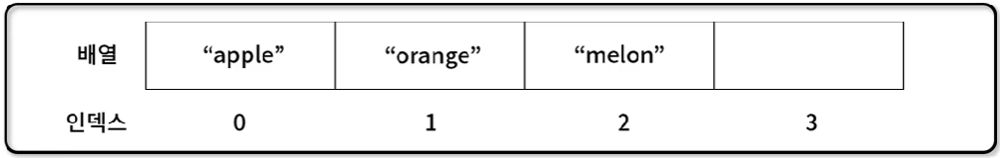
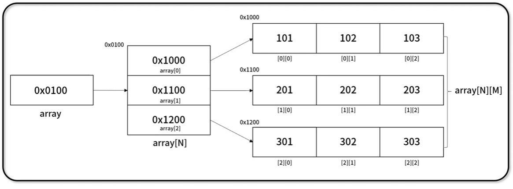

# [알고리즘] 배열

## 배열

- 여러 개체(Entity)값을 **순차적으로** **나열**한 선형 자료 구조
- **대표 속성**(property)과 **메서드**(method)
    - **배열 크기 및 배열 여부 확인**: **Array.length, Array.isArray()**
    - **배열 추가/삭제**: **Array.push(), Array.pop(), Array.shift(), Array.unshift(), Array.splice(), Array.slice() 등**
    - **배열 탐색**: **Array.indexOf(), Array.lastIndexOf(), Array.includes()**
    - **배열 변형**: **Array.sort(), Array.reverse(), Array.join()**
    - **배열 반복**: **Array.sort(), Array.forEach(), Array.map(), Array.find(), Array.filter(), Array.reduce()**
    - **배열 논리연산**: **Array.some(), Array.every()**
    
    
    

---

### 배열 선언/접근/속성

- **선언**: “**new Array()**” 혹은 “**[]**”를 통해 선언하며, 사이즈 혹은 값을 입력하여 초기화도 가능
- **접근 방법**: “**Array[index]**”를 통해 index를 통하여 O(1) 접근
- **배열 속성**: “**Array.length**”를 통해 배열 요소의 개수 확인 가능

```jsx
let arr_1 = new Array(10);
let arr_2 = [];

console.log(arr_1) // output: [ <10 empty items> ]
console.log(arr_2) // output: []

let fruits = ["apple", "orange", "melon"];
console.log(fruits); // output: [ 'apple', 'orange', 'melon' ]
console.log(fruits.length); // output: 3
console.log(fruits[0]); // output: apple
console.log(fruits[1]); // output: orange
console.log(fruits[2]); // output: melon

fruits[1] = "kiwi";
console.log(fruits); // output: [ 'apple', 'kiwi', 'melon' ]
```

---

### 배열의 실체

- **JavaScript**에서 배열은 다른 언어에서 말하는 일반적인 배열이 아닌 **Hash 기반의 객체**
- 메모리가 연속적인 밀집 배열(dense array)가 아닌 비 연속적인 **희소 배열**(sparse array)

```jsx
let nums= [];

nums.push("one");
nums.push("two");
console.log(nums.length); // output: 2
console.log(nums); // output: [ 'one', 'two' ]

nums["once"] = "once";
nums["twice"] = "twice";
console.log(nums.length); // output: 2
console.log(nums); // output: [ 'one', 'two', once: 'once', twice: 'twice' ]

console.log(Object.getOwnPropertyDescriptors(nums));
/* output:
{ '0': { value: 'one', writable: true, enumerable: true, configurable: true },
  '1': { value: 'two', writable: true, enumerable: true, configurable: true },
  length: { value: 2, writable: true, enumerable: false, configurable: false },
  once: { value: 'once', writable: true, enumerable: true, configurable: true },
  twice: { value: 'twice', writable: true, enumerable: true, configurable: true }} */
```

---

### 배열 타입 확인 및 요소 삭제

- 배열 타입 확인
  - 배열 타입 확인 방법: **Array.isArray(value)**

```jsx
let num = 123.456;
let str = "Here I am!";
let fruits = ["apple", "orange", "melon"];

console.log(Array.isArray(num)); // output: false
console.log(Array.isArray(str)); // output: false
console.log(Array.isArray(fruits)); // output: true
```

- 배열 요소 삭제
 - 배열 일부 요소 삭제: **delete array[index]** (삭제해도 배열 사이즈가 그대로인 문제점)

```jsx
let fruits = ["apple", "orange", "melon"];

console.log(fruits); // output: [ 'apple', 'orange', 'melon' ]
console.log(fruits.length); // output: 3

delete fruits[1];
console.log(fruits); // output" [ 'apple', <1 empty item>, 'melon' ]
console.log(fruits.length); // output: 3
```

---

### 배열 조작

- 배열 추가/삭제 (LIFO - Back)
  - 배열 추가: **Array.push(element)**, 배열 삭제: **Array.pop()**

```jsx
let fruits = ["apple", "orange", "melon"];

ret = fruits.push("watermelon");
console.log(fruits); // output: [ 'apple', 'kiwi', 'melon', 'watermelon' ]
console.log(ret); // output: 4
ret = fruits.pop();
console.log(fruits); // output: [ 'apple', 'kiwi', 'melon' ]
console.log(ret); // output: watermelon
```

- 배열 추가/삭제 (LIFO - Front)
  - 배열 추가: **Array.unshift(element)**, 배열 삭제: **Array.shift()**

```jsx
let fruits = ["apple", "orange", "melon"];

ret = fruits.shift();
console.log(fruits); // output: [ 'orange', 'melon' ]
console.log(ret); // output: apple
ret = fruits.unshift("watermelon");
console.log(fruits); // output: [ 'watermelon', 'orange', 'melon' ]
console.log(ret); // output: 3
```

- 배열 삭제/변경 (index)
  - 배열 요소 삭제/변경: **Array.splice(index[, deleteCount, elem1, …, elemN])**

```jsx
let fruits = ["apple", "orange", "melon"];

console.log(fruits.splice(1)); // output: [ 'orange', 'melon' ]
console.log(fruits); // output: [ 'apple' ]

fruits = ["apple", "orange", "melon", "strawberry"];
console.log(fruits.splice(1, 1)); // output: [ 'orange' ]
console.log(fruits); // output: [ 'apple', 'melon', 'strawberry' ]

console.log(fruits.splice(1, 1, "mango", "kiwi")); // output: [ 'melon' ]
console.log(fruits); // output: [ 'apple', 'mango', 'kiwi', 'strawberry' ]
```

- 배열 삭제 (index)
  - 배열 요소 삭제: **Array.slice([start], [end])** → **원본 배열 보존**

```jsx
let fruits = ["apple", "orange", "melon"];

console.log(fruits.slice(1)); // output: [ 'orange', 'melon' ]
console.log(fruits); // output: [ 'apple', 'orange', 'melon' ]

console.log(fruits.slice(1, 2)); // output: [ 'orange' ]
console.log(fruits.slice(-2)); // output: [ 'orange', 'melon' ]
```

- 배열 병합
  - 다중 배열 병합: **Array.concat(arg1, arg2…)**

```jsx
let fruits = ["apple", "orange", "melon"];

console.log(fruits.concat("strawberry"));
// output: [ 'apple', 'orange', 'melon', 'strawberry' ]
console.log(fruits.concat(["cherry", "banana"]));
// output: [ 'apple', 'orange', 'melon', 'cherry', 'banana' ]
console.log(fruits.concat(["cherry", "banana"], "mango"));
// output: [ 'apple', 'orange', 'melon', 'cherry', 'banana', 'mango' ]
```

---

### 배열 반복문

- 다양한 반복문 문법을 통해 배열 요소에 접근 가능
- 반복문 문법: **for … length (index 접근)**, **for … of (element 접근)**, **for … in (key 접근)**

```jsx
let fruits = ["apple", "orange", "melon"];

// 1. use for (index)
// output: apple, orange, melon
for (let i = 0 ; i < fruits.length ; i++) {
	console.log(fruits[i]);
}

// 2. use for ...(element) of
// output: apple, orange, melon
for (let fruit of fruits) {
	console.log(fruit);
}

// 3. use for ...(key) in
// output: apple, orange, melon
for (let key in fruits) {
	console.log(fruits[key]);
}
```

---

### 배열 탐색

- **index 탐색(앞에서부터)**: **Array.indexOf(item, from)**
- **index 탐색(뒤에서부터)**: **Array.lastIndexOf(item, from)**
- **값 포함 여부 확인**: **Array.includes(item, from)**

```jsx
let fruits = ["apple", "orange", "banana", "orange", "melon"];

console.log(fruits.indexOf("orange")); // output: 1
console.log(fruits.indexOf("Orange")); // output: -1
console.log(fruits.indexOf("orange", 2)); // output: 3

console.log(fruits.lastIndexOf("orange")); // output: 3
console.log(fruits.lastIndexOf("orange", -3); // output: 1
console.log(fruits.lastIndexOf("orange", 0)); // output: -1

console.log(fruits.includes("banana")); // output: true
console.log(fruits.includes("Banana")); // output: false
console.log(fruits.includes(0)); // output: false
```

---

### 배열 변형

- 배열 정렬/반전
  - 배열 정렬: **Array.sort()**, 배열 반전: **Array.reverse()**

```jsx
let nums = [1, -1, 4, 5, 2, 0];
console.log(nums.sort()); // output: [-1, 0, 1, 2, 4, 5]
console.log(nums.reverse()); // output: [5, 4, 2, 1, 0, -1]

let fruits = ["apple", "orange", "banana", "melon"];
console.log(fruits.sort()); // output: [ 'apple', 'banana', 'melon', 'orange' ]
console.log(fruits.reverse()); // output: [ 'orange', 'melon', 'banana', 'apple' ]
```

- 배열 변환
  - 배열 값을 문자열로 변환: **Array.join(separator)**

```jsx
let fruits = ["apple", "orange", "banana", "melon"];
let str = fruits.join();
console.log(str); // output: apple,orange,banana,melon

let str_separator = fruits.join(";");
console.log(str_separator); // output: apple;orange;banana;melon
let result = str_separator.split(";");
console.log(result); // output: [ 'apple', 'orange', 'banana', 'melon' ]
```

---

### sort()

**.sort()** 함수의 매개변수로 함수를 넣어 고차함수를 이용한 정렬 수행 가능

**[before]**

```jsx
let nums = [1, -1, 4, 0, 10, 20, 12];

console.log(nums.sort()); // output: [ -1, 0, 1, 10, 12, 20, 4 ]
console.log(nums.reverse()); // output: [ 4, 20, 12, 10, 1, 0, -1 ]
```

⬇️

**[after]**

```jsx
let ascending_order = function (x, y) { return x - y; };
let descending_order = function (x, y) { return y - x };

let nums = [1, -1, 4, 0, 10, 20, 12];
console.log(nums.sort(ascending_order));
// output: [ -1, 0, 1, 4, 10, 12, 20 ]
console.log(nums.sort(descending_order));
// output: [ 20, 12, 10, 4, 1, 0, -1 ]
```

---

### forEach()

- 배열 요소 별 콜백 함수 각각에 실행: **Array.forEach(function(item, index, array){})**
- **item**: 배열 요소, **index**: 배열 위치, **array**: 배열

```jsx
// use for loop
// output: 1 2 3
let nums = [1, 2, 3];
for (let i = 0 ; i < nums.length ; i++) {
	console.log(nums[i]);
}
```

⬇️

```jsx
// use forEach
// output: 1 2 3
nums.forEach(function (i) {
	console.log(i);
});
```

---

### map()

- 배열 요소 별 함수 호출 및 결과를 배열로 반환: **Array.map(function(item, index, array){})**
- **item**: 배열 요소, **index**: 배열 위치, **array**: 배열

```jsx
// use for loop
let nums = [1, 2, 3, 4, 5];
let use_for_loop = [];
for (let i = 0 ; i < nums.length ; i++) {
	use_for_loop.push(nums[i] * 2);
}
console.log(use_for_loop); // output: [ 2, 4, 6, 8, 10 ]
```

⬇️

```jsx
// use map
let nums = [1, 2, 3, 4, 5];
let use_map = nums.map(function (item) {
	return item * 2;
});
console.log(use_map); // output: [ 2, 4, 6, 8, 10 ]
```

---

### find()

- 콜백 함수의 조건을 만족하는, 단 하나의 값만 반환: **Array.find(function(item, index, array){})**
- **item**: 배열 요소, **index**: 배열 위치, **array**: 배열

```jsx
let users = [
	{ name: "bob", age: 17, job: false },
	{ name: "alice", age: 20, job: false },
	{ name: "john", age: 27, job: true },
];

let find_job = users.find(function (user) {
	return user.job == false;
});
console.log(find_job);
// output: { name: 'bob', age: 17, job: false }

let find_age = users.find(function (user) {
	return user.age > 19;
});
console.log(find_age);
// output: { name: 'alice', age: 20, job: false }
```

---

### reduce()

- 요소 별 함수 수행 누적 결과값 반환: **Array.reduce(function(accumulator, item, index, array){})**
- **accumulator**: 이전 함수 결과(initial로 초기값 설정 가능), **item**: 배열 요소, **index**: 배열 위치, **array**: 배열

```jsx
let nums = [1, 2, 3, 4, 5];
let call_count = 0;

console.log("result\tvalue\tindex");
let sum = nums.reduce(function (accumulator, item, index, array) {
	console.log(accumulator, "\t\t", item, "\t\t", index);
	call_count++;
	return accumulator + item;
}, 0); // initial 없다면 index 1부터 시작
/* output
result value index
0       1     0
1       2     1
3       3     2
6       4     3
10      5     4 */

console.log(call_count); // output: 5
console.log(sum); // output: 15
```

---

### some()

- 배열 내 단 하나라도 콜백 함수의 조건을 만족하는 요소가 있다면 true, 아니면 false 반환 (빈 배열인 경우 false)
- **Array.some(function(item, index, array){})**, **item**: 배열 요소, **index**: 배열 위치, **array**: 배열

```jsx
let users = [
	{ name: "bob", age: 17, job: false },
	{ name: "alice", age: 20, job: false },
	{ name: "john", age: 27, job: true },
];

let some_job = users.some(function (user) {
	return user.job == false;
});
console.log(some_jon); // output: true

let some_age = users.some(function (user) {
	return user.age < 16;
});
console.log(some_age); // output: false

let empty = [].some((item) => item > 16);
console.log(empty); // output: false
```

---

### every()

- 배열 내 모든 요소가 콜백 함수의 조건을 만족한다면 true, 아니면 false 반환 (빈 배열의 경우 true)
- **Array.every(function(item, index, array){})**, **item**: 배열 요소, **index**: 배열 위치, **array**: 배열

```jsx
let users = [
	{ name: "bob", age: 17, job: false },
	{ name: "alice", age: 20, job: false },
	{ name: "john", age: 27, job: true },
];

let every_job = users.every(function (user) {
	return user.job == false;
});
console.log(every_job); // output: false

let every_age = users.every(function (user) {
	return user.age > 16;
});
console.log(every_age); // output: true

let empty = [].every((item) => item > 16);
console.log(empty); // output: true
```

---

### N차원 배열

- 배열(Array) 안에 N개 만큼의 배열이 존재하는 객체
- 2/3차원 지도 정보, RGB를 저장하는 2차원 사진 파일 등을 표현할 때 활용 가능
    
    
    
- 2차원 배열은 **array[N][M]**으로 접근하며, **배열(Array)** 전체를 **push()**, **pop()** 가능

```jsx
let array = [ [101, 102, 103], [201, 202, 203], [301, 302, 303], ];

console.log(array); // output: [ [ 101, 102, 103 ], [ 201, 202, 203 ], [ 301, 302, 303  ] ]
console.log(array[0]); // output: [ 101, 102, 103 ]
console.log(array[1][0]); // output: 201
console.log(array[2][2]); // output: 303

let arr_2 = array.pop();
console.log(array.length); // output: 2
console.log(arr_2); // output: [ 301, 302, 303 ]
console.log(array); // output: [ [ 101, 102, 103 ], [ 201, 202, 203 ] ]

let array_num = array.push([401, 402, 403]);
console.log(array.length); // output: 3
console.log(array_num); // output: 3
console.log(array); // output: [ [ 101, 102, 103 ], [ 201, 202, 203 ], [ 401, 402, 403 ] ]

for (let i = 0 ; i < array.length ; i++) {
	for (let j = 0 ; j < array[i].length ; j++) {
		array[i][j] += 1000;
		console.log(array[i][j]);
	}
}
/* output: 1101 ... 1403 */
```