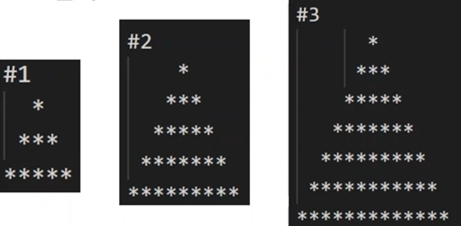
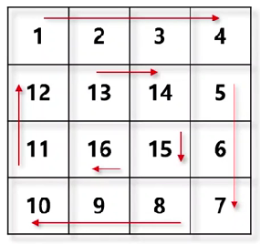

# [알고리즘] 배열에 익숙해지기 with JavaScript

### 1. 수열 최솟값 위치

💡 **문제 설명**

수열이 주어질 때, 이 수열의 있는 수 중 최소값의 위치를 모두 출력하는 프로그램을 작성하시오. 입력은 자연수로 된 배열을 받고, 시작 위치는 0으로 계산하여 최소값의 위치를 배열로 반환한다. 모든 수는 100 이하의 자연수로 입력 받는다.

⌨️ **입력 값**

**#1** [5, 2, 10, 2]

**#2** [4, 5, 7, 4, 8]

**#3** [12, 11, 11, 16, 11, 12]

🖨️ **출력 값**

**#1** [1, 3]

**#2** [0, 3]

**#3** [1, 2, 4]

```jsx
function answer(nums) {
	let result = [];

	// 1. 최소값
	let min = Numner.MAX_SAFE_INTEGER; // 가장 큰 숫자로
	for (let i = 0 ; i < nums.length ; i++) {
		if (min > nums[i]) {
			min = nums[i];
		}
	}

	// 2. 최소값에 해당하는 위치 index
	for (let i = 0 ; i < nums.length ; i++) {
		if (min === nums[i]) {
			result.push(i);
		}
	}

	return result;
}

let input = [
	// TC: 1
	[5, 2, 10, 2],

	// TC: 2
	[4, 5, 7, 4, 8],

	// TC: 3
	[11, 15, 12, 16, 11, 12],
];

for (let i = 0 ; i < input.length ; i++) {
	process.stdout.write(`#${i + 1} `);
	console.log(answer(input[i]));
}
```

---

### 2. 체스 세트

💡 **문제 설명**

오래된 창고에서 체스판과 체스 기물을 발견했다.

불행히도 기물 별 개수가 부족하거나 많아, 완전한 한 세트를 이루고 있지 못하고 있어 보인다.

게임을 하기 위해 부족하거나 많은 기물의 개수를 계산하여 반환하는 프로그램을 제작하시오.

기물의 개수는 배열 형태로 아래와 같이 king부터 pawns 순으로 들어오며 한 게임을 하기 위해 필요한 기물의 개수는 아래와 같다.

* 순서 및 기물 필요 개수: king(1), queen(1), rooks(2), bishops(2), knights(2), pawns(8)

⌨️ **입력 값**

**#1** [0, 1, 2, 2, 2, 7]

**#2** [2, 1, 2, 1, 2, 1]

**#3** [0, 1, 1, 5, 3, 6]

🖨️ **출력 값**

**#1** [1, 0, 0, 0, 0, 1]

**#2** [-1, 0, 0, 1, 0, 7]

**#3** [1, 0, 1, -3, -1, 2]

```jsx
function answer(chess) {
	let result = [];

	// 1. 각 index 별로 정해진 숫자 <--- 체스 게임을 하기 위한 기물의 개수
	let refer = [1, 1, 2, 2, 2, 8];

	// 2. 각 index 별로 정해진 숫자와 비교해서 얼마만큼 부족한지, 혹은 더 많은지 계산하여 result 배열에 업데이트
	let count = 0;
	for (let i = 0 ; i < chess.length ; i++) {
		result[count++] = refer[i] - chess[i];
	}

	return result;
}

let input = [
	// TC: 1
	[0, 1, 2, 2, 2, 7],

	// TC: 2
	[2, 1, 2, 1, 2, 1],

	// TC: 3
	[0, 1, 1, 5, 3, 6],
];

for (let i = 0 ; i < input.length ; i++) {
	process.stdout.write(`#${i + 1} `);
	console.log(answer(input[i]));
}
```

---

### 3. 두 수 최대 합

💡 **문제 설명**

수열이 주어질 때, 이 중 두 개의 수를 선택하여 최대 합이 나올 수 있도록 프로그램을 제작하시오.

입력은 정수로 된 배열을 받고, 최대 합이 나올 수 있는 두 수를 배열 형태로 반환한다.

배열로 입력되는 정수는 10 ~ 20개 사이이며, 정수의 범위는 -20 ~ +20 사이의 값이 입력된다.

⌨️ **입력 값**

**#1** [-11, 5, 18, -2, -3, 6, 4, 17, 10, 9]

**#2** [3, 7, -14, 2, -6, 13, -20, -2, -7, 6, -17, -5, 14, -9, 19]

**#3** [-15, -4, -8, 12, 12, -8, -8, 9, 10, 15, -2, 10, -14, 2, 13, 19, -9, 3, -18, 14]

🖨️ **출력 값**

**#1** [18, 17]

**#2** [19, 14]

**#3** [19, 15]

```jsx
function answer(nums) {
	let result = [];

	// 1. 1번째 최대값, 2번째 최대값
	// result[0] <-- 1번째 최대값, result[1] <-- 2번째 최대값
	result = nums[0] > nums[1] ? nums[0], nums[1] : nums[1], nums[0];

	for (let i = 2 ; i < nums.length ; i++) {
		if (nums[i] > result[0]) {
			result[1] = result[0];
			result[0] = nums[i];
		} else if(nums[i] > result[1]) {
			result[1] = nums[i];
		}
	}

	return result;
}

let input = [
	// TC: 1
	[-11, 5, 18, -2, -3, 6, 4, 17, 10, 9],

	// TC: 2
	[3, 7, -14, 2, -6, 13, -20, -2, -7, 6, -17, -5, 14, -9, 19],

	// TC: 3
	[
		-15, -4, -8, 12, 12, -8, -8, 9, 10, 15,
		-2, 10, -14, 2, 13, 19, -9, 3, -18, 14,
	],
];

for (let i = 0 ; i < input.length ; i++) {
	process.stdout.write(`#${i + 1} `);
	console.log(answer(input[i]));
}
```

---

### 4. 일곱 난장이

💡 **문제 설명**

일터에 나갔던 난장이 9명이 와서는 모두 자기가 일곱 난장이 중 하나라고 우기고 있다.

모든 난장이의 가슴에는 숫자가 표시된 배지가 있는데, 다행히도 일곱 난장이의 배지에 표시된 숫자의 합이 100이라는 단서로 일곱 난장이를 분별할 수 있다. 일곱 난장이를 분별하는 프로그램을 작성하시오.

배지 값은 100이하 자연수로 들어오며, 일곱 난장이의 배지 값을 기존 순서대로 배열에 넣어 반환한다.

⌨️ **입력 값**

**#1** [1, 5, 6, 7, 10, 12, 19, 29, 33]

**#2** [25, 23, 11, 2, 18, 3, 28, 6, 37]

**#3** [3, 37, 5, 36, 6, 22, 19, 2, 28]

🖨️ **출력 값**

**#1** [1, 5, 6, 7, 19, 29, 33]

**#2** [23, 11, 2, 18, 3, 6, 37]

**#3** [3, 37, 5, 6, 19, 2, 28]

```jsx

function answer(dwarf) {
	let result = [];

	// 1. 9명(배열 총 합) - 7명(100) + 2명(faker)
	// 9명 - 7명 = 2명에 대한 합 숫자
	let sum = 0;
	for (let i = 0 ; i < dwarf.length ; i++) {
		sum += dwarf[i];
	}
	sum -= 100; // -> faker 2명에 대한 배지값

	// 2. for 두 요소의 합이 faker 2명에 대한 합 숫자와 같은지 비교 -> i, j
	let faker = [];
	for (let i = 0 ; i < dwarf.length ; i++) {
		for (let j = i + 1 ; j < dwarf.length ; j++) {
			if (sum == dwarf[i] + dwarf[j]) {
				faker[0] = i;
				faker[1] = j;
				break;
			}
		}

		if (faker.length != 0) break;
	}

	// 3. faker 두명을 제외하고 나머지 배지값을 result에 넣어준다
	for (let i = 0 ; i < dwarf.length ; i++) {
		if (faker[0] != i && faker[1] != i) {
			result.push(dwarf[i]);
		}
	}

	return result;
}

let input = [
	// TC: 1
	[1, 5, 6, 7, 10, 12, 19, 29, 33],
	
	// TC: 2
	[25, 23, 11, 2, 18, 3, 28, 6, 37],

	// TC: 3
	[3, 37, 5, 36, 6, 22, 19, 2, 28],
];

for (let i = 0 ; i < input.length ; i++) {
	process.stdout.write(`#${i + 1} `);
	console.log(answer(input[i]));
}
```

---

### 5. 나무 그리기

💡 **문제 설명**

조카가 나무 그리기를 어려워 하고 있다. 어린 조카를 위해 나무를 그려주는 프로그램을 만들어주자.

자연수를 높이로 입력 받고 대칭형 형태로 나무 문자열을 만들어 반환한다.

각 행 별로 개행 문자(\n)를 넣어주면서 *을 찍으며 출력 값 형태로 나무를 그려준다.

⌨️ **입력 값**

**#1** 3

**#2** 5

**#3** 7

🖨️ **출력 값**

{: width="400"}

```jsx
function answer(height) {
	let str = "";
	
	for (let i = 0 ; i < height ; i++) {
		// 1. 공백 처리 " "
		for (let j = 0 ; j < height - i - 1 ; j++) {
			str += " ";
		}

		// 2. * 처리 "*" 2n + 1
		for (let j = 0 ; j < i * 2 + 1 ; j++) {
			str += "*";
		}

		// 3. 개행문자 추가
		str += "\n";
	}

	return str;
}

let input = [
	// TC: 1
	3,
	// TC: 2
	5,
	// TC: 3
	7,
];

for (let i = 0 ; i < input.length ; i++) {
	console.log(`#${i + 1} ${answer(input[i])}`);
}
```

---

### 6. Two Sum

💡 **문제 설명**

배열과 정수 값이 주어질 때, 배열 내 두 값을 합하여 정수 값을 만들 수 있도록 두개의 index를 반환하는 함수를 작성하시오. 각 입력에 정확히 하나의 솔루션이 있다고 가정하고, 동일한 요소를 두 번 사용하지 않는다. 배열의 index는 오름차순으로 정렬하여 반환한다.

⌨️ **입력 값**

**#1** [2, 7, 11, 15], 9

**#2** [3, 2, 4], 6

**#3** [3, 3], 6

🖨️ **출력 값**

**#1** [0, 1]

**#2** [1, 2]

**#3** [0, 1]

```jsx
// 2중 for문을 사용한 case 1(O(n^2))
function answer(nums, target) {
	// target == nums[i] + nums[j]
	for (let i = 0 ; i < nums.length ; i++) {
		for (let j = i + 1 ; j < nums.length ; j++) {
			if (nums[i] + nums[j] == target) {
				return [i, j];
			}
		}
	}

	return [];
}

// 1중 for문을 사용한 case 2(O(n))
function answer(nums, target) {
	let map = {}; // key, value

	// target - nums[i] = nums[j]
	for (let i = 0 ; i < nums.length ; i++) {
		if (map[target - nums[i]] != undefined) {
			return [map[target - nums[i]], i];
		}

		map[nums[i]] = i;
	}

	return [];
}

let input = [
	// TC: 1
	[[2, 7, 11, 15], 9],
	// TC: 2
	[[3, 2, 4], 6],
	// TC: 3
	[[3, 3], 6],
];

for (let i = 0 ; i < input.length ; i++) {
	process.stdout.write(`#${i + 1} `);
	console.log(answer(input[i][0], input[i][1]));
}
```

---

### 7. OX 퀴즈

💡 **문제 설명**

네카라쿠배 대학교에서 OX 퀴즈 쇼를 진행한다. 정답을 맞췄을 경우 문제당 1점을 부여하며, 연속적으로 맞출 경우 연속한 정답 개수 만큼의 가산점을 부여해준다. (상세 산출 방식은 위 표 참고)

진행자를 위해 채점표를 보고 점수를 산출해주는 프로그램을 제작해주자.

배열 형태의 채점 값이 1(정답), 0(오답)으로 입력되며, 점수의 합계를 반환한다.

⌨️ **입력 값**

**#1** [1, 0, 1, 1, 1, 0, 1, 1, 0, 0]

**#2** [1, 1, 0, 1, 1, 0, 1, 1, 1, 1]

**#3** [1, 1, 1, 1, 1, 0, 0, 1, 1, 0]

🖨️ **출력 값**

**#1** 10

**#2** 16

**#3** 18

```jsx
function answer(mark) {
	let result = 0;

	// 1 -> 1점, 연속한 1인 경우 연속한 count 만큼 점수 추가
	let score = 0;
	for (let i = 0 ; i < mark.length ; i++) {
		if (mark[i] == 1) {
			result += ++score;
		} else {
			score = 0;
		}
	}
	return result;
}

let input = [
	// TC: 1
	[1, 0, 1, 1, 1, 0, 1, 1, 0, 0],

	// TC: 2
	[1, 1, 0, 1, 1, 0, 1, 1, 1, 1],

	// TC: 3
	[1, 1, 1, 1, 1, 0, 0, 1, 1, 0],
];

for (let i = 0 ; i < input.length ; i++) {
	console.log(`#${i + 1} ${answer(input[i])}`);
}
```

---

### 8. 벽돌 옮기기

💡 **문제 설명**

새로 온 알바생이 벽돌의 높이를 맞추지 않고 벽을 쌓아 놓았다.

관리자를 위해 몇 개의 벽돌을 옮겨야 벽돌의 높이가 같아질 수 있을지 구해주는 프로그램을 제작하시오.

입력은 배열 형태의 정수이며, 같은 높이를 맞추기 위해 옮겨야 하는 벽돌의 개수를 반환한다.

단, 입력으로 들어오는 배열은 남는 벽돌 없이 높이가 딱 나눠 떨어지도록 들어온다.

⌨️ **입력 값**

**#1** [5, 2, 4, 1, 7, 5]

**#2** [12, 8, 10, 11, 9, 5, 8]

**#3** [27, 14, 19, 11, 26, 25, 23, 15]

🖨️ **출력 값**

**#1** 5

**#2** 6

**#3** 21

```jsx
function answer(blocks) {
	let result = 0;

	// 1. 벽돌 높이 평균
	let avg = 0;
	for (let i = 0 ; i < blocks.length ; i++) {
		avg += blocks[i];
	}
	avg /= blocks.length;

	// 2. 현재 벽돌 높이 - 벽돌 높이 평균 => 옮겨야 할 벽돌 개수
	for (let i = 0 ; i < blocks.length ; i++) {
		if (blocks[i] > avg) {
			result += blocks[i] - avg;
		}
	}

	return result;
}

let input = [
	// TC: 1
	[5, 2, 4, 1, 7, 5],

	// TC: 2
	[12, 8, 10, 11, 9, 5, 8],

	// TC: 3
	[27, 14, 19, 11, 26, 25, 23, 15],
];

for (let i = 0 ; i < input.length ; i++) {
	console.log(`#${i + 1} ${answer(input[i])}`);
}
```

---

### 9. 숫자 빈도수 구하기

💡 **문제 설명**

두 자연수 M, N을 입력 받아, M부터 N까지 각 자리수의 빈도수를 합하는 프로그램을 제작하시오.

예를 들어 129와 137이 주어졌을 때, 129, 130, 131, 132, 133, 134, 135, 136, 137 숫자가 나오고 이 숫자들의 자릿수 별 숫자 빈도수를 계산하여, 0부터 9까지의 빈도수 값을 반환한다.

입력 값 M, N은 10,000 이하의 자연수이며, 0부터 9까지의 자릿수 별 빈도수를 배열 형태로 반환한다.

⌨️ **입력 값**

**#1** 129 137

**#2** 1412 1918

**#3** 4159 9182

🖨️ **출력 값**

**#1** [ 1, 10, 2, 9, 1, 1, 1, 1, 0, 1 ]

**#2** [ 100, 614, 101, 101, 189, 201, 201, 201, 201, 119 ]

**#3** [ 1503, 1527, 1503, 1502, 2343, 2503, 2512, 2512, 2505, 1686 ]

```jsx
function answer(s, e) {
	let result = [];

	// 0. 각 자릿수 별 index => 0
	for (let i = 0 ; i < 10 ; i++) {
		result[i] = 0;
	}

	// 1. s <= n <= e
	let num;
	for (let i = s ; i <= e ; i++) {
		num = i;
		// 2. n => % /
		while(num != 0) {
			result[num % 10]++;
			num /= 10;
			num = parseInt(num);
		}
	}
	
	return result;
}

let input = [
	// TC: 1
	[129, 137],

	// TC: 2
	[1412, 1918],

	// TC: 3
	[4159, 9182],
];

for (let i = 0 ; i < input.length ; i++) {
	process.stdout.write(`#${i + 1} `);
	console.log(answer(input[i][0], input[i][1]));
}
```

---

### 10. 달팽이 만들기

💡 **문제 설명**

조카를 잠재우기 위해 달팽이 모양으로 숫자를 하나씩 적어주는 프로그램이 필요하게 되었다.

이를 위해 정사각형 모양의 달팽이 2차원 배열을 그려주는 함수를 작성하시오.

입력한 크기의 정사각형으로, 아래 그림처럼 시계방향으로 돌면서 숫자를 채워 2차원 배열을 반환한다.

{: width="200"}

⌨️ **입력 값**

**#1** 3

**#2** 5

**#3** 6

🖨️ **출력 값**

**#1** [ [ 1, 2, 3 ], [ 8, 9, 4 ], [ 7, 6, 5 ] ]

**#2** [ 

 [ 1, 2, 3, 4, 5 ],

 [ 16, 17, 18, 19, 6 ],

 [ 15, 24, 25, 20, 7 ],

 [ 14, 23, 22, 21, 8 ],

 [ 13, 12, 11, 10, 9 ]

]

**#3** [

 [ 1, 2, 3, 4, 5, 6 ],

 [ 20, 21, 22, 23, 24, 7 ],

 [ 19, 32, 33, 34, 25, 8 ],

 [ 18, 31, 36, 35, 26, 9 ],

 [ 17, 30, 29, 28, 27, 10 ],

 [ 16, 15, 14, 13, 12, 11 ]

]

```jsx
function answer(length) {
	let result = [];

	// 1. result(1차원 배열) => 2차원 배열
	for (let i = 0 ; i < length ; i++) {
		result[i] = [];
	}

	// 2. 패턴 기반으로 반복문 구현
	/**
	 *		1) length 길이만큼 시작해서 숫자를 채워준다.
	 *		2) length - i, 방향, 2회
	 *		3) length == 0, 프로그램이 멈춘다.
	 */
	let direction = 1;
	let x, y, num;
	x = y = num = 0;
	x--;
	while(1) {
		for (let i = 0 ; i < length ; i++) {
			x += direction;
			result[y][x] = ++num;
		}

		length--;

		if (length == 0) break;

		for (let j = 0 ; j < length ; j++) {
			y += direction;
			result[y][x] = ++num;
		}

		direction *= -1;
	}

	return result;
}

let input = [
	// TC: 1
	3,
	// TC: 2
	5,
	// TC: 3
	6,
];

for (let i = 0 ; i < input.length ; i++) {
	process.stdout.write(`#${i + 1} `);
	console.log(answer(input[i]));
}
```