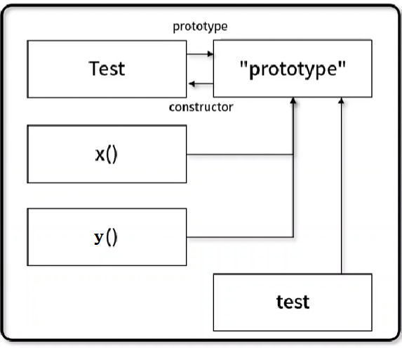

# [알고리즘] 프로토타입 (prototype)

## 프로토타입 (prototype) 이란?

- 어떠한 객체가 만들어지기 위해 객체의 모태가 되는 원형, **접근 터널**
- **JavaScript**는 일반적인 객체지향 언어와는 다르게, 프로토타입을 이용한 복사(Cloning)을 통해 새로운 객체 생성
- 일반적인 객체 생성 방식: 속성은 생성자, 메서드는 프로토타입에서 정의

{:width="300"}

```jsx
// 생성자에서 속성 정의
function Test(a, b) {
	// 속성 정의
}

// 첫 메소드 정의
Test.prototype.x = function() { ... };

// 두번째 메소드 정의
Test.prototype.y = function() { ... };

// 객체 생성
let test = new Test(1, 2);

// ...
```


---

### 프로토타입 예제

- **.prototype**을 이용하여 **Person** 객체에 메서드 추가

```jsx
// 생성자 속성 정의
function Person(name, age) {
	this.name = name;
	this.age = age
}

// prototype을 이용한 Person 메서드 정의
Person.prototype.isAudlt = function () {
	return this.age > 18;
};

// 객체 생성
const p1 = new Person("bob", 26);
const p2 = new Person("alice", 16);

// 객체 출력
console.log(p1); // output: Person { name: 'bob', age: 26 }
console.log(p2); // output: Person { name: 'alice', age: 16 }
console.log(Object.getOwnPropertyDescriptors(p1));
/* output:
 *	{
 *		name: {
 *			value: 'bob',
 *			writable: true,
 *			enumerable: true,
 *			configurable: true
 *		},
 *		age: { value: 26, writable: true, enumerable: true, configurable: true }
 *	}
 */

// 객체 메서드 호출
console.log(p1.isAudlt()); // output: true
console.log(p2.isAudlt()); // output: false
```

---

### **자료구조를 학습하면서 prototype을 응용할 일이 많으니 익숙해지도록 하자!**