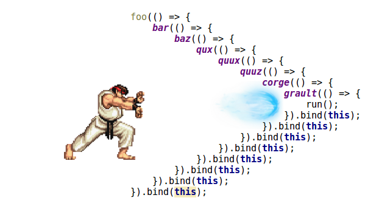
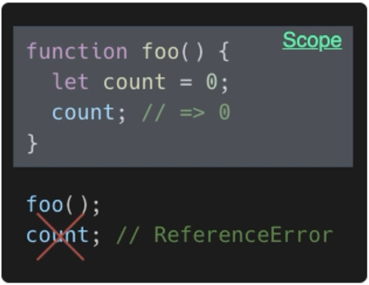
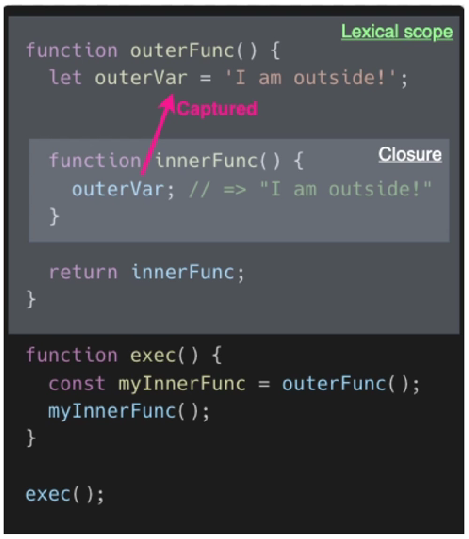
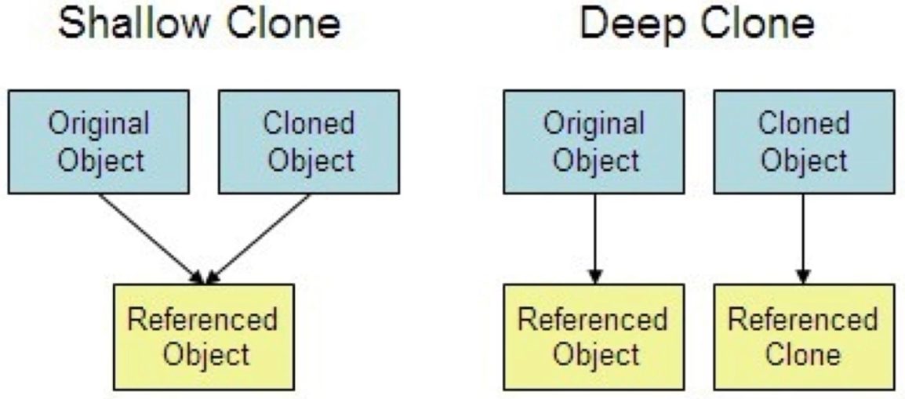
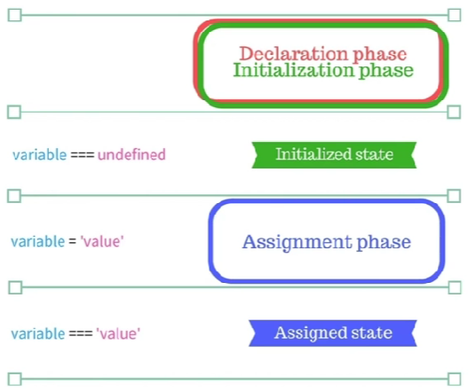
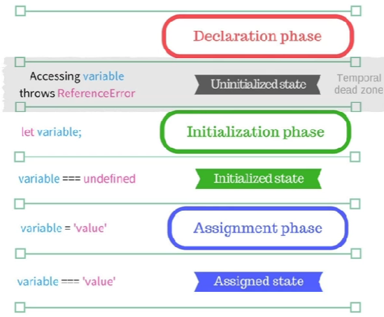

# [CS] JavaScript

## 1. 콜백 지옥 경험은? 해결 방법은?

### 콜백 지옥(Callback hell)이란

- 비동기 로직 처리 중 콜백 함수를 연속해서 사용할 때 발생한다.
- 콜백 함수 안에 또 다시 함수 호출이 반복되면서 코드의 들여쓰기가 보기 힘든 수준까지 간 상황

⇒ 비동기 함수의 결과는 예상할 수 없기 때문에 콜백을 사용한다.



### 콜백 지옥이 뭐가 문제인가?

- 코드 가독성
- 예외 처리 복잡도 증가

### 해결방법

- ES6 문법 중 하나인 **Promise**를 사용한다.
- **async/await** 문법 사용 (보통 이 방법을 많이 사용한다. → **Promise** 문법의 경우 then 안에 Promise 호출 시 then 안에 Promise… 가 반복될 수 있다. ⇒ 콜백 지옥)

### Promise와 async-await의 차이

1. 공통적으로 **JavaScript**에서 비동기 처리를 다루는 방법들
2. **Promise**는 ES6에서 추가, **async-await**는 ES8에서 추가됨.
3. **Promise**를 사용한 비동기 처리를 좀 더 쉽게 처리해주기 위해 **async-await**가 나왔다.
4. **Promise**는 3가지 상태를 가지는데
    1) **Pending**: 비동기 처리 완료 전
    2) **Fulfilled**: 비동기 처리 완료
    3) **Rejected**: 비동기 처리 실패
5. **resolve**와 **reject**로 결과값을 반환 받는다.
6. **async-await**는 **Promise**의 단점을 해결하기 위해 나왔다고 볼 수 있다.
    
**await를 통해 반환값을 받지만, 단점으로 에러를 핸들링할 수 있는 기능이 없기 때문에 try-catch를 사용해서 에러 처리를 해줘야 한다.**
    

---

## 2. 클로저란?

클로저에 대해 학습하기 이전에 **스코프**의 개념에 대해 알고 있어야 한다.

### 스코프(Scope)

1. **전역 스코프**(Global Scope)
    
    어느 곳에서든 해당 변수로 접근이 가능하다.
    
2. **지역 스코프**(Local Scope)
    
    해당 지역(함수) 내에서만 접근이 가능하다.
    



→ count는 Local Scope를 갖기 때문에 에러가 발생한다.

### 클로저(Closure)

- 내부함수가 외부함수의 맥락(context)에 접근할 수 있는 것을 의미한다.
- 불필요한 전역변수를 줄여서 실수를 방지하고, 코드의 재사용성을 높이기 위함이다.



---

## 4. var, let, const의 차이점은?

**var**, **let**, **const** 모두 변수를 선언하는 방식이다.

### 1. var

```jsx
var name = "tech"
console.log(name) // tech
var name = "art"
console.log(name) // art
```

- 변수의 중복 선언이 가능하여 변수에 할당된 값이 변할 수 있다.
    
    → 오류를 추적하기 어렵다.
    
- 함수 외부에서 선언한 변수는 모두 전역 변수로 취급한다.

이와 같은 **var**의 문제점을 해결한 것이 **let**과 **const**이다.

### 2. let

```jsx
let name = "tech"
console.log(name) // tech
let name = "art"
console.log(name) // Uncaught Syntax Error: Identifier 'name' has already been declared.
name = 'programming'
console.log(name) // programming
```

- 변수의 중복 선언은 불가하지만, 재할당은 가능하다.

### 3. const

```jsx
const class; // Uncaught SyntaxError: Missing initializer in const declaration
const class = "tech"
console.log(class)
const class = "art"
console.log(class) // Uncaught Syntax Error: Identifier 'class' has already been declared.
class = 'programming'
```

- 선언과 초기화를 동시에 해야 한다.
- 재선언과 재할당이 불가하다.
- **원시값의 재할당은 불가능하지만, 객체는 가능하다.**

***변수의 스코프는 최대한 좁게 선언되도록 하는 것이 좋다!**

---

## 5. 깊은 복사와 얕은 복사

### 얕은 복사(shallow copy)

```jsx
const info = { name: 'yum', age: 23, job: 'sw engineer' };
const info2 = info1;

console.log(info === info2) // true
```

- 참조에 의한 할당. 해당 데이터의 **참조 값(메모리 주소)**를 전달하는 방식으로 하나의 데이터를 공유하는 것

### 깊은 복사(deep copy)

```jsx
const info = { name: 'yum', age: 23, job: 'sw engineer', address: { city: 'seoul', post: 123} };
const info2 = {...info}
info2.address.city = 'busan'

console.log(info2)
```

- 기존 객체를 그대로 복사하여 사용하는 경우에는 원본 데이터가 변형될 수 있는 위험을 내포하고 있다.
- 단, 깊은 복사에서 주의해야 할 점은 1depth까지만 허용한다는 것이다. 즉, **객체 내부의 객체는 얕은 복사가 이루어진다**는 것이다.



---

## 6. 프로토타입이란?

**JavaScript**는? **객체지향언어**이다.

**객체지향언어**에서 빠질 수 없는 개념은? **클래스(Class) ⇒ 상속을 받기 위해**

하지만 **JavaScript**는 클래스라는 개념을 갖고 있지 않다. 그래서 **프로토타입(Prototype)**이 필요한 것.

프로토타입을 사용하는 이유는 **상속 개념을 활용해 코드를 재사용할 수 있기 때문**이다.

```jsx
function Food() {}

Food.prototype.korea = 'kimchi'
Food.prototype.italy = 'pasta'

var korea = new Food()
var italy = new Food()

console.log(korea.korea) // kimchi
```

- Food()로부터 생성된 객체에 들어있는 Object 값을 가져다 사용할 수 있다.

```jsx
function Food(name, price, type) { // 객체 생성자 함수 (object constructor function)
	this.name = name;
	this.price = price;
	this.type = type;
}

const food = new Food("kimchi", 10000, korean);
```

- food는 Food라는 프로토타입을 갖게 된다.
- food.name, food.price, food.type 값을 사용할 수 있다.

---

## 7. 타입스크립트 사용 경험은? 왜 사용하는 것 같은지?

 **TypeScript**는 마이크로소프트(MS)에서 개발한 언어로 기본적으로 **JavaScript** 기반의 언어이다.

사용 이유는 다음과 같다.

1. 정적 타입(사전에 타입을 지정)을 지원하기 때문에 컴파일 단계에서 오류를 잡을 수 있다. 이는 **JavaScript**의 치명적인 단점을 보완해준다.
2. 타입을 미리 지정해주기 때문에 메모리를 절약할 수 있다.
3. 브라우저 호환성 문제 해결 (컴파일 과정에서 ES6+ 문법을 ES5 혹은 ES3로 변경해준다)

---

## 8. require와 import의 차이점은?

### require()

- 내장 nodejs 키워드
- **const express = require(’moment’);**

### import()

- ES6 모듈에서 도입된 키워드
- **import express from ‘express’;**

1. **외부 파일 또는 라이브러리를 로드할 때** 사용한다.
2. **require()**는 코드의 **어느 지점에서나** 호출이 가능하다. **import()**는 코드의 **맨 위**에서만 실행이 가능하다.
3. 대신 **import는 from을 통해 필요한 모듈만 불러올 수 있다**.

---

## 9. 호이스팅이란?

인터프리터가 변수와 함수의 메모리 공간을 선언 전에 **미리** 할당하는 것

```jsx
console.log(a) // undefined
var a = hi;
console.log(a) // hi
```

**JavaScript**의 변수는 **선언 → 초기화 → 할당**을 거쳐 생성된다.

**var**의 경우 변수 선언과 초기화가 함께 진행되므로 변수 객체 등록과 동시에 메모리 공간도 할당을 받는다.

코드를 맨 위에서 읽어내려오기 전에 실행 컨텍스트를 생성해 놓은 상태이기 때문에 변수 이름을 찾을 수 있는 것이다.

### var 키워드의 lifecycle



1. 변수를 선언하기 전에 선언/초기화 단계를 **동시**에 진행한다.
2. 실행 컨텍스트에 변수 객체를 등록하고 메로리에 undefined를 만든다.
    
    ⇒ 변수에 값을 할당하기 전에 호출을 하면 undefined가 호출이 된다.
    

---

## 10. TDZ 란?

Temporal Dead Zone, **JavaScript**에서의 변수 생성 과정은 **선언 → 초기화 → 할당** 단계가 있다.

**TDZ**는 선언~초기화 단계의 사이를 말한다.

```jsx
console.log(a) // Uncaught ReferenceError: status is not defined
// temporal dead zone
let a = hi;
```

### let 키워드의 lifecycle



1. 선언 단계와 초기화 단계가 **분리**되어서 진행
2. 실행 컨텍스트에 **변수가 등록된 상태이지만 메모리 할당이 되지 않아** 참조 에러(ReferenceError)가 발생한다.
    
    **let** 키워드는 실행 컨텍스트에 등록된다. (호이스팅) → TDZ 구간에 의해 메모리 할당이 되지 않아 참조 에러가 발생한다.