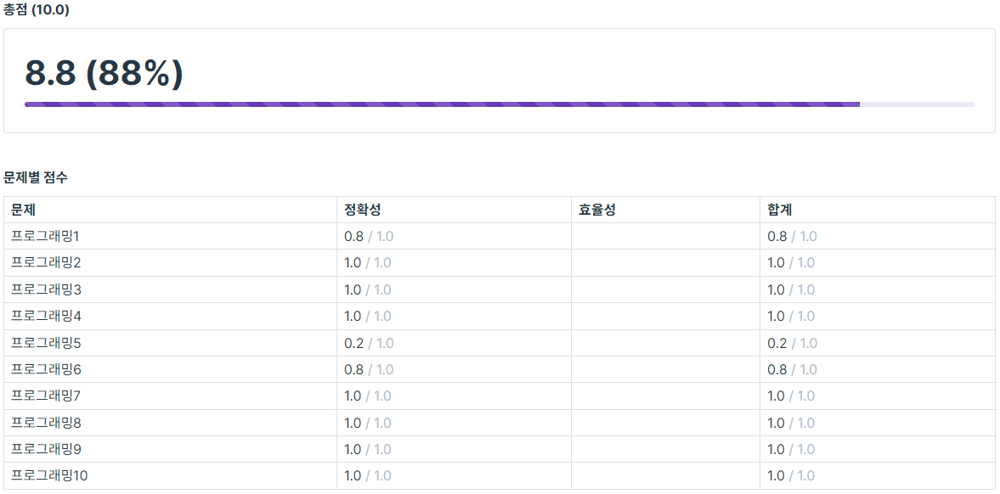

# [코테] 5주차 코딩테스트

**8월 17일**, 다섯 번째 코딩테스트였다!

---

**결과는 역대 최고 점수인 8.8점!**

---

여태껏 코테 중에서 초반에 가장 문제가 안풀렸어서 역시나 이번에도 공부 부족이었나.. 라는 생각이 들었지만, 마지막까지 포기하지 않고 푼 결과, 지난 코테 때보다 1.4점이나 높은 점수를 받았다!

1~4회차 코테 합계가 아쉽게 30점이 되지 않아 현타가 쌔게 왔었는데 그래도 꾸준히 공부한 결과를 보답받은 기분이 들어 이번 코테는 상당히 만족스러웠다!