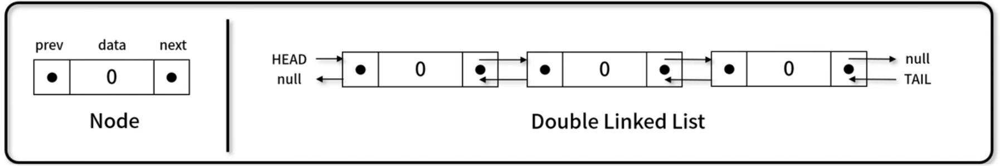

# [알고리즘] 이중 연결 리스트

### 선형 자료구조와 비선형 자료구조


그 중에서도 선형 자료구조인 **이중** **연결 리스트**에 대해 알아보자.

## 이중 연결 리스트 (Double Linked List)

- 각 노드가 데이터와 포인터를 가지며, **두 줄**로 연결되어 있는 방식으로 데이터를 저장하는 자료 구조
- 포인터를 두 개를 가짐으로서 이전 노드에의 접근도 가능해졌다.
- 구현 메서드(method)
    1. **노드 개수** / **비어 있는지 확인**: **DoubleLinkedList.size()**, **DoubleLinkedList.isEmpty()**
    2. **순차 출력** / **역 출력**: **DoubleLinkedList.printNode()**, **DoubleLinkedList.printNodeInverse()**
    3. **노드 추가**: **DoubleLinkedList.append()**, **DoubleLinkedList.insert()**
    4. **노드 삭제**: **DoubleLinkedList.remove()**, **DoubleLinkedList.removeAt()**
    5. **데이터 위치 확인**: **DoubleLinkedList.indexOf()**



---

### 이중 연결리스트 구현 (1)

```jsx
// Node(): data와 point인 next, prev를 가지고 있는 객체
function Node(data) {
	this.data = data;
	this.next = null;
	this.prev = null; // 추가됨
}

// LinkedList(): head, tail과 length를 가지고 있는 객체
function DoubleLinkedList() {
	this.head = null;
	this.tail = null; // 추가됨
	this.length = 0;
}

// size(): 연결 리스트 내 노드 개수 확인
DoubleLinkedList.prototype.size = function () {
	return this.length;
};

// isEmpty(): 객체 내 노드 존재 여부 파악
DoubleLinkedList.prototype.isEmpty = function () {
	return this.length === 0;
};

/* Test code */
let dll = new DoubleLinkedList();
let node;
console.log(dll);

node = new Node(123);
dll.head = node;
dll.tail = node;
dll.length++;
console.log(dll);

node = new Node(456);
dll.tail.next = node;
node.prev = dll.tail;
dll.tail = node;
dll.length++;
console.log(dll);
```

### 이중 연결리스트 구현 (2)

```jsx
// printNode(): 노드 정방향 출력
DoubleLinkedList.prototype.printNode = function () {
	process.stdout.write("head -> ");
	for (let node = this.head; node != null; node = node.next) {
		process.stdout.write(`${node.data} -> `);
	}
	console.log("null");
};

// printNodeInverse(): 노드 역방향 출력
DoubleLinkedList.prototype.printNodeInverse = function () {
	let temp = [];

	process.stdout.write("null <- ");
	for (let node = this.tail; node != null; node = node.prev) {
		temp.push(node.data);
	}
	for (let i = temp.length - 1; i >= 0; i--) {
		process.stdout.write(`${temp[i]} <- `);
	}
	console.log("tail");
};

// append(): 연결 리스트 가장 끝에 노드 추가
DoubleLinkedList.prototype.append = function (value) {
	let node = new Node(value);

	if (this.head === null) {
		this.head = node;
		this.tail = node;
	} else {
		this.tail.next = node;
		node.prev = this.tail;
		this.tail = node;
	}

	this.length++;
};

/* Test code */
let dll = new DoubleLinkedList();

dll.append(1);
dll.append(10);
dll.append(100);

dll.printNode();
dll.printNodeInverse();
```

### 이중 연결리스트 구현 (3)

```jsx
// insert(): position 위치에 노드 추가
DoubleLinkedList.prototype.insert = function (value, position = 0) {
	if (position < 0 || position > this.length) {
		return false;
	}

	let node = new Node(value),
		current = this.head,
		index = 0,
		prev;

	if (position === 0) {
		if (this.head === null) {
			this.head = node;
			this.tail = node;
		} else {
			node.next = current;
			current.prev = node;
			this.head = node;
		}
	} else if (position === this.length) {
		current = this.tail;
		current.next = node;
		node.prev = current;
		this.tail = node;
	} else {
		while (index++ < position) {
			prev = current;
			current = current.next;
		}

		node.next = current;
		prev.next = node;

		current.prev = node;
		node.prev = prev;
	}

	this.length++;

	return true;
};

/* Test code */
let dll = new DoubleLinkedList();

dll.insert(1);
dll.insert(10);
dll.insert(100);
dll.printNode();
dll.printNodeInverse();

dll.insert(2, 1);
dll.insert(3, 3);
dll.printNode();
dll.printNodeInverse();
```

### 이중 연결리스트 구현 (4)

```jsx
// remove(): value 데이터를 찾아 노드 삭제
DoubleLinkedList.prototype.remove = function (value) {
	let current = this.head,
		prev = current;

	while (current.data != value && current.next != null) {
		prev = current;
		current = current.next;
	}

	if (current.data != value) {
		return null;
	}

	if (current === this.head) {
		this.head = current.next;
		if (this.length === 1) this.tail = null;
		else this.head.prev = null;
	} else if (current === this.tail) {
		this.tail = current.prev;
		this.tail.next = null;
	} else {
		prev.next = current.next;
		current.next.prev = prev;
	}

	this.length--;

	return current.data;
}

/* Test code */
let dll = new DoubleLinkedList();

dll.insert(1);
dll.insert(10);
dll.insert(100);
dll.insert(2, 1);
dll.insert(3, 3);
dll.printNode();
dll.printNodeInverse();

console.log(dll.remove(1000));
dll.printNode();
dll.printNodeInverse();
console.log(dll.remove(1));
dll.printNode();
dll.printNodeInverse();
console.log(dll.remove(2));
dll.printNode();
dll.printNodeInverse();
console.log(dll.remove(100));
dll.printNode();
dll.printNodeInverse();
```

### 이중 연결리스트 구현 (5)

```jsx
// removeAt(): position 위치 노드 삭제
DoubleLinkedList.prototype.removeAt = function (position = 0) {
	if (position < 0 || position >= this.length) {
		return null;
	}

	let current = this.head,
		index = 0,
		prev;

	if (position === 0) {
		this.head = current.next;
		if (this.length === 1) this.tail = null;
		else this.head.prev = null;
	} else if (position === this.length - 1) {
		current = this.tail;
		this.tail = current.prev;
		this.tail.next = null;
	} else {
		while (index++ < position) {
			prev = current;
			current = current.next;
		}

		prev.next = current.next;
		current.next.prev = prev;
	}

	this.length--;

	return current.data;
}

/* Test code */
let dll = new DoubleLinkedList();

dll.insert(1);
dll.insert(10);
dll.insert(100);
dll.insert(2, 1);
dll.insert(3, 3);
dll.printNode();
dll.printNodeInverse();

console.log(dll.removeAt(1000));
dll.printNode();
dll.printNodeInverse();
console.log(dll.removeAt(4));
dll.printNode();
dll.printNodeInverse();
console.log(dll.removeAt());
dll.printNode();
dll.printNodeInverse();
console.log(dll.removeAt(1));
dll.printNode();
dll.printNodeInverse();
```

### 이중 연결리스트 구현 (6)

```jsx
// indexOf(): value 값을 갖는 노드 위치 반환
DoubleLinkedList.prototype.indexOf = function (value) {
	let current = this.head, index = 0;

	while (current != null) {
		if (current.data === value) {
			return index;
		}

		index++;
		current = current.next;
	}

	return -1;
};

// remove2(): indexOf + removeAt = remove
DoubleLinkedList.prototype.remove2 = function (value) {
	let index = this.indexOf(value);
	return this.removeAt(index);
};

/* Test code */
let dll = new DoubleLinkedList();

dll.insert(1); dll.insert(10); dll.insert(100);
dll.insert(2, 1); dll.insert(3, 3);
dll.printNode();
dll.printNodeInverse();

console.log(dll.indexOf(1000));
console.log(dll.indexOf(1));
console.log(dll.indexOf(100));
console.log(dll.indexOf(10));

console.log(dll.remove(1000));
dll.printNode();
dll.printNodeInverse();
console.log(dll.remove(1));
dll.printNode();
dll.printNodeInverse();
console.log(dll.remove(2));
dll.printNode();
dll.printNodeInverse();
console.log(dll.remove(100));
dll.printNode();
dll.printNodeInverse();
console.log(dll.size());
```