# [Git] About Git

## Git 이란?

### **형상관리도구(Configuration Management Tool) 중 하나이다.**

형상관리도구는 다른말로 버전 관리 시스템 이라고도 한다.

Git은 프로젝트 소스코드를 효과적으로 관리할 수 있는 시스템이다!

### 효과적 관리란?

여러 명이 동시에 작업하더라도 문제 없도록 한다.

소프트웨어의 여러 버전을 동시에 관리할 수 있다.

프로젝트 진행의 모든 로그를 볼 수 있으며 해당 시점으로 되돌리는 것도 가능하다.

---

## Git을 사용하는 이유

프로젝트 시 어떤 기능을 빼고 더하고 고치고 수정하는 과정은 필수!

기능을 되돌리게 될 수도 있고, 서로 다른 기능의 버전을 유지해야 하는 경우도 있다.

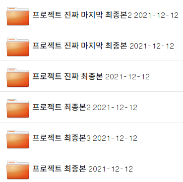

### 코드 관리 측면

1. 변경된 이력 확인
2. 이전 이력으로 되돌리기
3. 다른 기능의 버전 코드 유지
4. 현재 최종이 어느 시점인지 표현할 수 있음

### 협업의 측면

1. 각 기능별로 분업 후 하나의 코드로 합칠 수 있음
2. 같은 부분을 수정해 문제가 생기는 경우 안내
3. 협업으로 인한 실수 예방
4. 팀원 간의 커뮤니케이션 지원

---

## Git 기반의 서비스


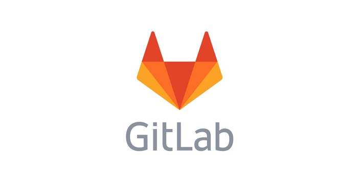

### 프로젝트 소스코드 클라우드 호스팅 + 특색에 맞는 기능 제공!

1. **Bitbucket** ([https://bitbucket.org/](https://bitbucket.org/))
    
    Atlassian의 제품들과 연계 (Jira : [https://www.atlassian.com/ko/software/jira](https://www.atlassian.com/ko/software/jira))
    
2. **GitLab** ([https://about.gitlab.com/](https://about.gitlab.com/))
    
    설치형 Git ⇒ 용량에 대한 비용 절감, 소스코드의 보안 좋음
    

---

## 사용자 설정 및 세팅

### Git 사용자 설정

로컬에서 사용할 Git 사용자 이메일과 이름을 설정

**git config** : Git에 관한 설정을 추가/변경/삭제하는 명령어

설정 파일 - System 설정 파일 / Global 설정 파일 / 로컬 설정 파일

1. **System 설정 파일** : 모든 시스템 사용자에게 적용 (**git config --system**)
2. **Global 설정 파일** : 한 사용자의 전치 Git Repository에 적용 (**git config --global**)
3. **Local 설정 파일** : 하나의 Repository에만 적용 (**git config --local**)

### Global Git 사용자 설정

**git config --global user.email “abc@abc.com”**

**git config --global user.name “Hong Gil-dong”**

### 설정 확인

**git config --list**

### Github 계정에 ssh key 등록하기

1. **ssh key** 만들기 → [https://bit.ly/368zxvR](https://bit.ly/368zxvR)
    
    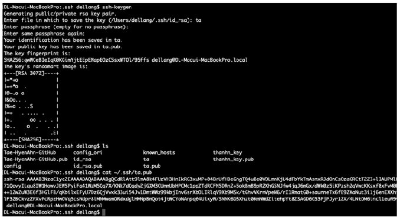
    
2. **Github** 접속 후 오른쪽 상단 프로필 클릭 **Setting → SSH and GPg Keys**
3. **New SSH Key** 클릭해 **Title**과 복사한 **Key** 입력 후 **Add SSH Key** 클릭
    
    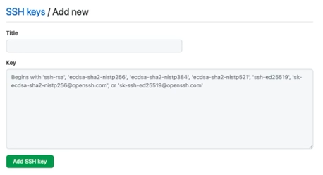
    

---

## 깃 초기화 및 삭제

### Git 초기화

명령어 : **git init**

초기화 할 대상 폴더에서 명령어 (**git init**) 입력

**Git** 초기화 시 폴더 안에 숨김 폴더로 **.git** **폴더** 생성 (**Local Config** 등으로 구성)

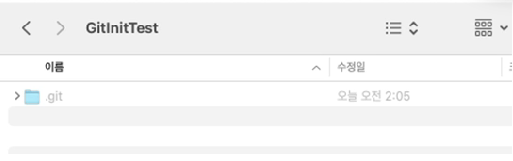

### Git 삭제

단순히 **.git** **폴더**를 삭제

**mac**의 경우 폴더를 삭제하는 명령어 입력 : **rm -rf .git**

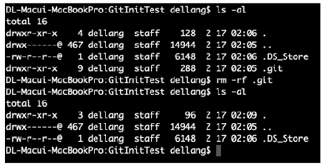

---

## gitignore 란?

사용자가 **git**에 등록(커밋)되지 않길 원하는 파일 또는 폴더들의 목록을 저장할 수 있다.

**.gitignore**에 등록된 파일(폴더)들은 **커밋 시 자동으로 제외됨**

### 작성법

- **#**은 주석의 역할
- **폴더** : /폴더명 (예: /docs)
- **파일** : 파일명.확장자 (예: test.txt)
- **폴더 안 파일** : /폴더명/파일명.확장자 (예: /docs/test.txt)
- **폴더 안 특정 확장자 파일 전부** (예: /docs/*.txt)
- **폴더 하위 모든 특정 확장자 파일 전부** (예: /docs/**/*.txt)

**.gitignore** 작성에 유용한 사이트 → [https://gitignore.io](https://gitignore.io)

→ 사이트에서 기본 양식을 붙여넣기한 후에 개인적으로 추가할 내용을 추가하는 것을 권장


---

## Git의 기본 동작 원리

1. **Working Directory**: 작업하는 파일이 있는 디렉토리
2. **Staging Area**: Git에 등록할 (커밋) 파일들이 올라가는 영역
3. **Local Repository**: 로컬 Git 프로젝트의 메타데이터와 데이터 정보가 저장되는 영역
4. **Remote Repository**: Github 등의 서비스를 통한 **온라인** 상의 저장소

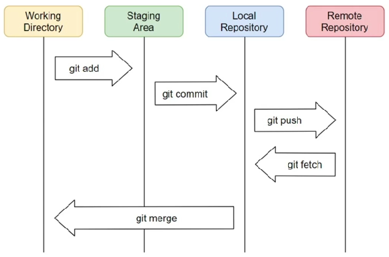

---

## Git 기본 용어

1. **origin**: 원격 (**Github** 등의 온라인 저장소)에 있는 코드
2. **head**: 내가 지금 작업하고 있는 로컬 브랜치
3. **add**: **Working Directory**에서 **Staging Area**로 등록하다
4. **commit**: **Staging Area**에 등록된 파일을 **Local Storage**로 등록
5. **Commit Message**: **commit** 시 함께 작성해 저장하는 메시지 (메모)
6. **push**: **Local Storage**에서 변경된 파일들을 **Remote Repository**로 등록
7. **fetch**: **Remote Repository**의 변경된 파일들을 **Local Repository**로 전달
8. **merge**: **Local Repository**의 변경사항을 **Working Directory**로 전달
9. **Branch**: 독립적으로 어떤 작업을 따로 진행하기 위한 가지
10. **checkout**: 사용할 다른 브랜치를 지정

---

## Local Repository

**저장소 (Repository)?**

- 파일이나 폴더를 저장하는 곳
- **Git** 저장소는 파일 변경 이력별로 구분되어 저장
- **Snapshot**: 파일이나 폴더를 사진을 찍듯 순간의 상태를 저장한다.

**내 PC에 파일이 저장되는 개인 전용 저장 공간**

### Local Repository 생성

1. 원하는 폴더 생성
2. 해당 폴더에서 **git init** 명령어 입력
3. **.git** 폴더 생성 확인

**원격 저장소 (Remote Repository)에서 복사해 Local Repository를 생성할 수도 있다.**

---

## Remote Repository

**파일이 전용 서버(Github)에서 관리되며 여러 사람이 함께 공유할 수 있다.**

### Remote Repository 생성:

**Github**를 통해 생성한다.

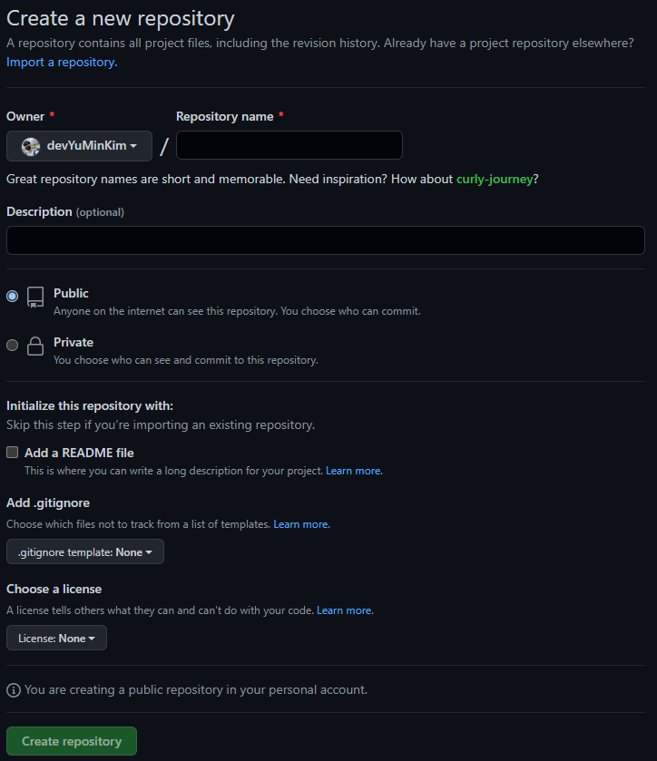

---

## Clone

- **에피소드**
    
    여러분이 입사 후 첫 출근해서 처음 프로젝트에 투입되었다!
    
    선배 : 프로젝트 레파지토리 클론 받아서 작업  시작해줘!
    
    나 : (크..클론)???
    

**로컬에서 작업하기 위해 Remote Repository를 복제해 내 PC의 Local Repositoriy로 저장하는 것**

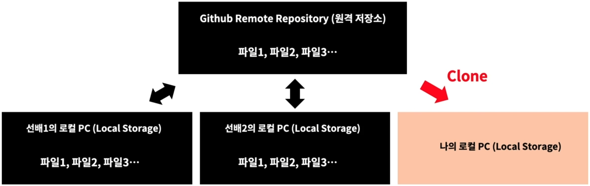

### 소스트리를 이용해 Clone

1. **Github 원격 저장소에서 SSH 주소 복사**
    
    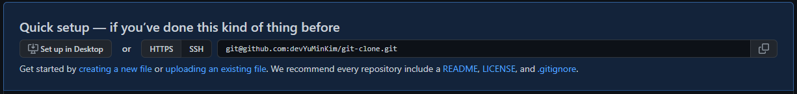
    
2. **URL에서 복제 선택**
    
    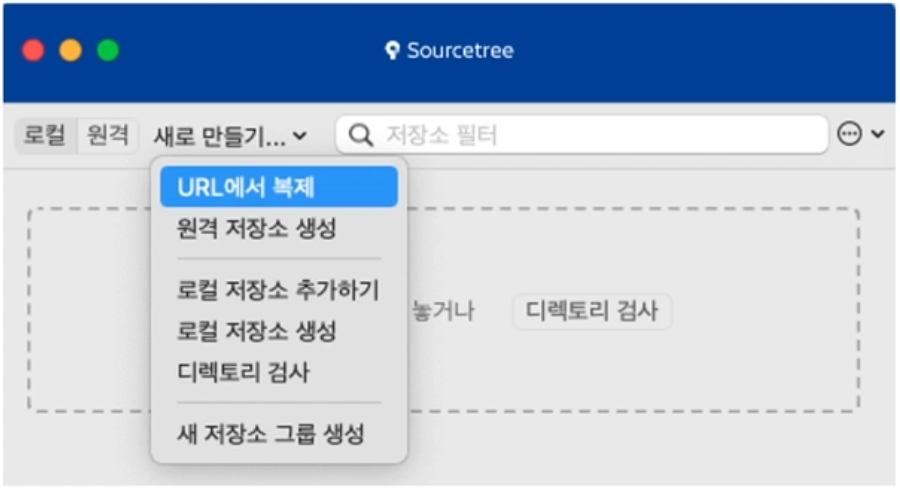
    
3. **복사한 SSH 주소 입력, 복사할 폴더 설정, 이름 설정**
    
    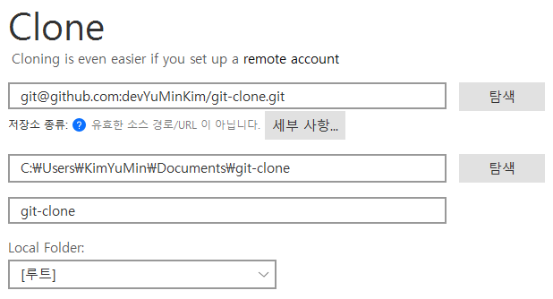
    

---

## Add, Commit, Push, Pull

### Add 란?

변경된 파일 중 Repository에 올릴 파일들을 등록한다.

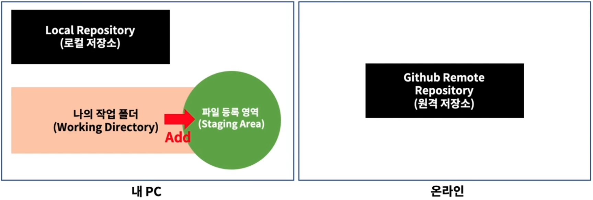

**Add 하기**

아래에서 **Add** 할 파일을 선택해 **Staging Area**에 등록

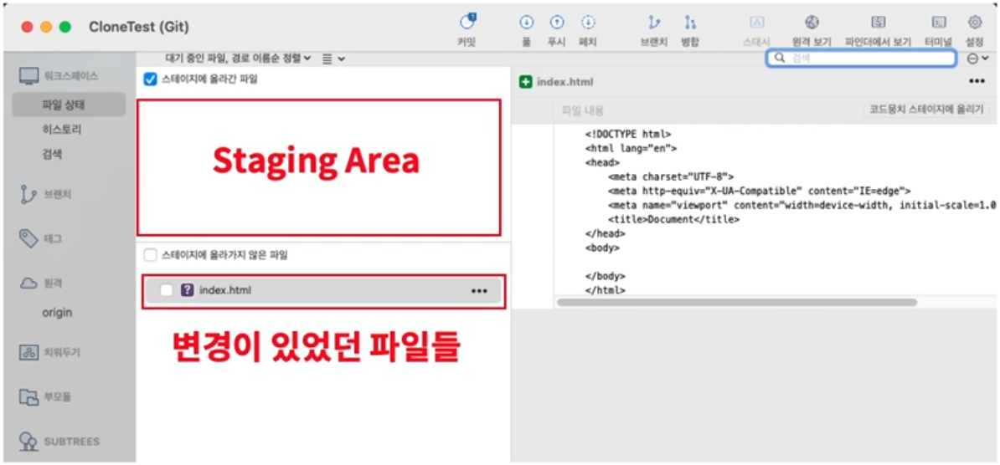

### Commit 이란?

**Add**로 등록된 파일들을 한 덩어리로 만들고 메시지를 추가해 로컬저장소에 올린다.

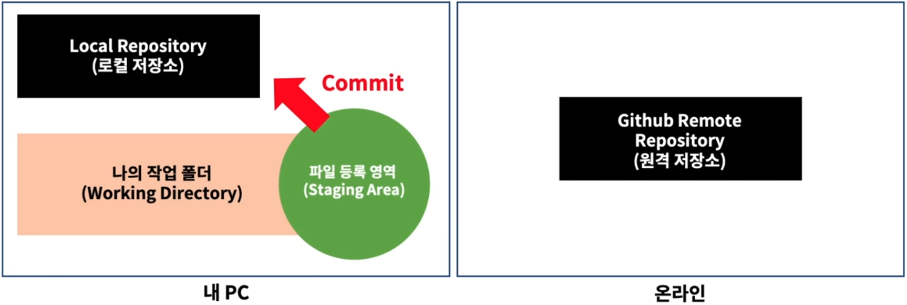

**Commit 하기**

**Staging Area**에 등록된 파일을 확인하고, 메시지 작성 후 커밋

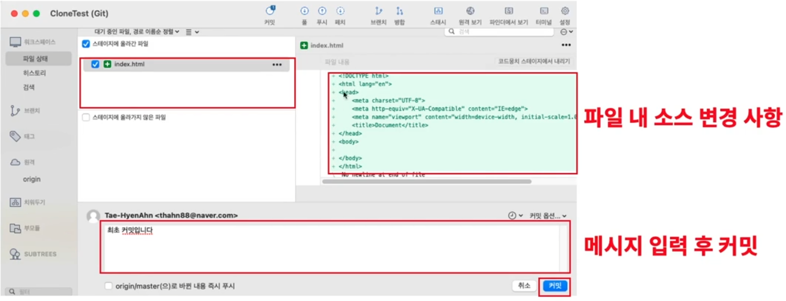

### Push 란?

**Commit** 되어 로컬  저장소에서 변경이 된 파일들을 원격 저장소로 전달한다.

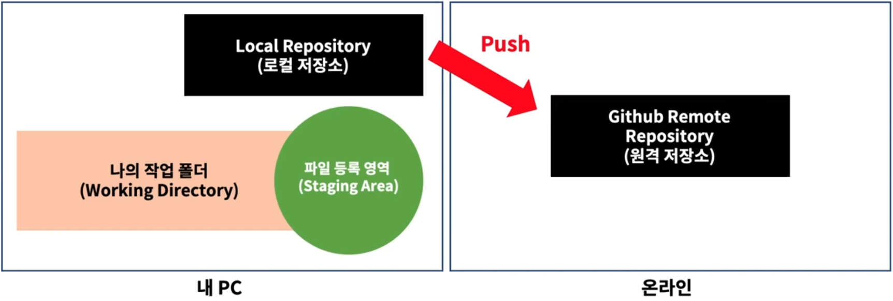

**Push 하기**

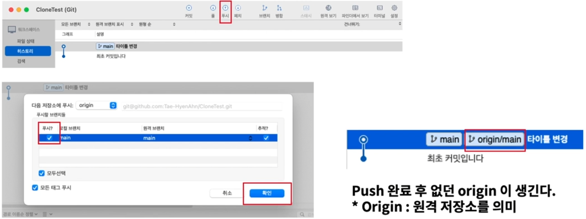

### 히스토리와 Checkout

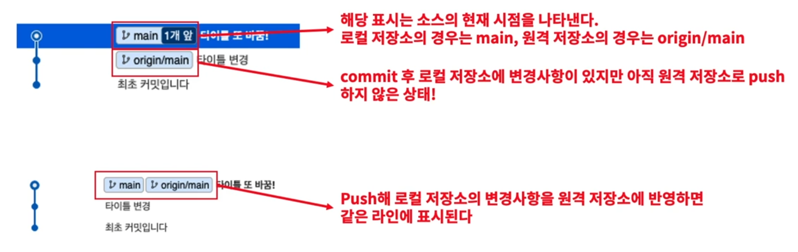


### Pull 이란?

원격 저장소의 변경사항을 로컬 저장소로 가져옴과 동시에 내 작업 소스에 합친다.

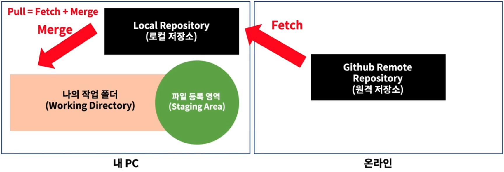

**Pull 하기**

다른 개발자가 Push해 원격 저장소가 변경되어 Pull 할 거리가 생기면 상단 풀 아이콘에 숫자가 생긴다!

히스토리에도 **origin**과 로컬 저장소의 현재 시점이 다르게 표시!

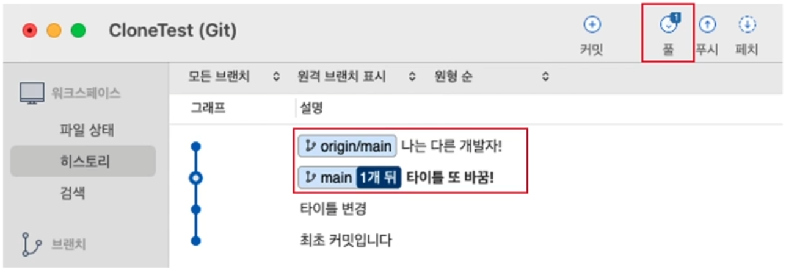

### Fetch와 Merge

- **Fetch** : 원격 저장소의 소스를 로컬 저장소로 받아와 일치 시킨다. (내 작업 소스에는 반영 X)
- **Merge** : **Fetch**해 온 로컬 저장소의 소스를 내 작업 소스에 합친다.
    
    (합칠 때 같은 부분의 소스가 다를 경우 충돌 발생!)
    

### Pull을 하는 상황은 언제 발생할까?

- 원격 저장소는 여러 프로젝트 개발 인원들이 동시에 사용한다.
- 다른 개발자가 변경상태를 **Push**해 원격 저장소에 반영한다면 내 입장에서는 원격 저장소에 변경사항이 발생한 것!

---

## Branch

- **‘나무가지’**를 의미
- **Git**이 가진 가장 강력한 기능 중 하나
- 기존에 만들어 놓은 버전(**Main**)에서 복사해 **새로운 가지를 만들어** 다른 방향으로 작업을 이어 나가는 것

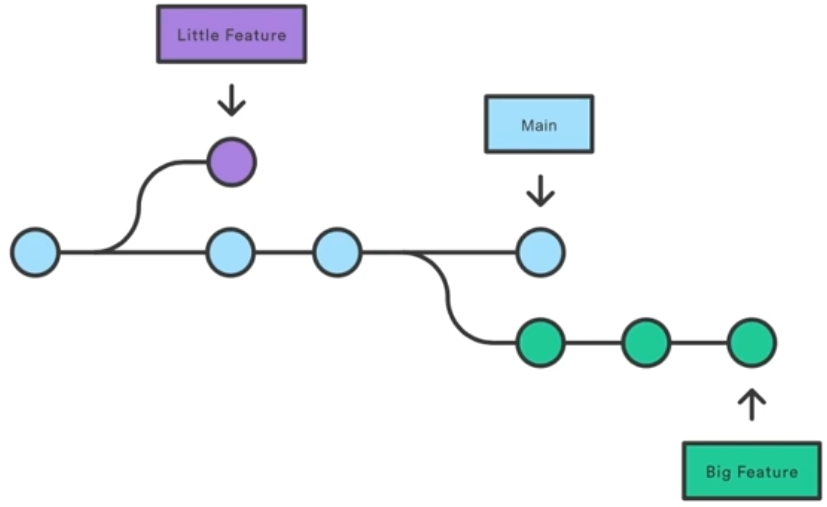

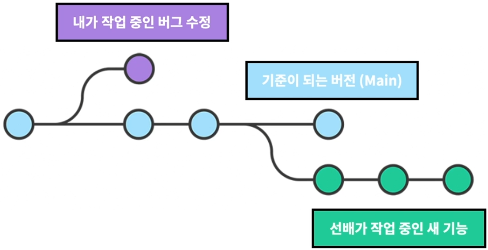

### Branch 생성

브랜치 이름 작성 후 생성


### 새 브랜치 체크아웃

브랜치를 생성한 뒤 현재 작업 소스를 해당 브런치의 상태로 변경 (**Head**의 이동)

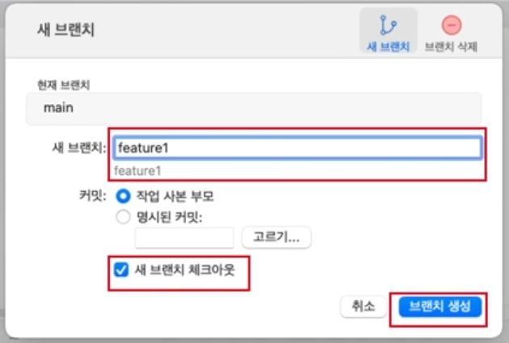

### Branch 생성 후 커밋 → 푸시

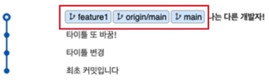

**브랜치 생성 직후**

- 가지는 생겼지만 소스의 상태가 같기 때문에 한줄에 표시됨
- 변경사항이 없어 브랜치는 로컬 저장소에만 반영되어 있는 상태

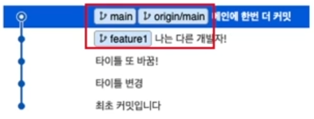

**main 브랜치 커밋 & 푸시**

- **feature1** 브랜치는 가만히 있고 **Main** 브랜치만 뻗어 나감
- **main** 브랜치는 원격 저장소에까지 반영됨

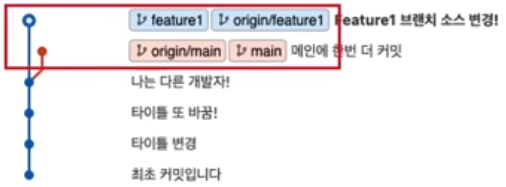

**feature1 브랜치 커밋 & 푸시**

- **feature1** 브랜치와 **main** 브랜치가 서로 다른 방향으로 뻗어 나감
- 원격 저장소에 **feature1** 브랜치 생성됨

---

## Merge

각각의 브랜치에서 작업이 완료된 후 **통합 브랜치(Main)**로 모아 **합치는 작업**

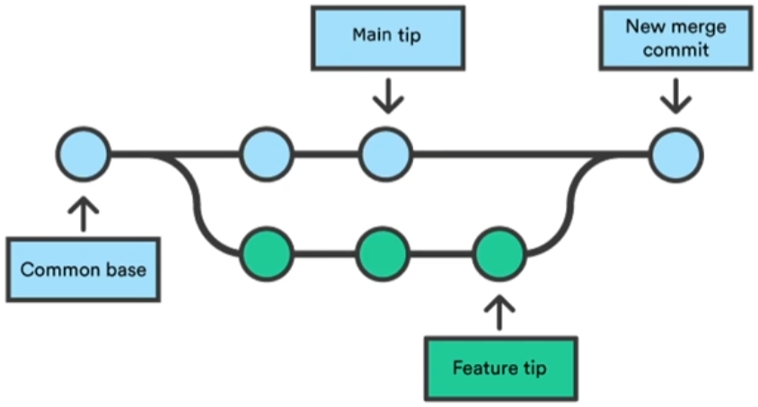

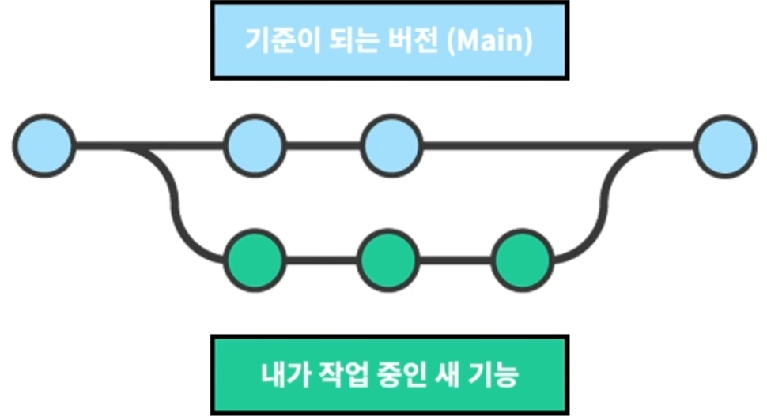

**Merge** 후 결과 **Branch**로 체크아웃 후 **Merge** 대상 브랜치에서 **Merge**!

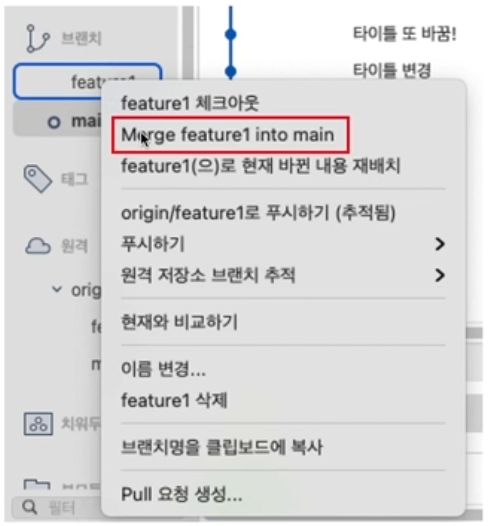

**Merge**할 커밋 시점을 선택해 **Merge**하는 것도 가능하다!

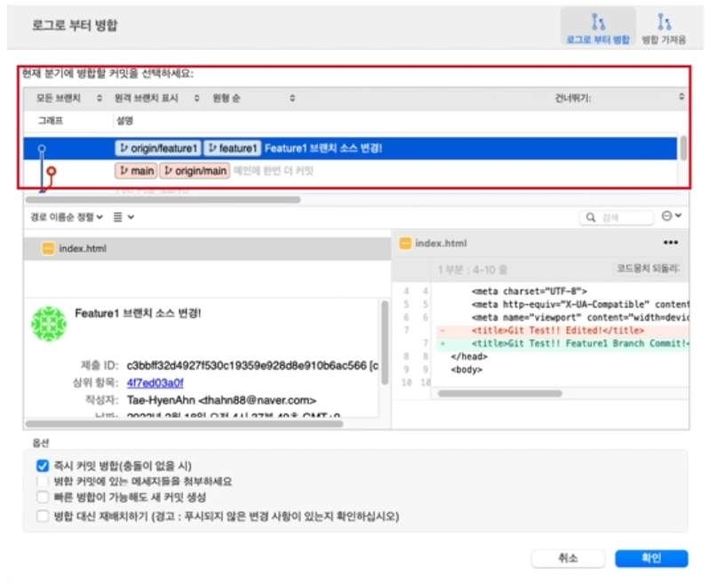

**Merge** 후 **main** 브랜치는 **feature1** 브랜치와 합쳐져 **Merge** 결과를 반영해 한 커밋 나아갔다!

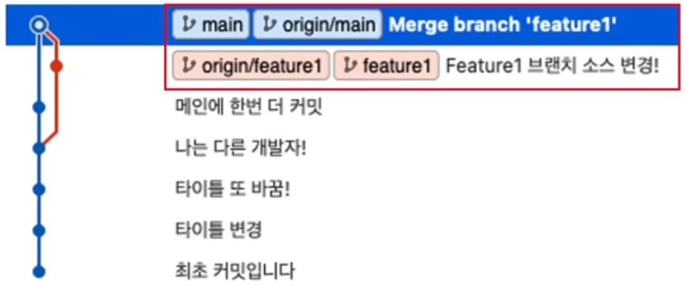

---

## Conflict 해결

### Conflict 발생!

- **Branch**를 **Merge** 할 때 발생할 수 있다.
- 같은 파일 같은 부분을 수정한 브랜치들을 **Merge**할 때 발생한다!

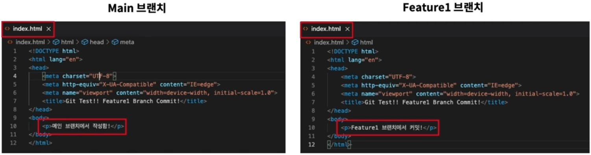

→ **같은 파일 (index.html) 같은 부분 (p 태그)이 서로 다르다!**

### Merge 시 충돌이 일어나면?

**Main** 브랜치에 **Feature1** 브랜치를 머지한다면?

충돌이 발생했다는 것을 알려준다!

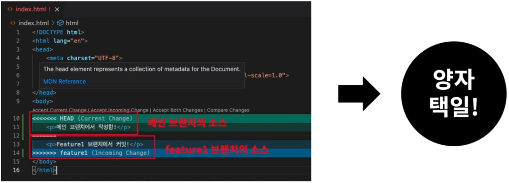

**다른 작업자가 작업한 브랜치를 머지할 땐 해당 작업자와의 충분한 논의가 필요하다!**

---

## Fork 복제

### Fork 란?

다른 사람의 원격 저장소에서 어떤 부분을 수정하거나 추가 기능을 넣고 싶을 때 해당 원격 저장소를 내 원격 저장소에 그대로 복제하는 것, 전문용어로 **“포크뜬다”**라고 한다!

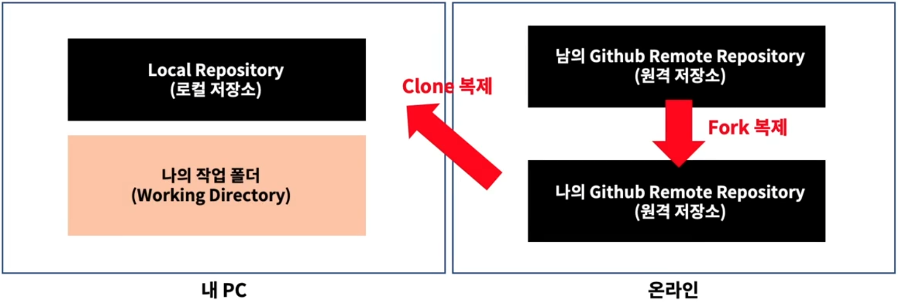

### Fork 복제

- 다른 계정으로 접속
- 원하는 레포지토리에 Github 페이지 접속 후 Fork 버튼 클릭!
- 다른 이의 레포지토리를 가져오는 것이기에 어떻게 하느냐에 따라 원본 레포지토리에 영향을 끼칠 수도 있다.

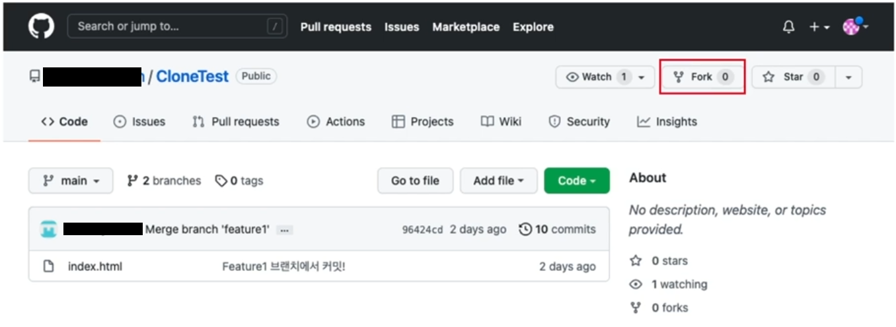

---

## Pull Request

다른 사람에게 내 브랜치를 **Merge** 해 달라고 하는 요청

- **사례**
    
    사례 1 : 한 원격 저장소에서 내 브랜치를 Merge 하기 전 피드백을 요청!
    
    사례 2 : Fork 뜬 저장소에서 원본 저장소에 개발 완료 후 원본 저장소에 Merge를 요청!
    

**어떤 부분을 어떻게 수정했는지, 피드백 요청하는 부분은 정확히 어떤 파일의 어느 부분인지 기입한다.**

**Feature1** 브랜치에 푸시하게 되면 **Github** 페이지에 **Compare** & **pull request** 버튼 생김

또는 세번째 **Pull Requests** 탭 글릭해 생성

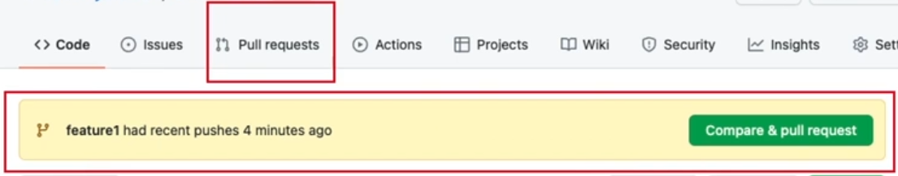

**어떤 브랜치에서 어떤 브랜치로 Merge 요청할 것인지 설정**

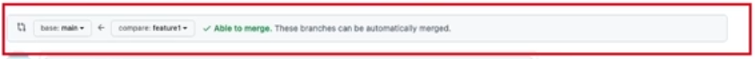

**Pull request 메시지 작성 부분**

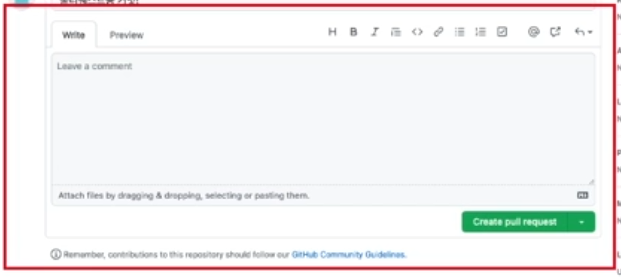

**Merge할 두 브랜치의 소스코드 비교 부분**

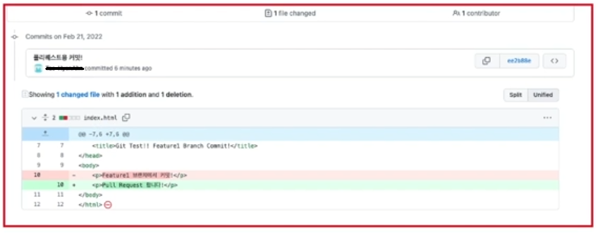

**Pull request** 한 저장소 & 브랜치 / **Merge** 대상 저장소 & 브랜치를 선택할 수 있다.

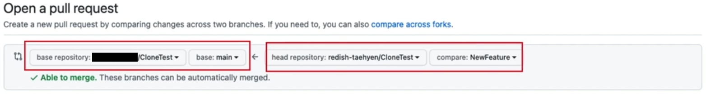

---

## 터미널에서 사용하기

- **git clone [원격 저장소 주소]**
- **git status**: 저장소의 상태를 보여준다.
- **git add [파일경로]**
    - **git add -i**: 추가되지 않은 파일들 모두 한번에 **Staging Area**에 추가한다.
- **git rm --cached [파일경로]**: **Staging Area**에 **add**된 파일을 다시 **Working Directory**로 내린다.
    - **git rm -r --cached**: **Staging Area**의 모든 파일을 **Working Directory**로 내린다.
- **git commit -m“커밋 메시지”**
- **git push**: **remote repository**로 업로드한다.
- **git long --decorate --graph**: 그래프 형식으로 로그를 출력한다.

---

## VSCode에서 사용하기

- **Visual Studio Code**
- 마이크로소프트에서 개발한 소스코드 편집기
- [https://code.visualstudio.com/](https://code.visualstudio.com/)
- 편집기 내에서 **Git**을 지원

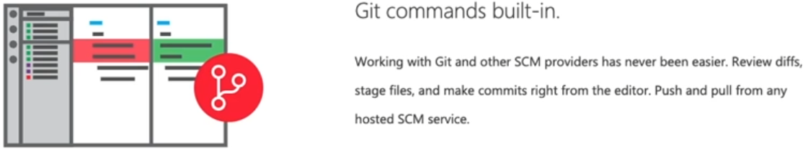

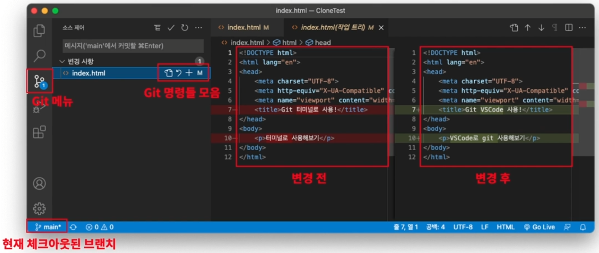

---

## ISSUES

이슈는 프로젝트의 작업, 개선사항, 버그를 추적하고 커뮤니케이션 할 수 있는 **Github**에서 제공하는 기능

- **대표 사례**
    
    React 레파지토리의 ISSUES : [https://github.com/facebook/react/issues](https://github.com/facebook/react/issues)
    
    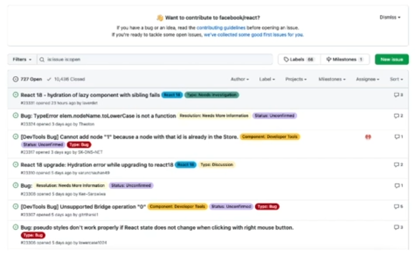
    

---

## Markdown

- 일반 텍스트 형식의 문서의 양식을 편집하는 문법
- 누구나 쉽게 읽고 쓸 수 있으며 **HTML**로 변환이 가능하다.
- 특수기호와 문자를 이용한 매우 간단한 구조의 문법을 사용해 빠르게 작성하고 쉽게 읽을 수 있다.


### Markdown 태그의 종류

- **제목**: #, =====
- **인용**: >
- **강조**: *, _
- **링크**: ```[텍스트](주소 ”설명 생략가능”)```
- **이미지**: ``````
- **리스트**: 1, *, -, +
- **코드표시**: <code>코드</code>, 한줄 띄우고 스페이스 4칸, ```코드```
- **줄바꿈**: 엔터 2번, 강제 줄바꿈은 문장 끝에 스페이스바 2번
- **가로선**: -----, *****, +++++

**참고**: [https://www.markdownguide.org/](https://www.markdownguide.org/)