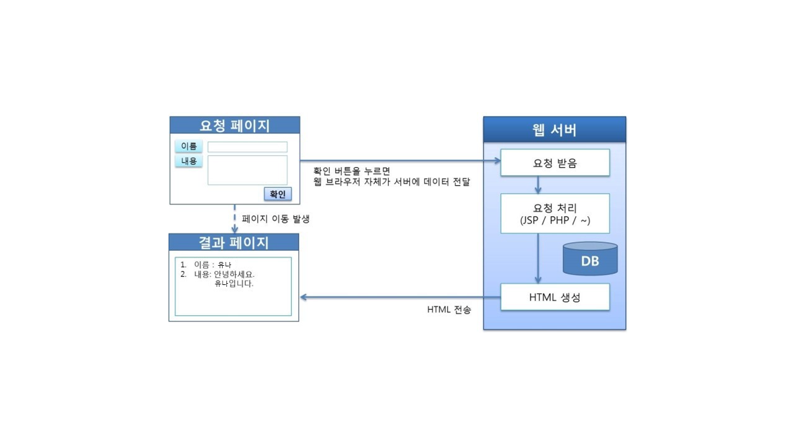
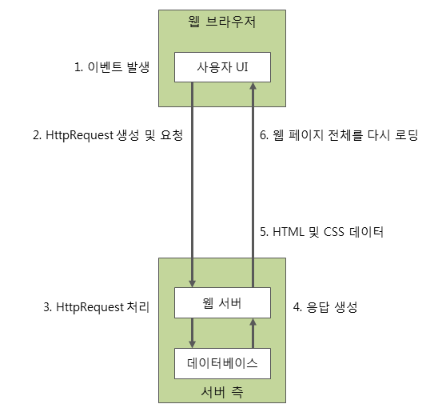
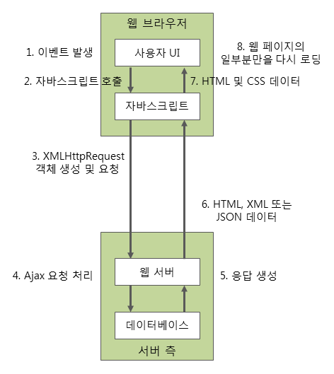

# [JS] AJAX

## HTTP의 한계

**HTTP**의 뒤 두 글자 **Transfer Protocol**. **HTTP**의 대전제는 “**URL** 및 부가정보를 통해 사용자가 원하는 페이지를 서버에 요청한다, 그리고 서버는 해당 요청에 응답한다” 이다.

그런데 대전제가 붙는다. 사용자가 **URL을 요청할 때에만**! 서버에서 해당 페이지를 꺼내주는 식이라는 것이다.

이는 사용자가 서버로부터 새로운 정보를 받아보기 위해서는 반드시 새로운 **URL**을 요청해야 한다는 뜻이다.

즉, 브라우저가 웹서버에 무엇인가 요청하려면 페이지를 이동해야만 했다. 이러한 방식으로 만들면 시각적으로 뻣뻣해지고 구려지기 때문에 꼼수들이 등장하게 된다.

이러한 상황에서 등장한 것이 **AJAX**!

---

## AJAX

구글에서 **HTTP** 규약을 뛰어넘는 방안을 제시한다. 이것이 **AJAX**이다.

**AJAX**는 **HTTP**를 효과적으로 이용하는 기술이다.

다음은 **HTTP**에 따른 나이브한 통신 방식이다.

요청 페이지에서 확인 버튼을 누르면, 확인 버튼을 눌렀다는 정보를 서버에 전달하고, 웹 서버는 요청을 받고, 처리한 후에 HTML 페이지를 생성하고, 유저에게 해당 HTML 페이지를 전송한다.

해당 방식의 경우, HTML을 하나 새롭게 브라우저에 뿌리게 되고, 결국 새로운 페이지로 이동하는 결과를 맞게 된다.

다음은 **AJAX** 기술이 들어간 통신 방식이다.

**AJAX**를 쓰면, 유저는 새로운 **HTML**을 서버로 받는 것이 아니라 **동일한 웹페이지 내에서 DOM을 변경**하게 된다.

1. 요청 페이지에서 이름 칸에 ‘유나’를 입력하고, 내용에 ‘안녕하세요. 유나입니다’ 라고 썼다고 가정하자.
2. 사용자의 이벤트로부터 **JavaScript**는 해당 이름과 내용이 쓰여진 DOM을 읽는다.
3. **XMLHttpRequest** 객체를 통해 웹서버에 해당 이름과 내용을 전송한다.
4. 웹서버는 요청을 처리하고 **XML**, **Text** 혹은 **JSON**을 **XMLHttpRequest** 객체에 전송한다.
5. **JavaScript**가 응답 정보를 **DOM**에 쓴다.
6. 결과 페이지가 만들어진다.

**AJAX**를 사용하면 **HTML**을 서버로부터 받아야 하는 것이 아니라 동일한 페이지의 일부를 수정할 수 있는 가능성이 생기게 된다. 결과적으로 페이지 이동이 발생하지 않고 페이지 내부의 변화만 일어나게 된다.

---

## 정리

**Ajax**는 웹 페이지 전체를 **다시 로딩하지 않고도, 웹 페이지의 일부분만을 갱신**할 수 있게 해준다.

즉, **Ajax**를 이용하면 백그라운드 영역에서 버어와 통신하여, 그 결과를 웹페이지의 일부분에만 표시할 수 있다.

이 때, 서버와는 다음과 같은 다양한 형태의 데이터를 주고받을 수 있다.

1. **JSON**
2. **XML**
3. **HTML**
4. **텍스트 파일**

### Ajax의 장점

1. **웹페이지 전체를 다시 로딩하지 않고도, 웹페이지의 일부분만을 갱신할 수 있다.**
2. 웹페이지가 로드된 후에 서버로 데이터 요청을 보내고, 데이터를 받을 수 있다.
3. 백그라운드 영역에서 서버로 데이터를 보낼 수 있다.

### Ajax의 한계

1. **Ajax는 클라이언트가 서버에 데이터를 요청하는 클라이언트 풀링 방식**(사용자가 직접 요청)**을 사용하므로**, **서버 푸시 방식**(ex: 푸시 알람)의 실시간 서비스는 만들 수 없다.
2. **Ajax**로는 바이너리 데이터를 보내거나 받을 수 없다.
3. **Ajax** 스크립트가 포함된 서버가 아닌 다른 서버로 **Ajax** 요청을 보낼 수는 없다.
4. 클라이언트의 PC로 **Ajax** 요청을 보낼 수는 없다.

### Ajax 구성 요소

- 웹페이지 표현을 위한 **HTML**, **CSS**
- 데이터에 접근하거나 화면 구성을 동적으로 조작하기 위해 사용되는 **DOM 모델**
- 데이터 교환을 위한 **JSON**, **XML**
- 웹서버와의 비동기식 통신을 위한 **XMLHttpRequest** **객체**
- 위에서 언급한 모든 기술을 결합하여 사용자의 작업 흐름을 제어하는 데에 사용되는 **JavaScript**

### Ajax 동작 원리

**Ajax**의 동작은 위에서 언급한 **Ajax** 구성 요소들을 사용하여 이루어진다.

**Ajax**를 이용한 웹 응용 프로그램은 **JavaScript** 코드를 통해 웹 서버와 통신을 하게 된다.

따라서 사용자의 동작에 영향을 주지 않으면서 백그라운드에서 지속해서 서버와 통신할 수 있다.

기존 웹 응용 프로그램의 동작 원리

**Ajax**를 이용한 웹 응용 프로그램의 동작 원리

### <<Ajax를 이용한 웹 응용 프로그램의 동작 원리>>는 다음과 같은 순서로 진행된다!

1. 사용자에 의한 요청 이벤트가 발생한다.
2. 요청 이벤트가 발생하면 이벤트 핸들러에 의해 **JavaScript**가 호출된다.
3. **JavaScript**는 **XMLHttpRequest 객체**를 사용하여 서버로 요청을 보낸다.
    
    이 때 웹 브라우저는 요청을 보내고 나서, **서버의 응답을 기다릴 필요 없이** 다른 작업을 처리할 수 있다.
    
4. 서버는 전달받은 **XMLHttpRequest 객체**를 가지고 **Ajax** 요청을 처리한다.
5. 서버는 처리한 결과를 **HTML**, **XML** 또는 **JSON** 형태의 데이터로 웹 브라우저에 전달한다.
6. 서버로부터 전달 받은 데이터를 가지고 웹 페이지의 일부분만을 갱신하는 **JavaScript**를 호출한다.
7. 결과적으로 웹 페이지의 일부분만이 다시 로딩되어 표시된다.

### XMLHttpRequest 객체

**Ajax**의 가장 핵심적인 구성 요소는 바로 **XMLHttpRequest 객체**이다.

**Ajax**에서 **XMLHttpRequest 객체**는 **웹 브라우저가 서버와 데이터를 교환**할 때 사용된다.

웹 브라우저가 백그라운드에서 계속해서 서버와 통신할 수 있는 것은 바로 이 객체를 사용하기 때문이다.

---

**Reference**

- [메인 참고](https://inpa.tistory.com/)
- [서브 참고](http://tcpschool.com/ajax/ajax_intro_works)