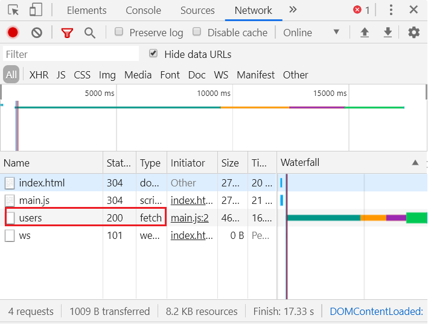
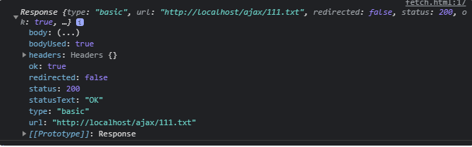
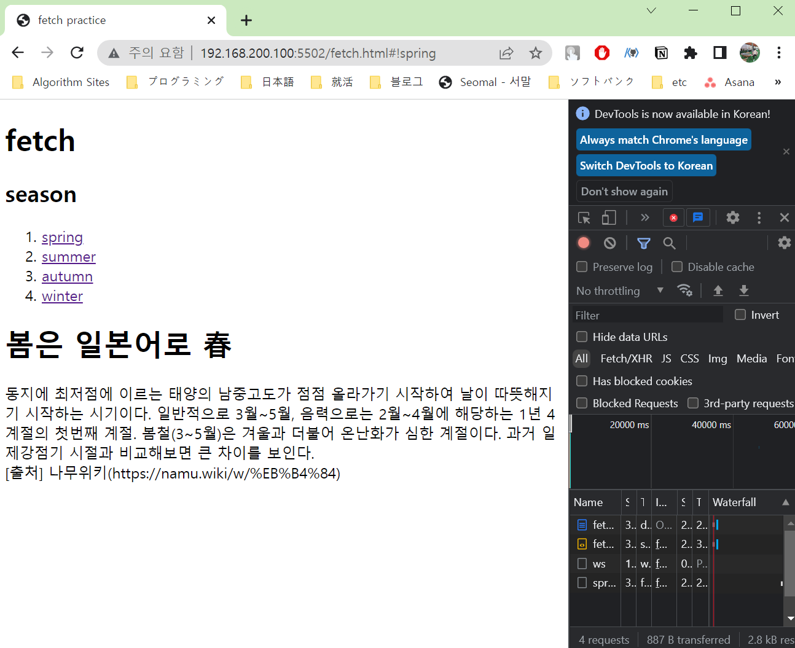

# [JS] Fetch API

웹 개발을 할 때 **ajax** 통신을 자주 사용하는데 JQuery, XHR, **fetch** 등등 여러 선택지가 존재한다.

그 중에서도 **fetch**가 자주 사용되는 추세이기에 이에 대해 알아보도록 하자.

---

## fetch

**Fetch**는 네트워크 요청/응답에 관련된 일반적인 **Request/Response Object**를 제공한다.

**WindowOrWorkerGlobalScope.fetch()** (**WindowOrWorkerGlobalScope** 키워드 생략 가능)메소드를 사용하면 요청과 응답을 만들 수 있다.

**fetch()** 는 **URL**, **Option** 2개의 매개변수를 받는다. 이 중에서 **URL**은 필수 매개변수이다.

또한, 이 녀석은 **ajax** 통신의 성공/실패 여부를 떠나 **Response** 로 분해할 수 있는 **Promise** 를 리턴한다.

---

## **JQuery**와의 차이점

- **fetch()** 가 반환하는 **Promise** 는 **response**가 HTTP 404, 500 같은 **HTTP error status**라 할지라도 거부하지 않고 다 받아온다.
- **cross-site cookies**를 받지 않는다. **fetch()** 는 **cross-site session**을 설정할 수 없다.
- **credential init** 옵션을 설정하지 않으면 **cookie**를 전송하지 않는다.

---

## fecth API 방식

**fetch API**는 **Promise** 기반으로 구성되어 있어 **비동기 처리** 프로그래밍 방식에 잘 맞는 형태다.

그래서 **then** 이나 **catch** 와 같은 체이닝으로 작성할 수 있다는 점이 장점이라 할 수 있다.

```jsx
/* 'fetch('서버주소')' 는 웹 브라우저에게 '이 서버주소로 요청해줘' 라는 의미이고, 
뒤에 .then이 붙으면 '요청 끝나고나서 이 할일을 해줘!' 라는 뜻이다. */

fetch('ajax_data.txt')
    .then( response => response.text() )
    .then( text => { document.getElementById("#text").innerHTML = text; } )
```

---

## fetch 문법 & 사용법

```jsx
fetch("https://devYuMinKim.github.io/posts", option)
   .then(res => res.text())
   .then(text => console.log(text));
```

1. **fetch** 에는 첫 번째 인자로 요청할 **url**이 들어간다.
2. 기본적으로 **HTTP** 메소드 중 **GET**으로 동작한다.
3. **fetch** 를 통해 **ajax** 를 호출 시 해당 주소에 요청을 보낸 후, 응답 객체(Promise Object Response)를 받는다.
4. 첫 번째 **then** 에서 응답을 받게 되고, **res.text()** 메서드로 파싱한 **text** 값을 리턴한다.
5. 그 다음 **then**에서 리턴 받은 text 값을 받고, 원하는 처리를 할 수 있게 된다.

**fetch** 를 통해 얻어온 데이터는 개발자 도구의 네트워크 탭에서 확인할 수 있다.



---

## response 프로퍼티와 메서드

**fetch**를 통해 요청하고 서버로부터 값을 응답 받으면 .**then** 을 통해 함수의 인자에 담긴 값은 **Response 객체**로서 여러 정보를 담고 있다.



- **response.status** - HTTP 상태 코드
- **response.ok** - HTTP 상태 코드가 200 ~ 299 일 경우 true
- **response.body** - 내용
- **response.text()** - response를 읽고 텍스트 반환
- **response.json()** - response를 JSON 형태로 파싱
- **response.formData()** - response를 FormData 객체 형태로 반환
- **response.blob()** - response를 Blob(타입이 있는 바이너리 데이터) 형태로 반환
- **response.arrayBuffer()** - response를 ArrayBuffer(바이너리 데이터를 로우 레벨 형식으로 표현한 것) 형태로 반환한다.

---

## fetch - GET / POST / PUT / PATCH / DELETE

### HTTP Method 종류 (CRUD)

- **POST**
- **GET**
- **PUT**
- **DELETE**

### GET

존재하는 자원을 요청한다.

```jsx
{
  "userId": 1,
  "id": 1,
  "title": "testing code",
  "body": "this is testing code"
}
```

### POST

새로운 자원 생성을 요청한다.

- headers - 요청 헤드가 담긴 객체. 제약 사항 존재
- body - 보내려는 데이터. **string**이나 **FormData**, **BufferSource**, **Blob**, **UrlSearchParams** 객체 형태

```jsx
fetch("https://devYuMinKim.github.io/posts", {
  method: "POST", // POST
  headers: { // 헤더 조작
    "Content-Type": "application/json",
  },
  body: JSON.stringify({ // JavaScript 객체를 json화 한다.
    title: "TestCode",
    body: "Now I am testing!",
    userId: 1,
  }),
})
  .then((response) => response.json())
  .then((data) => console.log(data))
```

### PUT

존재하는 자원(**body**) 변경을 요청한다.

- 전체를 **body**의 데이터로 교체해버린다.

```jsx
fetch("https://devYuMinKim.github.io/posts", {
  method: "PUT",
  headers: {
    "Content-Type": "application/json",
  },
  body: JSON.stringify({
    title: "TestCode" // innerHTML같이 아예 title 엘리먼트로 전체 데이터를 바꾼다.
  }),
})
  .then((response) => response.json())
  .then((data) => console.log(data))
```

### PATCH Method

존재하는 자원(**body**) **일부** 변경을 요청한다.

```jsx
fetch("https://devYuMinKim.github.io/posts/1", { // posts의 id 1인 엘리먼트를 수정한다.
  method: "PATCH",
  headers: {
    "Content-Type": "application/json",
  },
  body: JSON.stringify({
    title: "ChangedTestCode" // title만 바꾸고, 나머지 요소는 변경하지 않는다.
  }),
})
  .then((response) => response.json())
  .then((data) => console.log(data))
```

### DELETE Method

존재하는 자원 삭제를 요청한다.

- 전송할 데이터가 없기 때문에 **headers**, **body** 옵션이 필요없다.

```jsx
fetch("https://devYuMinKim.github.io/posts/1", {
  method: "DELETE",
})
  .then((response) => response.json())
  .then((data) => console.log(data))
```

---

## fetch 활용

**a** 태그를 클릭하면 **fetch**를 통해 다른 파일을 불러서 화면에 나타내도록 해보겠다.

**fetch.html**

```html
<!DOCTYPE html>
<html lang="en" dir="ltr">

<head>
  <meta charset="utf-8">
  <title>fetch practice</title>
  <script type="text/javascript" src="fetch.js"></script>
</head>

<body>
  <h1>fetch</h1>
  <h2> season </h2>
  <ol>
    <li> <a href="#!spring" onclick="fetchPage('spring.txt')">spring </a> </li>
    <li> <a href="#!summer" onclick="fetchPage('summer.txt')">summer </a> </li>
    <li> <a href="#!autumn" onclick="fetchPage('autumn.txt')">autumn </a> </li>
    <li> <a href="#!winter" onclick="fetchPage('winter.txt')">winter </a> </li>
  </ol>
  <p id="text"></p>

</body>

</html>
```

**fetch.js**

```jsx
function fetchPage(fileName) {
  fetch(fileName).then(function (response) {
    response.text().then(function (text) {
      document.querySelector('#text').innerHTML = text;
    })
  })
};
```

**spring.txt**


**결과 화면**

**첫 화면**


**spring 텍스트 클릭 후**



---

**Reference**

- [참고](https://inpa.tistory.com/)