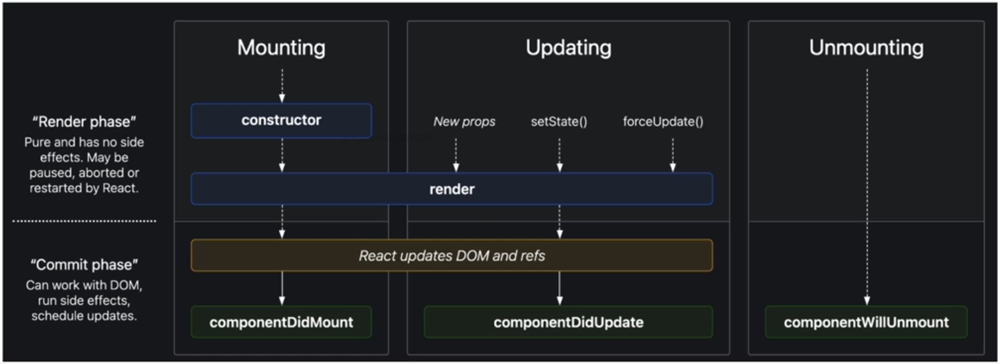

# [CS] React

## 1. 리액트의 Lifecycle API란?



1. **마운트**
    - 컴포넌트가 브라우저 상에 나타날 때
2. **업데이트**
    - 컴포넌트의 props나 state가 업데이트 될 때
3. **언마운트**
    - 컴포넌트가 브라우저 상에서 사라질 때

---

## 2. JSX란?

**JSX(JavaScript XML)**

- **JavaScript**에 **XML**을 추가한 것
    
    **XML** (e**X**tensible **M**arkup **L**anguage)
    
- 공식적인 **JavaScript** 문법은 아니다.

```jsx
const element = <h1>Hello, world!</h1>;
```

**왜 쓰는가?**

→ 하나의 파일에서 **JavaScript**와 **HTML**을 동시에 작성할 수 있어 편리하다.

---

## 3. React Hooks란?

- **Class Component**의 불편함을 해결하기 위해 **Functional Component**를 사용하는 리액트 훅이 등장했다.
- **Functional component**에서 **state**를 가질 수 있게 리액트 훅이 도와준다.
- 이로 인해, **Class Component**, **did mount**, **render** 등을 안해도 된다.
- 리액트 훅으로 함수형 컴포넌트에서도 클래스형 컴포넌트의 작업들을 할 수 있게 된다.

---

## 4. 클래스형 컴포넌트와 함수형 컴포넌트의 차이점은?

**React**는 컴포넌트를 생성할 때 2가지 방식을 사용할 수 있다.

1. **클래스형 컴포넌트**

	```jsx
	import React, {Component} from 'react';

	class App extends Component {
		render() {
			const name = 'react';
			return <div className="react">{name}</div>
		}
	}

	export default App;
	```

2. **함수형 컴포넌트**

	```jsx
	import React from 'react';
	import './App.css';

	function App() {
		const name = 'react';
		return <div className = "react">{name}</div>
	}

	export default App;
	```

### 차이점

**클래스형 컴포넌트**

- **class**
- **Component**를 상속 받는다. (**extends Component**)
- **render()** 함수가 필요하다.
- **state**와 생명주기 함수들을 사용할 수 있다. (**state**를 컴포넌트 내에서 구현하기 때문에 복잡한 UI 로직을 갖고 있다.)
- **constructor**, **this**, **binding** 등 지켜야 할 규칙이 많아 코드가 길고 복잡하다.

**함수형 컴포넌트**

- **state**를 사용하지 않고 **props**를 통해 데이터를 받아 UI에 뿌려준다.
- 클래스형 컴포넌트에 비해 간편하고 편리하게 사용할 수 있다.

⇒ **공식문서에서는 함수형 컴포넌트와 함께 훅을 사용하는 것을 권장하고 있다!**

---

## 5. Redux란?

상태 관리를 도와주는 라이브러리

리액트에는 이미 **setState()**, 리액트 훅스의 **useState()** 등이 상태를 관리할 수 있게 도와주는 함수들이 있음에도 불구하고 **redux**가 필요한 이유는 무엇일까?

부모 컴포넌트

- 자식 컴포넌트 1 / 자식 컴포넌트 2
- 자식 컴포턴트 3 / 자식 컴포넌트 4

만약 자식 컴포넌트 4에서 자식 컴포넌트 1로 상태를 전달하려면 

자식 컴포넌트 4 → 부모 컴포넌트 → 자식 컴포넌트 1

로 상태값을 전달해야 한다.

**props**를 사용하지 않고도 **store**에서 상태를 꺼내 사용할 수 있다.

주로 로그인 후 유저의 인증 정보를 유지하기 위해 사용한다.

---

## 6. state와 props의 차이는?

**Props**와 **State**는 데이터를 처리하기 위해 사용한다.

**Props**는 **Properties**의 줄임말로, **State**와의 가장 큰 차이는 불변의 데이터라는 것이다.

**Props**는 부모 컴포넌트에서 상속 받은 데이터이며, 이 받아온 **props**는 직접 수정이 불가능하다.

**State**는 컴포넌트에 내부에서 생성되고 값 변경이 가능하다.