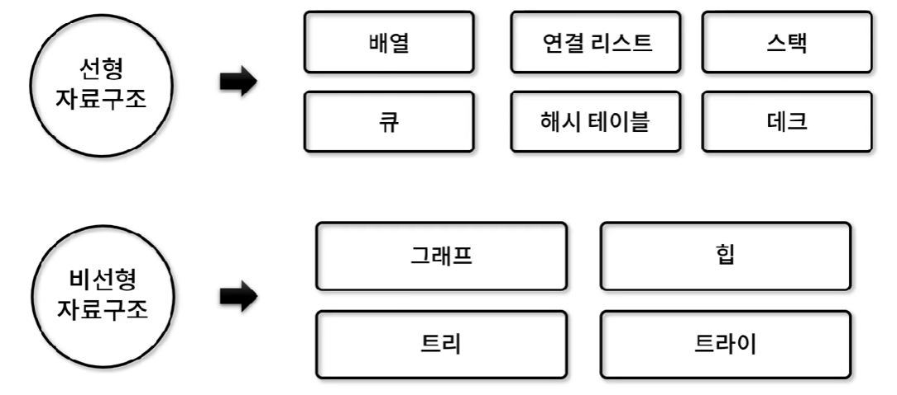

# [알고리즘] 원형 연결 리스트

### 선형 자료구조와 비선형 자료구조



그 중에서도 선형 자료구조인 **원형** **연결 리스트**에 대해 알아보자.

## 원형 연결 리스트 (Circular Linked List)

- 각 노드가 데이터와 포인터를 가지며, **원형 형태**로 연결되어 있는 방식으로 데이터를 저장하는 자료 구조
- 구현 메서드(method)
    1. **노드 개수** / **비어 있는지 확인**: **CircularLinkedList.size()**, **CircularLinkedList.isEmpty()**
    2. **노드 추가**: **CircularLinkedList.append()**, **CircularLinkedList.insert()**
    3. **노드 삭제**: **CircularLinkedList.remove()**, **CircularLinkedList.removeAt()**
    4. **데이터 위치 확인 / 노드 출력**: **CircularLinkedList.indexOf()**, **CircularLinkedList.printNode()**


---

### 원형 연결리스트 구현 (1)

```jsx
// Node(): data와 point를 가지고 있는 객체
function Node(data) {
	this.data = data;
	this.next = null;
}

// LinkedList(): head와 length를 가지고 있는 객체
function CircularLinkedList() {
	this.head = null;
	this.length = 0;
}

// size(): 연결 리스트 내 노드 개수 확인
CircularLinkedList.prototype.size = function () {
	return this.length;
};

// isEmpty(): 객체 내 노드 존재 여부 파악
CircularLinkedList.prototype.isEmpty = function () {
	return this.length === 0;
};

/* Test code */
let cll = new CircularLinkedList();
let node;
console.log(cll);

node = new Node(123);
cll.head = node;
node.next = cll.head;
cll.length++;
console.log(cll);

node = new Node(456);
node.next = cll.head.next;
cll.head.next = node;
cll.length++;
console.log(cll);
```

### 원형 연결리스트 구현 (2)

```jsx
// printNode(): 노드 출력
CircularLinkedList.prototype.printNode = function () {
	process.stdout.write("heade -> ");

	if (this.length != 0) {
		process.stdout.write(`${this.head.data} -> `);
		for (let node = this.head.next ; node != this.head ; node = node.next) {
			process.stdout.write(`${node.data} -> `);
		}
	}

	console.log("null");
};

// append(): 연결 리스트 가장 끝에 노드 추가
CircularLinkedList.prototype.append = function (value) {
	let node = new Node(value),
		current = this.head;

	if (this.head === null) {
		this.head = node;
	} else {
		while (current.next != this.head) {
			current = current.next;
		}
		current.next = node;
	}
	node.next = this.head;

	this.length++;
};

/* Test code */
let cll = new CircularLinkedList();

cll.append(1);
cll.append(10);
cll.append(100);

cll.printNode();
console.log(cll.size());
```

### 원형 연결리스트 구현 (3)

```jsx
// insert(): position 위치에 노드 추가
CircularLinkedList.prototype.insert = function (value, position = 0) {
	if (position < 0 || position > this.length) {
		return false;
	}

	let node = new Node(value),
		current = this.head,
		index = 0,
		prev;

	if (position === 0) {
		node.next = current;
	
		if (this.isEmpty()) {
			current = node;
		} else {
			while (current.next != this.head) {
				current = current.next;
			}
		}

		this.head = node;
		current.next = this.head;
	} else {
		while (index++ < position) {
			prev = current;
			current = current.next;
		}

		node.next = current;
		prev.next = node;

		if (node.next === null) {
			node.next = this.head;
		}
	}

	this.length++;

	return true;
};
```

### 원형 연결리스트 구현 (4)

```jsx
// remove(): value 데이터를 찾아 노드 삭제
CircularLinkedList.prototype.remove = function (value) {
	let current = this.head,
		prev = current,
		date;

	while (current.data != value && current.next != this.head) {
		prev = current;
		current = current.next;
	}

	if (current.data != value) {
		return null;
	}

	data = current.data;
	if (current === this.head) {
		while (current.next != this.head) {
			current = current.next;
		}

		this.head = this.head.next;
		current.next = this.head;
	} else {
		prev.next = current.next;
	}

	this.length--;
	
	return data;
};

/* Test code */
let cll = new CircularLinkedList();
cll.insert(1);
cll.insert(10);
cll.insert(100);
cll.insert(2, 1);
cll.insert(3, 3);
cll.printNode();

console.log(cll.remove(1000));
cll.printNode();
console.log(cll.remove(1));
cll.printNode();
console.log(cll.remove(2));
cll.printNode();
console.log(cll.remove(100));
cll.printNode();
console.log(cll.size());
```

### 원형 연결리스트 구현 (5)

```jsx
// removeAt(): position 위치 노드 삭제
CircularLinkedList.prototype.removeAt = function (position = 0) {
	if (position < 0 || position >= this.length) {
		return null;
	}

	let current = this.head,
		index = 0,
		prev,
		data;

	if (position === 0) {
		data = current.data;

		while (current.next != this.head) {
			current = current.next;
		}

		this.head = this.head.next;
		current.next = this.head;
	} else {
		while (index++ < position) {
			prev = current;
			current = current.next;
		}
		
		data = current.data;
		prev.next = current.next;
	}

	this.length--;
	
	return data;
};

/* Test code */
let cll = new CircularLinkedList();
```

### 원형 연결리스트 구현 (6)

```jsx
// indexOf(): value 값을 갖는 노드 위치 반환
CircularLinkedList.prototype.indexOf = function (value) {
	let current = this.head,
		index = 0;

	do {
		if (current.data === value) {
			return index;
		}
	
		index++;
		current = current.next;
	} while (current != this.head);

	return -1;
};

// remove2(): indexOf + removeAt = remove
CircularLinkedList.prototype.remove2 = function (value) {
	let index = this.indexOf(value);
	return this.removeAt(index);
};

/* Test code */
let cll = new CircularLinkedList();

cll.insert(1);
cll.insert(10);
cll.insert(100);
cll.insert(2, 1);
cll.insert(3, 3);
cll.printNode();

console.log(cll.indexOf(1000));
console.log(cll.indexOf(1));
console.log(cll.indexOf(100));
console.log(cll.indexOf(10));

console.log(cll.remove2(1000));
cll.printNode();
console.log(cll.remove2(1));
cll.printNode();
console.log(cll.remove2(2));
cll.printNode();
console.log(cll.remove2(100));
cll.printNode();
console.log(cll.size());
```