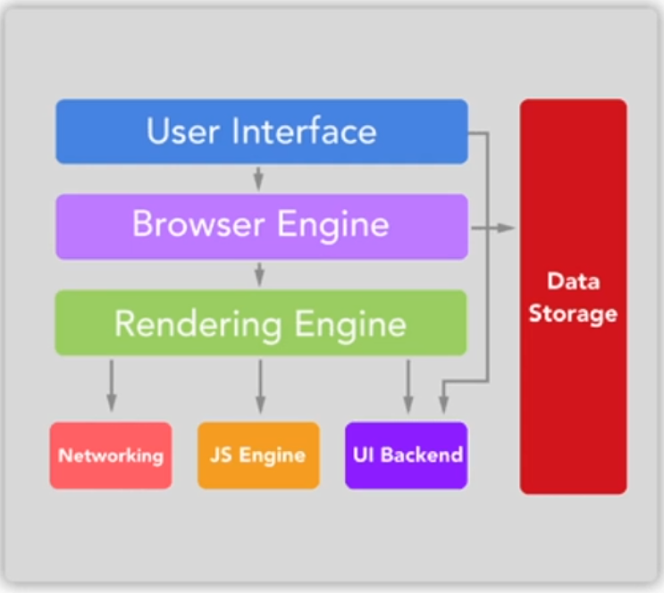
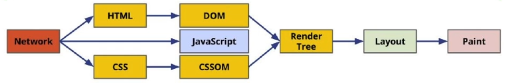
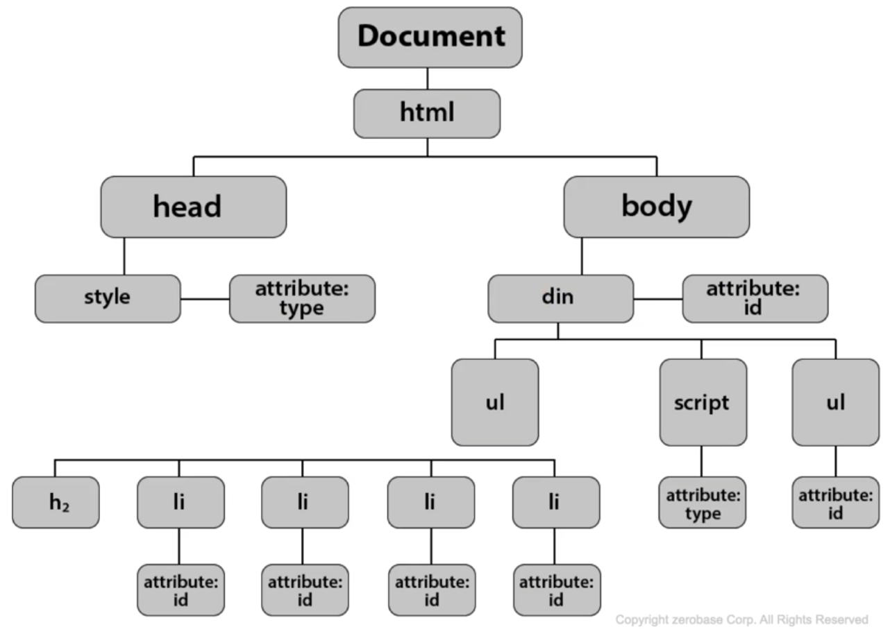
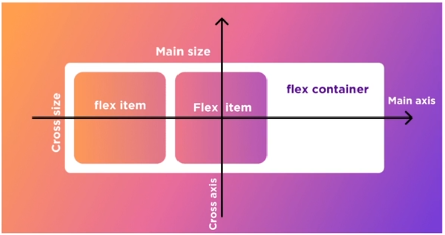
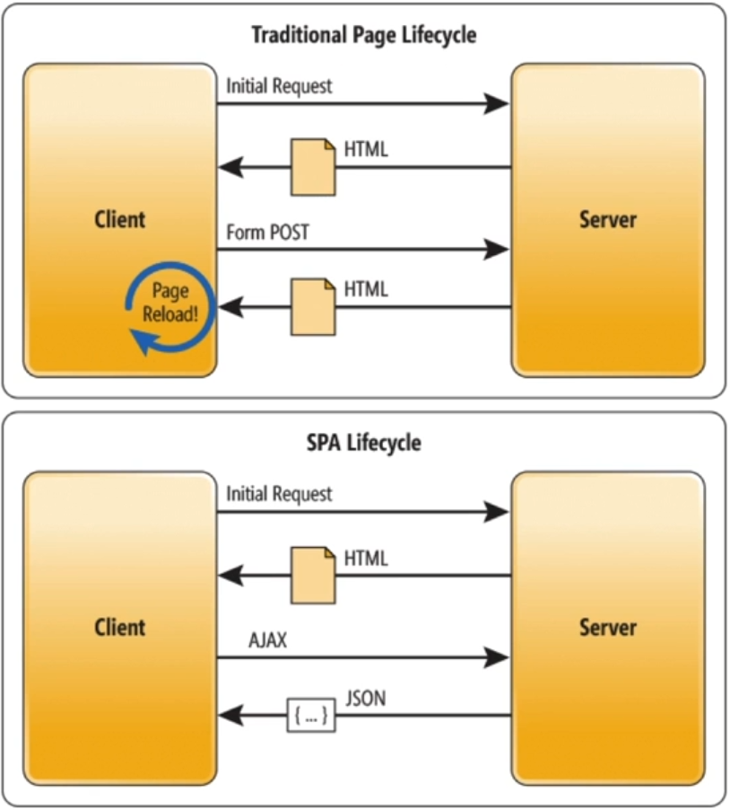

# [CS] Browser

## 1. 브라우저의 렌더링 과정에 대해 설명해주세요.

### 웹 브라우저의 구조

**User Interface**

- 사용자와 상호작용하는 인터페이스 (주소 표시줄, 이전/다음/새로고침 등)

**Browser Engine**

- User Interface와 Rendering Engine을 연결

**Rendering Engine**

- HTML과 CSS를 파싱하여 웹 페이지를 표시

**Networking**

**UI Backend**

**Data Persistence**

- localStorage와 Cookie와 같은 데이터를 저장

### Critical rendering path

1. 유저가 접속하고자 하는 URL을 입력
2. 브라우저에서 사용자가 요청한 웹페이지를 파싱
3. HTML과 CSS를 DOM (계층화)
4. 화면에 표시되어야 하는 정보를 포함하는 트리

**HTML DOM**: HTML 태그들을 계층화하는 과정

---

## 2. Flexbox란?

- 행 또는 열을 기준으로 웹 요소들을 정렬하는 방식
- 크기가 유동적이어야 하는 상황에서 많이 사용 (화면 크기에 맞춰 화면의 아이템들의 높이와 넓이를 최적의 길이로 맞춰줌)
- **display: flex;** 로 사용

---

## 3. CSS 애니메이션과 JS 애니메이션의 차이점은?

### CSS 애니메이션

- **Transition**과 **Animation** 속성이 존재
- **Transition**은 **hover**나 **click**과 같은 이벤트 트리거에 의해 동작
    
    해당 **element**의 변화를 일정 기간동안 일어나게 함
    
- **Animation**은 이벤트를 포함하여 시작, 정지, 반복까지 제어 가능

### JS 애니메이션

- **setInterval()** 과 같은 함수를 활용해 **element**에 변화를 줌.

### 차이점

1. **CSS** 애니메이션은 IE를 잘 지원하지 않는다는 단점. 크로스 브라우징 측면에서는 JS 애니메이션이 선호된다.
2. **JS**는 **style.top**, **style.left**와 같이 요소 하나하나의 동작을 관리해줘야 한다.
    
    **CSS**는 **CSS**만 관리하면 되기 때문에 관리가 용이하다. 대신 **JS**는 세밀한 동작까지 변형을 줄 수가 있다.
    

---

## 4. 브라우저 저장소의 차이점 (localStorage, sessionStorage, Cookie)

### localStorage

- 가장 간단하게 **key**-**value를** 저장한다.
- 최대로 저장할 수 있는 용량(약 5~10MB)의 제한이 있다.
- 도메인이 같으면 전역적으로 데이터를 공유한다.

### sessionStorage

- 브라우저를 종료하면 초기화된다. (새로고침은 제외)
- 게시판의 자동 임시 저장 용도로 자주 활용된다.
- 도메인이 같아도 브라우저가 다르면 데이터 공유가 안된다. (브라우저마다 별도의 **sessionStorage**가 생성된다.)

### Cookie

- 데이터 유효 기간을 지정할 수 있다.
- 저장할 수 있는 용량이 작은데 그 이유는 서버로 데이터를 전송할 때마다 쿠키 데이터가 담겨서 전송이 되기 때문이다.

---

## 5. 서버 사이드 렌더링과 클라이언트 사이드 렌더링의 차이점은?

### 서버 사이드 렌더링 (Server Side Rendering, SSR)

- 페이지 내용을 서버에서 그린 다음 브라우저로 전달한다.
- 페이지를 이동할 때마다 서버에 새로운 페이지를 요청한다.

### 클라이언트 사이드 렌더링 (Client Side Rendering, CSR)

- 페이지 내용을 브라우저에서 그린다.
- **React**를 예로 보면 **index.js** 파일만 로드하는 경우 (**Single Page Application**)
- **SEO**에 단점이 있다. 웹봇이 크롤링할 때는 웹이 로드되기 전의 빈 상태 코드를 크롤링해가기 때문이다.

### 차이점

- 화면에 뿌려줄 컨텐츠를 어디서 그려주느냐의 차이.
- 성능. 아무래도 렌더링된 **HTML**을 브라우저에 전달하는 **SSR**이 초기화면 로딩속도가 빠르다. 대신 **CSR**은 초기 로딩 이후 **SSR**보다 로딩 속도가 빠르다.
- **SSR**은 잦은 서버 요청에 따른 부하가 있을 수 있다.

 기존에는 페이지를 이동할 때마다 서버에 리소스를 요청하고 화면에 렌더링 하는 방식을 사용했다면, 최근의 웹 트렌드는 브라우저 로드시 페이지를 전체 로드한 다음, 새로운 페이지 갱신에 필요한 데이터만을 전달받아 데이터를 갱신한다.

대표적으로 **React**, **Vue**, **Angular**가 있다.

---

## 6. CORS란 무엇이며 왜 발생하는 것인지? 어떻게 해결하셨는지?

### CORS(Cross-Origin Resource Sharing)

- 도메인이 다르면 요청을 주고 받을 수 없게 하려는 초기 웹 브라우저의 정책으로 인해 발생한 문제.

**cross-origin 케이스**

- 프로토콜 (**http**, **https**), 도메인, 포트번호가 다른 경우

**해결 방법**

- 프론트의 경우 **Request Header**에 **CORS** 관련 옵션 추가 및 서버 개발자에게 **CORS** 허용 요청
- 프록시 서버를 통한 우회 (외부 도메인 서버에 바로 요청하는 것이 아닌 프록시 서버를 통해 외부 서버에 요청한 다음 결과값을 받는 방법)