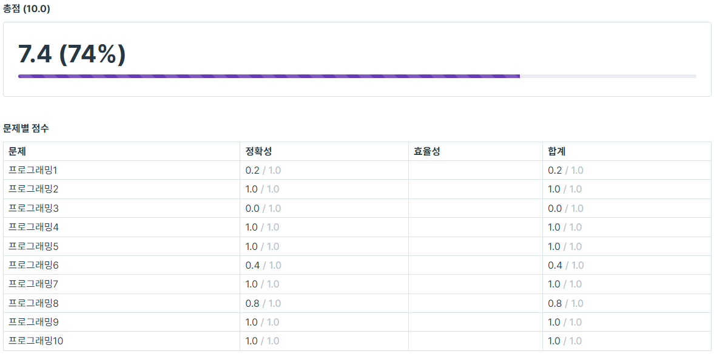

# [코테] 6주차 코딩테스트

**8월 24일**, 여섯 번째 코딩테스트였다!

---

**결과는 7.4점!**

---

여전히 손을 못댈 정도로 감이 안잡히는 문제가 한 문제씩은 존재하는 것 같다..

스택, 큐를 비롯한 자료구조와 관련된 개념들은 잡힌 상태이나, 이를 활용하는 것이 아직 부족한 것 같다.

꾸준히 관련 문제들을 백준에서 풀며 이에 대한 경험을 늘려야 할 것 같다.