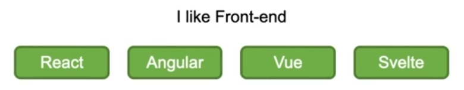
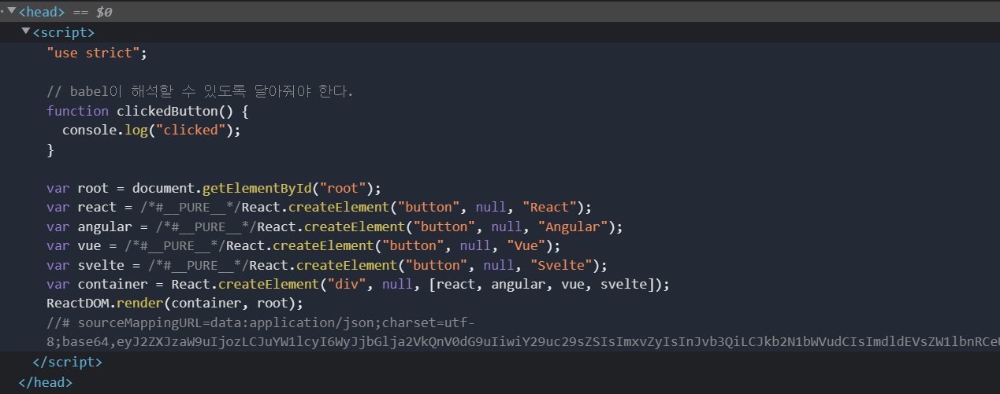

# [리액트] 바닐라 JavaScript와 리액트 비교

아래와 같은 기능을 구현하고자 한다.



1. 버튼 **html** 생성
2. 버튼에 **click** 이벤트 추가
3. 문장(I like~~) **html** 생성
4. 버튼 **click**할 때마다 문장 단어 변경하기

**JavaScript**로 작성한다면 이러한 순서로 기능을 구현해야 한다.

코드로 구현하면 다음과 같을 것이다.

```html
<!DOCTYPE html>
<html>

<body>
  <span id="title">I like Front-end</span>
  <div>
    <button id="react">React</button>
    <button id="angular">Angular</button>
    <button id="vue">Vue</button>
    <button id="svelte">Svelte</button>
  </div>
</body>
<script>
  const title = document.querySelector('#title');
  const react = document.querySelector('#react');
  const angular = document.querySelector('#angular');
  const vue = document.querySelector('#vue');
  const svelte = document.querySelector('#svelte');

  function clicked(text) {
    title.innerText = `I like ${text}`;
  }

  react.addEventListener("click", (e) => clicked(e.target.innerText));
  angular.addEventListener("click", (e) => clicked(e.target.innerText));
  vue.addEventListener("click", (e) => clicked(e.target.innerText));
  svelte.addEventListener("click", (e) => clicked(e.target.innerText));
</script>

</html>
```

위의 예제는 단순한 기능이기에 코드 몇 줄만으로 구현하는 것이 가능하지만, 현업에서는 코드 몇 줄로 끝나는 프로젝트일리가 없다. 그렇기에 **리액트**를 사용하는 것이다.

리액트를 사용하기 위해서 다음 코드를 추가하도록 하겠다.

```html
<script src="https://unpkg.com/react@17/umd/react.production.min.js" crossorigin></script>
<script src="https://unpkg.com/react-dom@17/umd/react-dom.production.min.js" crossoriign></script>
```

- **React**란, **User Interface**를 만들기 위한 **JavaScript** 라이브러리이다.
    
    → (웹 도는 브라우저의 라이브러리가 아님)
    
- **React-DOM**은 브라우저의 **DOM**에서 **React**를 사용하기 위한 라이브러리이다.

위의 예제의 뼈대를 리액트 코드로 변환하면 다음과 같다.

```html
<!DOCTYPE html>
<html>

<body>
  <div id="root"></div>
</body>
<script src="https://unpkg.com/react@17/umd/react.production.min.js" crossorigin></script>
<script src="https://unpkg.com/react-dom@17/umd/react-dom.production.min.js" crossorigin></script>
<script>
  const root = document.getElementById("root");
  const react = React.createElement("button", {
    id: "react"
  }, "React"); // <button></button>
  const angular = React.createElement("button", {
    id: "angular"
  }, "Angular");
  const vue = React.createElement("button", {
    id: "vue"
  }, "Vue");
  const svelte = React.createElement("button", {
    id: "svelte"
  }, "Svelte");
  const title = React.createElement("span", {
    id: "title"
  }, "I like Front-end");

  const container = React.createElement("div", null, [title, react, angular, vue, svelte]);

  ReactDOM.render(container, root);
</script>

</html>
```

물론 **JSX**로 작성한 것이 아니기에 **리액트는 이렇게 작성해야 한다!** 는 것은 아니다.

**JSX**에 대해서는 곧 다루도록 하겠다.

**React**로 작성한다면

1. **HTML**을 직접 작성하지 않고, **React**를 통해 **script**를 작성하여 버튼 **element**를 생성한다.
2. 1 에서 만든 버튼을 **HTML**에 **render** 한다.

…

이러한 과정이 될 것이다.

### 리액트에서 이벤트 다루기

리액트의 이벤트 규칙은 **on~**을 통해 추가한다.

```html
function clickedButton() {
    console.log("clicked");
}

const react = React.createElement("button", {
    id: "react",
    onClick: clickedButton
}, "React");
```

 **clickedButton** 이라는 함수명으로 따로 만들어준 뒤에 **Click**하면 함수를 실행하도록 구현하였다.

### JSX 문법과 트랜스파일링

**JSX** 문법은 **HTML**과 같지는 않지만, 유사하다.

**JSX** 문법을 그대로 사용하지는 못하고, 브라우저가 이해할 수 있도록 변환해주는 과정이 필요한데 이러한 과정이 **트랜스파일링**이다! 트랜스파일링을 해주는 것이 **트랜스파일러**이다. 가장 많이 사용되는 트랜스파일러로는 **BABEL**이 있다.

```html
<!DOCTYPE html>
<html>

<body>
  <div id="root"></div>
</body>
<script src="https://unpkg.com/react@17/umd/react.production.min.js" crossorigin></script>
<script src="https://unpkg.com/react-dom@17/umd/react-dom.production.min.js" crossorigin></script>
<script src="https://unpkg.com/@babel/standalone/babel.min.js"></script>
<script type="text/babel"> // babel이 해석할 수 있도록 달아줘야 한다.
  function clickedButton() {
    console.log("clicked");
  }

  const root = document.getElementById("root");
  const react = <button>React</button>;
  const angular = <button>Angular</button>;
  const vue = <button>Vue</button>;
  const svelte = <button>Svelte</button>;

  const container = React.createElement("div", null, [react, angular, vue, svelte]);

  ReactDOM.render(container, root);
</script>

</html>
```

**JSX**를 사용하여 위와 같이 코드를 작성하였지만,



개발자 도구에서 보면 변환되어 적용되어 있는 것을 볼 수 있다!

위의 코드도 작성하지만, 더 선호되는 방식이 있기에 다른 방식으로 구현해보도록 하겠다.

```html
<!DOCTYPE html>
<html>

<body>
  <div id="root"></div>
</body>
<script src="https://unpkg.com/react@17/umd/react.production.min.js" crossorigin></script>
<script src="https://unpkg.com/react-dom@17/umd/react-dom.production.min.js" crossorigin></script>
<script src="https://unpkg.com/@babel/standalone/babel.min.js"></script>
<script type="text/babel"> // babel이 해석할 수 있도록 달아줘야 한다.
  const root = document.getElementById("root");
  const Title = () => <span>I like Front-end</span>
  const ReactButton = () => <button>React</button>;
  const Angular = () => <button>Angular</button>;
  const Vue = () => <button>Vue</button>;
  const Svelte = () => <button>Svelte</button>;

  const Container = () =>
    <div>
      <Title />
      <ReactButton /> 
      <Angular /> 
      <Vue /> 
      <Svelte />
    </div>;

  ReactDOM.render(<Container/>, root);
</script>

</html>
```

- **변수 네이밍을 할 때 꼭 대문자로 하도록 하자! HTML** 태그들도 사용하기 때문에 혼동을 방지하기 위함이다.
- **React**의 경우 커맨드이기 때문에 변수명에 **Button**을 추가해주었다.

아직 **onClick** 했을 때의 함수를 구현하지 않았는데 이는 **State** 포스팅 시간에 구현해보도록 하겠다.