# [CSS] 선택자 (셀렉터)

## 주요 선택자

**index.html**

```html
<!DOCTYPE html>
<html>
  <head>
    <link rel="stylesheet" href="styles/main.css">
    <title>CSS</title>
  </head>
  <body>
    <h1 id="welcome-title">Welcome!</h1>
    
    <h2>List1</h2>
    <ul>
      <li class="blue red">Toy Story</li>
      <li class="red">Zootopia</li>
      <li class="blue">Inside Out</li>
    </ul>

    <h2>List2</h2>
    <ul>
      <li>first</li>
      <li>second</li>
    </ul>
    
    <h3>Lorem Ipsum</h3>
    <p>Lorem ipsum dolor sit amet consectetur adipisicing elit.</p>
    <p class="blue">Saepe officia qui, voluptatem sunt, eos, quia nesciunt tenetur voluptas quas ex exercitationem tempora nulla blanditiis incidunt recusandae corporis sed.</p>
    <p>Eligendi, temporibus!</p>  
  </body>
</html>
```

**style.css**

```html
/* Type Selector */
h2 {
  color: purple;
}

/* ID Selector */
#welcome-title {
  color: green;
}

/* Class Selector */
.blue {
  color: blue;
}

.red {
  color: red;
}
```

### Type Selector

- **css** 파일 상단부에 주로 작성한다. → 브라우저 스타일을 제외하고 가장 먼저 적용하기 때문
- **ID Selector**와 **Class Selector**을 많이 사용한다.
- **id**는 유일해야 한다.
- **class**는 중복이 가능하다.
- **class**는 스페이싱( )을 통해 여러 **class**를 줄 수 있다.

**결과 화면**

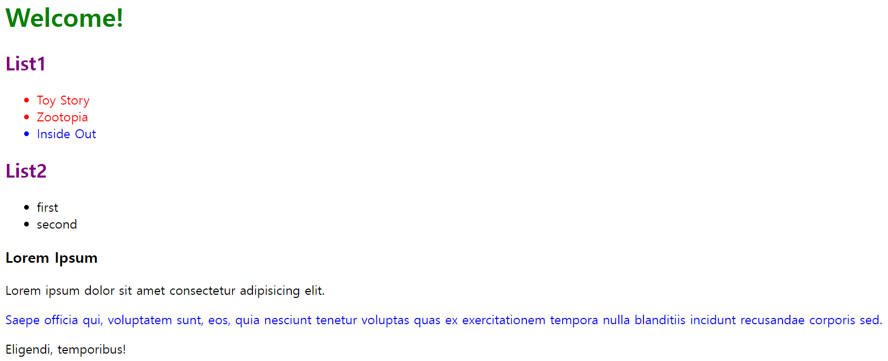

---

## 속성 선택자

**index.html**

```html
<!DOCTYPE html>
<html>

<head>
  <link rel="stylesheet" href="styles/main.css">
  <title>CSS</title>
</head>

<body>

  <ul>
    <li>
      <a href="http://example.com" target="_blink">
        Example Link (com/http)
      </a>
    </li>
    <li>
      <a href="http://example.org" target="_blink">
        Example Link (org/http)
      </a>
    </li>
    <li>
      <a href="https://example.com">
        Example Link (com/https)
      </a>
    </li>
    <li>
      <a href="https://example.org">
        Example Link (org/https)
      </a>
    </li>
  </ul>

  <input type="text">
  <input type="submit">
  <input type="reset">

</body>

</html>
```

**style.css**

```html
/* Attribute Selector (속성 선택자) */

/* 1. [attr] */
/* [attr]이 존재하면 적용 */
a[target] {
  color: hotpink;
}

/* 2. [attr=value] */
/* attr 속성이 value 값과 일치하면 적용 */
input[type="submit"] {
  background-color: green;
}

/* 3. [attr^=value] */
/* [value]로 시작한다면 적용 */
a[href^="https://"] {
  font-style: italic;
}

/* 4. [attr$=value] */
/* [value]로 끝난다면 적용 */
a[href$=".com"] {
  color: silver;
}

/* 5. [attr*=value] */
/* attr 속성이 [value]를 포함하고 있다면 적용 */
a[href*="com"] {
  color:sienna;
}
```

### Attribute Selector

- 특정 속성만 골라서 적용시킬 수 있다.
- 다음과 같은 방식이 존재한다.
    1. **[attr]**
    2. **[attr=value]**
    3. **[attr^=value]**
    4. **[attr$=value]**
    5. **[attr*=value]**

**결과 화면**

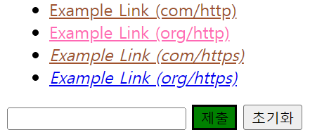

---

## 가상클래스 선택자

**index.html**

```html
<!DOCTYPE html>
<html>

<head>
  <link rel="stylesheet" href="styles/main.css">
  <title>CSS</title>
</head>

<body>

  <h2>Movie List</h2>
  <ul>
    <li class="movie">Toy Story</li>
    <li class="movie">Zootopia</li>
    <li class="movie">Inside Out</li>
    <li class="movie">Coco</li>
    <li class="movie">Finding Nemo</li>
  </ul>

  <ol>
    <li>Americano</li>
    <li>Latte</li>
    <li>Hot Choco</li>
  </ol>

  <h2>Lorem Ipsum</h2>
  <p>
    <span>Lorem ipsum dolor sit amet </span>
    <span>consectetur adipisicing elit. </span>
    <span>Commodi voluptates sint iure quas quasi. </span>
  </p>

</body>

</html>
```

**main.css**

```html
/* Pseudo-Class Selector (가상 클래스 선택자) */
/*
selector:___ {
  property: value;
}
*/

/* 1. first-child */
/* li 태그 중 첫 번째 자식 태그만 적용 */
li:first-child {
  color: green;
}

/* movie 클래스 태그 중 첫 번째 태그 */
/* 항상 의도한대로 선택되는 것은 아님 */
.movie:first-child {
  font-size: 32px;
}

/* 2. last-child */
/* 마지막 태그 적용 */
span:last-child {
  color:tomato;
}

/* 3. nth-child */
/* 특정 번째 적용 */
/* 자연수 뿐만 아니라 함수식이나 다른 키워드도 적용 가능 ex: 2n(짝수), odd(홀수), even(짝수) */
li:nth-child(3) {
  color: hotpink;
}
```

### Pseudo-Class Selector (1)

- 다음과 같은 방식이 존재한다.
    1. **first-child**
    2. **last-child**
    3. **nth-child()**

→ **first-child**에는 허점이 존재한다. 제일 첫 번째 요소에 원하는 태그가 아닌 다른 태그가 위치한 경우, 적용되지 않는 경우가 있다. **last-child** 또한 동일하다. 그렇기에 first-child 보다는 아래에서 설명할 **first-of-type**을 선호한다.

**결과 화면**

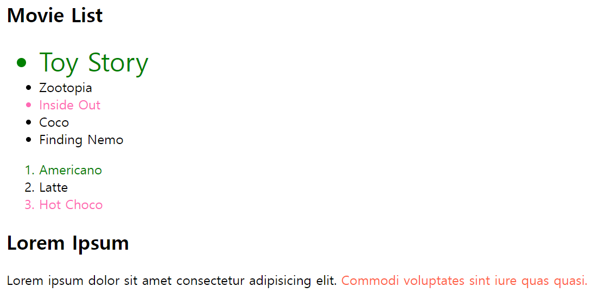

**index.html**

```html
<!DOCTYPE html>
<html>

<head>
  <link rel="stylesheet" href="styles/main.css">
  <title>CSS</title>
</head>

<body>

  <h2>Movie List</h2>
  <section>
    <div class="movie">Toy Story</div>
    <p class="movie">Zootopia</p>
    <p class="movie">Inside Out</p>
    <div class="movie">Coco</div>
    <p class="movie">Finding Nemo</p>
  </section>

</body>

</html>
```

**main.css**

```html
/* Pseudo-Class Selector (가상 클래스 선택자) */

/* 1. :first-of-type */
/* Type들 중에 첫 번째 태그에 적용 */
p:first-of-type {
  color: red;
}

/* 각 Type들 중에 첫 번째 태그에 적용 -> div 태그와 p 태그 모두 적용됨*/
.movie:first-of-type {
  color: pink;
}

/* 2. :last-of-type */
/* Type들 중에 마지막 태그에 적용 */
p:last-of-type {
  color: blue;
}

/* 3. :nth-of-type() */
/* nth-child()와 동일하게 자연수 뿐만 아니라 수식, 키워드도 적용 가능하다. */
p:nth-of-type(even) {
  color: aqua;
}
```

### Pseudo-Class Selector (2)

- 다음과 같은 방식이 존재한다.
    1. **:first-of-type**
    2. **:last-of-type**
    3. **:nth-of-type()**
    

**결과 화면**


**index.html**

```html
<!DOCTYPE html>
<html>

<head>
  <link rel="stylesheet" href="styles/main.css">
  <title>CSS</title>
</head>

<body>

  <form>
    <input type="text" placeholder="name">
    <input type="email" placeholder="email">
    <input class="pw" type="password" placeholder="password">
    <input type="submit">
  </form>

</body>

</html>
```

**main.css**

```html
/* Pseudo-Class Selector (가상 클래스 선택자) */

/* :not() */
/* pw 클래스를 제외한 input 타입에 적용 */
input:not(.pw) {
  background-color: indianred;
}

/* 위 코드와 동일 */
input:not([type=password]) {
  background-color: aqua;
}

/* submit 타입을 제외한 input 타입에 적용 */
input:not([type=submit]) {
  background-color: beige;
}

/* placeholder가 없는 input 타입에만 적용 */
input:not([placeholder]) {
  ~
}
```

### Pseudo-Class Selector (3)

- **:not()** → 해당하는 태그 중에 특정 조건을 제외

**결과 화면**

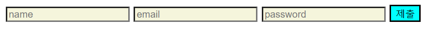

**index.html**

```html
<!DOCTYPE html>
<html>

<head>
  <link rel="stylesheet" href="styles/main.css">
  <title>CSS</title>
</head>

<body>

  <a href="http://example.com">Example Link</a>
  <a href="http://example1.com">Example Link1</a>

</body>

</html>
```

**main.css**

```html
/* Pseudo-Class Selector (가상 클래스 선택자) */

/* link */
/* 방문한 적이 없는 경우 적용 */
a:link {
  color: tomato;
}

/* visited */
/* 방문한 적이 있는 경우 적용 */
a:visited {
  color:yellowgreen;
}
```

### Pseudo-Class Selector (4)

- 하이퍼태그의 경우 두 가지의 상태로 존재한다.
    - 방문 기록 기준
    1. 방문한 적이 **있는** 경우 → **blue**로 표현
    2. 방문한 적이 **없는** 경우 → **purple**로 표현
- 다음과 같은 종류가 존재한다.
    1. 방문한 적이 없는 경우 → **link**
    2. 방문한 적이 있는 경우 → **visited**

**결과 화면**

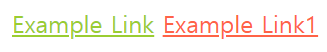

**index.html**

```html
<!DOCTYPE html>
<html>

<head>
  <link rel="stylesheet" href="styles/main.css">
  <title>CSS</title>
</head>

<body>

  <input type="button" value="저를 클릭하세요!">
  <input type="button" value="저를 클릭하세요!">
  <input type="button" value="저를 클릭하세요!">
  <input type="button" value="저를 클릭하세요!">
  <input type="button" value="저를 클릭하세요!">
  <input type="text">

</body>

</html>
```

**main.css**

```html
/* Pseudo-Class Selector (가상 클래스 선택자) */

input[type=button] {
  border: none;
  background-color: skyblue;
}

/* hover */
/* 해당 버튼에 접근했을 경우 적용 */
input[type=button]:hover {
  background-color: teal;
  color: white;
}

/* active */
/* 해당 버튼을 마우스로 클릭하고 떼는 시점까지 적용. */
input[type=button]:active {
  background-color: red;
}

/* focus */
/* 클릭 등으로 요소에 포커싱이 되었을 때 적용 */
input[type=button]:focus {
  background-color: blue;
}

input[type=text]:active {
  background-color: blue;
  color: white;
}
```

### Pseudo-Class Selector (5)

- 다음과 같은 종류가 존재한다.
    1. 접근했을 경우 → **hover**
    2. 클릭했을 경우 → **active**
    3. 포커싱 되었을 경우 → **focus**
- **a** 태그나 **button** 태그에 많이 적용한다.
- **:active**의 경우 다른 링크 의사 클래스 **:link**, **:hover**, **:visited**가 덮어 쓰므로, 링크를 적절히 디자인하려면
    
    **LVHA-순서(:link** - **:visited** - **:hover** - **:active**)
    
    순으로 작성해야 한다.
    
    따라서, **:active 규칙을 다른 모든 규칙 링크 규칙들보다 뒤에 배치해야 한다.**
    

**결과 화면**

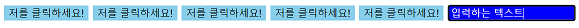

**index.html**

```html
<!DOCTYPE html>
<html>

<head>
  <link rel="stylesheet" href="styles/main.css">
  <title>CSS</title>
</head>

<body>

  <div>
    <input type="text" placeholder="1">
    <input type="text" placeholder="2">
    <input type="text" placeholder="3" disabled>
  </div>

  <div>
    <input type="radio" name="my-input" id="yes">
    <label for="yes">Yes</label>

    <input type="radio" name="my-input" id="no">
    <label for="no">No</label>
  </div>

  <div>
    <input type="checkbox" name="check-me" id="check-me">
    <label for="check-me">Check me!</label>

    <input type="checkbox" name="check-me1" id="check-me1">
    <label for="check-me">Check me1!</label>
  </div>

</body>

</html>
```

**main.css**

```html
/* Pseudo-Class Selector (가상 클래스 선택자) */

/* enabled */
/* input 태그가 disabled가 아닌 경우 적용(enabled가 기본값) */
input[type=text]:enabled {
  background-color: skyblue;
}

/* disabled */
/* input 태그가 disabled일 경우 적용 */
input[type=text]:disabled {
  background-color: silver;
}

/* checked */
/* 체크된 radio 태그에만 적용 */
input[type=radio]:checked {
  outline: 3px solid red;
}

/* 체크된 checkbox 태그에만 적용 */
input[type=checkbox]:checked {
  outline: 3px solid blue;
}
```

### Pseudo-Class Selector (6)

- **체크 여부**, **입력 가능 여부**에 따른 조건을 부여할 수 있는 선택자들이다.
- 다음과 같은 종류가 존재한다.
    1. 입력 가능한 text인 경우 → **enabled**
    2. 입력 불가능한 text인 경우 → **disabled**
    3. 체크된 경우 → **checked**

**결과 화면**

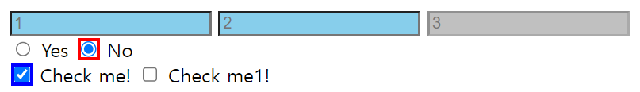

---

## 가상 요소 선택자

**index.html**

```html
<!DOCTYPE html>
<html lang="en">

<head>
  <link rel="stylesheet" href="styles/main.css">
  <title>CSS</title>
</head>

<body>
  <div class="movie">Toy Story</div>
  <div class="movie favorite">Zootopia</div>
  <div class="movie favorite">Inside Out</div>
  <div class="movie">Coco</div>
  <div class="movie">Finding Nemo</div>
</body>

</html>
```

**main.css**

```html
/* Pseudo-Element Selector (가상 요소 선택자) */

/* before */
.favorite::before {
  content: '❤';
}

/* after */
.favorite::after {
  content: '🎈';
}
```

### Pseudo-ElementSelector

- 가상 클래스 선택자(:)와 구분하기 위해 가상 요소 선택자는 **더블콜론**(**::)**을 권장한다.
- 실제로 존재하지 않는 요소에 스타일을 부여하는 것
- 가상 요소 선택자로 생성한 **content**는 꾸밈을 위한 요소, 스타일적인 요소라고 판단되기 때문에 선택되지 않는다.

### Pseudo-ElementSelector (1)

- 다음과 같은 종류가 존재한다.
    1. **before**
    2. **after**
- 요소 앞과 뒤에 스타일을 추가한다.

**결과 화면**

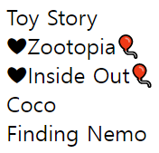

**index.html**

```html
<!DOCTYPE html>
<html lang="en">

<head>
  <link rel="stylesheet" href="styles/main.css">
  <title>CSS</title>
</head>

<body>

  <p class="lorem">Lorem, ipsum dolor sit amet consectetur adipisicing elit. At reprehenderit illo accusantium facilis
    quos quisquam
    voluptatum id magni. Corrupti at fugit beatae quasi, laborum ex quia deleniti quo vitae placeat!
  </p>
  <p class="lorem">Lorem, ipsum dolor sit amet consectetur adipisicing elit. At reprehenderit illo accusantium facilis
    quos quisquam
    voluptatum id magni. Corrupti at fugit beatae quasi, laborum ex quia deleniti quo vitae placeat!
  </p>
  <p class="lorem">Lorem, ipsum dolor sit amet consectetur adipisicing elit. At reprehenderit illo accusantium facilis
    quos quisquam
    voluptatum id magni. Corrupti at fugit beatae quasi, laborum ex quia deleniti quo vitae placeat!
  </p>

</body>

</html>
```

**main.css**

```html
/* Pseudo-Element Selector (가상 요소 선택자) */

/* first-letter */
/* 첫번째 글자에만 스타일링 */
.lorem::first-letter {
  color: red;
  font-size: 30px;
}

/* before를 적용하면 first-letter 스타일링이 content의 첫글자에 적용됨 */
.lorem::before {
  content: 'BEFORE';
}

/* first-line */
/* 첫번째 줄에 스타일링 */
.lorem::first-line {
  color: blue;
}

/* selection */
/* 선택 영역에 대한 스타일링 ex: 드래그 */
.lorem::selection {
  border-color: aqua;
  color:chartreuse;
}
```

### Pseudo-ElementSelector (1)

- 다음과 같은 종류가 존재한다.
    1. **first-letter**
    2. **first-line**
    3. **selection**
    

**결과 화면**

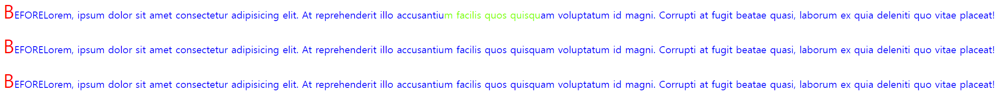

**index.html**

```html
<!DOCTYPE html>
<html lang="en">

<head>
  <link rel="stylesheet" href="styles/main.css">
  <title>CSS</title>
</head>

<body>

  <ul id="list">
    <li>리스트1</li>
    <ol>
      <li>리스트2</li>
      <li>리스트3</li>
    </ol>
    <li>리스트4</li>
  </ul>

  <ol>
    <li>리스트1</li>
    <li>리스트2</li>
    <li>리스트3</li>
  </ol>

  <h1>제목</h1>

  <div>
    <p class="red">P</p>
    <span>Span</span>
    <code>Code</code>
    <p>P2</p>
    <div class="red">Div</div>
    <div>Div</div>
    <div>Div</div>
    <div class="red">Div</div>
    <div>Div</div>
    <div class="red">Div</div>
    <p class="red">P3</p>
    <div>Div</div>
  </div>
</body>

</html>
```

**main.css**

```html
/* Selector Combinators (선택자 결합) */

/* 하위 선택자 결합 */
/* ul 태그의 하위에 존재하는 li 태그에서 스타일 적용 */
/* 자식의 자식에도 적용되는 허점이 존재한다. */
ul li:last-of-type {
  color: red;
}

/* list id에 존재하는 첫번째 li 태그에 스타일 적용 */
#list li:first-of-type {
  color: blue;
}

/* 자식 선택자 결합 */
/* 바로 밑의 자식에만 스타일 적용 */
#list > li:last-of-type {
  color: aquamarine;
}

/* 형제 선택자 결합 */
/* 1. 일반 형제 선택자 결합 */
/* code 뒤에 존재하는 p 태그만 적용 */
/* code 뒤에 위치한다면 p의 개수에 상관없이 적용됨 */
code ~ p {
  color: red;
}

/* 2. 인접 형제 선택자 결합 */
/* + 사용 */
/* 순서대로 바로 마주하고 있을 때에만 적용 */
.red + div {
  background-color: blue;
}

/* 3. 그룹화 */
/* 콤마(,)를 활용하여 동일한 코드를 적용시킬 수 있다. */
p, span, code {
  color: purple;
}
```

### Selector Combinators (선택자 결합)

1. **하위 선택자**
    
    ex) **ul li**
    
2. **자식 선택자**
    
    ex) **#list > li**
    
3. **형제 선택자**
    
    ex) **.red + div**
    
4. **그룹화**
    
    ex) **p, span, code**
    

**결과 화면**


**index.html**

```html
<!DOCTYPE html>
<html lang="en">

<head>
  <link rel="stylesheet" href="styles/main.css">
  <title>CSS</title>
</head>

<body>

  <h1>제목</h1>

  <div>
    <p class="red">P</p>
    <span class="red">Span</span>
    <code class="red">Code</code>
    <p class="red">P2</p>
    <div class="red">Div</div>
  </div>
</body>

</html>
```

**main.css**

```html
/* 범용 선택자 (Universal Selector) */
*.red {
  color: red;
}

/* div 하위에 있는 모든 자식들 적용 */
div > * {
  color: blue;
}
```

---

## Universal Selector (범용 선택자)

- *****
- 모든 요소에 적용된다.
- 사용한다면 파일의 가장 위에 사용하는 것을 권장한다.
- .red {} 라고 작성하지만 사실은 *.red {}로 *이 생략된 상태임

**결과 화면**

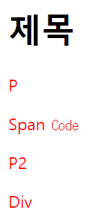

**index.html**

```html
<!DOCTYPE html>
<html lang="en">

<head>
  <link rel="stylesheet" href="styles/main.css">
  <title>CSS</title>
</head>

<body>

  <div class="parent1">
    parent
    <div class="child1">child1</div>
    <div class="child2">child2</div>
    <div class="child3">child3</div>
  </div>

  <div class="parent2">
    parent
    <div class="child1">child1</div>
    <div class="child2">child2</div>
    <div class="child3">child3</div>
  </div>

</body>

</html>
```

**main.css**

```html
/* 상속 제어하기 - initial, inherit, unset */
div {
  border: 1px solid silver;
  margin: 2px;
}

.parent1 {
  color: blue;
  font-size: 7px;
}

.child2 {
  color: red;
}

/* initial */
/* 부모에 상관없이 상속받지 않겠다. */
/* 브라우저가 설정한 초기값으로 설정된다. */
.child3 {
  color:initial;
  font-size: initial;
  all: initial; /* 모든 설정값을 기본값으로 설정 */
}

/* inherit */
/* 상속을 무조건 받아야 할 때 사용 */
.child1 {
  color: red;
}

.parent1, .parent2 {
  color: green;
}

/* 다른 곳에서 다른 스타일을 아무리 적용해봤자 적용 안됨 */
.parent2 * {
  color: inherit;
  all: inherit; /* 모든 설정값을 상속받는 것으로 설정 */
}

/* unset */
/* 1. 부모로부터 상속받을 값이 있을 때 : inherit */
/* 2. 부모로부터 상속받을 값이 없을 때 : initial */
.parent2 .child1 {
  all: unset;
}
```

---

## 상속 제어하기

- 지정된 스타일이 없다면 부모의 스타일을 상속 받는다.
- 모든 스타일이 상속되는 것은 아니다.
- 다음과 같은 종류가 존재한다.
    1. **initial**
    2. **inherit**
    3. **unset**

**initial: “부모에 상관없이 상속받지 않겠다.” 브라우저가 설정한 초기값으로 설정된다.**

**inherit: “상속을 무조건 받겠다.” 부모 스타일을 상속 받는다.**

**unset: 부모로부터 상속받을 값이 있을 때 → inherit, 부모로부터 상속받을 값이 없을 때 → initial**

**결과 화면**

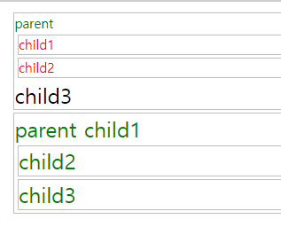

---

## 스타일 우선순위

- 동일한 스타일이라도 **선언된 곳**에 따라 우선순위가 정해진다.
    - 브라우저에 의해 정의되니 스타일 < 개발자가 선언한 스타일 < 사용자가 구성한 스타일
- 적용 범위가 **적을수록** 우선시 된다.
    - **tag** 스타일 < **class** 스타일 < **id** 스타일 < 인라인 스타일
- 소스코드의 순서가 **뒤**에 있으면 덮어쓴다.

**순서로 따지면 다음과 같다.**

**!important** > **inline style** > **ID** > **Class**/**Attribute**/**Pseudo Class** > **Type (tag)** > * > **inherited**