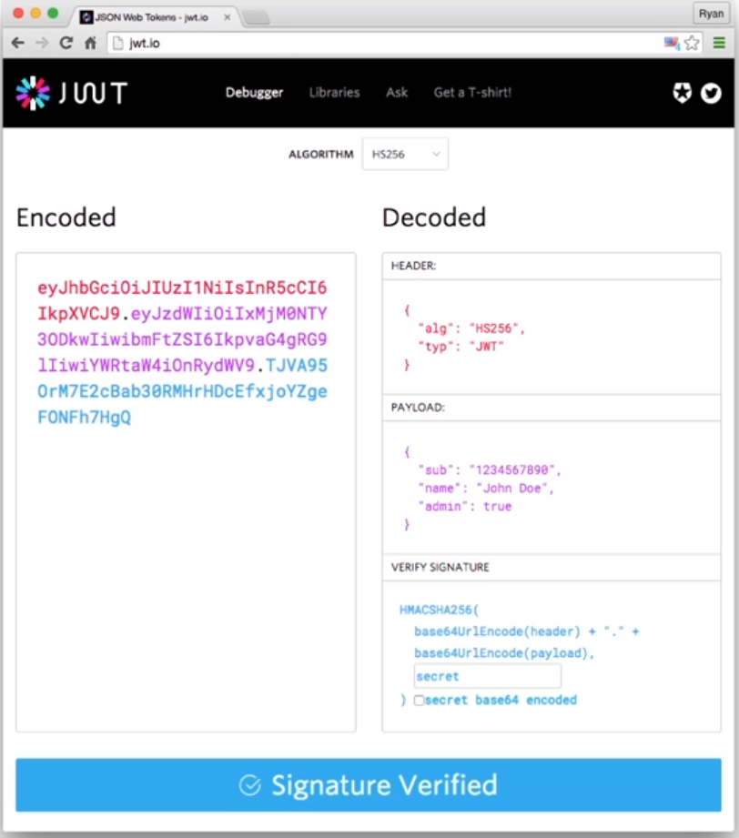
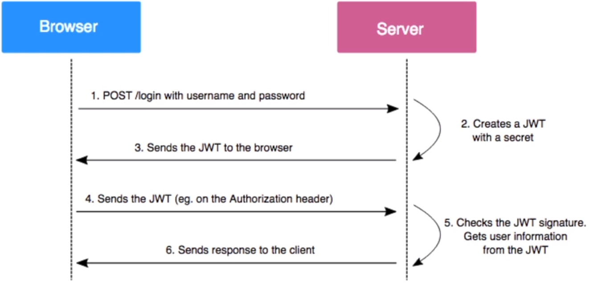
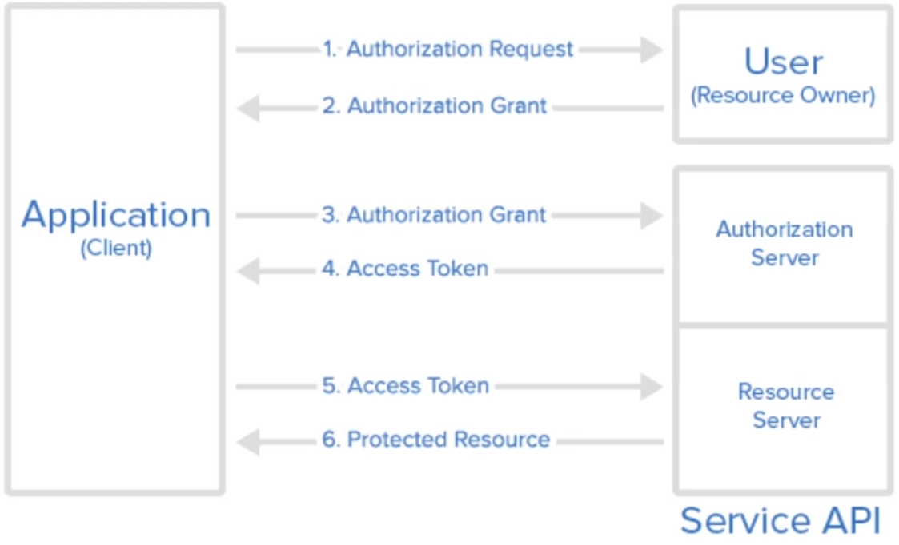
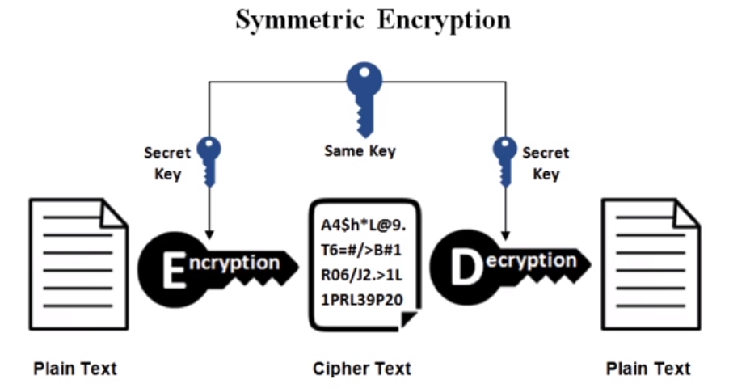
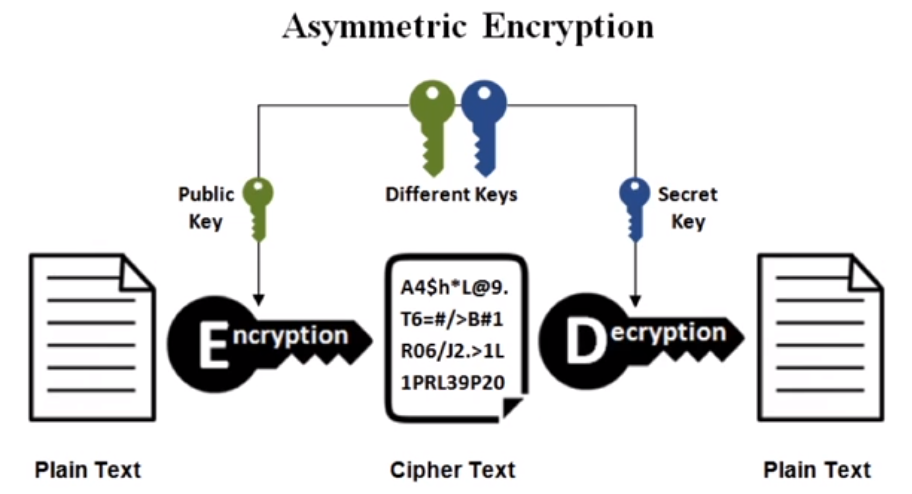
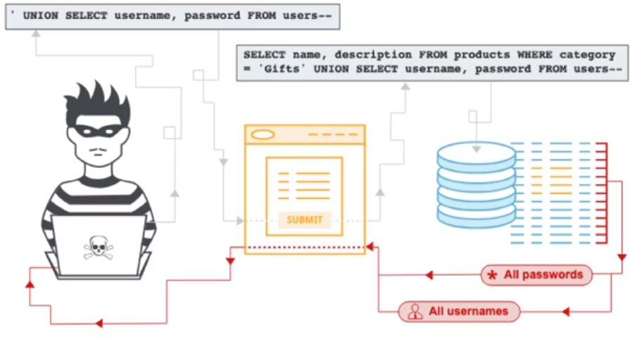
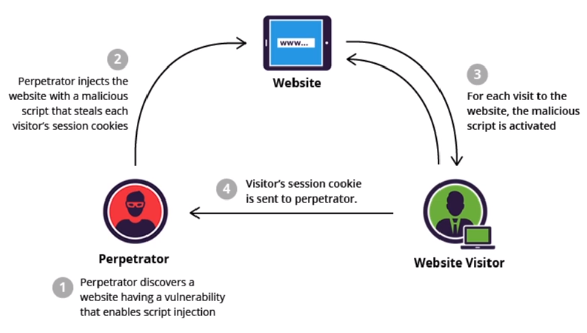
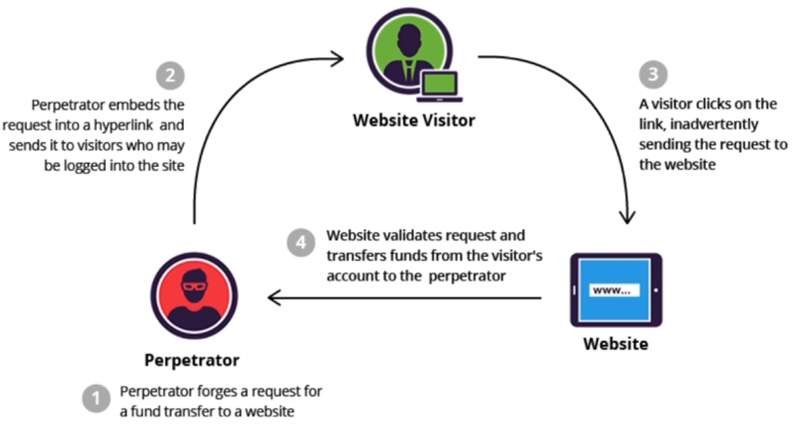
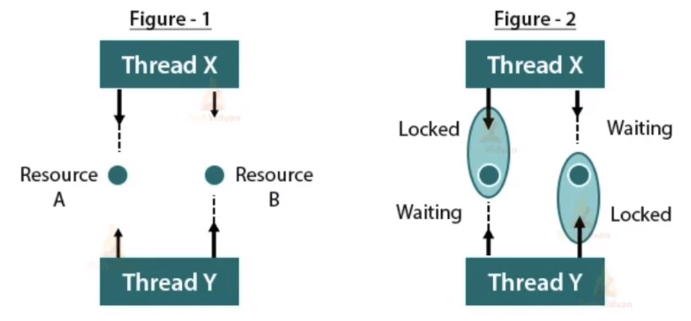

# [CS] 보안 & DB

## 1. JWT란

**JWT(Json Web Token)**

- 웹 유저의 인증을 위해 사용하는 암호화된 토큰
- **JWT**에는 **header**, **payload**, **signature**의 3가지 정보가 담겨있다.

1. 유저가 로그인 하는 경우 서버에서 유저 정보를 기반으로 토큰을 발급
2. 유저는 **JWT** 정보를 서버에 리퀘스트 날릴 때마다 함께 전송
3. 서버는 해당 **JWT** 토큰이 유효한지를 검증 후 응답

---

## 2. OAuth란?

### **OAuth**

- 인증(**Authentication**)과 권한(**Authorization**)을 획득하는 과정

### **언제/왜 사용하는가?**

- 유저들 입장에서는 다양한 서비스에 본인의 **ID**/**PW**를 노출시키는 것이 부담스러움
- 개발자 입장에서는 네이버/카카오 로그인을 손쉽게 사용할 수 있음.
    
    즉, 유저가 우리 서비스에 **ID**/**PW**를 노출시키지 않아도 네이버/카카오에 있는 고객 정보를 사용할 수 있음.
    

### **Abstract Protocol Flow**

### **OAuth**의 인증 종류

- **Authorization Code Grant**
- **Implicit Grant**
- **Resource Owner Password Credentials Grant**
- **Client Credentials Grant**

### **Token**

- **Access Token**
    
    인증을 마친 유저에게 발급되는 토큰
    
- **Refresh Token**
    
    **Access Token**의 유효기간이 만료되면 **Refresh Token**을 이용해 **Access Token**을 재발급 받을 수 있음.
    

---

## 3. 대칭키와 비대칭키 암호화 차이점

### 대칭키 (Symmetric Encryption)

- 암호화-복호화에 사용하는 키가 동일
- 키값을 알고 있는 사람만이 문서를 복호화할 수 있음.
- 공개키 방식에 비해 속도가 빠르다는 장점이 있지만, 키 교환 과정 중에 키가 탈취될 수도 있고, 키 사용 유저가 증가할수록 관리 포인트가 늘어남.

### 공개키 (Aynmmetric Encryption) 또는 비대칭키

- 암호화-복호화에 사용하는 키가 서로 다름
- 공개키와 개인키가 존재하며, 공개키는 모든 사람이 접근 가능하고 개인키는 각 사용자만이 갖고 있는 키
- 공개키가 탈취되어도 개인키를 갖고 있는 수신자만 복호화가 가능하다는 장점, 반면에 속도가 느림

---

## 4. SQL Injection이란?

### SQL Injection

- 가장 흔하게 발생하는 공격기법 중 하나
- 말 그대로 **SQL** + **Injection** ⇒ **SQL문**을 이용해 서버에 공격문을 주입하는 것
- 만약 **SQL Injection** 취약점이 존재한다면 웹서버의 정보를 모두 탈취해 갈 수도 있을 정도로 위협적임.

1. https://insecure-website.com/products?category=Gifts’--
    
    SELECT * FROM products WHERE category = ‘Gifts’--’ AND released = 1
    
    - ‘**--**’를 붙임으로서 **release** 되지 않은 상품까지 노출이 되게 만들 수 있음.
2. https://insecure-website.com/products?category=Gifts’+OR 1=1--’AND released = 1
    - ‘OR 1=1’은 항상 참이기 때문에 **where** 절을 무력화시켜서 모든 상품이 노출되게 만들 수 있음.

**위와 같은 방식으로 유저 정보도 탈취 시도해볼 수 있음.**

---

## 5. CSRF와 XSS란? 차이점은?

### XSS (Cross-Site Scripting)

- 사이트에 스크립트를 넣는 방법
- 웹 애플리케이션이 사용자로부터 받은 값을 제대로 검사하지 않는 경우 주로 나타남. 공격에 성공하면 해당 사이트에 접속한 사용자는 악의적으로 삽입된 코드를 실행하게 됨.
- 주로 쿠키나 세션, 토큰 등의 데이터를 탈취해감.

### CSRF (Cross-Site Request Forgery)

- 유저가 자신의 의지와 무관하게 공격자가 의도한 행위(수정, 삭제, 등록)를 특정 사이트에 요청하게 하는 공격
- 로그인된 유저가 특정 링크를 클릭했을 때, 유저의 권한을 도용해서 가짜 요청을 서버에 전송하는 것

### XSS와 CSRF의 차이점

- **XSS**는 스크립트가 실행되는 곳(유저의 브라우저)에서 탈취가 일어나고, **CSRF**는 서버에서 실행된다는 점
- **XSS**는 인증된 세션이 없어도 공격을 할 수 있고, **CSRF**는 인증된 세션을 이용하여 공격한다는 점

---

## 6. 트랜잭션의 ACID란?

### ACID

- 트랜잭션이 안전하게 수행된다는 것을 보장하기 위한 성질을 가리키는 약어

### 원자성 (Atomicity)

- 트랜잭션과 관련된 작업들이 부분적으로 실행되다가 중단되지 않는 것을 보장하는 능력
- 은행 송금 기능의 경우 이체가 실패하면 입금도 처리가 되지 않아야 하는데, 입금이 성공해서는 안된다는 것

### 일관성 (Consistency)

- 트랜잭션이 성공적으로 완료되면 일관성 있는 데이터베이스 상태를 유지하는 것.
- 위에서의 일관성이란 예를 들어 데이터의 타입이 변경된다던지 하는 등의 경우를 말함.

### 고립성 (Isolation)

- 트랜잭션을 수행하는 도중에 다른 연산작업이 끼어들지 못하도록 하는 것

### 지속성 (Durability)

- 성공적으로 트랜잭션이 수행되었다면 그 결과는 영원히 반영되어야 함을 의미

---

## 7. 데드락이란?

### 데드락 (Deadlock)

- 프로세스가 자원을 얻지 못해 다음 처리를 하지 못하는 상태를 데드락이라고 부른다.

데드락은 아래의 4가지 조건이 성립할 때 발생한다.

1. **상호 배제 (Mutual Exclusion)**
    - 자원은 한 번에 한 프로세스만
2. **점유 대기 (Hold and Wait)**
    - 최소한 하나의 자원을 점유하고 있으면서 다른 프로세스에 할당되어 있는 자원을 추가로 점유하기 위해 대기하는 프로세스가 있어야 함.
3. **비선점 (No Preemtion)**
    - 다른 프로세스에 할당된 자원은 사용이 끝날 때까지 강제로 빼앗을 수 없어야 함
4. **순환 대기 (Circular wait)**
    - 프로세스의 집합(P0, P1, ~, PN)에서 P0이 P1이 점유한 자원을 대기하고 P1은 P2가 점유한 자원을 대기하고 .. PN-1은 PN이 점유한 자원을 대기하고 PN은 P0이 점유한 자원을 요규해야 한다.
    - 프로세스의 집합에서 순환 형태로 자원을 대기하고 있어야 함.

### 데드락 해결 방법

1. **예방**
- 데드락 발생 조건 4가지 중 하나를 무력화시킨다.
1. **회피**
- 미리 할당되는 자원의 수를 조절하여 교착 상태를 회피
1. **탐지**
- 운영체제의 프로세스를 관찰하면서 교착 상태를 탐지하는 것
1. **회복**
- 교착 상태를 유발한 프로세스를 강제 종료