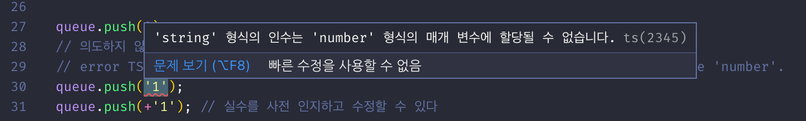

# [TS] 제네릭

**Java**나 **C#** 같은 정적 타입 언어의 경우, 함수 또는 클래스를 정의하는 시점에 매개변수나 반환값의 타입을 선언해야 한다. 

**TypeScript** 또한 정적 타입 언어이기 때문에 함수 또는 클래스를 정의하는 시점에 매개변수나 반환값의 타입을 선언하여야 한다. 그런데 함수 또는 클래스를 정의하는 시점에 매개변수나 반환값의 타입을 선언하기 어려운 경우가 있다.

아래의 예제는 **FIFO**(**First In First Out**) 구조로 데이터를 저장하는 큐를 표현한 것이다.

```tsx
class Queue {
	protected data: any[] = [];

	push(item: any) {
		this.data.push(item);
	}

	pop() {
		return this.data.shift();
	}
}

const queue = new Queue();

queue.push(0);
queue.push('1'); // 의도치 않은 실수!

console.log(queue.pop().toFixed()); // 0
console.log(queue.pop().toFixed()); // Runtime error
```

**Queue** 클래스의 **data** 프로퍼티는 **any**[] 타입이다. **any**[] 타입은 어떤 타입의 요소도 가질 수 있는 배열을 의미하다.

**any**[] 타입은 배열 요소의 타입이 모두 같지 않다는 문제를 가지게 된다. 위 예제의 경우 **data** 프로퍼티는 **number** 타입만을 포함하는 배열이라는 기대 하에 각 요소에 대해 **Number.prototype.toFixed**를 사용하였다. 따라서 **number 타입이 아닌 요소의 경우 런타임 에러가 발생한다.**

위와 같은 문제를 해결하기 위해 **Queue** 클래스를 상속하여 **number** 타입 전용 **NumberQueue** 클래스를 정의할 수 있다.

```tsx
class Queue {
	protected data: any[] = [];

	push(item: any) {
		this.data.push(item);
	}

	pop() {
		return this.data.shift();
	}
}

// Queue 클래스를 상속하여 number 타입 전용 NumberQueue 클래스를 정의
class NumberQueue extends Queue {
	// number 타입의 요소만을 push한다.
	push(item: number) {
		super.push(item);
	}

	pop(): number {
		return super.pop();
	}
}

const queue = new NumberQueue();

queue.push(0);
// 의도하지 않은 실수를 사전 검출 가능
// error TS2345: Argument of type 'string' is not assignable to parameter of type 'number'.
// queue.push('1');
queue.push(+'1'); // 실수를 사전 인지하고 수정할 수 있다

console.log(queue.pop().toFixed()); // 0
console.log(queue.pop().toFixed()); // 1
```

이와 같이 **number** 타입 전용 **NumberQueue** 클래스를 정의하면 **number** 타입 이외의 요소 추가(**push**)되었을 때, 아래와 같이 런타임 이전에 에러를 사전 감지할 수 있다.



하지만, 다양한 타입을 지원해야 한다면 타입 별로 클래스를 상속받아 추가해야 하므로 이 또한 좋은 방법은 아니다. **제네릭**을 사용하여 이 문제를 해결하여 보자.

```tsx
class Queue<T> {
	protected data: Array<T> = [];
	push(item: T) {
		this.data.push(item);
	}
	pop(): T | undefined {
		return this.data.shift();
	}
}

// number 전용 Queue
const numberQueue = new Queue<number>();

numberQueue.push(0);
// numberQueue.push('1'); // 의도하지 않은 실수를 사전 검출 가능
numberQueue.push(+'1'); // 실수를 사전 인지하고 수정할 수 있다

// ?. => optional chaining
// https://www.typescriptlang.org/docs/handbook/release-notes/typescript-3-7.html#optional-chaining
console.log(numberQueue.pop()?.toFixed()); // 0
console.log(numberQueue.pop()?.toFixed()); // 1
console.log(numberQueue.pop()?.toFixed()); // undefined

// string 전용 Queue
const stringQueue = new Queue<string>();

stringQueue.push('Hello');
stringQueue.push('World');

console.log(stringQueue.pop()?.toUpperCase()); // HELLO
console.log(stringQueue.pop()?.toUpperCase()); // WORLD
console.log(stringQueue.pop()?.toUpperCase()); // undefined

// 커스텀 객체 전용 Queue
const myQueue = new Queue<{name: string, age: number}>();
myQueue.push({name: 'Lee', age: 10});
myQueue.push({name: 'Kim', age: 20});

console.log(myQueue.pop()); // { name: 'Lee', age: 10 }
console.log(myQueue.pop()); // { name: 'Kim', age: 20 }
console.log(myQueue.pop()); // undefined
```

**제네릭은 선언 시점이 아니라 생성 시점에 타입을 명시하여 하나의 타입만이 아닌 다양한 타입을 사용할 수 있도록 하는 기법이다.** **대규모 소프트웨어를 구축할 수 있는 가장 유연한 기능을 제공한다. 한번의 선언으로 다양한 타입에 재사용이 가능하다는 장점이 있다.**

형식은 다음과 같다.

```tsx
function 함수명<타입 변수 지정>(msg: 타입 인자): 타입 반환 {}
```

**T**는 제네릭을 선언할 때 관용적으로 사용되는 식별자로 **타입 파라미터**(**Type parameter**)라 한다. T는 Type의 약자로 반드시 T를 사용하여야 하는 것은 아니다.

또한 **함수에도 제네릭을 사용할 수 있다**. 제네릭을 사용하면 하나의 타입만이 아닌 다양한 타입의 매개변수와 리턴값을 사용할 수 있다. 아래 예제를 보자.

```tsx
function rerverse<T>(items: T[]): T[] {
	return items.reverse();
}
```

**reverse** 함수는 **인수의 타입에 의해 타입 매개변수가 결정된다**. **Reverse** 함수는 다양한 타입의 요소로 구성된 배열을 인자로 전달받는다. 예를 들어 number 타입의 요소를 갖는 배열을 전달받으면 타입 매개변수는 **number**가 된다.

```tsx
function reverse<T>(items: T[]): T[] {
	return items.reverse();
}

const arg = [1, 2, 3, 4, 5];
// 인수에 의해 타입 매개변수가 결정된다.
const reversed = reverse(arg);
console.log(reverse); // [ 5, 4, 3, 2, 1 ]
```

만약 {name:string} 타입의 요소를 갖는 배열을 전달받으면 타입 매개변수는 {name:strting}가 된다.

```tsx
function reverse<T>(items: T[]) {
	return items.reverse();
}

const arg = [{ name: 'Lee' }, { name: 'Kim' }];
// 인수에 의해 타입 매개변수가 결정된다.
const reversed = reverse(arg);
console.log(reversed); // [ { name: 'Kim' }, { name: 'Lee' } ]
```

---

### 참고

- [https://poiemaweb.com/typescript-generic](https://poiemaweb.com/typescript-generic)