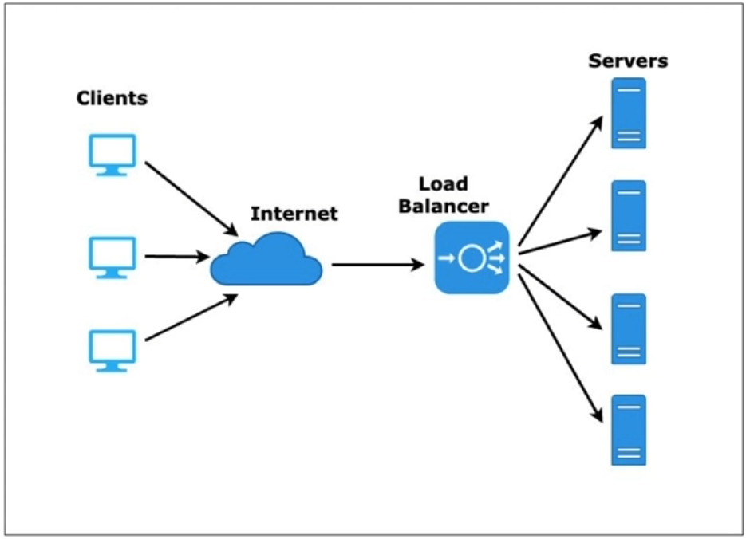
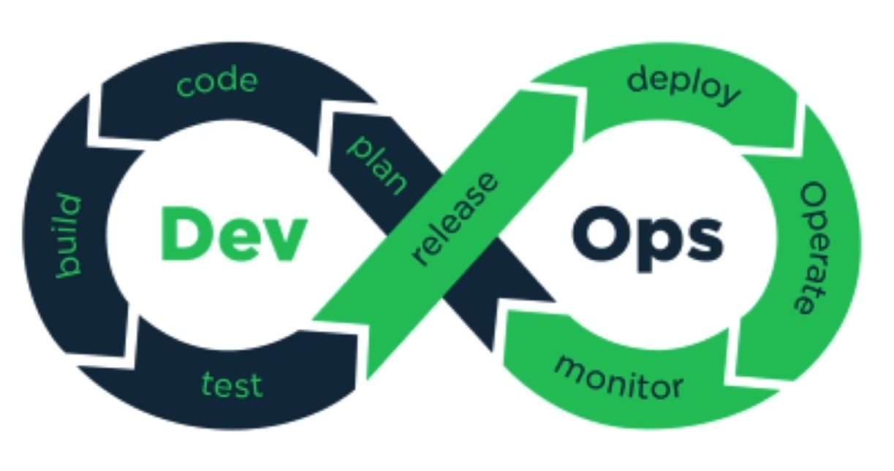

# [CS] 인프라

## 1. 도커란?

### 도커 (Docker)

- **컨테이너 기반의 오픈소스 가상화 플랫폼**
- **다양한 서버 환경에서도 동일한 환경을 구축할 수 있게 도와준다.**
- Docker 컨테이너는 독립적이기 때문에 하나의 서버에서 수 많은 컨테이너를 가질 수 있다.
- 기존 환경을 그대로 가져올 수 있기 때문에 새로운 서비스를 만들 때마다 새로운 서버의 환경 설정 문제를 줄일 수 있다.
- 원하는 개발 환경을 세팅해두고 도커 파일에 저장을 하면 도커는 어떤 환경에서든 똑같은 환경을 시뮬레이션 할 수 있다.

---

## 2. 쿠버네티스란?

### 쿠버네티스 (Kubernetes)

- **컨테이너 관리 툴. 즉, 실행되고 있는 여러 개의 도커의 관리를 도와주는 툴.**
- 수십 개의 컨테이너가 운영되고 있을 때, 특정 컨테이너가 장애 발생으로 죽게 되면 쿠버네티스가 이를 모니터링하고 다시 재시작할 수 있도록 도울 수 있다.
- 갑작스럽게 유저가 몰렸을 경우 쿠버네티스가 컨테이너의 개수를 늘려주기도 하고 트래픽이 줄어들었을 경우 개수를 다시 줄이기도 한다.
- 컨테이너를 업데이트해야 하는 경우 쿠버네티스가 없으면 컨테이너를 종료 후 다시 켜는 과정에서 웹 사이트가 잠시 죽는 경우가 발생할 수 있다. 하지만, 쿠버네티스는 위와 같은 문제를 해결해준다.

---

## 3. 로드밸런서란?

### 로드밸런서 (Load Balancer)

- **서버에 가해지는 부하(load)를 분산(balancing)해주는 장치 또는 기술**
- 보통은 서버에 가해지는 부하가 커지면 선택하는 방법이
  
    1. **Scale-up** 방식
        
        기존 서버의 하드웨어 성능을 업그레이드
        
    2. **Scale-out**
        
        한 대의 서버가 아닌 여러 대의 서버로 트래픽을 분산시켜주는 방식
        
        이 때, 이 트래픽을 분산시켜주는 역할을 하는 것이 로드밸런스이다.
        

### 로드밸런서 (Load Balancer) 종류

1. **L2**
    
    맥 주소를 바탕으로 로드밸런싱
    
2. **L3**
    
    IP 주소를 바탕으로 로드밸런싱
    
3. **L4**
    
    전송 계층에서 로드밸런싱 / 로드밸런서로 요청이 들어오면 최적의 서버로 요청을 전송
    
4. **L7**
    
    응용 계층에서 로드밸런싱 / L7 위에서 동작하기 때문에 IP, Port, URI, Payload, Http Header, Cookie 등의 데이터 기준으로 서버로 요청을 전송
    

**L4**는 단순 부하 분산이라면 **L7**은 세부적 요청 사항을 기반 (채팅서버, 결제서버 등) 으로 각각의 서버에 분산을 할 수 있다.

---

## 4. 데브옵스란?

### 데브옵스 (DevOps)

- **개발(development)과 운영(Operations)이 합쳐진 단어**
- 애플리케이션의 개발 속도를 높이고, 배포 주기를 단축시킬 수 있도록 장려하는 철학이자 프레임워크
- 문화로서는 기존에 개발팀에서 개발이 끝나면 운영팀으로 결과물을 넘기고 운영팀에서는 결과물을 체크하는 과정이었다면, 개발팀과 운영팀을 하나의 원팀으로 운영하고자 하는 것
- 기술로서는 배포자동화와 같은 기술을 사용해 빠른 배포를 돕는 것

---

## 5. CI/CD란?

**CI(Continuous Integration) CD(Continuous Delivery)**

### CI

- 빌드/테스트 자동화
- 배포 이전까지의 형상관리툴(git, svn 등)에 빌드나 테스트, 병합 등으로 최종 릴리즈까지 통합하는 것을 자동화

### CD

- 배포 자동화
- **CI**를 통해 릴리즈된 최종 결과물을 유저에게 전달(배포)하는 것을 자동화

**대표적으로는 Jenkins, GitLabCI, CircleCI, TravisCI 등이 있다.**