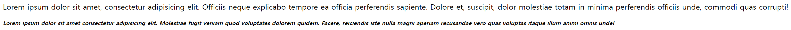
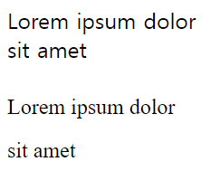
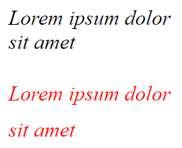
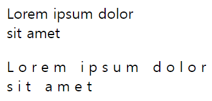
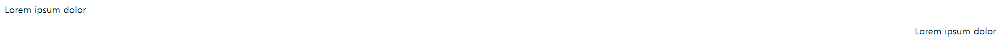
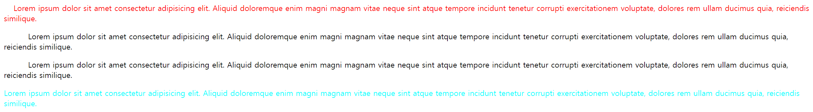
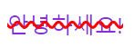
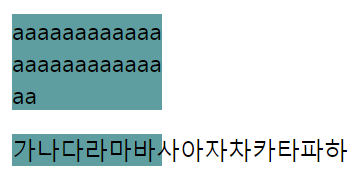

# [CSS] 폰트 관련 속성

## 폰트/텍스트 관련 속성

**index.html**

```html
<!DOCTYPE html>
<html lang="en">

<head>
  <link rel="stylesheet" href="styles/main.css">
  <title>CSS</title>
</head>

<body>

  <div>
    <p class="default">
      Lorem ipsum dolor sit amet, consectetur adipisicing elit. Officiis neque explicabo tempore ea officia perferendis
      sapiente. Dolore et, suscipit, dolor molestiae totam in minima perferendis officiis unde, commodi quas corrupti!
    </p>
    <p class="text">
      Lorem ipsum dolor sit amet consectetur adipisicing elit. Molestiae fugit veniam quod voluptates dolorem quidem.
      Facere, reiciendis iste nulla magni aperiam recusandae vero quas voluptas itaque illum animi omnis unde!
    </p>
  </div>

</body>

</html>
```

**main.css**

```html
/* 폰트/텍스트 관련 속성 */
/* font-size, font-style, font-weight */

.text {
  /* font-size */
  font-size: 12px;

  /* font-style */
  font-style: italic;

  /* font-weight */
  font-weight: bold;
}
```

**font-size**

- 폰트 크기 조절, 16px가 기본 설정

**font-style**

- **normal**이 기본 설정
- **italic**: 기울어짐 **oblique**: 기울어짐
- 상태에 따라 **italic**이 더 필기체처럼 느껴지는 경우가 있음.

**font-weight**

- 폰트 굵기 설정
- 400, **normal**이 기본 설정
- 키워드 혹은 숫자로 설정할 수 있는데 숫자의 경우 100 단위로 많이 사용한다.
- **b** 태그로 폰트를 굵게 하는 것과 **bold**(700) 속성을 줌으로서 폰트를 굵게 하는 것은 엄연히 다르다.
- 폰트에 따라 지원하는 굵기가 다르다.

**결과 화면**



---

## font-family

**index.html**

```html
<!DOCTYPE html>
<html lang="en">

<head>
  <link rel="stylesheet" href="styles/main.css">
  <title>CSS</title>
</head>

<body>

  <div>
    <p class="default">
      Lorem ipsum dolor<br>
      sit amet
    </p>
    <p class="text">
      Lorem ipsum dolor<br>
      sit amet
    </p>
  </div>

</body>

</html>
```

**main.css**

```html
/* 폰트/텍스트 관련 속성 */
/* font-family, line-height */

.text {
  /* font-family */
  font-family: 'Times New Roman', Times, serif;

  /* line-height */
  line-height: 2.0;
}
```

**font-family**

- 지정한 글꼴로 변경한다.
- pc 환경에 따라 기본 글꼴이 다르다.
- 콤마를 통해 여러 글꼴을 입력 받는데 입력순으로 글꼴이 적용된다. (이전 글꼴이 없으면 다음 글꼴 적용)
- 폰트 이름이 여러 글자로 구성되어 있다면 콤마('')로 감싼다.

**line-height**

- 폰트 위아래 여백 설정
- 폰트에 따라 여백이 다르다. 그러므로 공통으로 여백이 다르면 폰트에 따른 여백 차이로 인해 중구난방이 될 수 있다.

**결과 화면**



---

## font

**index.html**

```html
<!DOCTYPE html>
<html lang="en">

<head>
  <link rel="stylesheet" href="styles/main.css">
  <title>CSS</title>
</head>

<body>

  <div>
    <p class="default">
      Lorem ipsum dolor<br>
      sit amet
    </p>
    <p class="text">
      Lorem ipsum dolor<br>
      sit amet
    </p>
  </div>

</body>

</html>
```

**main.css**

```html
/* 폰트/텍스트 관련 속성 */
/* font */

.default {
  font-size: 20px;
  font-family: 'Times New Roman', Times, serif;
  font-weight: 100;
  font-style: italic;
}

.text {
  color: red;
  /* default의 코드와 동일하다. */
  font: italic 100 20px/1.7 'Times New Roman', Times, serif;
}
```

**font**

- font 관련 속성을 한 줄로 나열하여 표현할 수 있다.
- **필수**: font-size, font-family, **선택**: font-style, font-variant, font-weight, line-height
- 선택으로 넣을 수 있는 요소는 font-size보다 앞에 위치해야 한다.
- style과 weight는 size 앞에 / 뒤에는 line-height

**결과 화면**



---

## letter-spacing, word-spacing

**index.html**

```html
<!DOCTYPE html>
<html lang="en">

<head>
  <link rel="stylesheet" href="styles/main.css">
  <title>CSS</title>
</head>

<body>

  <div>
    <p class="default">
      Lorem ipsum dolor<br>
      sit amet
    </p>
    <p class="text">
      Lorem ipsum dolor<br>
      sit amet
    </p>
  </div>

</body>

</html>
```

**main.css**

```html
/* 폰트/텍스트 관련 속성 */
/* letter-spacing, word-spacing */

.text {
  /* letter-spacing */
  letter-spacing: 5px;

  /* word-spacing */
  word-spacing: 50%;
}
```

**letter-spacing**

- 글자간 간격
- normal이 default
- 음수도 입력 가능하다.
- font-size처럼 px뿐만 아니라 rem, em도 사용 가능하다.

**word-spacing**

- 단어간 간격
- letter-spacing과 유사한데 단위로 %를 사용할 수 있다.
- 100%가 default

**결과 화면**



---

## text-align

**index.html**

```html
<!DOCTYPE html>
<html lang="en">

<head>
  <link rel="stylesheet" href="styles/main.css">
  <title>CSS</title>
</head>

<body>

  <div>
    <div class="default">
      Lorem ipsum dolor
    </div>
    <p class="text">
      Lorem ipsum dolor
    </p>
  </div>

</body>

</html>
```

**main.css**

```html
/* 폰트/텍스트 관련 속성 */
/* text-align */

.text {
  text-align: right;
}
```

**text-align**

- 정렬
- left, center, right 속성을 자주 준다.
- **text-align**이 적용이 안되는 경우?
    
    → **인라인 속성**이라서 그런 경우가 많다.
    

**결과 화면**



---

## text-indent

**index.html**

```html
<!DOCTYPE html>
<html lang="en">

<head>
  <link rel="stylesheet" href="styles/main.css">
  <title>CSS</title>
</head>

<body>

  <div class="container">
    <p class="paragraph1">
      Lorem ipsum dolor sit amet consectetur adipisicing elit. Aliquid doloremque enim magni magnam vitae neque sint
      atque tempore incidunt tenetur corrupti exercitationem voluptate, dolores rem ullam ducimus quia, reiciendis
      similique.
    </p>
    <p class="paragraph2">
      Lorem ipsum dolor sit amet consectetur adipisicing elit. Aliquid doloremque enim magni magnam vitae neque sint
      atque tempore incidunt tenetur corrupti exercitationem voluptate, dolores rem ullam ducimus quia, reiciendis
      similique.
    </p>
    <p class="paragraph3">
      Lorem ipsum dolor sit amet consectetur adipisicing elit. Aliquid doloremque enim magni magnam vitae neque sint
      atque tempore incidunt tenetur corrupti exercitationem voluptate, dolores rem ullam ducimus quia, reiciendis
      similique.
    </p>
    <span class="inline">
      Lorem ipsum dolor sit amet consectetur adipisicing elit. Aliquid doloremque enim magni magnam vitae neque sint
      atque tempore incidunt tenetur corrupti exercitationem voluptate, dolores rem ullam ducimus quia, reiciendis
      similique.
    </span>
  </div>

</body>

</html>
```

**main.css**

```html
/* 폰트/텍스트 관련 속성 */
/* text-indent */

.paragraph1 {
  color: red;
  text-indent: 20px;
}

.container {
  text-indent: 50px;
}

/* 적용 안됨 */
.inline {
  color:aqua;
  text-indent: 30px;
}
```

**text-indent**

- 들여쓰기
- 0이 default
- %나 em등의 단위를 사용할 수 있다.
- inherited: yes. 즉, 상속이 된다.
- block 요소에만 적용된다. 즉, 인라인 요소에는 적용되지 않는다.

**결과 화면**



---

## text-decoration

**index.html**

```html
<!DOCTYPE html>
<html lang="en">

<head>
  <link rel="stylesheet" href="styles/main.css">
  <title>CSS</title>
</head>

<body>

  <div class="container">
    <span>
      안녕하세요!
    </span>
  </div>

</body>

</html>
```

**main.css**

```html
/* 폰트/텍스트 관련 속성 */
/* text-decoration */

span {
  color: blueviolet;
  text-decoration: line-through red 2px wavy;
}
```

**text-decoration**

- 필수: text-decoration-line, 선택: text-decoration-color, text-decoration-style, text-decoration-thickness 4가지의 프로퍼티를 한 가지로 합친 형태
- color를 주면 선 색도 변한다.
    
    따로 색 설정도 가능하다.
    
- **text-decoration-line**
    - none: 없음, underline: 밑줄, overline: 윗줄, line-through: 취소선
    - 한 속성만 선택하는 것이 아니라 여러 속성도 선택 가능하다.
- **text-decoration-style**
    - solid: 한 줄, double: 두 줄, dotted: 점선, dashed: 좀 더 긴 형태의 점선, wavy: 물결
    - solid가 default

**결과 화면**



---

## word-break

**index.html**

```html
<!DOCTYPE html>
<html lang="en">

<head>
  <link rel="stylesheet" href="styles/main.css">
  <title>CSS</title>
</head>

<body>

  <div class="container">
    <p lang="en">
      aaaaaaaaaaaaaaaaaaaaaaaaaa
    </p>
    <p lang="ko">
      가나다라마바사아자차카타파하
    </p>
  </div>

</body>

</html>
```

**main.css**

```html
/* 폰트/텍스트 관련 속성 */
/* word-break */

p {
  width: 100px;
  background-color: cadetblue;
}

/* 넘치는 애들이 끊겨서 아래로 내려간다. */
p[lang="en"] {
  word-break: break-all;
}

/* 끊겼던 애들이 내려가지 않고 넘친다. */
p[lang="ko"] {
  word-break: keep-all;
}
```

**word-break**

- 언어에 따라 다르게 작동한다
- 기본값은 normal, 이외에도 break-all, keep-all이 존재한다.
- **break-all**
    - 한중일 텍스트 제외
    - 주어진 너비를 넘어갔던 요소들을 내린다.
- **keep-all**
    - only 한중일 텍스트
    - 주어진 너비를 넘어가면 내려갔던 요소들을 내리지 않고 넘어가게 둔다.

**결과 화면**



---

## text-transform

**index.html**

```html
<!DOCTYPE html>
<html lang="en">

<head>
  <link rel="stylesheet" href="styles/main.css">
  <title>CSS</title>
</head>

<body>

  <div class="container">
    <p>
      Lorem ipsum dolor sit amet consectetur adipisicing elit. Porro maiores eos accusantium inventore nobis voluptas
      itaque, voluptatem ipsum quae perspiciatis tenetur blanditiis, laboriosam, officiis nihil aspernatur assumenda
      corrupti cumque libero.
    </p>
    <p>
      Lorem ipsum dolor sit amet consectetur adipisicing elit. Porro maiores eos accusantium inventore nobis voluptas
      itaque, voluptatem ipsum quae perspiciatis tenetur blanditiis, laboriosam, officiis nihil aspernatur assumenda
      corrupti cumque libero.
    </p>
  </div>

</body>

</html>
```

**main.css**

```html
/* 폰트/텍스트 관련 속성 */
/* text-transform */

.container p:last-of-type {
  color: blue;
  text-transform: uppercase;
}
```

**text-transform**

- 사용할 수 있는 언어가 한정되어 있어 한글에는 적용 불가. 일본어는 가능.
- capitalize, uppercase, lowercase 속성을 많이 사용한다.
- **none**
    - default
- **capitalize**
    - 모든 단어의 첫 글자만 대문자로 바꾼다.
- **uppercase**
    - 모든 텍스트를 대문자로 바꾼다.
- **lowercase**
    - 모든 텍스트를 소문자로 바꾼다.
- 개발자 도구를 통해 보면 속성이 적용되지 않은 원문을 볼 수 있다.
    
    즉, 사용자에게만 스타일을 적용하여 보여준다.
    

**결과 화면**

