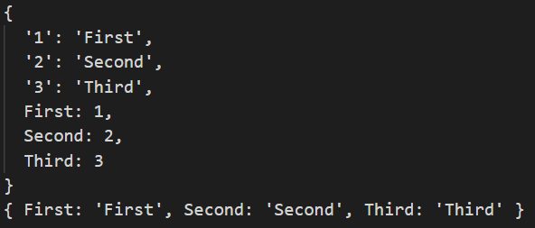
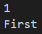

# [TS] 열거형

## 열거형 소개

> Code Snippet
> 
- 의미있는 상수 자료를 정의할 수 있다. (문서화)
- 키를 값에 할당하며 순서가 없는 집합이자 자료구조이다.
- **enum**  키워드 +  **PascalCase**  조합으로 생성
- 계산된 값을 사용할 수 있다.
    - 타입스크립트가 알아서 추론

## 숫자형 열거

```tsx
/**
 * 숫자 열거형 (Enum)
 */

enum Prize {
  Gold = 100,
  Silver, // 101 자동할당
  Bronze  // 102 자동할당 => 숫자 열거형
}

interface Inter {
  name: 'name'
}

// console.log(Inter.name) // 출력 불가능. 인터페이스의 경우 자바스크립트에서 값으로 취급되지 않기 때문.

// 열거형의 경우 다양한 방식으로 활용 가능
console.log(Prize);
console.log(Prize.Gold)
console.log(Prize['Gold'])

// 1씩 규칙적으로 증가하는 요소라면 굳이 일일이 지정하지 않아도 된다.
enum Order {
  First = 1,
  Second,
  Third
}
```

## 문자열 열거

- 각 멤버의 값을 문자열로 초기화되어야 한다.
- 숫자형 열거와 동작 방식이 다르다.
    - 값이 자동으로 증가하지 않는다. → 직접 전부 할당해주어야 한다.
    - 이외에 리버스 매핑의 차이점도 존재

```tsx
/**
 * 문자 열거형 (Enum)
 */

// 값 지정하지 않으면 error 발생
enum Prize {
  Gold = 'Gold',
  Silver = 'Silver',
  Bronze = 'Bronze'
}

// 값으로 사용 가능
console.log(Prize)
console.log(Prize.Gold)
console.log(Prize['Bronze'])
```

## 혼합형 열거

- 다양한 타입이 들어올 수 있고, 전부 값을 지정해주어야 한다.
- 사용할 수는 있지만, 가급적 사용을 지양하자.

```tsx
/**
 * Heterogeneous 열거형 (혼합)
 */

// 다양한 타입이 들어올 수 있다.
enum Dummy {
  Gold = 0,
  Silver = 'Silver',
  Bronze = 'Bronze',
}

enum BoolLikeEnum {
  No = 0,
  Yes = 'YES',
}
```

## 리버스 매핑

- 숫자형 열거 같은 경우 키와 값을 역으로 매핑할 수 있다.
    - 문자열 열거는 지원되지 않음

예제 코드이다.

```tsx
/**
 * 리버스 매핑 (역방향 찾기)
 */

enum Order {
  First = 1,
  Second = 2,
  Third = 3,
}

enum OrderStr {
  First = 'First',
  Second = 'Second',
  Third = 'Third'
}

console.log(Order)
console.log(OrderStr)

const firstVal = Order.First
const keyOfFirstVal = Order[firstVal]

console.log(firstVal)
console.log(keyOfFirstVal)
```

콘솔로 찍어보아도 문자열 열거와 달리 숫자형 열거는 리버스 매핑이 가능한 것을 알 수 있다.



결과는 다음과 같다.



## const 열거

- 기본적으로 열거형은 불안전한 접근을 허용한다.
    - **const enum**  은 이러한 점을 보완하기 위한 안전한 열거형
- **enum**  앞에  **const**  키워드를 명시한다.
- 컴파일 후 제거되기 때문에 **JavaScript** 코드를 생성하지 않는다.

```tsx
/**
 * const 열거
 */

enum Desk {
  Color = 'White',
  Width = 1400,
}

// 다음과 같이 열거형에 손쉽게 접근할 수 있다.
Desk.Color
// 하지만, 존재하지 않는 열거형에 접근하려 하면..
Desk.Height  // Errors in code: Property 'Height' does not exist on type 'typeof Desk'
Desk[Height] // Errors in code: Cannot find name 'Height'

// 이는 불안전한 접근을 아직은 허용할 수 있기 때문이다.
// 여기서 const를 통해 열거형 선언을 하면 에러명이 동일해진다.

const enum Desks {
  Color = 'Black',
  Width = 1300,
}

Desks.Height  // Errors in code: Property 'Height' does not exist on type 'typeof Desks'
Desks[Height] // Errors in code: Property 'Height' does not exist on type 'typeof Desks'
```

에러가 발생하더라도 이름을 찾지 못하는 것과 typeof로 비교한 결과를 나타내는 것에는 큰 차이가 존재한다.

## 열거형 활용

- 런타임에 존재하는 실제 객체
    
    → 그냥 객체를 사용하면 되는거 아닌가? 라는 생각이 들지도 모른다.
    
    하지만, 열거형의 엄연한 쓰임새가 존재하기에 이에 대해 알고 넘어가도록 하자.
    
- **keyof** ,  **keyof typeof**  와 조합하여 활용할 수 있다.

```tsx
/**
 * 열거형 활용
 * 
 * 숫자, 문자, 복합 타입
 */

enum Language {
  TypeScript = 'TS',
  JavaScript = 'JS',
  Java = 'JAVA',
  Ruby = 'RB',
}

const Language2 = {
  TypeScript: 'TS',
  JavaScript: 'JS',
  Java: 'JAVA',
  Ruby: 'RB'
} as const

type LangCode = keyof typeof Language
// 위와 아래가 같다.
type LangCode2 = "TypeScript" | "JavaScript" | "Java" | "Ruby"

function getLang(langCode: string) {
  console.log(langCode)
}

getLang('아무 언어')
getLang('Python')
getLang('TS')
```