# [CS] 자바

## 1. Java의 동작원리

1. **java** 코드를 작성
2. 컴파일러(**compiler**)가 **java** 코드를 바이트 코드로 변환(확장자가 **.class**)
    - 컴파일: 사람이 이해할 수 있는 코드를 컴퓨터가 이해할 수 있는 언어로 바꾸는 작업
3. 이클립스나 **VSC**와 같은 코드 편집기가 우리의 컴퓨터에 설치되어 있는 **JVM**에게 명령을 내린다.
4. **JVM**은 **.class** 파일을 읽은 다음 컴퓨터에게 명령을 내린다.

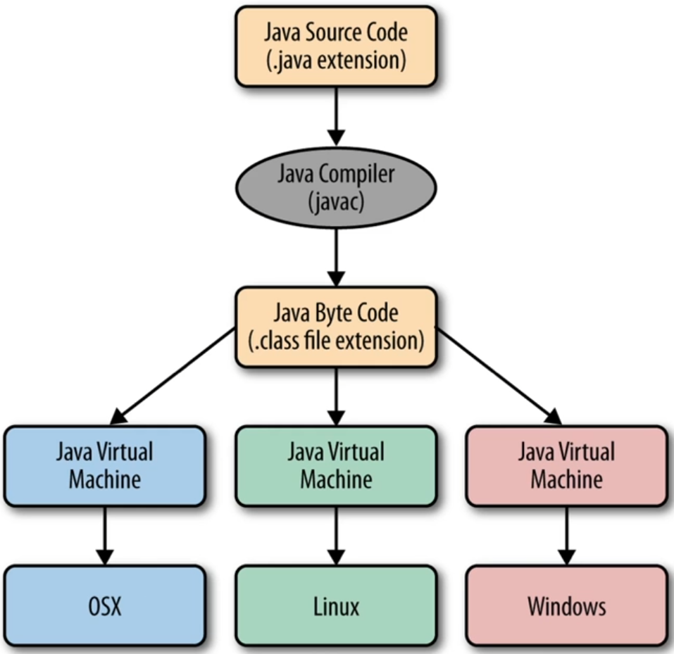

---

## 2. JVM이란?

### JVM(Java Virtual Machine)

- 바이트코드로 이루어진 .**class** 파일을 읽어 컴퓨터에게 명령을 내리는 역할 그리고 운영체제의 메모리 영역에 접근하여 메모리를 관리하는 역할
- 이 **JVM** 덕분에 **java**를 실행할 수 있는 운영체제에서도 실행이 가능하다. (독립성)
    
    **C**/**C++**의 경우 리눅스에서 컴파일한 파일을 윈도우에서 실행하려고 하면 실행되지 않는다. (이 문제를 크로스 컴파일을 통해서 해결)
    

**그럼에도 JVM이 필요한 이유는?**

- 초기 **java**가 등장했을 때 다양한 하드웨어와 운영체제에서도 실행이 되게끔 설계가 됨. 즉, 다양한 하드웨어에서도 동작하게 하고자 했던 것.

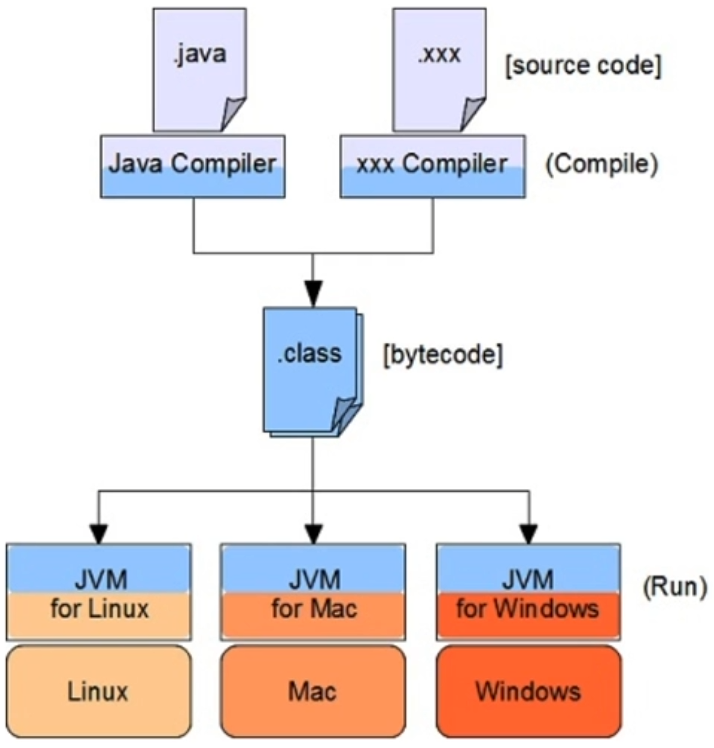

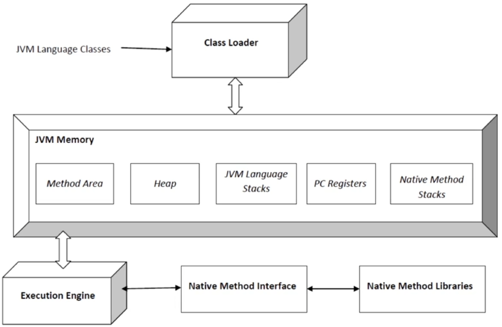

### JVM Memory

**Method Area**

- 클래스 파일을 메모리 공간에 올릴 때 클래스 정보, 변수 정보, static으로 선언된 변수를 저장 / 모든 스레드가 공유하는 메모리 영역

**Heap Area**

- 객체를 저장하는 메모리 영역 / 모든 스레드가 공유하는 메모리 영역

**Java Stack Area**

- 메소드의 Stack Frame이 저장되는 공간으로 지역변수, 인자값, 리턴값이 저장 / 각 스레드별로 생성

**PC(Program Counter) Register**

- JVM이 수행할 명령어의 주소를 저장하는 공간 / 각 스레드별로 생성

**Native Method Area**

- 바이트코드가 아닌 기계어로 작성된 코드를 실행하는 공간 / 각 스레드별로 생성

---

## 3. GC란?

### 가비지 컬렉션 (Garbage Collection)

- 유효하지 않은 메모리인 가비지(Gargage, 대부분 객체)를 찾아 지우는 역할
    
    C언어에서는 free()라는 함수로 직접 메모리를 해제해줘야 하지만,
    
    Java에서는 JVM이 불필요한 메모리를 알아서 정리해준다.
    
- 즉, GC란 동적으로 할당된 메모리 영역 중 사용하지 않는 영역을 탐지하여 해제하는 것을 뜻한다.
- Young / Old 영역으로 구성되어 GC가 이루어진다.

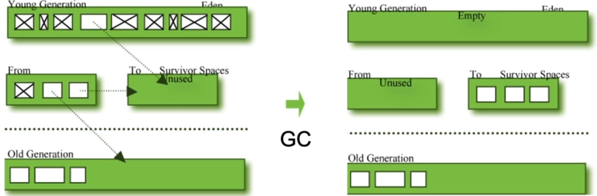

X 표시는 지운 것. Survivor Spaces에서 시간이 지나면 Old Generation으로 이동한다.

### 가비지 컬렉터 (Garbage Collector)의 종류

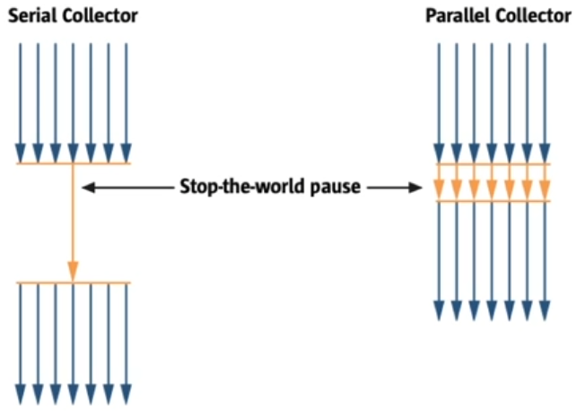

1. **Serial GC**
    - GC를 처리하는 스레드가 1개 / 가장 오래된 GC
2. **Parallel GC**
    - 여러 개의 스레드로 GC를 처리
3. **Concurrent Mark Sweep GC (CMS GC)**
    - Stop-The-World (GC를 실행하기 위해 JVM이 애플리케이션 실행을 멈추는 것)가 발생하는 시간을 최소화 하는데 초점을 맞춘 방식

    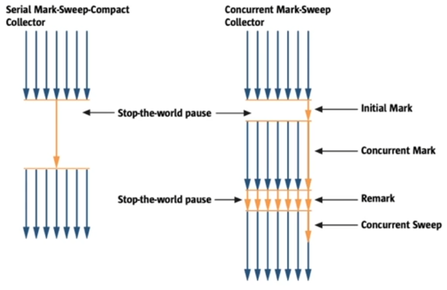

4. **G1 GC**
    - Eden, Survivor, Old 영역이 존재하며 기존의 GC와 다르게 Young 영역과 Old 영역을 물리적으로 나누지 않고 힙을 일정한 크기의 Region 이라는 논리적 단위로 나누어서 관리

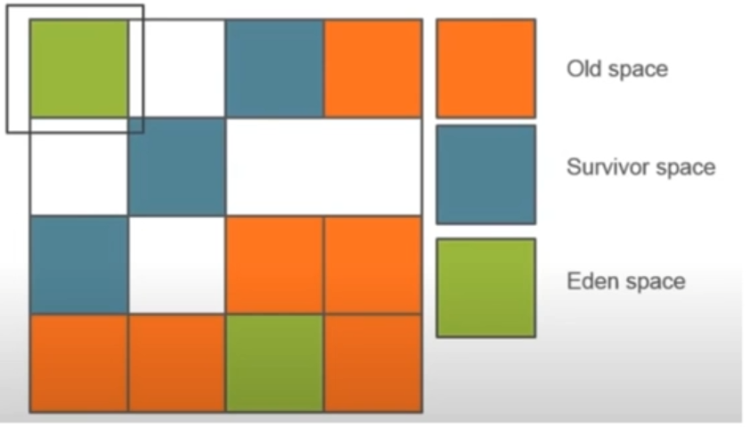

---

## 4. 객체지향프로그래밍과 절차지향프로그래밍의 차이점

### 절차지향(Procedural Programming, PP)

- 일련의 처리 절차를 정해진 문법에 따라 순서대로 기술하는 프로그래밍 방법
- 대표적인 언어로는 C가 있다.
- Top-Down 방식으로 프로그래밍

**장점**

- 컴퓨터의 처리구조와 유사하기 때문에 실행속도가 빠름

**단점**

- 유지보수가 어려움 (하나의 구조를 유기적으로 흐르게 짜야하기 때문에 하나의 로직이 너무 길다)

### 객체지향(Object Oriented Programming, OOP)

- 과거의 하드웨어 성능에 비해 월등히 좋아진 현재, 하드웨어의 성능에 구애받기 보다는 소프트웨어의 속도를 단축시키기 위한 방법으로 객체지향 프로그래밍이 탄생
    
    (자동차 부품을 하나씩 구매한 다음 자동차를 조립하는 것과 같은 방법)
    
- 자바, 파이썬, php와 같은 언어들

**장점**

- 이미 잘 만들어진 클래스를 가져다 쓰면 되기 때문에 생산성이 높고 코드의 재사용성 또한 높다.

**단점**

- 여러 객체를 나누어서 설계해야 하는 복잡성 때문에 초기 아키텍처 설계시 시간이 많이 들어감.
- 실행 시에 처리 속도가 느림

### 객체지향의 3가지 특징

1. **캡슐화** (Encapsulation)
    - 객체의 변수 및 메소드를 외부 객체가 건드리지 못하도록 감싸는 역할
2. **상속** (Inheritance)
    - 부모 클래스의 변수와 메소드를 자식 클래스가 물려받는 것을 의미
3. **다형성** (Polymorphism)
    - 하나의 객체가 여러 가지 타입을 가질 수 있는 것을 의미

---

## 5. 클래스, 객체, 인스턴스란

### 클래스 (Class)

- 일종의 설계도. 붕어빵을 찍어내는 기계의 틀과 같은 역할.
- 객체를 만들기 위해 필요한 메소드와 변수의 집합.

### 객체 (Object)

- 클래스의 타입으로 선언된 상태. 붕어빵 그 자체. 클래스의 인스턴스
- 메모리가 할당되기 전

### 인스턴스 (Instance)

- 클래스를 통해서 구현해야 할 대상인 객체가 실제로 구현이 된 것
- 메모리가 할당된 상태

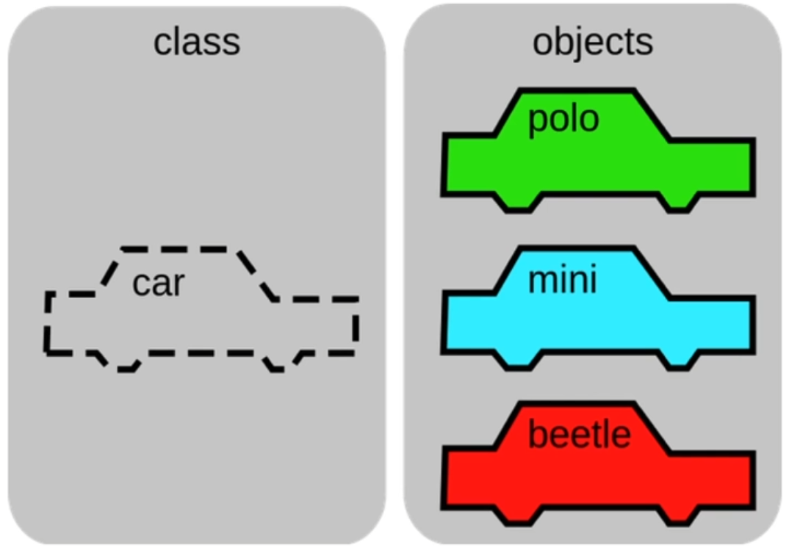

---

## 6. 오버라이딩과 오버로딩

### 오버로딩 (Overloading)

- 메서드의 이름은 같고 매개변수의 개수나 타입이 다른 함수를 정의하는 것
- 리턴값만 다르게 갖는 오버로딩은 불가능하다.

### 오버라이딩 (Overriding)

- 부모 클래스로부터 상속받은 메소드를 자식 클래스에서 재정의하는 것
- 상속 받은 메소드를 그대로 사용할 수도 있고 또는 자식 클래스에서 상황에 맞게 변경해야 하는 경우 사용한다.
- 이 경우 오버라이딩하고자 하는 메소드의 이름, 매개변수, 리턴 값이 모두 같아야 한다.

---

## 7. 싱글톤 패턴 사용 이유

### 싱글톤 패턴 (Singleton Pattern)

- 객체의 인스턴스가 오직 1개만 생성되게 만드는 디자인 패턴
- 생성자가 여러 차례 호출되더라도 실제로 생성되는 객체는 하나고 최초 생성 이후에 호출된 생성자는 최초에 생성한 객체를 반환

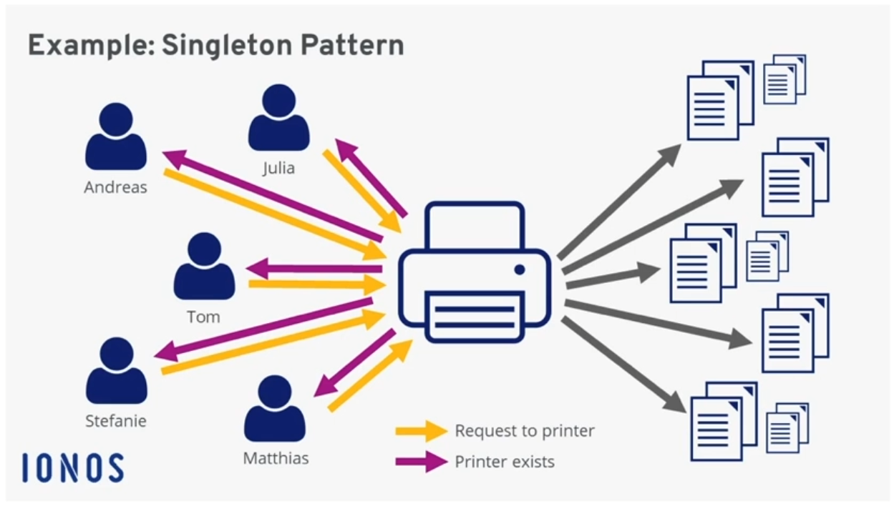

**사용 이유**

- 한번의 객체 생성으로 재사용이 가능하기 때문에 메모리 낭비를 방지
- 싱글톤으로 생성된 객체는 전역성을 띄기 때문에 다른 객체와 공유가 용이

**문제점**

- 싱글톤 객체의 역할이 복잡한 경우라면 사이드 이펙트 발생 확률이 높아짐.
- 멀티 쓰레드 환경에서는 동기화 문제가 생길 수 있음.

---

## 8. 접근 제어자의 종류

### 접근 제어자 (Access Modifier)

- 변수 또는 메서드 접근을 제어하기 위해 사용
- 이를 통해 객체의 로직을 보호하고 외부의 접근을 허용하거나 차단하는 보안목적으로 사용된다.
- 여러 개발자가 함께 작업하다 보면 주요 변수나 메서드에 접근하여 값을 변경하는 경우가 생기는 경우를 막기 위함

**public**

- 모든 패키지와 클래스에서 접근 가능

**protected**

- 동일한 패키지의 모든 클래스에 접근 허용 / 다른 패키지에 있어도 자식 클래스일 경우 접근 허용

**default**

- 동일한 패키지 내에 있는 클래스만 접근이 가능 / 접근제어자를 선언하지 않은 경우 설정됨

**private**

- 오직 해당 멤버를 선언한 클래스에서만 접근 가능

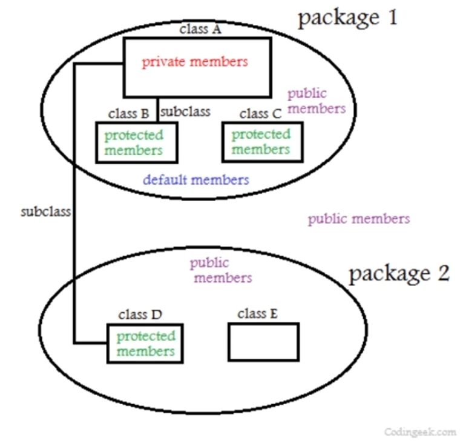

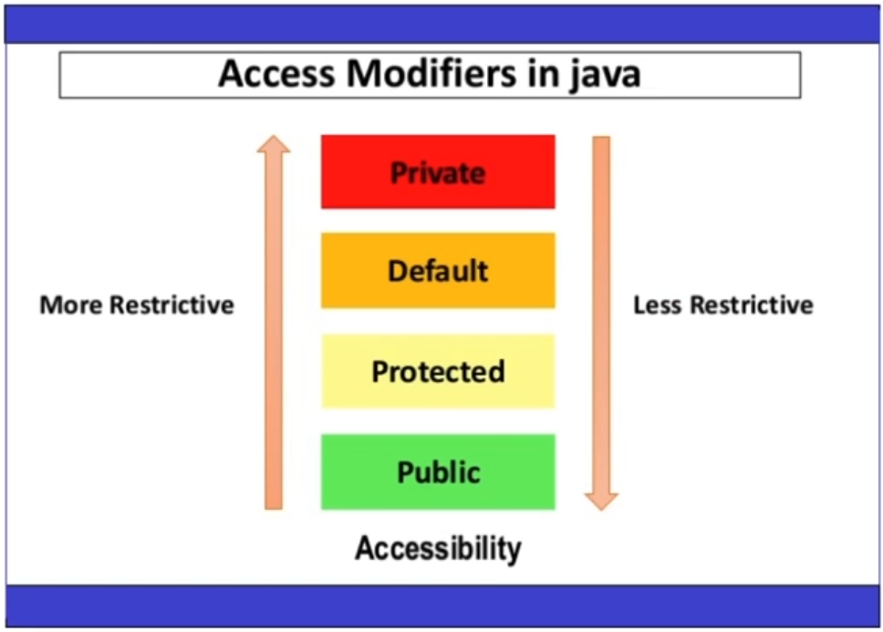

---

## 9. 직렬화와 역직렬화

### 직렬화 (Serialization)

- 자바의 객체를 직렬화 한다는 뜻.
- 자바의 객체를 외부로 저장하거나 네트워크 상으로 전송할 수 있도록 바이트 형태로 변환하는 기술
- Serializable 인터페이스를 구현하거나 직렬화가 가능한 클래스를 상속받음으로서 직렬화가 가능한 클래스를 생성할 수 있다.
- class Info implements Serializable

**객체의 상태를 영속적으로 저장(파일, DB, 메모리 등) 해야 할 필요가 있거나, 네트워크를 통해 정보를 전송하고 싶을 때 직렬화한다.**

### 역직렬화 (Deserialization)

- 직렬화를 통해 변환된 바이트 형태를 다시 원상태인 객체로 변환시키는 것

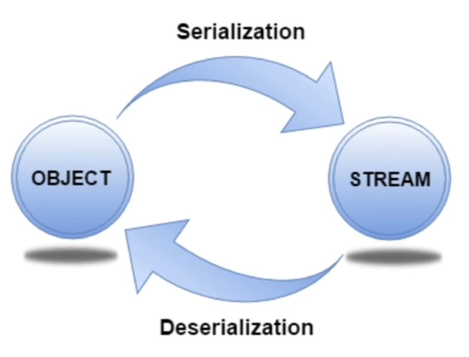