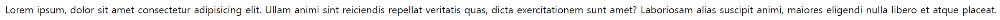
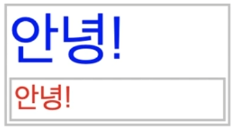
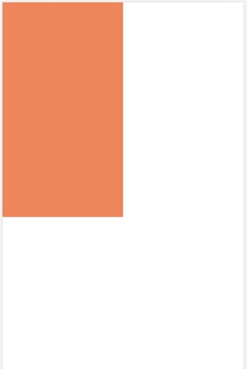
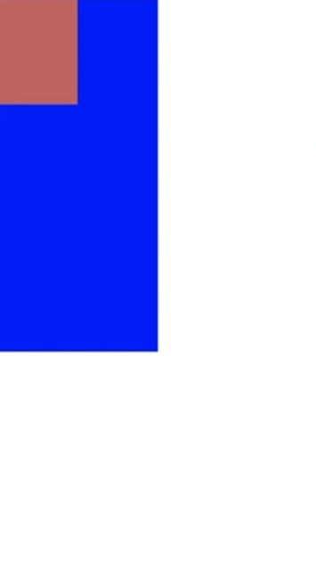
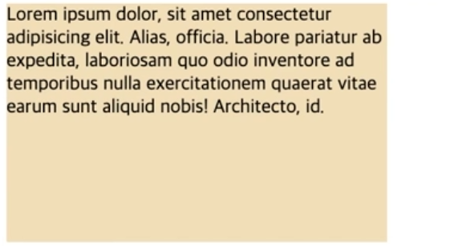

# [CSS] 단위와 값

## 절대길이 - px

**index.html**

```html
<!DOCTYPE html>
<html lang="en">

<head>
  <title>Document</title>
</head>

<body>
  <div>
    <p>
      Lorem ipsum, dolor sit amet consectetur adipisicing elit. Ullam animi sint reiciendis repellat veritatis quas,
      dicta exercitationem sunt amet? Laboriosam alias suscipit animi, maiores eligendi nulla libero et atque placeat.
    </p>
  </div>
</body>

</html>
```

**main.css**

```html
/* 단위와 값 */
/* 절대길이 - px, in, pt */

p {
  font-size: 24px;
}
```

### 절대길이

- 절대길이 단위는 프린트 등 출력 수단의 크기를 알 수 있을 때의 물리적 측정 거리를 나타낸다.
- cm, mm, in, pc 등등 여러 단위가 존재하지만 사실상 **px**만을 사용한다. pt는 가끔 사용하기도 한다. (한글 등 문서 작업)
- 크롬 설정을 통해 폰트 크기를 사용자가 조절할 수 있지만, 폰트 사이즈를 지정해주면 변하지 않는다.
    - 이는 접근성 문제를 유발할 수 있다.

**결과 화면**



---

## 상대길이 - em, rem

**index.html**

```html
<!DOCTYPE html>
<html lang="en">

<head>
  <title>Document</title>
</head>

<body>
  <div class="parent">
    안녕!
    <div class="child">
      안녕!
    </div>
  </div>
</body>

</html>
```

**main.css**

```html
/* 단위와 값 */
/* 상대길이 - em, rem */

div {}

.parent {
  color: blue;
  font-size: 24px;
}

.child {
  color: red;
  font-size: 1.5em;
}
```

### **상대길이 - em, rem**

- 글꼴 상대길이
- em은 부모의 폰트 사이즈와 비교하여 크기가 결정된다.
- 기본적으로는 부모의 폰트 사이즈가 상속된다.
- **1em === 부모의 font-size**
- **1rem === root의 font-size**
- **rem 사용을 지향**

**결과 화면**



---

## 상대길이 - vw, vh

**index.html**

```html
<!DOCTYPE html>
<html lang="en">

<head>
  <title>Document</title>
</head>

<body>
  <div class="container">
  </div>
</body>

</html>
```

**main.css**

```html
/* 단위와 값 */
/* 상대길이 - vw, vh */

body {
  margin: 0;
}

.container {
  background-color: coral;

  width: 100vw;
  height: 50px;
}
```

### 상대길이 - vw, vh

- 뷰포트 백분율길이
- 뷰포트: 웹사이트를 볼 수 있는 영역의 크기
- **vw**: 뷰포트의 너비, **vh**: 뷰포트의 높이
- 전체를 100으로 가정한다.

**결과 화면**



---

## 상대길이 - vmin, vmax

**index.html**

```html
<!DOCTYPE html>
<html lang="en">

<head>
  <title>Document</title>
</head>

<body>
  <div class="container"></div>
</body>

</html>
```

**main.css**

```html
/* 단위와 값 */
/* 상대길이 - vmin, vmax */

body {
  margin: 0;
}

.container {
  background-color: blue;
  width: 100vmin;
  height: 100vmin;
}
```

### 상대길이 - vmin, vmax

- 디바이스에 따라 vw와 vh로 인해 길이가 다른 현상이 발생한다.
- 가로, 세로 길이를 비교해서 짧은 부분이 vmin, 긴 부분이 vmax로 설정된다.

**결과 화면**


---

## 퍼센트

**index.html**

```html
<!DOCTYPE html>
<html lang="en">

<head>
  <title>Document</title>
</head>

<body>
  <div class="parent">
    <div class="child"></div>
  </div>
</body>

</html>
```

**main.css**

```html
/* 단위와 값 */
/* 상대길이 - % */

body {
  margin: 0;
}

.parent {
  width: 50%;
  height: 100px;
  background-color: blue;
}

.child {
  width: 50%;
  height: 30%;
  background-color: indianred;
}
```

### 퍼센트 (percentage)

- 부모 객체의 크기가 기준이 된다.

**결과 화면**



---

## 함수 표기법 - calc(), min(), max()

**index.html**

```html
<!DOCTYPE html>
<html lang="en">

<head>
  <title>Document</title>
</head>

<body>
  <div class="container">
    Lorem ipsum dolor, sit amet consectetur adipisicing elit. Officia deleniti est enim eveniet totam? Placeat illo officia deleniti quidem dolor fugiat nisi consequatur? Sed ab ad rerum, corporis fuga ullam.
  </div>
</body>

</html>
```

**main.css**

```html
/* 함수 표기법 */
/* calc(), min(), max() */

.container {
  width: calc(100% - 50px);
  /* min(100%, 200px) -> 둘 중에 작은 값을 선택. 200px을 넘어가면 더이상 늘어나지 않는다. */
  /* max(100%, 500px) -> 둘 중에 큰 값을 선택. 500px보다 줄이려 하면 더이상 줄어들지 않는다. */
  height: 200px;

  background-color: wheat;
}
```

### 함수 표기법 - calc(), min(), max()

- CSS 속성의 값으로 계산식을 지정하고자 할 때 사용한다.
- **calc()** 키워드를 통해 계산식을 사용할 수 있다. (+, -, *. / 사용 가능)
- **계산식을 작성할 때 연산자(+, -) 앞뒤로 공백을 넣어줘야만 한다.**
    - *, / 연산자의 경우 공백을 넣지 않아도 되지만, 코드의 일관성을 위해 공백 삽입을 지향하자!
- **min()**의 경우 둘 중에 작은 값을 선택한다.
- **max()**의 경우 둘 중에 큰 값을 선택한다.
- **min()**, **max()** 함수의 경우 지원하는 브라우저가 정해져 있다. (IE에서는 사용 불가)

**결과 화면**

