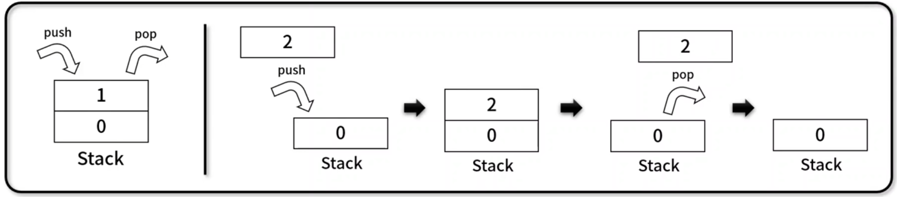

# [알고리즘] 스택

### 선형 자료구조와 비선형 자료구조


그 중에서도 선형 자료구조인 **스택**에 대해 알아보자.

## 스택 (Stack)

- 나중에 넣은 데이터가 먼저 나오는 LIFO(Last In First Out) 기반의 선형 자료 구조
- 구현 메서드(method)
    - **데이터 전체 획득** / **비어 있는지 확인**: Stack.getBuffer(), Stack.isEmpty()
    - **추가** / **삭제** / **마지막 데이터 조회** / **크기 확인**: Stack.push(), Stack.pop(), Stack.peak(), Stack.size()
    - **데이터 위치** / **존재 여부 확인**: Stack.indexOf(), Stack.includes()



---

## 스택 구현

```jsx
// Stack(): 생성자 함수
function Stack(array) {
  this.array = array ? array : [];
}

// getBuffer(): 객체 내 데이터 셋 반환
Stack.prototype.getBuffer = function () {
  return this.array.slice();
};

// isEmpty(): 객체 내 데이터 O/X
Stack.prototype.isEmpty = function () {
  return this.array.length === 0;
};

let stack_0 = new Stack([1, 2, 3]);

console.log(stack_0); // output: Stack { array: [ 1, 2, 3 ] }

let data = stack_0.getBuffer();
console.log(data); // output: [ 1, 2, 3 ]
console.log(data === stack_0.array); // output: false

console.log(stack_0.isEmpty()); // output: false
console.log(Object.getOwnPropertyDescriptors(Stack.prototype));
/** output: 
 * {
  constructor: {
    value: [Function: Stack],
    writable: true,
    enumerable: false,
    configurable: true
  },
  getBuffer: {
    value: [Function (anonymous)],
    writable: true,
    enumerable: true,
    configurable: true
  },
  isEmpty: {
    value: [Function (anonymous)],
    writable: true,
    enumerable: true,
    configurable: true
  }
}
 */

// push(): 데이터 추가
Stack.prototype.push = function (element) {
  return this.array.push(element);
};

// pop(): 데이터 삭제
Stack.prototype.pop = function () {
  return this.array.pop();
};

// peek(): 가장 끝 데이터 반환
Stack.prototype.peek = function () {
  return this.array[this.array.length - 1];
};

// size(): 스택 내 데이터 개수 확인
Stack.prototype.size = function () {
  return this.array.length;
};

let stack_1 = new Stack([1, 2]);
console.log(stack_1); // output: Stack { array: [ 1, 2 ] }
stack_1.push(3);
console.log(stack_1); // output: Stack { array: [ 1, 2, 3 ] }
stack_1.push(4);
stack_1.push(5);
stack_1.push(6);
console.log(stack_1); // output: Stack { array: [ 1, 2, 3, 4, 5, 6 ] }

console.log(stack_1.pop()); // output: 6
console.log(stack_1.pop()); // output: 5
console.log(stack_1); // output: Stack { array: [ 1, 2, 3, 4 ] }

// indexOf(): 매개변수로 넘어온 element 위치 확인
Stack.prototype.indexOf = function (element, position = 0) {
  /* case 1 */
  /*
  for (let i = position ; i < this.array.length ; i++) {
    if (element === this.array[i]) return i;
  }
  return -1;
  */
  /* case 2 */
  return this.array.indexOf(element, position);
};

// includes(): 데이터 존재 여부 확인
Stack.prototype.includes = function (element, position = 0) {
  /* case 1 */
  /*
  for (let i = position ; i < this.array.length ; i++) {
    if (element === this.array[i]) return true;
  }
  return false;
  */
  /* case 2 */
  return this.array.includes(element);
};

let stack_2 = new Stack([1, 2, 3]);

console.log(stack_2.indexOf(1)); // output: 0
console.log(stack_2.indexOf(1, 2)); // output: -1
console.log(stack_2.includes(1)); // output: true
console.log(stack_2.includes(1, 2)); // output: false
```