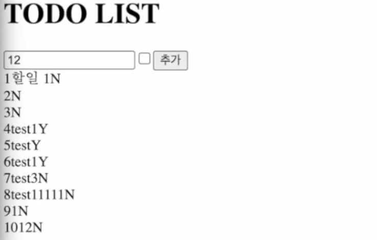
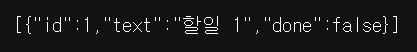

# [JS] fetch 사용하여 Todo 기능 구현

**fetch()** 를 활용하여 Todo 기능을 구현해보았다.

client, server 폴더를 각각 생성 후, 코드를 작성하였다.

**client/src/App.js**

```jsx
import { useEffect, useState } from "react";

function App() {
  const [todoList, setTodoList] = useState(null);

  const fetchData = () => {
    fetch('http://localhost:4000/api/todo')
    .then((response) => response.json())
    .then((data) => setTodoList(data));
  };

  useEffect(() => {fetchData()}, []);

  const onSubmitHandler = (e) => {
    e.preventDefault();
    const text = e.target.text.value;
    const done = e.target.done.checked;
    fetch('http://localhost:4000/api/todo', {
      method: 'POST',
      headers: {
        'Content-Type': 'application/json',
      },
      body: JSON.stringify({
        text,
        done,
      }),
    }).then(() => fetchData());
  };

  return (
    <div className="App">
      <h1>TODO LIST</h1>
      <form onSubmit={onSubmitHandler}>
        <input name='text' />
        <input name='done' type='checkbox' />
        <input name='submit' value='추가' />
      </form>
      {todoList.map((todo) => (
        <div key={todo.id} style={{ display: 'flex' }}>
          <div>{todo.id}</div>
          <div>{todo.text}</div>
          <div>{todo.done ? 'Y' : 'N'}</div>
        </div>
      ))}
    </div>
  );
}

export default App;
```

**client/src/index.js**

```jsx
import React from 'react';
import ReactDOM from 'react-dom/client';
import App from './App';
import reportWebVitals from './reportWebVitals';

const root = ReactDOM.createRoot(document.getElementById('root'));
root.render(
  <React.StrictMode>
    <App />
  </React.StrictMode>
);

// If you want to start measuring performance in your app, pass a function
// to log results (for example: reportWebVitals(console.log))
// or send to an analytics endpoint. Learn more: https://bit.ly/CRA-vitals
reportWebVitals();
```

**server/app.js**

```jsx
const express = require('express');
const app = express();
const cors = require('cors');

app.use(cors());

app.use(express.json()); // for parsing application/json
app.use(express.urlencoded({ extended: true })); // for parsing

let id = 2;
const todoList = [{
  id: 1,
  text: '할일 1',
  done: false,
}];

app.get('/api/todo', (req, res) => {
  res.json(todoList);
})

app.post('/api/todo', (req, res) => {
  const { text, done } = req.body;
  todoList.push({
    id: id++,
    text,
    done,
  });
  return res.send('success');
})

app.listen(4000, () => {
  console.log('server start!!');
});
```

### **결과 화면**

**메인 화면**



text를 입력하고 수행 여부를 체크한 후, 추가 버튼을 누르면 배열에 추가되는 방식이다.

**서버**



위와 같은 형식으로 저장된다.

---

## 참고

- [https://www.youtube.com/watch?v=d6suykcsNeY&ab_channel=라매개발자](https://www.youtube.com/watch?v=d6suykcsNeY&ab_channel=%EB%9D%BC%EB%A7%A4%EA%B0%9C%EB%B0%9C%EC%9E%90)