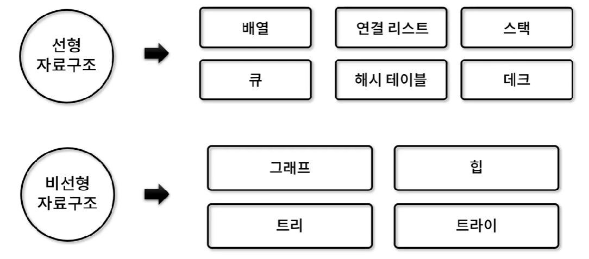
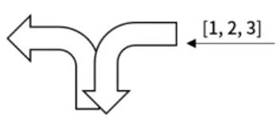

# [알고리즘] 스택 문제 풀이

### 선형 자료구조와 비선형 자료구조



그 중에서도 선형 자료구조인 **스택** 문제들을 몇 문제 가져와서 풀어보도록 하겠다.

### 기차 운행

💡 **문제 설명**

하단의 그림처럼 열차가 들어갔다 나올 수 있는 플랫폼이 있다. 열차가 1번부터 3번까지 순서대로 들어온다고 했을 때, 입력 순서대로 나갈 수 있는지 없는지 판단하는 프로그램을 작성하시오. 입력은 차량 순서 번호가 적혀 있는 배열이며, 가능 여부에 따라 true/false를 반환한다.



⌨️ **입력 값**

**#1.** [1, 2, 3]

**#2.** [3, 2, 1]

**#3.** [3, 1, 2]

🖨️ **출력 값**

**#1.** true

**#2.** true

**#3.** false

**풀이**

```jsx
if (!Array.prototype.peek) {
  Array.prototype.peek = function () {
    return this[this.length - 1];
  };
}

if (!Array.prototype.isEmpty) {
  Array.prototype.isEmpty = function () {
    return this.length == 0;
  };
}

function answer(train) {
  // train <--- 우리가 이 순서로 나갈 수 있는지 판단할 수 있는 train
  let stack = [];
  let num = 0;

  for (let i = 0 ; i < train.length ; i++) {
    while(stack.isEmpty() || stack[stack.length - 1] < train[i]) {
      stack.push(++num);
    }

    if (stack.peek() === train[i]) {
      stack.pop();
    } else {
      return false;
    }
  }

  return true;
}

let input = [
  // TC: 1
  [1, 2, 3],

  // TC: 2
  [3, 2, 1],

  // TC: 3
  [3, 1, 2],
];

for (let i = 0 ; i < input.length ; i++) {
  process.stdout.write(`#${i + 1} `);
  console.log(answer(input[i]));
}
```

### 괄호 짝 찾기

💡 **문제 설명**

계산 수식이 주어졌을 때, 같은 짝의 괄호 위치를 찾는 프로그램을 제작하시오.

입력은 계산 수식으로 주어지며, 괄호의 짝 별 위치를 [시작, 끝]으로 찾아 2차원 배열 형태로 반환한다.

위치 시작 값은 0으로 시작하며, 하나라도 짝이 맞지 않을 경우 빈 배열을 반환한다.

⌨️ **입력 값**

**#1.** (a+b)

**#2.** (a*(b+c)+d)

**#3.** (a*(b+c)+d+(e)

**#4.** (a*(b+c)+d)+e)

**#5.** (a*(b+c)+d)+(e*(f+g))

🖨️ **출력 값**

**#1.** [ [ 0, 4 ] ]

**#2.** [ [ 3, 7 ], [ 0, 10 ] ]

**#3.** []

**#4.** []

**#5.** [ [ 3, 7 ], [ 0, 10 ], [ 15, 19 ], [ 12, 20 ] ] 

**풀이**

```jsx
if (!Array.prototype.peek) {
  Array.prototype.peek = function () {
    return this[this.length - 1];
  };
}

if (!Array.prototype.isEmpty) {
  Array.prototype.isEmpty = function () {
    return this.length == 0;
  };
}

function answer(str) {
  let result = [];

  let stack = [];
  for (let i = 0 ; i < str.length ; i++) {
    if (str[i] == "(") {
      stack.push(i);
    } else if (str[i] == ")") {
      if (stack.isEmpty()) {
        return [];
      }

      result.push([stack.pop(), i]);
    }
  }

  if (!stack.isEmpty()) {
    return [];
  }

  return result;
}

let input = [
  // TC: 1
  "(a+b)",

  // TC: 2
  "(a*(b+c)+d)",

  // TC: 3
  "(a*(b+c)+d+(e)",

  // TC: 4
  "(a*(b+c)+d)+e)",

  // TC: 5
  "(a*(b+c)+d)+(e*(f+g))",
];

for (let i = 0 ; i < input.length ; i++) {
  process.stdout.write(`#${i + 1} `);
  console.log(answer(input[i]));
}
```

### 접시 꺼내기

💡 **문제 설명**

접시가 a, b, c, d 순으로 한쪽이 막혀 있는 세척기에 들어간다고 할 때, b a c d 순으로 꺼내기 위해서는 push, push, pop, pop, push, pop, push, pop 순으로 꺼내면 된다. 세척기에 꺼내야 하는 접시의 순서가 주어질 때, push/pop으로 접시가 꺼내져야 하는 동작을 계산하는 프로그램을 작성하시오.

입력은 접시의 수가 10개를 넘기지 않는 소문자 알파벳으로 주어지며, 접시 꺼내는 push/pop 연산 동작을 push → 0, pop → 1로 변환하여 배열로 반환한다. (단, 주어진 순서로 못 꺼낼 경우, 빈 배열로 반환)

⌨️ **입력 값**

**#1.** bacd

**#2.** dabc

**#3.** edcfgbijha

🖨️ **출력 값**

**#1.** [ 0, 0, 1, 1, 0, 1, 0, 1 ]

**#2.** []

**#3.** [ 0, 0, 0, 0, 0, 1, 1, 1, 0, 1, 0, 1, 1, 0, 0, 1, 0, 1, 1, 1 ]


**풀이**

```jsx
if (!Array.prototype.peek) {
  Array.prototype.peek = function () {
    return this[this.length - 1];
  };
}

if (!Array.prototype.isEmpty) {
  Array.prototype.isEmpty = function () {
    return this.length == 0;
  };
}

function answer(str) {
  let result = [];

  // 1. 접시의 순서 abc... 문자열

  // 2. 꺼내야 하는 접시, 세척기 안헤 있는 알파벳 작을 때 push

  // 3. 최상단 접시와 비교
  
  let stack = [];
  let dish = str.split("").sort().join("");
  let dish_index = 0;

  for (let i = 0 ; i < str.length ; i++) {
    while (stack.isEmpty() || stack.peek() > str[i]) {
      stack.push(dish[dish_index++]);
      result.push(0);
    }

    if (stack.isEmpty() || stack.peek() > str[i]) {
      return [];
    } else {
      stack.pop();
      result.push(1);
    }
  }

  return result;
}

let input = [
  // TC: 1
  "bacd",

  // TC: 2
  "dabc",

  // TC: 3
  "edcfgbijha",
];

for (let i = 0 ; i < input.length ; i++) {
  process.stdout.write(`#${i + 1} `);
  console.log(answer(input[i]));
}
```

### 소들의 시야

💡 **문제 설명**

기린이 앞쪽만 볼 수 있는 경우, 다른 기린을 몇 마리 볼 수 있는지 총합을 구하는 프로그램을 작성하시오. 기린은 자신보다 작거나 같은 기린만 볼 수 있으며, 자신보다 큰 기린이 나올 경우 앞 기린들이 가려서 볼 수가 없다.

입력은 기린 별 키 값이 들어오며, 다른 기린을 볼 수 있는 총합을 구해 반환한다.

예를 들어, 5 2 4 2 6 1 순의 기린 키가 입력으로 들어오면 1번 기린은 2, 3, 4 기린을 볼 수 있어 3마리, 2번은 볼 수 있는 기린이 없고, 3번은 1마리, 4번은 0마리, 5번은 1마리, 마지막 기린은 앞의 기린이 없으므로 0마리로, 답은 총 5마리 기린이다.

⌨️ **입력 값**

**#1.** [10, 3, 7, 4, 12, 2]

**#2.** [7, 4, 12, 1, 13, 11, 12, 6]

**#3.** [20, 1, 19, 18, 15, 4, 6, 8, 3, 3]

🖨️ **출력 값**

**#1.** 5

**#2.** 6

**#3.** 30


**풀이**

```jsx
if (!Array.prototype.peek) {
  Array.prototype.peek = function () {
    return this[this.length - 1];
  };
}

if (!Array.prototype.isEmpty) {
  Array.prototype.isEmpty = function () {
    return this.length == 0;
  };
}

function answer(giraffe) {
  let result = 0;

  let stack = [];
  giraffe.push(Number.MAX_SAFE_INTEGER);
  for (let i = 0 ; i < giraffe.length ; i++) {
    while (!stack.isEmpty() && stack.peek()["h"] < giraffe[i]) {
      result += i - stack.pop()["i"] - 1;
    }
    stack.push({ h: giraffe[i], i: i});
  }
  
  return result;
}

let input = [
  // TC: 1
  [10, 3, 7, 4, 12, 2],

  // TC: 2
  [7, 4, 12, 1, 13, 11, 12, 6],

  // TC: 3
  [20, 1, 19, 18, 15, 4, 6, 8, 3, 3],
];

for (let i = 0 ; i < input.length ; i++) {
  process.stdout.write(`#${i + 1} `);
  console.log(answer(input[i]));
}
```

### 괄호 계산

💡 **문제 설명**

4개의 기호 ‘(’, ‘)’, ‘[’, ‘]’ 를 이용해서 만들어지는 괄호열로, 아래 규칙으로 계산하는 프로그램을 작성하시오.

1. ‘()’ 인 괄호 열 값은 2
2. ‘[]’ 인 괄호 열 값은 3
3. ‘(X)’ 인 괄호 값은 2 * 값(X)로 계산
4. ‘[X]’ 인 괄호 값은 3 * 값(X)로 계산
5. 괄호형 X와 Y가 결합된 XY는 값(XY) = 값(X) + 값(Y)로 계산

예를 들어 ()[[]] 는 2 + 3 * 3 = 11이 나오며, ([]) 의 값은 2 * 3으로 6이다.

만약 쌍이 맞지 않거나 기호 순서가 비정상적이라 올바른 괄호 셋이 만들어지지 않는 경우에는 0을 반환한다.

입력은 4개의 기호로만 이루어진 괄호가 문자열 형태로 주어지며, 계산을 통해 나온 정수를 반환한다.

⌨️ **입력 값**

**#1.** (()[[]])

**#2.** [][]))])

**#3.** (()[[]])([])

🖨️ **출력 값**

**#1.** 22

**#2.** 0

**#3.** 28

**풀이**

```jsx
if (!Array.prototype.peek) {
  Array.prototype.peek = function () {
    return this[this.length - 1];
  };
}

if (!Array.prototype.isEmpty) {
  Array.prototype.isEmpty = function () {
    return this.length == 0;
  };
}

function answer(str) {
  let result = 0;

  // "(" -> x2, "[" -> x3, ")" -> /2, "]" -> /3
  // () or [], 현재 temp값을 result에 더해준다.

  let stack = [];
  let temp = 1;
  for (let i = 0 ; i < str.length ; i++) {
    let mark = str[i];

    switch (mark) {
      case "(":
        temp *= 2;
        stack.push(mark);
        break;
      case "[":
        temp *= 3;
        stack.push(mark);
        break;
      case ")":
        if (stack.isEmpty() || stack.peek() != "(") {
          return 0;
        }

        if (str[i - 1] == "(") {
          result += temp;
        }

        stack.pop();
        temp /= 2;
        break;
      case "]":
        if (stack.isEmpty() || stack.peek() != "[") {
          return 0;
        }

        if (str[i - 1] == "[") {
          result += temp;
        }

        stack.pop();
        temp /= 3;
        break;
    }
  }

  if (!stack.isEmpty()) {
    return 0;
  }
  
  return result;
}

let input = [
  // TC: 1
  "(()[[]])",

  // TC: 2
  "[][]((])",

  // TC: 3
  "(()[[]])([])",
];

for (let i = 0 ; i < input.length ; i++) {
  process.stdout.write(`#${i + 1} `);
  console.log(answer(input[i]));
}
```