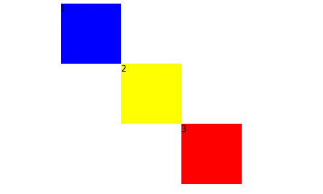
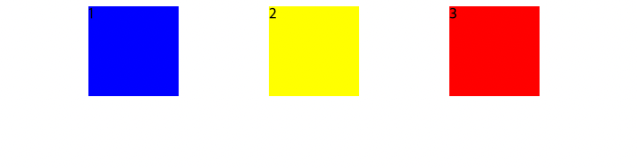
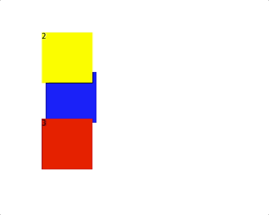
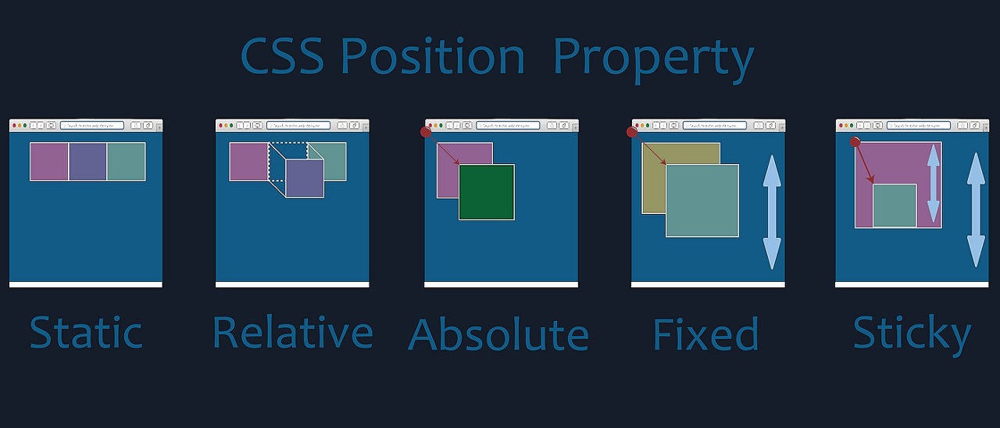

[position - MDN]:https://developer.mozilla.org/ko/docs/Web/CSS/position
웹페이지를 꾸미기 위하여 CSS를 쓰다 보면 우리는 필수 적으로 Position 속성을 사용할 때가 많다.  
각각 어떤 차이점이 있고 어떻게 사용하는지 알아보자.  
그리고 가끔 헷갈리기도 하는 inline, inline-block, block에 대해서도 같이 알아보려 한다.  

<!--more-->

* this ordered seed list will be replaced by the toc
{:toc}  

# Position의 속성  
---  
position 은 객체를 원하는 곳에 위치시키고 레이아웃을 배치하는 CSS의 속성이다.  
위, 아래, 왼쪽, 오른쪽 (top, bottom, left, right)의 위치를 같이 설정 한다.  

* __static__  
기본값이다. 아무런 속성도 지정하지 않았을때와 동일하다.  

* __relative__  
현재의 객체가 기준점으로 위치가 계산 된다.  
{:.centered}  

```css
/* file: "relative.css" */
   .one {
      background-color: blue;
      position: relative;
      left: 100px;
    }

    .two {
      background-color: yellow;
           position: relative;
      left: 200px;
    }

    .three {
      background-color: red;
      position: relative;
      left: 300px;
    }
```

* __absolute__  
원래 객체의 위치와는 상관없이 위치를 지정할 수 있으며 부모 요소의 속성이 relative 일 경우  
그 요소가 기준으로 위치가 조정된다.  

{:.centered}  
```css
/* file: "absolute.css" */
    .one {
      background-color: blue;
      position: absolute;
      left: 100px;
    }

    .two {
      background-color: yellow;
      position: absolute;
      left: 300px;
    }

    .three {
      background-color: red;
      position: absolute;
      left: 500px;
    }
```
* __fixed__  
원래의 위치와 상관없이 위치를 지정할 수 있으며 브라우저의 화면이 바뀌더라도 고정된 위치를 가진다.  

{:.centered}  
```css
/* file: "absolute.css" */
    .one {
      background-color: blue;
      position: relative;
      left: 100px;
      top: 200px;
    }

    .two {
      background-color: yellow;
      position: fixed;
      left: 100px;
    }

    .three {
      background-color: red;
      position: absolute;
      left: 100px;
    }
```  


{:.centered}
Position 참고 그림
{:.figcaption}  

<br>  
자세한 사항은 MDN을 참고하기 바란다.  

[position - MDN]
{:.note title="Link"}  
## 주로 어떨때 쓰일까?  

그렇다면 주로 어떨때 쓰일까? 나는 주로 어떤 아이콘이나 세세한 움직임이 필요한  
요소들에 대해서 relative 와 absolute를 적절하게 쓴다.  

그리고 nav 나 어떠한 사이드 메뉴를 스크롤을 내려도 고정하고 싶다 할때는  
fixed를 쓰고 여기에는 명시하지 않고 다른 포스팅에 있지만 브라우저의 스크롤에 따라  
움직이다가 어느 특정 위치에서 고정하고 싶을때 sticky 속성을 쓴다.

# inline, inline-block, block  
---  

* __inline__  
한 칸을 다 차지하지 않고 줄바꿈 없이 다른 개체들과 나란히 배치된다.  
대표적인 inline 태그는 `<span>, <a>, , <input>` 등이 있다.

* __block__  
하나의 개체가 한 칸을 다 차지하기 때문에 자동으로 줄바꿈이 된다.  
대표적인 block 태그는 `<div>, <h1~h6>,` 등이 있다.  

* __inline-block__  
inline처럼 줄바꿈 없이 다른 개체들과 나란히 배치된다. 하지만, inline과 다른 점은  
기존 inline에서 사용하지 못하는 width, height 속성을 지정할 수 있고, margin과  
padding 지정이 가능하다.  
대표적인 태그로는 `<button>` 이 있다.

