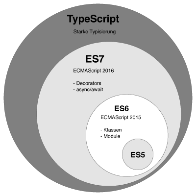
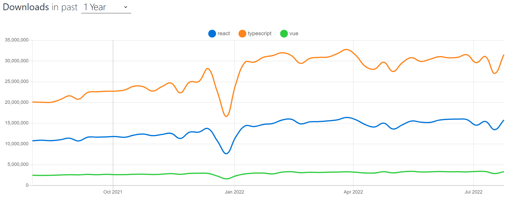
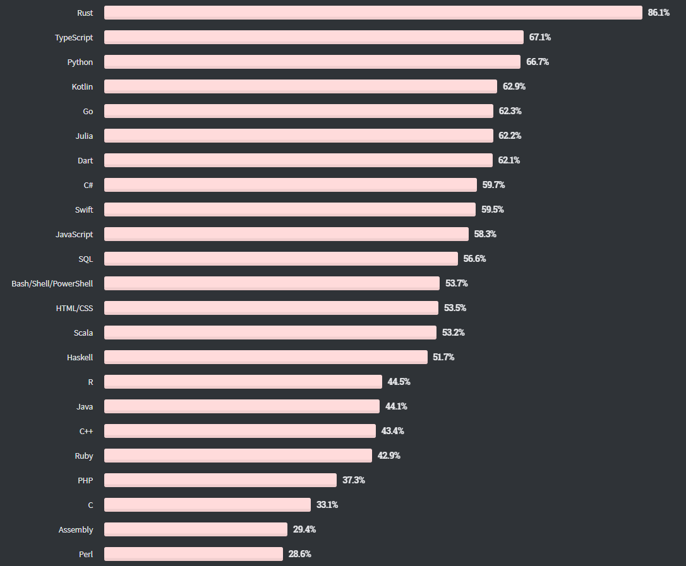
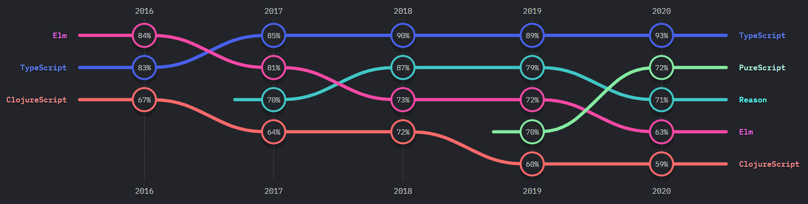
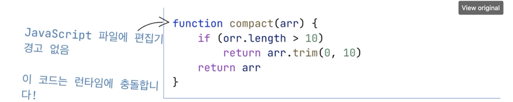
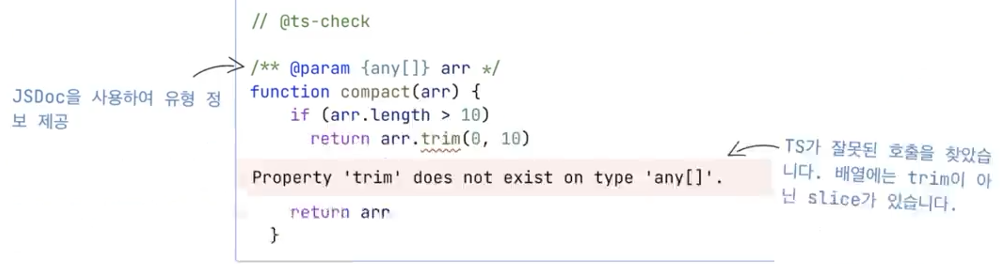
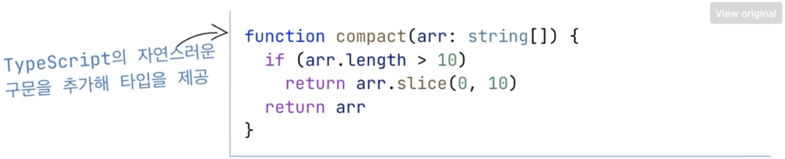
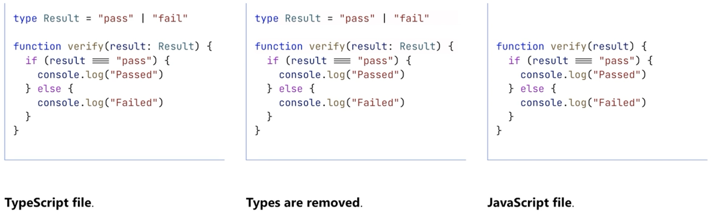
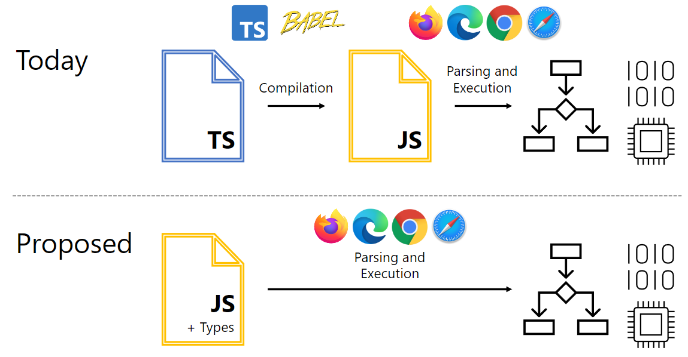

# 왜 TypeScript를 써야할까?

작성일시: 2022년 8월 7일 오후 12:00
최종 편집일시: 2022년 8월 7일 오후 12:00

# TypeScript 소개

## 과거의 TypeScript



## 현대의 TypeScript

> TypeScript is JavaScript with syntax for types.
>
> 👉 타입 구문이 있는 **JavaScript**

**JavaScript and More**

- JavaScript에 추가 구문을 첨가하는 언어
- IDE와 통합 ⇒ VSCode에서 오류 캐치가 수월하다

**A Result You Can Trust**

- JavaScript로 변환됨
- JavaScript가 지원되는 모든 곳에서 실행된다 (브라우저, Node.js, Deno 등)

**Safety at Scale**

- JavaScript를 이해하는 타입 추론을 사용
- 추가적인 코드 없이도 훌륭한 도구를 제공

---

## TypeScript를 공부해야 하는 이유

**npm 트렌드** (20220806 기준)



→ React, Vue보다 압도적인 다운로드 수. 인기와 선택을 넘어 필수가 되어가고 있다.

**StackOverFlow 순위** (2020년 12월 기준)



**State of JS 2020**



→ 다양한 지표들로 보아 이미 세계적으로 TypeScript가 많이 쓰이고 있는 추세라는 것을 알 수 있다.

---

## TypeScript 효과

### (나의, 우리의) 데이터 기술서

- 객체와 함수의 생김새를 정의
- 데이터를 코드로 설명할 수 있는 데이터 기술서를 만들 수 있는 효과가 있다.
- 편집기에서 문서 및 버그를 검출할 수 있다.

```tsx
interface Person {
  name: string;
  age: number;
  gender: "M" | "F";
}
```

---

## JavaScript 런타임 시점 오류 검출



→ 이와 같이 JavaScript의 경우에는 경고가 나오지 않지만, TypeScript의 경우

```tsx
// @ts-check
```

주석을 달아주면


다음과 같이 오류를 표시해준다.



→ **JSDoc**을 사용하여 타입에 대한 정보를 제공해주기도 한다.

---

## TypeScript (타입 구문 추가)



→ 콜론(:) 을 기준으로 우측에 TypeScript 문법이 추가된 형태

---

## 타입 구문이 존재하는 JavaScript

<aside>
🗂️ 타입 구문이 존재하는 JavaScript 즉 TypeScript이며

TypeScript가 컴파일되면 JavaScript로 변환된다.

</aside>

**TypeScript becomes JavaScript via the delete key.**



```tsx
type Result = "pass" | "fail";

function verify(result: Result) {
  if (result === "pass") {
    console.log("Passed");
  } else {
    console.log("Failed");
  }
}
```

```jsx
function verify(result) {
  if (result === "pass") {
    console.log("Passed");
  } else {
    console.log("Failed");
  }
}
```

⇒ 이와 같이 변환된다.

---

# TypeScript 미래

> 이미 현재 진행형에 가까움

## 국내 Front-end 채용 공고

### 자격요건

- 웹 프론트엔드 개발 경험에 준하는 실력 (3년 이상)
- HTML/CSS, Javascript (ES2015+)
- Computer Science 기본 지식
- React 개발 경험 (2년 이상)
- 상태 관리 라이브러리 경험 有

### 우대사항

- 프론트엔드 개발 환경 구성 경험
- Node.js 개발 경험
- **TypeScript 개발 경험**
- 모바일 환경 개발 경험



→ 컴파일러가 필요한 현시점에서 JS에 Type이 붙고 브라우저에서 바로 동작이 되도록 도전하고있는 듯하다(?)

[A Proposal For Type Syntax in JavaScript](https://devblogs.microsoft.com/typescript/a-proposal-for-type-syntax-in-javascript/)

---

# TypeScript 의식적으로 학습하기

## any 지양하기

→ any를 사용하면 **TypeScript**보다는 **JavaScript**에 가까워진다.

**대안**

- unknown
- Generic
- Type Guard
- Type Assertion
- ban-ts-comment

```tsx
// @ts-expect-error
// @ts-ignore
// @ts-nocheck
// @ts-check
```

[TypeScript ESLint](https://typescript-eslint.io/)

## 지향하기

- strictNullChecks
- 문서화
- 선 타이핑 후 구현 → 타입을 먼저 달고, 타입에 맞게 구현하기
- 집단지성
- 컨벤션 & 팀 문화 지향하기

[https://github.com/typescript-eslint/typescript-eslint](https://github.com/typescript-eslint/typescript-eslint)

[https://github.com/dtekeshe/typescript-book](https://github.com/dtekeshe/typescript-book)

---
