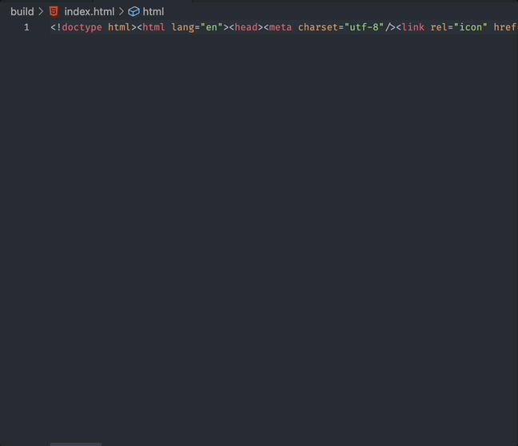
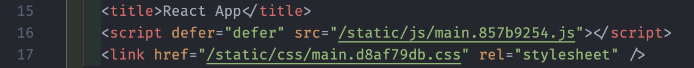
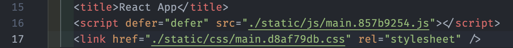

리액트로 뚝딱뚝딱 무언가를 만들고 드디어 빌드!!  
`npm run build` ... 완료!! 얼른 Github에 올리고 정적 페이지 배포 완료!

엇.. 그런데.. 왜 빈 화면만 나오지? 분명 빌드는 잘 됐는데..?

아~ 이것 때문이었구나 한번 해결해 보자!

<!-- more -->

## 해결방법

---

- 무엇 때문인지는 모르나 `Link` 와 `Script` 경로가 로컬 경로로 아닌채로 빌드된다.

- 빌드하고 난후의 `index.html` 를 열어보자.

- 당황하지마라! 기존의 프리티어같은 코드정렬 확장프로그램이 있으면 살포시 저장을 눌러 정렬해주자.

  
정렬!  
{:.figcaption}

- `/static/...` 경로를 현재 경로인 `./static/...` 으로 바꾸어주자! 점만 찍으면 된다.

경로 수정 전  
{:.figcaption}

경로 수정 후  
{:.figcaption}

- 이제 다시 테스트 해보면? 웹페이지가 잘 나오는것을 확인할 수 있다.

- 다만 이것은 깃헙의 정적 페이지 배포일 경우이고 aws 배포는 해당 하지 않는다.
