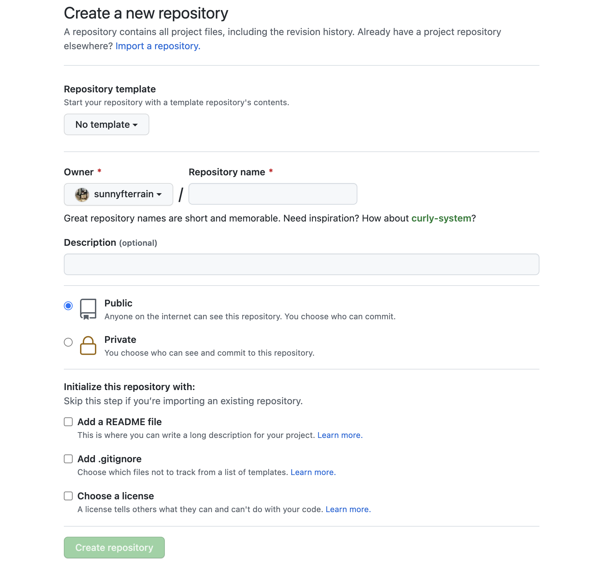
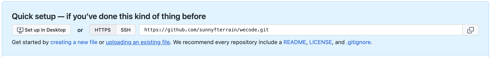

개발 업무에 필수적인 Git과 Github! 하지만 처음 사용할 때 명령어들이 너무 많고,  
어떤 순서대로 써야하는지도 모르겠고 너무 어려웠다.  

지금은 어느정도 능숙하게 쓰게 되었지만, 이제 막 git을 접하는 분들에게 바친다.  
부제 : git! github! 처음엔 이것만 알면 돼!!  

<!-- more -->

* this ordered seed list will be replaced by the toc
{:toc}  

## 깃과 깃허브의 차이?  
---  
정말 쉽게 얘기하면 Git은 내컴퓨터. 로컬에서만 파일 버전 관리를 하는 것이고,  
Github는 내컴퓨터에서만 하던것을 네트워크 상의 저장소에 저장하여 버전 관리를 하는 것이다.  

Github를 가입하지 않았다면 일단 먼저 가입을 하고 repository를 만들자  
아래는 Github에서 새 repository를 만드는 방법이다.  

## 깃허브 repository 생성 방법  
---  

  

* 우측의 new 버튼을 눌러준다.  

  

* Repository name 에 저장소의 이름을 정해주자.  
* 비공개로하고 싶다면 Privae, 그렇지 않다면 Public 으로 해준다.  
* 처음 만들어 질때 같이 생성할 파일을 지정해 준다.  
  * 해도되고 안해도 된다.  
* Create repository 클릭!  

## 내 프로젝트를 git 으로 만들고 github과 연결하기
---  

github에서 repository를 생성하면 이러한 해당 주소가 있을 것이다.  

  

이것을 복사해 두자
### 첫번째 방법  

* 터미널을 연다.  
* 내가 하고 있는 프로젝트 중 Git 을 하고 싶은 폴더로 들어간다.  
* `git init` : 깃 초기화를 한다. 즉 내가 작업하고 있는 현재 폴더를 Git을 할 수 있게 만들어 준다.  
  * 해당 폴더로 가서 숨김 폴더 및 파일 해제 (mac:shift+cmd+.) 하면 '.git'이라는 폴더가 생겼을 것이다.  
* `git remote add origin 복사한주소` : github과 내 로컬을 연결하는 것이다.
* `git remote -v` : github와 잘 연결되었는지 확인한다.

### 두번째 방법  

* `git clone 주소` : github에서 만든 repository가 해당 이름으로 폴더가 만들어져 복사된다.  
* 끝이다. 이방법은 첫번째 방법에서 다루었던 remote 연결 과정을 한꺼번에 다 해준다.  

## git 을 사용해 보자!  
---  

어느정도 코드를 다 작성했다면?  

* 터미널을 연다.
* `git status` : 현재 작업 중인 파일을 보여주거나, 커밋 할 파일을 보여준다. 즉, 현재의 상황을 보여준다.
* `git add .` : 현재 작업중인 모든 파일을 git에 저장할 것이다 라고 지정해주는 것이다.  
  * .(마침표) 는 모두를 지정. 특정 파일만 하고 싶으면 작업 중인 목록 중에 원하는 것만 복사 붙여넣기 하면 된다.  
  * `git status` 를 해서 확인하자! 항상 확인하는 습관을 들여야 한다.  
* `git commit -m "커밋내용"` : 커밋 내용과 함께 커밋이 된다. -m 옵션은 간단하게 한줄정도만 적는다는 뜻!  

여기까지가 로컬에서만 하는 것이다.  

## github의 내 repository에 올리자!  

* `git push origin main` : 연결된 github의 repository에 업로드 된다.  
  * repository를 생성한 시기에따라 main일 수도 있고 master 일 수도 있다.  

끝이다. 혼자서는 여기까지만 하면 딱이다. 그냥 정말 기초적인것만 나열 했다.  
어느정도 익숙해지면 그때그때 필요해지는 명령어들이 있다. 그럴땐 검색하면 많이 나오니, 참고하면 좋을 것 같다.  

### 기타 알면 좋은 명령어  
* `git log` : 현재까지 커밋한 로그 내역을 볼 수 있다.
* `git reset` : 원하는 커밋 위치로 되돌릴수 있다.
  * `git reset add한 파일명` : 방금 add 한 파일을 add 취소한다.
  * `git reset --hard HEAD^` : 바로 이전 커밋으로 되돌린다.
  * `git reset --hard HEAD~2` : 2단계 전 커밋으로 돌린다.(전전 커밋)
* `git merge --abort` : merge 취소 (충돌났을시)
* `git stash` : 해당 작업 중인것을 비우고 stack에 저장 (잘못된 브랜치에서 작업하고 있었을때 주로 사용)
  * `git stash apply` : 올바른 브랜치에서 사용하면 이전에 stash 한것을 살림