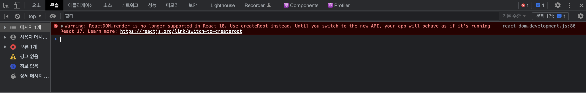

리액트 프로젝트로 오랜만에 CRA를 하고 나서 `npm start` 하니 콘솔에 발생하는 오류  

```
react-dom.development.js:86 Warning: ReactDOM.render is no longer supported in React 18. Use createRoot instead. Until you switch to the new API, your app will behave as if it's running React 17. Learn more: https://reactjs.org/link/switch-to-createroot
```

고새 리액트가 업그레드 되었나보다.


  

그냥 간단하게 리액트 17에서 18로 업데이트 되었는데, 더이상 `ReactDOM.render` 는  
지원하지 않는다는 것.  

공식문서 및 참고문서에는 수정하는 방법이 기술 되어있다.  

[Dev.to]:(https://dev.to/osmanforhad/react-js-warning-reactdomrender-is-no-longer-supported-in-react-18-use-createroot-instead-until-you-switch-to-the-new-api-1jhh)
[참고 문서]{:.note title="Link"}  

**Before**
```js
// file: "App.js"
ReactDOM.render(
  <React.StrictMode>
    <App/>
  </React.StrictMode>
  document.getElementById('root')
);
```

**After**
```js
// file: "App.js"
const root = ReactDOM.createRoot(document.getElementById('root'));
root.render(
<React.StrictMode>
  <App/>
</React.StrictMode>
);
```

이렇게 바꾸어 주면 더이상 오류가 없다.