AWS에는 사용자의 취향에 맞는 각종 서버들이 있습니다.  
흔히 우리가 리액트로 만든 웹페이지는 정적 웹페이지가 많고, 정적 웹페이지는  
S3만으로도 충분하나 이번에 EC2로 웹페이지를 한번 배포해 보겠습니다.

<!-- more -->

- this ordered seed list will be replaced by the toc
  {:toc}

# 리액트 웹페이지 EC2 배포하기

---

## AWS EC2 인스턴스 생성하기

- AWS 웹페이지로 가서 회원가입이 되어 있다면 로그인을 합니다.
- 로그인을 하고 나서 검색 창에서 EC2를 검색하거나, AWS 관리 콘솔에서 모든 서비스를  
  클릭해 서비스에서 EC2 를 선택합니다.
- 아래의 화면이 나옵니다.

<br>

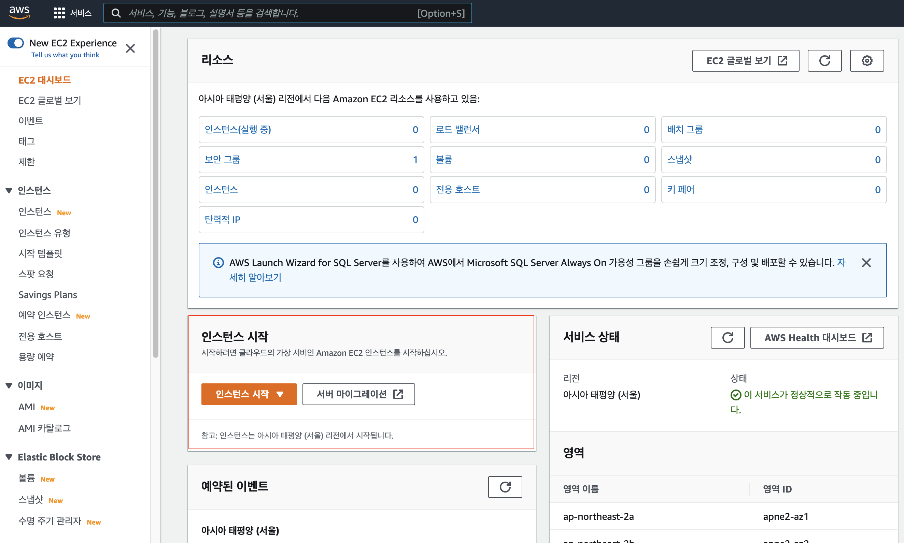  
인스턴스 시작  
{:.figcaption}

- 인스턴스 시작을 클릭해 줍니다.

<br>

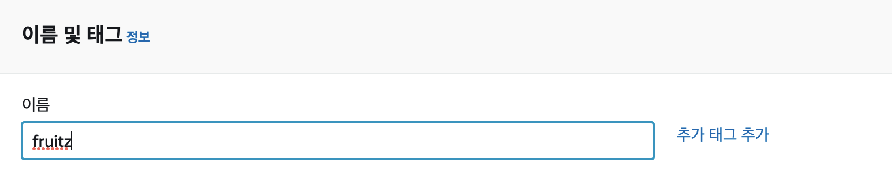  
이름 및 태그 설정  
{:.figcaption}

<br>

- 용도에 따라 원하는 EC2 이름이나 태그를 지정합니다.

<br>

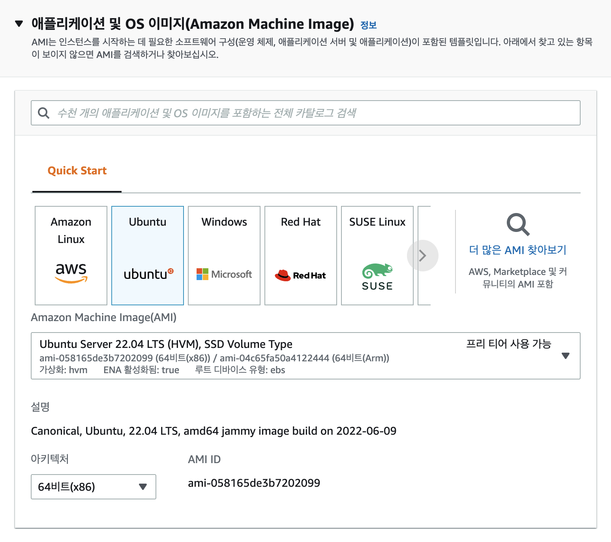  
Quick Start 화면  
{:.figcaption}

<br>

- Quick Start에서 EC2 에서 사용할 머신 OS를 선택해 줍니다.  
  우리는 우분투 64비트를 선택하겠습니다.

<br>

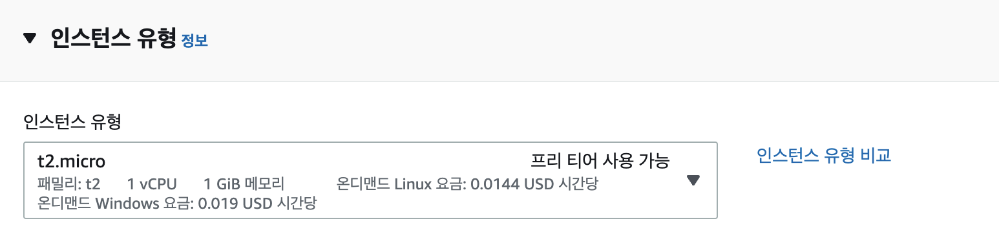  
인스턴스 선택 화면  
{:.figcaption}

- 인스턴스 유형을 선택합니다. EC2의 서버를 종류에 따라 과금이 달라집니다.
- 우리는 일정 기간 무료인 t2.micro의 프리 티어를 사용하겠습니다.  
  (추후에 자동 과금이 되지 않도록 관리 잘하셔야 합니다.)

<br>

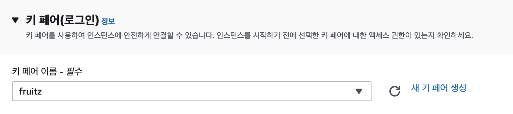  
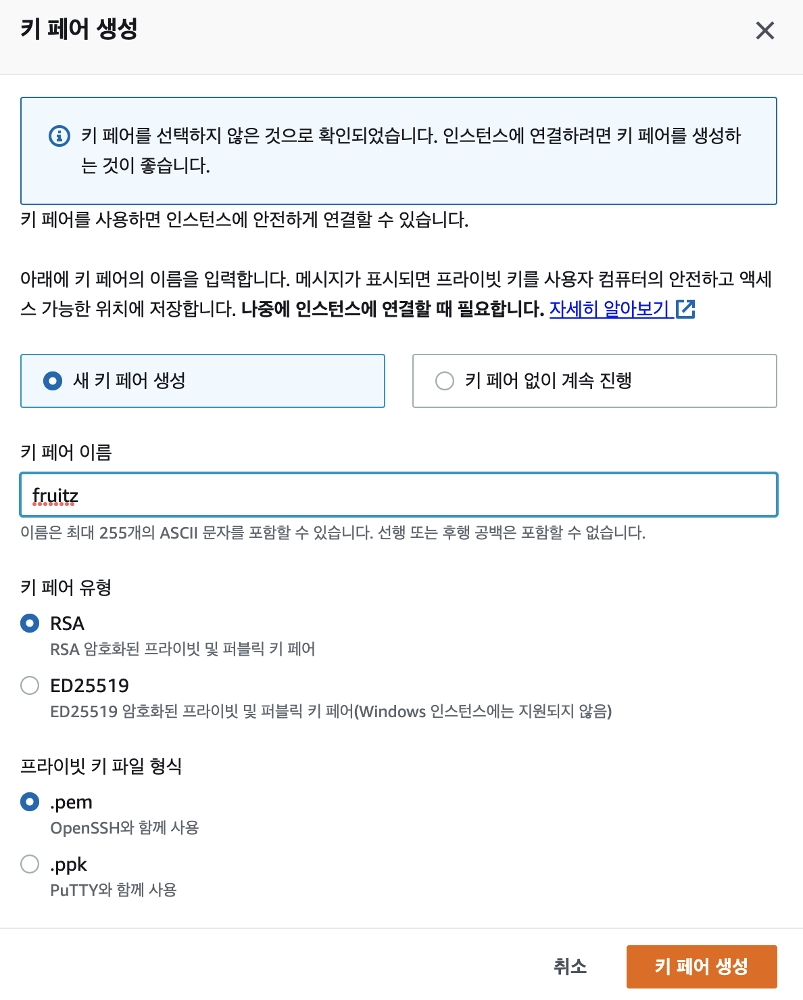  
키페어 설정 화면  
{:.figcaption}

<br>

- 키 페어 생성을 해 줍니다.
- 키 페어 이름은 원하는 것을 해주고 키 페어 지정을 하면 생성되는 파일은 한 번만  
  다운받을 수 있기 때문에 잘 저장해 두어야 합니다.

<br>

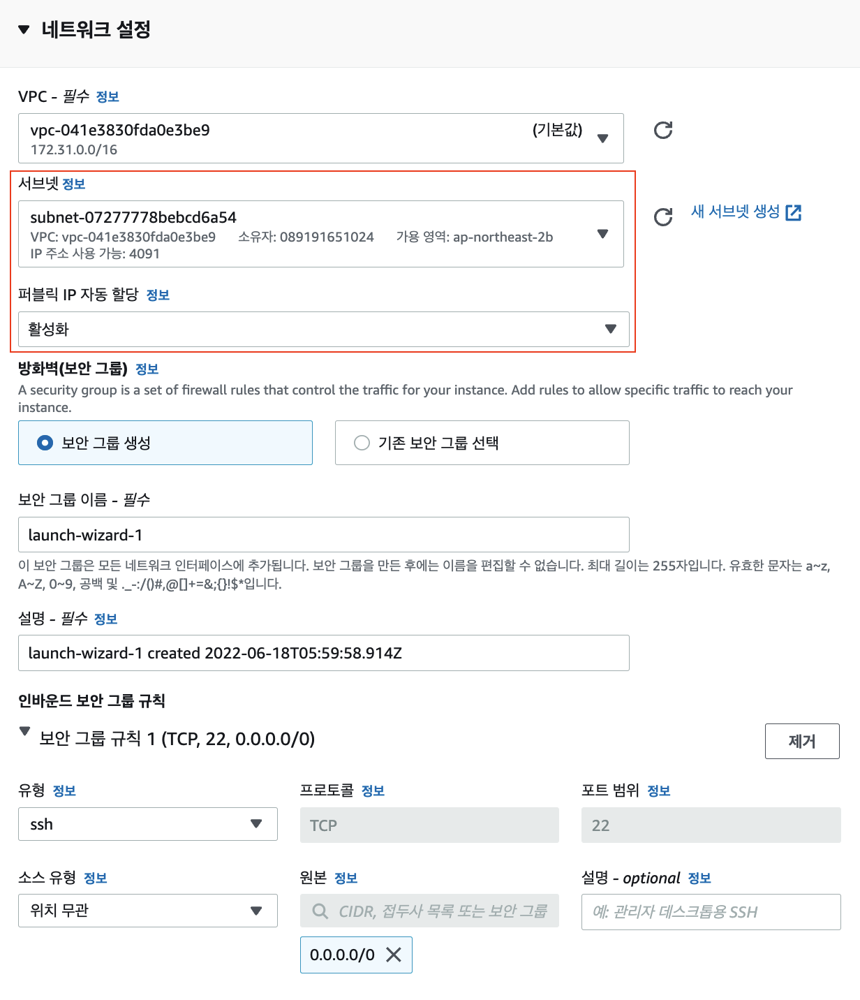  
네트워크 설정 화면  
{:.figcaption}

- 네트워크 설정의 편집 버튼을 눌러 다음과 같이 설정합니다.
  - 서브넷은 IP가 사용 가능한 곳으로 설정해 줍니다.
  - 퍼블릭 IP 자동 할당은 활성화 상태로 놔둡니다.  
    (나중에 고정 아이피를 설정하려면 Elastic IP 라는 것을 설정해야 합니다.)

<br>

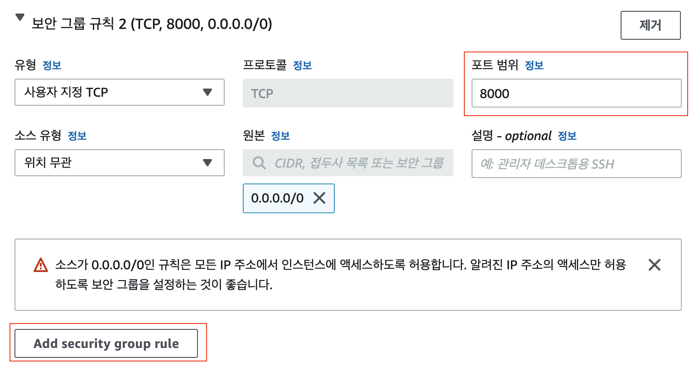  
보안 그룹 설정 화면  
{:.figcaption}

<br>

- `Add security group rule` 을 클릭하고 다음과 같이 설정합니다.
  - EC2에서는 Http 와 Https 의 접속을 허용해 주기 위하여 규칙 추가를 해줍니다.
  - 기본적으로는 모든 IP로부터 SSH의 접속을 허용하도록 되어 있습니다.
  - 웹서버의 포트 번호가 8000이고 어떤 IP든 접속되게 허용하려면 포트 범위를  
    추가해 주어야 합니다.

<br>

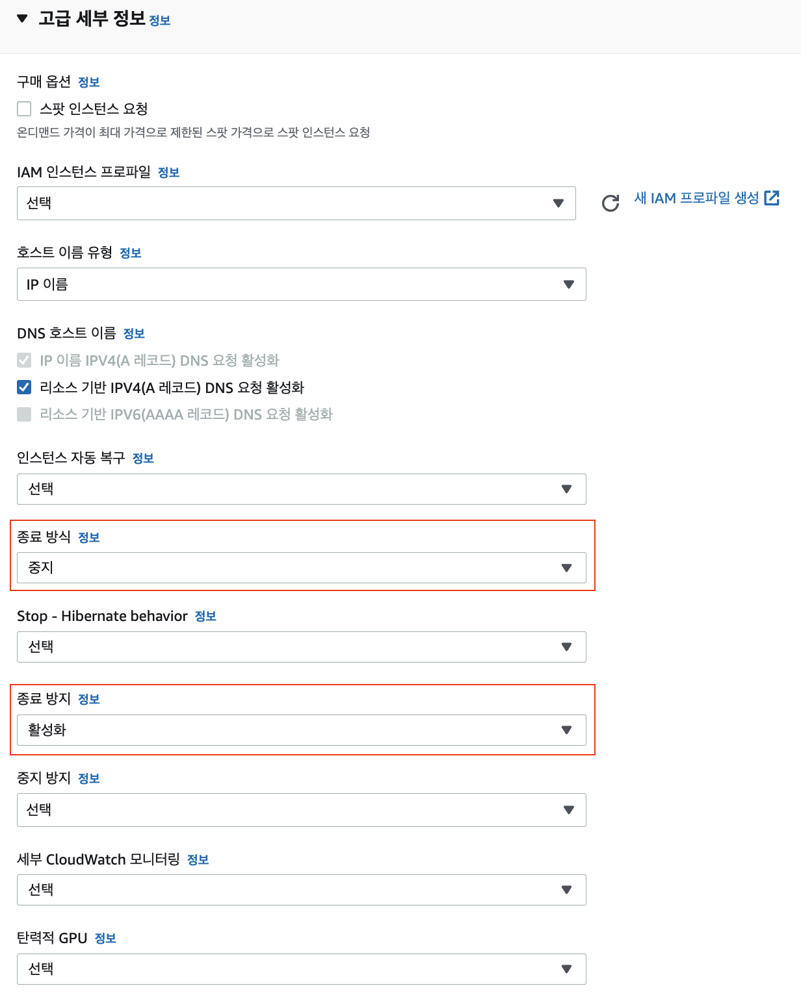  
고급 세부 설정 화면  
{:.figcaption}

<br>

- 종료 방식 설정을 설정합니다.
  - 중지 : 인스턴스 셧다운 시에 OS가 정지되어 이미지가 보존 재시작하면 다시 시작
  - 종료 : OS를 정지하는 것과 동시에 EC2 인스턴스 삭제
- 여기에서는 중지를 선택하겠습니다.
- 실제로 EC2 인스턴스가 삭제되는 것을 방지하기 위하여 종료 방지를 활성화합니다.

특별히 또 설정할 것은 없고 요금이 부과되는 것도 있기 때문에 여기까지만 설정을 하고  
마지막으로 인스턴스 시작을 눌러줍니다.

---

## 인스턴스 접속

- 만든 인스턴스를 확인해 봅시다.

<br>

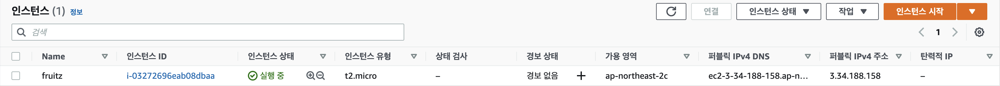  
생성된 인스턴스 - 인스턴스 상태는 기다리면 실행중 으로 바뀝니다.  
{:.figcaption}

<br>

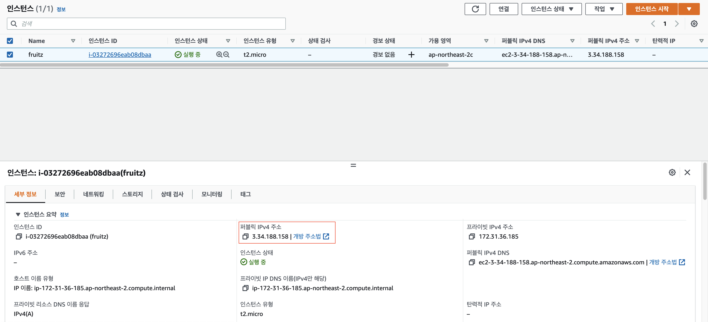  
퍼블릭 IPv4 주소를 잘 확인하세요. 접속할 때 필요합니다.  
{:.figcaption}  
<br>

이제부터는 우리가 만든 EC2 인스턴스 서버에 접속을 해보겠습니다.  
아까 만든 키 페어는 EC2에 접속하기 위한 인증서라고 보시면 됩니다.

터미널을 열어서 키 페어 생성을 할 때 받은 파일이 있는 폴더로 이동합니다.

<br>

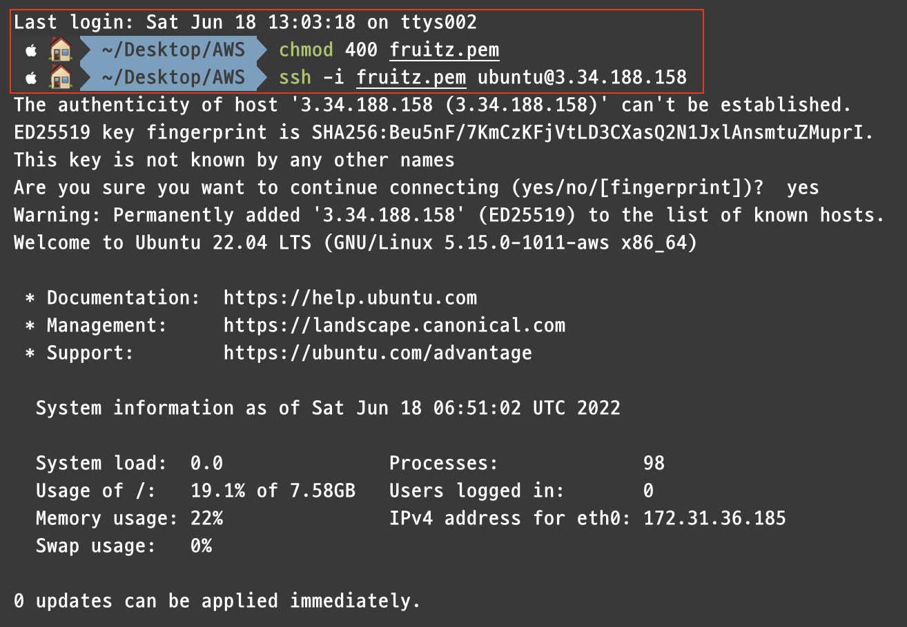  
터미널 작업 화면  
{:.figcaption}

<br>

- 다음과 같은 명령어를 쳐서 키 페어에 읽기 권한을 부여해 줍니다.  
  `chmod 400 키페어이름.pem`

- 그리고 다음과 같은 명령어를 쳐서 ssh 접속을 할 수 있게 해줍니다.  
  `ssh -i 키페어이름.pem ubuntu@퍼블릭 IPv4주소`  
  퍼블릭 IP주소는 인스턴스의 세부정보에 있습니다.

<br>

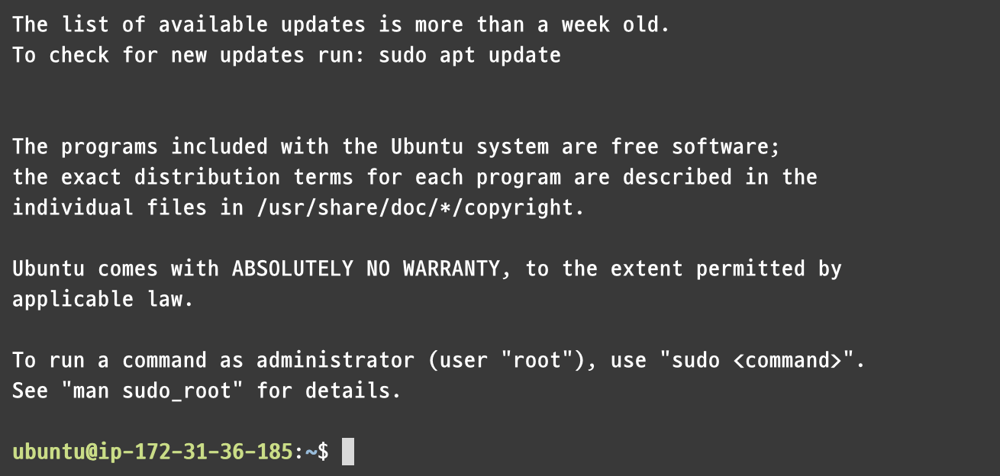  
접속된 우분투  
{:.figcaption}

<br>

- 이렇게 나왔나요? 그럼 우리가 만든 AWS 인스턴스에 잘 접속이 된것입니다.
- `ls`, `pwd` 등 리눅스 명령어를 한번 쳐 봅시다.

<br>

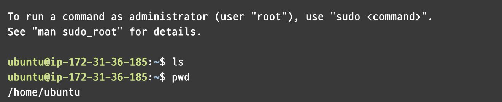  
현재 경로는 이렇게되고, 아무것도 존재하지 않습니다.  
{:.figcaption}

---

## 웹페이지 빌드하기

- 현재 인스턴스에는 아무것도 없는 상태이기 때문에 웹페이지를 올리고자 하는  
   git repo를 클론 해 줍니다.  
  `git clone repo주소`

- 우분투 서버에는 아무것도 깔려있지 않아 npm을 사용할 수 없기 때문에 설치해 줍니다.
- 우분투 서버에 node 설치  
  `curl -sL https://deb.nodesource.com/setup_14.x | sudo bash -`  
  `sudo apt-get install nodejs`

- 다음과 같은 명령어를 쳐서 잘 설치되었는지 확인합니다. (버전은 다를 수 있습니다.)

<br>

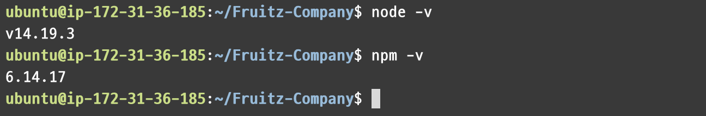  
node와 npm이 잘 설치되었습니다.  
{:.figcaption}

<br>

- clone 했던 곳에 가서 `npm install` 을 해줍시다.

- build 를 해줍니다. 기본 명령어는 `npm run build` 입니다.

---

## 웹서버 설치하기

EC2 에서 웹페이지 배포를 하려면 웹서버를 설치를 해야합니다.  
여기서는 nodejs Express 를 설치 하겠습니다.

- 명령어를 쳐서 express를 설치해 줍니다.  
  `npm install express`

설치만 해준다고 끝이 아니니 서버 코드를 넣어주겠습니다.

- 웹페이지가 있는 프로젝트의 폴더로 이동합니다.

- 파일을 하나 생성하겠습니다. 저는 server.js 로 하겠습니다.  
  명령어 `vi server.js`

- i 를 눌러 INSERT 모드로 바꾼 후 아래의 코드를 붙여넣기 해줍니다.

```
const http = require("http");
const express = require("express");
const path = require("path");

const app = express();

const port = 8000;

app.get("/ping", (req, res) => {
    res.send("pong");
});

app.use(express.static(path.join(__dirname, "build")));

app.get("/*", (req, res) => {
res.set({
    "Cache-Control": "no-cache, no-store, must-revalidate",
    Pragma: "no-cache",
    Date: Date.now()
});
res.sendFile(path.join(__dirname, "build", "index.html"));
});

http.createServer(app).listen(port, () => {
  console.log(`app listening at ${port}`);
});
```

- esc 를 누르고 :wq 를 해서 저장하고 나옵니다.

<br>

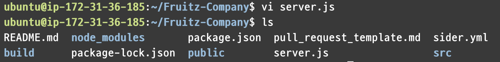  
ls를 해서 server.js 파일이 잘 있는지 확인합니다.  
{:.figcaption}

<br>

이제 서버를 실행해 봅시다!  
`node server.js` 를 실행하여 app listening at 8000 이 잘 뜨는지 확인!

그리고 퍼블릭IP주소를 브라우저에 쳐봅시다.

저는 3.34.188.158 이므로 3.34.188.158:8000 으로 브라우저에 접속하니  
아까 빌드한 웹페이지가 아주 잘 나옵니다!

---

## 주의점

터미널을 종료하면 서버가 꺼지므로 웹페이지가 접속이 되지 않습니다.

그렇기 때문에 다음과 같은 명령어를 쳐서 서버를 꺼도 돌아가게 해줍니다.

`sudo node server.js &`

이제 배포가 완료되었습니다!~
