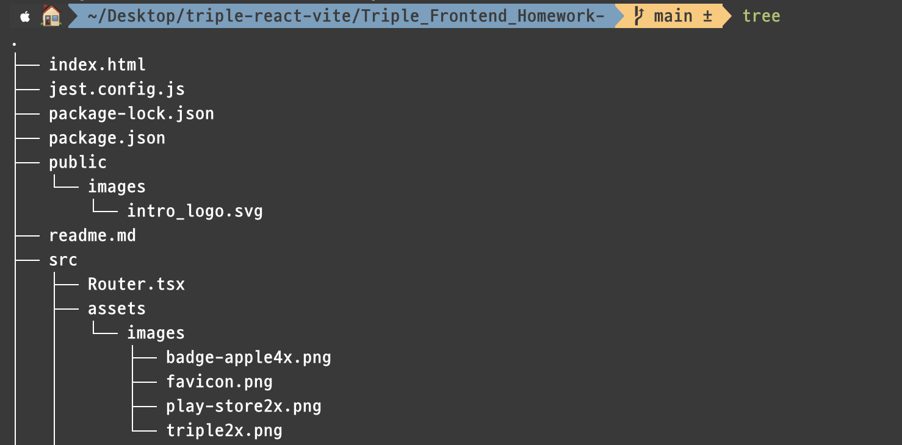

<!-- more -->

* this ordered seed list will be replaced by the toc
{:toc}  

# 폴더구조를 Tree로 만들어 보자!  
---

프로젝트에 대한 것을 깃헙 리드미에 올리면서 폴더구조에 대한 설명도  
올리게 되었습니다. 그런데 정말 바보 같게도 하나하나 손으로 쓰다가  
이걸 뭔가 자동으로 해주는게 없을까? 하고 알아보던중, 역시나 있었습니다.  

바로 Tree!  
 
## 1. 설치방법
일단 바로 설치 먼저 해볼까요? Mac 기준이고 홈브루가 있어야 합니다.  

만약 홈브루가 없으시다면?  
 👉🏻 [Home Brew](https://brew.sh/index_ko)  

그리고, 터미널에서 다음과 같은 명령어를 칩니다.  

`brew install tree`  

설치가 되실텐데 다 되면 끝입니다.  

 

## 2. 사용방법

먼저 트리구조로 만들고 싶은 폴더로 갑니다.  

그리고 명령어 👉🏻 `tree` 끝. 쉽죠??  

그러면 이러한 결과가 나옵니다.  

  

이제 이것을 복사 하거나하셔서 쓰고싶은곳에 쓰시면 됩니다!.  
