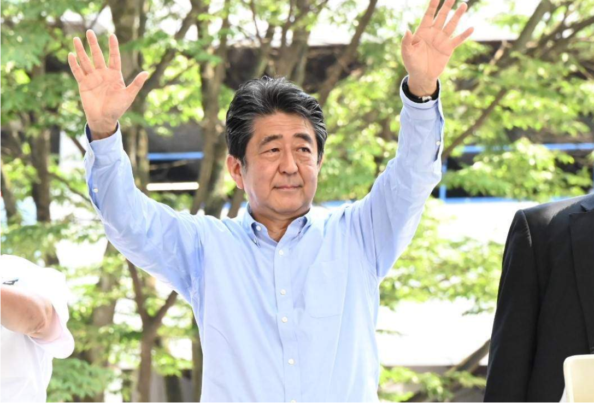

# 今日のニュース (2022-08-08)

### 기사

# **安倍元首相に「お願いだから帰ってきて！」「民主主義の冒涜」ネットで祈りや怒りの声**

아베 전 총리에게 「부탁이니까 돌아와!」「민주주의의 모독」 인터넷으로 기도나 분노의 목소리

参院選宮城選挙区から出馬した自民党現職の応援に駆け付けた安倍晋三元首相＝５日午後、仙台市宮城野区（奥原慎平撮影）

참원 선궁성 선거구에서 출마한 자민당 현직의 응원에 달려온 아베 신조 전 총리=5일 오후, 센다이시 미야기노구(오쿠하라 신헤이 촬영)    

奈良市の近鉄大和西大寺駅前で**街頭演説**中の安倍晋三元首相が**銃撃**された事件。

나라시의 긴키 야마토사이다이지 역 앞에서 가두 연설 중인 아베 신조 전 총리가 총격된 사건.

ネットには、無事を祈る声が広がり、

인터넷에서는, 무사를 바라는 목소리가 퍼지고,

「民主主義の死だ」

「민주주의의 죽음이다」

などと、**憤る**声も**相次いだ**。

등과, 분노하는 목소리도 잇따랐다.

産経ニュースによると、**捜査**関係者の話として、安倍元首相は**背後**から**銃**で**撃たれた**といい、奈良県内の４０代、山上徹也容疑者が殺人**未遂容疑**で**逮捕**された。

산케이 뉴스에 의하면, 수사 관계자의 이야기로, 아베 전 총리는 배후에서 총으로 맞았다고 하며, 나라현 내의 40대, 야마가미 테츠야 용의자가 살인 미수 혐의로 체포되었다.

ツイッターには、「安倍さんお願いだから帰ってきて！！」「どうか、どうかご無事で。

回復されることを信じています」といった安倍元首相の無事を祈る声が広がった。

트위터에는, 「아베씨 부탁이니까 돌아와!!」「부디, 제발 무사히. 회복될 것을 믿고 있습니다」라고 하는 아베 전 총리의 무사를 기도하는 목소리가 퍼졌다.

また、怒りの声も高まり、

또, 분노의 목소리도 높아져,

「相手が気に入らないから暴力で何とかする！ってのは絶対に間違ってます！」

「상대가 마음에 들지 않아 폭력으로 어떻게든 한다! 라는 것은 무조건 잘못되어 있습니다!」

「これは民主主義の冒涜であり、断じて許されないことである」

「이는 민주주의의 모독이며, 결코 용서받을 수 없는 일이다」

「物申したいなら選挙に行くのが民主主義であって、**銃弾**ではない」

「말하고 싶은 거라면 선거에 가는 것이 민주주의지, 총알이 아니다」

といった意見も書き込まれていた。

라는 의견도 적혀 있었다.

安倍元首相が昨日更新していたツイッターには、所属する自民党の**候補**を応援するコメントや写真が**投稿**されており、

아베 전 총리가 어제 갱신했던 트위터에는, 소속하는 자민당의 후보를 응원하는 코멘트나 사진이 투고되어 있어,

「心から無事になるようにお祈りします　台湾からの祈り」

「진심으로 무사하길 빌겠습니다 대만으로부터의 기도」

などと、国内だけでなく、海外からもリプライが多数**寄せられていた**。

등과, 국내뿐만 아니라, 해외에서도 댓글이 다수 밀려오고 있다.

---

### 학습한 단어

|     | 漢字     | 読み仮名         | 意味             |
| --- | -------- | ---------------- | ---------------- |
| 1   | 冒涜     | ぼうどく         | 모독             |
| 2   | 街頭演説 | かいとうえんぜつ | 가두 연설        |
| 3   | 銃撃     | じゅうげき       | 총격             |
| 4   | 憤る     | いきどおる       | 분개하다, 노하다 |
| 5   | 相次ぐ   | あいつぐ         | 연달다, 잇따르다 |
| 6   | 捜査     | そうさ           | 수사             |
| 7   | 背後     | はいご           | 배후             |
| 8   | 銃       | じゅう           | 총               |
| 9   | 撃たれる | うたれる         | (총에) 맞다      |
| 10  | 未遂     | みすい           | 미수             |
| 11  | 容疑     | ようぎ           | 용의, 혐의       |
| 12  | 逮捕     | たいほ           | 체포             |
| 13  | 銃弾     | じゅうだん       | 총탄, 탄환, 총알 |
| 14  | 候補     | こうほ           | 후보             |
| 15  | 投稿     | とうこう         | 투고             |
| 16  | 寄せる   | よせる           | 밀려오다         |

---

### 개인적인 생각

일본 역대 최장기 집권 총리였던 만큼, 혐한, 혐중 정책을 펼쳤던 그였던 만큼 일본 국내에서도, 우리나라를 비롯한 해외에서도 그의 사망 소식은 큰 이슈가 되었다고 생각한다.

비록 우리나라 국민들에게는 좋지 않은 기억으로 남아있지만, 일본 국민들은 벌써부터 그를 그리워하는 분위기이다.

일본 정치계의 다이아 수저(?)인 아베였기에 좋든 나쁘든 그가 가졌던 영향력은 컸던 것 같다.

그의 죽음으로 앞으로의 일본 정치가 어떻게 변화할지 궁금해지는 부분이다.

---

### 출처

[安倍元首相に「お願いだから帰ってきて！」「民主主義の冒涜」ネットで祈りや怒りの声](https://www.iza.ne.jp/article/20220708-XERW6YNKRNEQPMW2VZ4OMYGZCY/?dicbo=v2-4a36064011e0dbfbf2e532be5c149081&obtp_src=www.iza.ne.jp)
