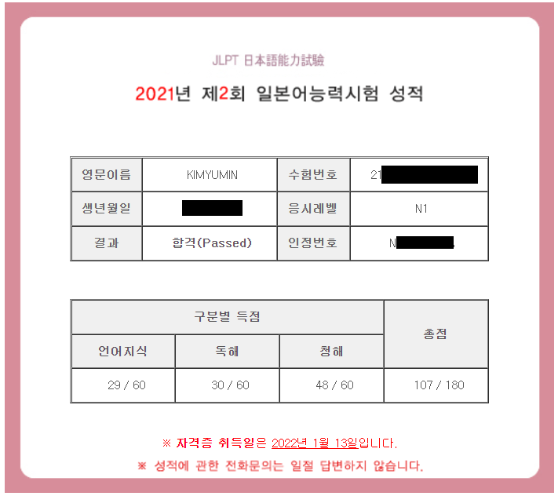

# 1 Day 1 News by 日本語 スタート! 그 계기는?

작년 12월인 2021년, 드디어 JLPT N1 취득에 성공했다!

{: width="500"}

하지만, 기쁨도 잠시… 앞으로의 공부를 어떻게 해야 할지에 대한 막막함이 다가왔다..

여태껏 JLPT 시험을 중점적으로 공부를 해왔기에 JLPT의 최고 단계인 N1까지 합격한 지금, 새로운 공부 방향을 정해야만 했다.

---

그렇게 찾은 방법은 총 세가지.

```
1. 일본인 친구 만들기
2. 일본 뉴스 시청
3. 일본 뉴스 독해
```

---

### 일본인 친구 만들기

이전부터 꾸준히 Hellotalk이나 교내 일본인 유학생들을 통해 교류를 지속해왔었기에 **일본인과의 교류**를 더욱 강화하여 회화 능력을 향상시킬 것이다.

{:width="200"}

---

### 일본 뉴스 시청

유튜브의 **ANNnewsCH 채널**의 스트리밍을 **매일** 시청하며 일본 사회 이슈 수집과 청해 능력을 향상시킬 것이다.

{:width="200"}

---

### **일본 뉴스 독해**

현재 가장 부족한 단어 능력을 일본 뉴스 독해를 통해 보완할 것이다. 일본 사회 이슈 수집에도 또한 용이하다. **하루 한 개의 뉴스 기사** 해석을 목표로 포스팅할 것이다.

{:width="200"}

---

### 이를 통해

일본 취업을 목표로 하고 있는만큼 전공 실력은 물론 일본어 능력 향상이 중요하다. (오히려 더 중요할지도!)

휴학한 지금을 기회로 삼아 부족한 부분을 채울 수 있도록 노력할 것이다.
