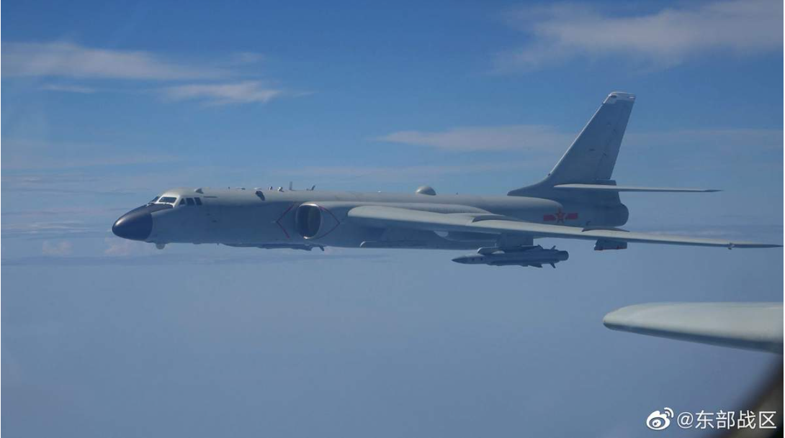

# 今日のニュース (2022-08-09)

### 기사

# **中国の軍事演習　国交記念行事を中止せよ**

중국의 군사연습 국교기념행사를 중단하라.

中国人民解放軍の東部**戦区**が３日「**微博**（ウェイボ）」に**投稿**した軍事演習の写真（共同）

중국인민해방군의 동부전구(?)가 3일 「미히로(?)(웨이보)」에 투고한 군사연습의 사진 (공동)

ペロシ米**下院議長**の**台湾**訪問に強く反発した中国による台湾**周辺**での軍事演習は、東アジア**情勢**にも緊張を**もたらしている**。

페로시 미 하원 의장의 대만 방문에 강하게 반발한 중국에 의한 대만 주변에서의 군사연습은, 동아시아 정세에도 긴장을 가져오고 있다.

こうした中で日中両国は、９月２９日に国交正常化５０周年の**節目**となるが、これを**祝賀**ムードで迎えることは決してできない。

이런 가운데 중일 양국은, 9월 29일에 국교정상화 50주년의 절목(?)이 되지만, 이를 죽하 분위기로 맞이하는 것은 절대 불가능하다.

**官民**を含め日本側は、記念**式典**など**一連**の行事は**即刻**中止すべきである。

관민을 포함해 일본 측은, 기념식전 등 일련의 행사는 즉시 중지해야 한다.

中国側に**誤った**メッセージを送ることがあってはならない。

중국 측에 잘못된 메시지를 보내는 일이 있어서는 안된다.

中国軍は今回の**大規模**な軍事演習で、台湾を**取り囲む**ように６カ所に**実弾射撃訓練**を**実施**する空・**海域**を設定し、日本の**排他的経済水域**（ＥＥＺ）内にも**弾道**ミサイルを**撃ち込んでいる**。

중국군은 이번 대규모 군사연습으로, 대만을 둘러싸듯이 6곳에 실탄사격훈련을 실시하는 하늘・해역을 설정하고, 일본의 배타적 경제수역(EEZ) 내에도 탄도미사일을 쏘고 있다.

こうした行為は、日本や在日米軍への攻撃も**視野**に入れた**極めて敵対的**な軍事的対応と見るべきだ。

이러한 행위는, 일본이나 재일미군에의 공격도 시야에 넣은 지극히 적대적인 군사적 대응으로 봐야 한다.

**もはや**日中両国が**友好的**な雰囲気にあるとは**到底**言えない。

더 이상 중일 양국이 우호적인 분위기에 있다고는 도저히 말할 수 없다.

日中国交正常化５０年をめぐっては、すでに各地で祝賀関連イベントなどが**開催**されている。

중일국교정상화 50년을 두고는, 이미 각지에서 축하 관련 이벤트 등이 개최되고 있다.

そして国交正常化の**共同声明**を出した９月２９日には、東京都内で記念式典をはじめとする**民間主体**の「記念**慶典**」が予定されている。

그리고 국교정상화의 공동성명을 낸 9월 29일에는, 도쿄도내에서 기념식전을 비롯해 민간주체인 「기념경전」이 예정되어 있다.

この記念慶典は**外務省**が**後援**し、慶典**組織委員会**の最高**顧問**には、**親中派**として知られる自民党の福田康夫元首相や二階俊博元**幹事長**らが名を連ね、**経団連**なども協力する予定だという。

이 기념 경전은 외무성이 후원하고, 경전 조직위원회의 최고 고문에는, 친중파로 알려진 자민당의 후쿠다 야스오 전 총리와 니카이 토시히로 전 간사장들이 이름을 올리고, 경단련 등도 협력할 예정이라고 한다.

日本としては、こうした祝賀行事について中止を決断すべきだ。

일본으로서는, 이러한 축하 행사에 대해 중지를 결단해야 한다.

先進７カ国（Ｇ７）の**外相**は、ペロシ氏の訪台について「攻撃的な軍事行動の口実にすることは**正当化**できない」とする共同声明を発表した。

선진 7개국(G7)의 외상은, 페로시 씨의 방문에 대해 「공격적인 군사행동의 구실로 하는 것은 정당화할 수 없다」는 공동 성명을 발표했다.

これに対し、中国外務省の鄧（とう）励（れい）外務**次官**は、垂（たるみ）秀夫駐中国日本大使を呼び出して**抗議**した。

이에 대해, 중국 외무성의 토레이 외무차관은, 타루미 히데오 주 중국 일본 대사를 불러 항의했다.

なぜ、ミサイルを発射した中国側に日本側が呼び出され、抗議されなければならないのか。

왜, 미사일을 발사한 중국 측에 일본 측이 불려, 항의 받아야 하는가.

日本のＥＥＺに弾道ミサイルが**着弾**したのを受け、日本の外務省は森健良事務次官が中国の孔（こう）鉉（げん）佑（ゆう）駐日大使に抗議したが、電話で済ませたのには驚くほかない。

일본의 EEZ에 탄도 미사일이 착탄한 것을 받아, 일본의 외무성은 모리 켄라 사무 차관이 중국의 코우겐유우 주일 대사에 항의했지만, 전화로 끝냈다는 것에는 놀라울 수 밖에 없다.

そもそも岸田文雄政権は、中国による今回の軍事演習に対し、国家安全**保障**会議（ＮＳＣ）をいまだ**開催**していない。

애초에 기시다 후미오 정권은, 중국에 의한 이번 군사연습에 대해, 국가안전보장회의(NSC)를 아직 개최하지 않고 있다.

台湾**有事**は日本有事に直結するという危機感があまりに**欠如**している。

대만 유사는 일본 유사에 직결된다는 위기감이 너무 결여되어 있다.

岸田首相には一国の指導者として、**毅**（き）**然**（ぜん）たる態度で中国にあたってもらいたい。

기시다 총리이 한 나라의 지도자로서, 의연한 태도로 중국을 대하기 바란다.

---

### 학습한 단어

|  | 漢字 | 読み仮名 | 意味 |
| --- | --- | --- | --- |
| 1 | 演習 | えんしゅう | 연습 |
| 2 | 戦区 | せんく | 전구 |
| 3 | 微博 | ウェイボ | 웨이보 |
| 4 | 投稿 | とうこう | 투고 |
| 5 | 下院議長 | かいんぎちょう | 하원 의장 |
| 6 | 台湾 | たいわん | 대만 |
| 7 | 周辺 | しゅうへん | 주변 |
| 8 | 情勢 | じょうせい | 정세, 형세 |
| 9 | もたらす | ・ | 가져가다, 가져오다, 초래하다 |
| 10 | 節目 | せつもく | 절목 |
| 11 | 祝賀 | しゅくが | 축하 |
| 12 | 官民 | かんみん | 관민 |
| 13 | 式典 | しきてん | 식전, 의식 |
| 14 | 一連 | いちれん | 일련 |
| 15 | 即刻 | そっこく | 즉각, 곧, 즉시 |
| 16 | 誤る | あやまる | 실패하다, 틀리다, 그르치다 |
| 17 | 大規模 | だいきぼ | 대규모 |
| 18 | 取り囲む | とりかこむ | 둘러싸다, 포위하다 |
| 19 | 実弾 | じつだん | 실탄 |
| 20 | 射撃 | しゃげき | 사격 |
| 21 | 訓練 | くんれん | 훈련 |
| 22 | 実施 | じっし | 실시 |
| 23 | 海域 | かいいき | 해역 |
| 24 | 排他的経済水域 | はいたてきけいざいすいいき | 배타적 경제 수역 |
| 25 | 弾道 | だんどう | 탄도 |
| 26 | 撃ち込む | うちこむ | 쏘아 대다, 발사하다 |
| 27 | 視野 | しや | 시야 |
| 28 | 極めて | きわめて | 극히, 더없이, 지극히 |
| 29 | 敵対的 | てきたいてき | 적대적 |
| 30 | もはや | ・ | 벌써, 이미, 어느새 |
| 31 | 友好的 | ゆうこうてき | 우호적 |
| 32 | 到底 | とうてい | 도저히 |
| 33 | 開催 | かいさい | 개최 |
| 34 | 共同声明 | きょうどうせいめい | 공동 성명 |
| 35 | 民間主体 | みんかんしゅたい | 민간 주체 |
| 36 | 慶典 | けいてん | 경전, 경사스러운 의식 |
| 37 | 外務省 | かいむしょう | 외무성 |
| 38 | 後援 | こうえん | 후원 |
| 39 | 組織 | そしき | 조직 |
| 40 | 委員会 | いいんかい | 위원회 |
| 41 | 顧問 | こもん | 고문 |
| 42 | 親中派 | しんちゅうは | 친중파 |
| 43 | 幹事長 | かんじちょう | 간사장 |
| 44 | 経団連 | けいだんれん | 경단련(경제 단체 연합회) |
| 45 | 外相 | がいしょう | 외상(외무 장관) |
| 46 | 正当化 | せいとうか | 정당화 |
| 47 | 次官 | じかん | 차관 |
| 48 | 抗議 | こうぎ | 항의 |
| 49 | 着弾 | ちゃくだん | 착탄, 발사된 총알이 적중함 |
| 50 | 保障 | ほしょう | 보장 |
| 51 | 開催 | かいさい | 개최 |
| 52 | 有事 | ゆうじ | 유사 |
| 53 | 欠如 | けつじょ | 결여 |
| 54 | 毅然 | きぜん | 의연, 의지가 굳고 어엿한 모양 |

---

### 개인적인 생각

대만에 방문한 미하원의장으로 중국의 강한 반발이 국내에서도 큰 화제가 되었는데 일본에서 또한 화두가 되고 있는 모양이다.

동아시아 정세가 계속 불안정한 가운데 앞으로 이러한 화제에 더욱 관심을 가져야겠다.

---

### 출처

[【主張】中国の軍事演習　国交記念行事を中止せよ](https://www.iza.ne.jp/article/20220809-NLSP7RGYEROG5C3YCM6VPTKTNE/?dicbo=v2-024c9ad992cfa1d29bda50200f072e2a)