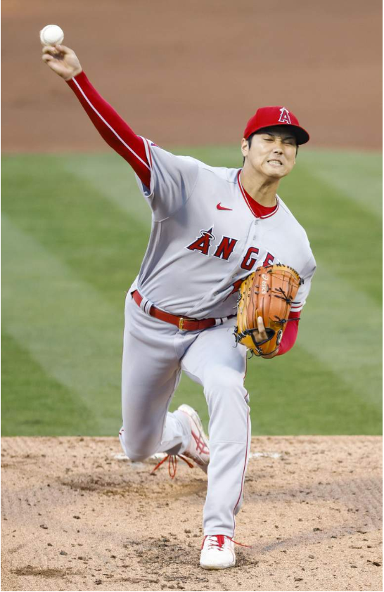

# 今日のニュース (2022-08-10)

### 기사

# **大谷が日米通算１０００奪三振　１０４年ぶり偉業へ４度目挑戦中**

오타니가 미일 통산 1000 탈삼진 104년 만에 위업에 4번째 도전 중

米大リーグ、アスレチックス戦に「２番・**投手兼指名打者**」で先発し、**投球**するエンゼルス・大谷翔平＝９日、オークランド（共同）

미 대리그, 애슬레틱스전에 「2번・투수 겸 지명 타자」로 선발해, 투구하는 에인절스・오타니 쇼헤이 = 9일, 오클랜드 (공동)    

米大リーグ、エンゼルスの大谷翔平は９日、オークランドでのアスレチックス戦に「２番・投手」で先発出場。

미 대리그, 에인절스의 오타니 쇼헤이는 9일, 오클랜드에서의 애슬레틱스전에 「2번・투수」로 선발 출전.

日米**通算**１０００**奪三振**を**達成**した。

미일통산 1000탈삼진을 달성했다.

内訳は日本の日本ハム時代に６２４個、メジャーで３７６個。

내역은 일본의 햄 시절에 624개, 메이저에서 376개.

１０勝目を**懸ける**と当時に**偉業**に**挑んでいる**。

10승을 거두자 당시의 위업에 도전하고 있다.

〝神様〟ベーブ・ルースが１９１８年にマークして以来、１０４年ぶりの大記録「**２桁**勝利＆**２桁本塁打**」は、**打線**の**援護**がないことも加わって３度達成を**阻まれている**。

“하나님” 베이브 루스가 1918년에 마크한 이래, 104년 만의 대기록 「2자리 승리 & 2자리 홈런」은, 타선의 원호가 없는 것도 더해 3번 달성을 막고 있다.

本塁打はすでに２４本**放っている**。

홈런은 이미 24개 쏘고 있다.

中５日での立ち上がりは**上々**で、コントロール良く**わずか**５球で**初回**を終了。

중 5일로 상승은 능숙하고, 컨트롤 좋게 불과 5구로 첫회를 종료.

影響が心配された７日の試合で**踏まれた**左足も気にする**素振り**はなかった。

영향이 걱정된 7일 경기에서 밟힌 왼발도 신경 쓰는 흔들림은 없었다.

三回無死で７番ブライドからこの試合２個目の三振を**奪い**、日米通算１０００奪三振に記録した。

3회 무사로7번 브라이드에서 이 경기 2번째 삼진을 빼앗고, 미일 통산 1000탈삼진을 기록했다.

この回２死一、三塁では２番ロレアーノの強烈な**投ゴロ**が左足すねを**直撃**、**捕手**の肩を借りてベンチに**引き上げた**が、大事には**至らず**、四回も**登板**した。

이번 2사 1, 3루에서는 2번 로레아노의 강력한 땅볼이 왼발 정강이를 직격, 포수의 어깨를 빌려 벤치로 끌어올렸으나 큰일 없이 네 차례나 등판했다.

マウンドに立つ前に登場した一回１死走者なしの第１打席は四球。

마운드에 서기 전에 등장한 1회 1사 주자 없는 제1타석은 4구.

打線が援護の１点を先行した直後の三回無死一塁での第２打席は一ゴロ。

타선이 원호의 1점을 앞선 직후의 3회 무사 1루에서의 제 2타석은 1 땅볼.

試合は四回**表(おもて)**を終えて１－０でリードしている。

시합은 4회 초를 마치고 1-0으로 리드하고 있다.

---

### 학습한 단어

|  | 漢字 | 読み仮名 | 意味 |
| --- | --- | --- | --- |
| 1 | 偉業 | いぎょう | 위업 |
| 2 | 投手 | とうしゅ | 투수 |
| 3 | 兼 | けん | 겸 |
| 4 | 指名打者 | しめいだしゃ | 지명타자 |
| 5 | 投球 | とうきゅう | 투구 |
| 6 | 通算 | つうさん | 통산 |
| 7 | 奪三振 | だつさんしん | 탈삼진 |
| 8 | 達成 | たっせい | 달성 |
| 9 | 懸ける | かける | 거두다 |
| 10 | 挑む | いどむ | 도전하다 |
| 11 | ～桁 | ～けた | ~자릿수 |
| 12 | 本塁打 | ほんるいだ | 홈런 |
| 13 | 打線 | だせん | 타선 |
| 14 | 援護 | えんご | 원호 |
| 15 | 阻む | はばむ | 방해하다, 저지하다, 막다 |
| 16 | 放る | ほうる | 멀리 내던지다, 집어치우다, 방치하다 |
| 17 | 上々だ | じょうじょうだ | 훌륭하다, 최상이다 |
| 18 | わずか | ・ | 불과 |
| 19 | 初回 | しょかい | 1회, 초회 |
| 20 | 踏まれる | ふまれる | 밟히다 |
| 21 | 素振り | そぶり | 거동, 기색 |
| 22 | 奪う | うばう | 빼앗다 |
| 23 | 投ゴロ | とうごろ | 땅볼 |
| 24 | 直撃 | ちょくげき | 직격 |
| 25 | 捕手 | ほしゅ | 포수 |
| 26 | 引き上げる | ひきあげる | 끌어올리다 |
| 27 | 至る | いたる | 이르다, 도달하다 |
| 28 | 登板 | とうばん | 등판 |
| 29 | 表 | おもて | (~회)초 |

---

### 개인적인 생각

메이저리그에서 꾸준히 대단한 성적을 거두고 있는 오타니 쇼헤이는 한국에서도 유명하고, 나 또한 개인적으로 응원하고 있는 편이다.

PL에 손흥민이 있듯이 메이저리그에서 역사를 써내려가고 있는 오타니 쇼헤이를 응원하고 앞으로도 부상없이 좋은 활약을 보여주면 좋겠다.

---

### 출처

[大谷が日米通算１０００奪三振　１０４年ぶり偉業へ４度目挑戦中](https://www.iza.ne.jp/article/20220810-NJCFGS6WU5LJXHDBYQZMN4DO3E/)