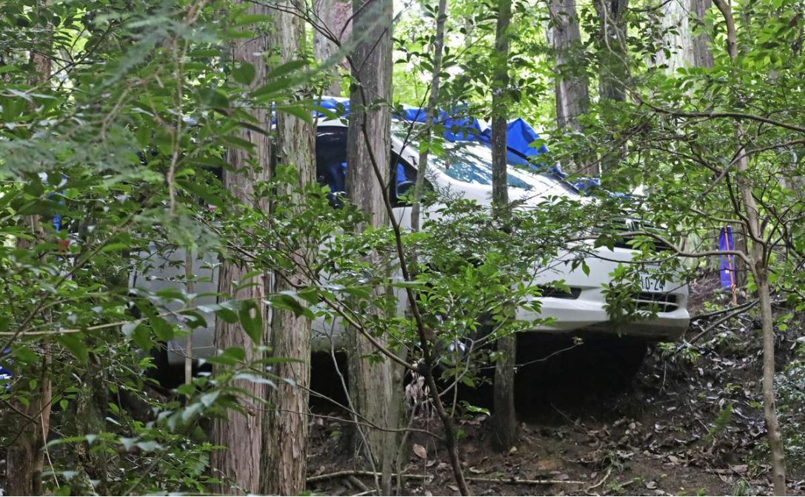

# 今日のニュース (2022-08-11)

### 기사

# **車内の遺体は９歳と６歳　母も窒息死　愛知・犬山の母子３人死亡**

차내의 시신은 9세와 6세 어머니도 질식사 아이치・이누야마의 모자 3명 사망

小学生きょうだいの遺体が見つかった**ワゴン車**＝１０日午前６時１５分、愛知県犬山市

초등학생 형제의 시신이 발견된 승합차 = 10일 오전 6시 15분, 아이치현 이누야마시    

愛知県犬山市の山中のワゴン車から**遺体**で見つかった男女について、愛知県警犬山署は１０日、同県扶桑町小淵小淵新開に住む小学４年、田中千結（ちゆ）さん（９）と小学１年、十楽（とら）君（６）のきょうだいと確認したと発表した。

아이치현 이누야마시의 산중의 승합차에서 시신으로 발견된 남녀에 대해서, 아이치현경 이누야마서는 10일, 동현 **ちょうおぶちおぶちしんかい**에 사는 초등학교 4학년, 다나카 치유  씨(9)와 초등학교 1학년, 토라 군(6)의 형제라고 확인했다고 발표했다.

山中から約１３キロ離れた扶桑町の自宅ではきょうだいの母、智子さん（４２）が遺体で見つかった。

산중에서 약 13km 떨어진 후소마치의 자택에서는 형제의 어머니, 토모코 씨(42)가 시신으로 발견되었다.

**いずれも**殺害された疑いが強く、同署は父親（４２）が何らかの事情を知っているとみて行方を捜している。

모두 살해당한 혐의가 강하고, 이 서는 부친(42)이 어떠한 사정을 알고 있다고 보고 행방을 찾고 있다.

**司法解剖**の結果、千結さんは**心臓**の**周囲**に血液がたまって**圧迫**される「**心タンポナーデ**」、十楽君と智子さんは首を絞められたことによる**窒息死**だった。

부검 결과, 치카츠 씨는 심장 주위에 혈액이 쌓여 압박을 받는 「심낭압전」, 토라 군과 토모코 씨는 목을 졸린 것으로 인한 질식사였다.

**捜査**関係者によると、きょうだいの遺体に**毛布**がかけられ、自宅からは**遺書**が見つかった。

수사 관계자에 의하면, 형제의 시신에 담요가 걸려 있어, 자택에서는 유서가 발견되었다.

車や自宅から**凶器**は見つかっていない。

차나 자택에서 흉기는 발견되지 않았다.

一家は両親と子ども２人の計４人家族。

일가는 부모와 아이 2명의 총 4인 가족.

遺体発見の直前、現場近くを何度も**往復**する車を工事現場の**警備員**が**目撃**していたことも**判明**。

시체 발견 직전, 현장 근처를 몇번이나 왕복하는 차를 공사 현장의 경비원이 목격한 것도 판명.

男性が運転していたといい、関連を調べている。

남성이 운전하고 있었다고 하여, 관련을 조사하고 있다.

---

### 학습한 단어

|  | 漢字 | 読み仮名 | 意味 |
| --- | --- | --- | --- |
| 1 | ワゴン車 | わごんくるま | 승합차 |
| 2 | 遺体 | いたい | 시체 |
| 3 | いずれも | ・ | 모두, 어느 것이나, 아무거나 |
| 4 | 司法解剖 | しほうかいぼう | 사법 해부 |
| 5 | 心臓 | しんぞう | 심장 |
| 6 | 周囲 | しゅうい | 주위 |
| 7 | 圧迫 | あっぱく | 압박 |
| 8 | 心タンポナーデ | ・ | 심낭압전 |
| 9 | 窒息死 | ちっそくし | 질식사 |
| 10 | 捜査 | そうさ | 수사 |
| 11 | 毛布 | もうふ | 모포, 담요 |
| 12 | 遺書 | いしょ | 유서 |
| 13 | 凶器 | きょうき | 흉기 |
| 14 | 往復 | おうふく | 왕복 |
| 15 | 警備員 | けいびいん | 경비원 |
| 16 | 目撃 | もくげき | 목격 |
| 17 | 判明 | はんめい | 판명 |

---

### 개인적인 생각

이러한 사망 기사를 볼 때마다 안타깝다.

사건의 진상이 하루빨리 밝혀지기를 바란다.

삼가 고인의 명복을 빈다.

---

### 출처

[車内の遺体は９歳と６歳　母も窒息死　愛知・犬山の母子３人死亡](https://www.iza.ne.jp/article/20220811-2ENCRJKNXZIPZKSGGQVFVLUCWI/)